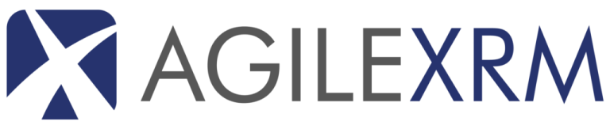
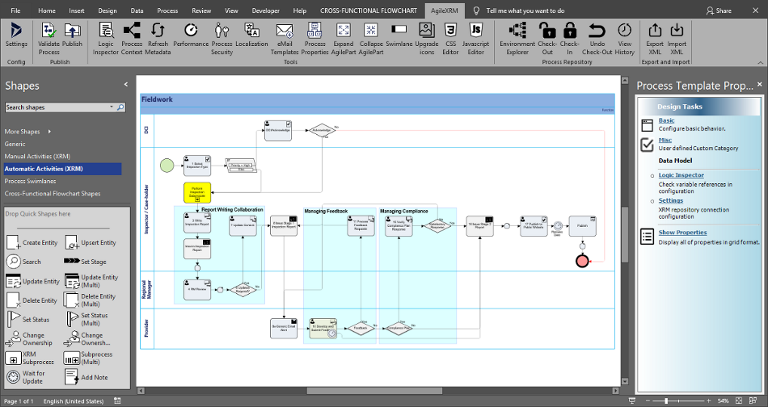
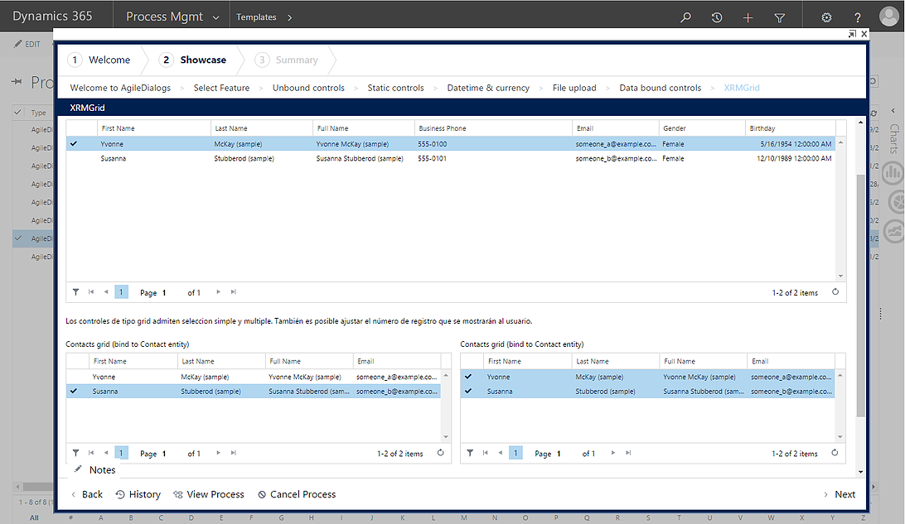
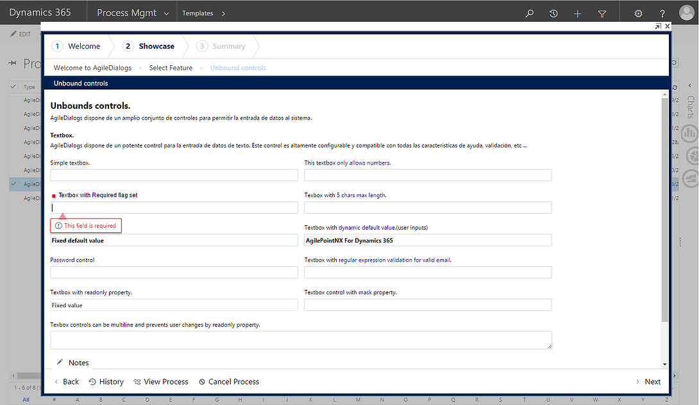
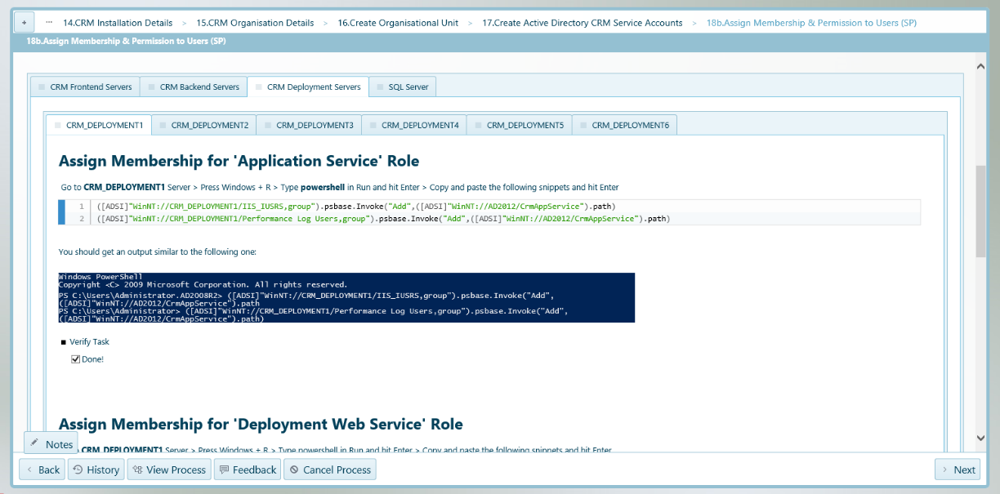
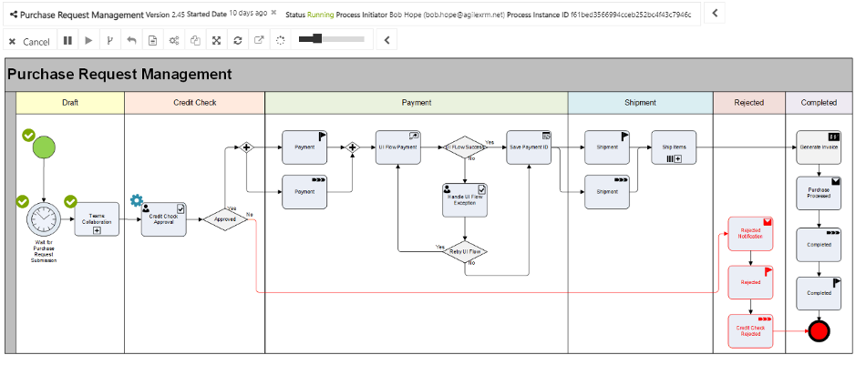
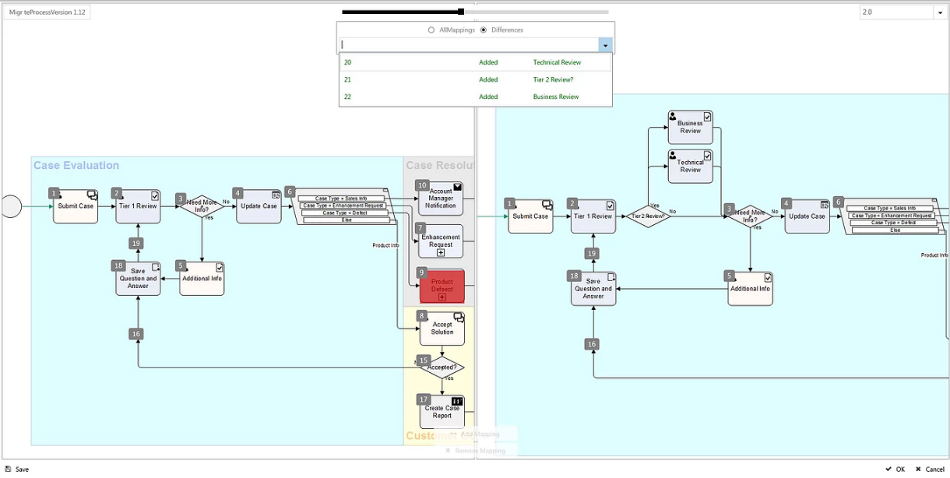
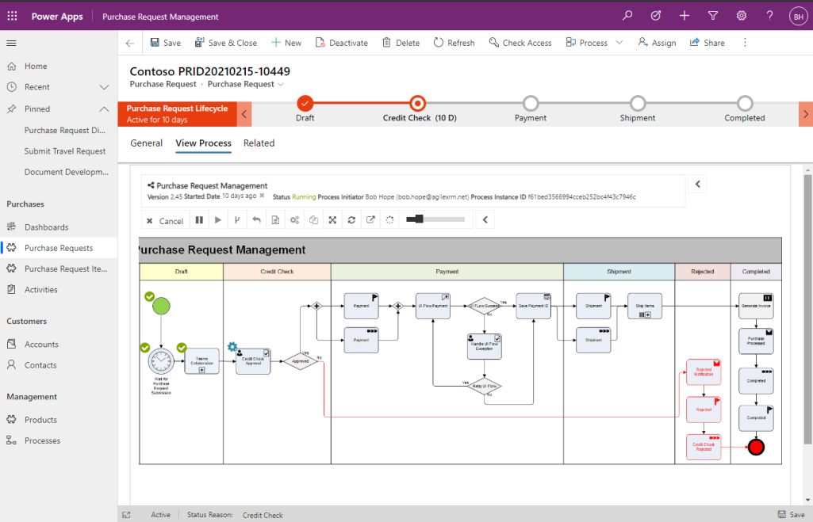

# AgileXRM Concepts

**[Home](/) --> AgileXRM Concepts**

---

## What is AgileXRM?

**AgileXRM** is a Low-to-No-Code Business Process Management (BPM) and Dialogs engine fully integrated with embedded into **Microsoft Dynamics 365 Customer Engagement** and **Power Platform Dataverse/CDS**.

**AgileXRM** allows users of Dynamics 365 CE / Dataverse / CDS to create powerful process-centric applications
within their environments that extend beyond out-of-the-box functionality to cater for
more business requirements in an easier more manageable way.

With **AgileXRM** you can:

- Visually model end-to-end business processes using Visio-based Process Modeller
- Visually monitor the execution of business processes in the organization
- Extend business processes beyond Dynamics 365 for easy integration with other systems
- Involve non-Dynamics 365 users, inside or outside the organization, to participate in business processes
- Measure and improve efficiency by controlling the performance of business processes including SLAs
- Adapt to change with agility enabling business Users to respond to changing requirements

**AgileXRM** allows companies to build line-of-business
applications rapidly within Microsoft Dataverse/CDS and Dynamics 365 CE,
enhancing its out-of-the-box functionality allowing to manage real-world
business processes. **AgileXRM brings true BPM functionality and dialogs
to the Microsoft platform**.

## AgileXRM Components

### Process Modeller

- Comprehensive and visual Process Modeller
- End-to-end business process design: Full data life-cycle management
- Activity-based Forms
- Validate the business logic before publishing
- Zero down-time deploying new versions of processes
- Full Multi-Version Control
- Model to easily interact with external users
- Drag & Drop system activities to integrate with many external systems: Office365, SharePoint, DBs, WS, etc.
- Extensive Workflow patterns supported to cater for more business use cases, many out-of-the-box
- Multiple Notification mechanisms to make sure users are duly reminded of their tasks
- Create escalation routes when tasks become overdue
- Bi-directional integration with Power Automate
- Integrates with ALM tools
- Need more? No worries: It is extensible

### AgileDialogs

- Contact-center grade Dialogs
- Standalone or embeddable in Dataverse/CDS/D365CE and Portal
- Dynamic UI guided by process models
- Create and deploy with no compilation
- Consume business data in and out of different systems: integrate seamlessly with Dataverse/CDS/D365CE
- Full track history and versioning
- Comprehensive Dialogs
  - Dialog Page steps: for user interaction
  - Automatic System steps: for system interaction
- Single-Page-Application (SPA)
  - Navigating around pages
    - Next & Back, History, Option buttons
  - Responsive Layout Design for Multi-Device support
- Session Persistence
  - Sessions can be transferred to another user
  - Session can resume after unexpected errors -e.g. if the browser closes unexpectedly, the session resumes in the same point when the browser reopens. 
- Rich Set of Controls 
  - Text, Password, Date Time, File Upload, Tip-Help controls
  - Validation associated to control, Conditional Behavior
  - Custom UI controls to extend the way data is captured and/or presented
  - Custom UI Logic using Built-In API
- Flexible Selection of Dynamic Data
  - OptionSet & Dynamic Filtered LookUps
  - Single & Multiple selection, Drop-down, Radio button, Check-boxes, Data Grid, List, LookUp List
  - REST Data sources
- Flow Control
  - Elements in the Flow include: Single Condition, Multiple Condition, Nested SubDialogs 
- Synchronous & Asynchronous External System Calls
- Theming & Branding
- Localization & Globalization for Multi-Language and Multi-Region support
- Section 508 Accesibility Support

> Contact-center grade Dialogs

AgileDialogs is fully customizable to your company branding.

> Theming & Branding Sample

### Process Manager

- Real-Time Visual Tracking of process execution 
  - Who has done which tasks
  - How long each activity takes to complete
  - What path the process has taken
  - See status of each task
  - View/Change process data
  - Navigate in the process hierarchy
 

- Control Flow: when required, it is possible to jump back or forth within a process instance, 
  stop and resume it, and always maintaining full traceability.  
- In-flight process migration: **AgileXRM** can run multiple versions of the same process at the 
  same time and Process Manager can migrate a running process instance, or a selection of instances, 
  from one version to another. 

- Process Manager can run standalone or embeded within Dataverse/CDS/D365CE and gives full process 
  control to the user, assuming the necessary permissions are granted

### Process Engine

**AgileXRM** Process Engine where the Process Models are executed.

> Power Apps full deep integration

## Disclaimer of warranty

[Disclaimer of warranty](../guides/common/DisclaimerOfWarranty.md)