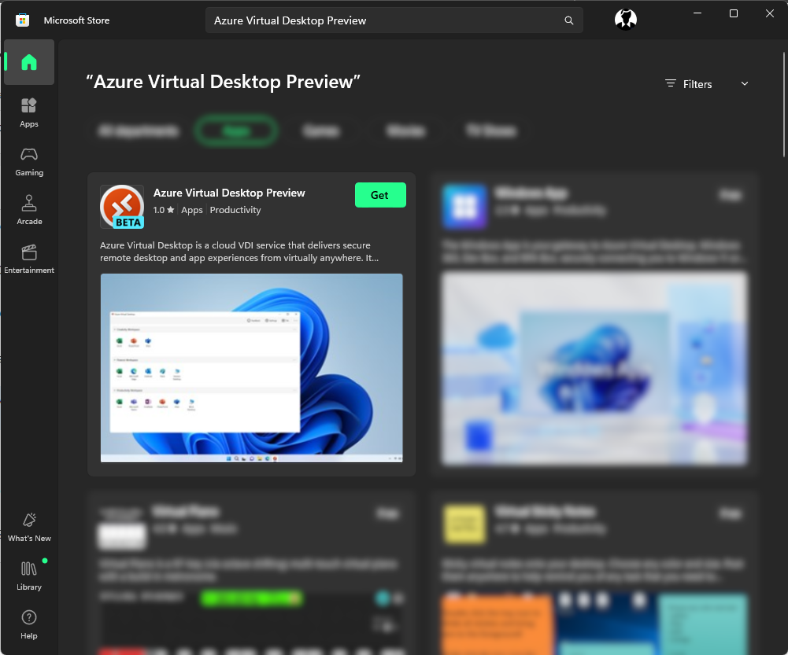
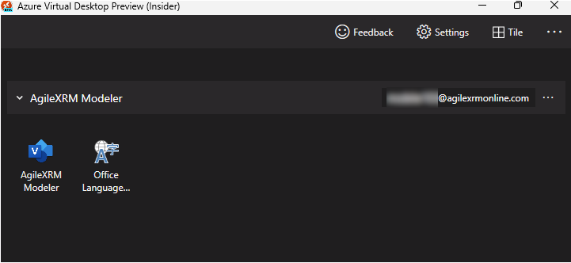

# AgileXRM Modeler Connection to Azure Virtual Desktop

**[Home](/) --> AgileXRM Modeler Connection to Azure Virtual Desktop**

---

## Introduction

This document describes how to connect to existent AgileXRM Modeler Azure Virtual Desktop Deployment in a Cloud deployment. 

---

## PreRequisites

You will need following items before to be able to connect:

- Valid User in "agilexrmonline.com" domain (i.e., myModeler@agilexrmonline.com)
- Visio Plan 2 License associated to above user

---

## Step 1 - Download "Azure Virtual Desktop" App from Microsoft Store (Windows 10/Windows 11)

- Open up "Microsoft Store" App
- Look for "Azure Virtual Desktop Preview" app
- Click on "Get" button to install on your PC

---

## Step 2 - Susbscribe to AgileXRM Modeler Workspace
- Open up new "Azure Virtual Desktop Preview" app
- Click on "Subscribe" button
- Login with "AgileXRMOnline" credential mentioned in the prerequisites section
- Check that new workspace is available in the App.
- "AgileXRM Modeler" workspace contains 2 RemoteApps: "AgileXRM Modeler" and "Office Language Preferences"

---

## Alternative Way - Susbscribe to AgileXRM Modeler Workspace

- Open up new "Azure Virtual Desktop Preview" app
- Click on "Subscribe URL" button
- Provide this URL: "https://rdweb.wvd.microsoft.com/api/arm/feeddiscovery"
- Login with "AgileXRMOnline" credential mentioned in the prerequisites section
- Check that new workspace is available in the App.
- "AgileXRM Modeler" workspace contains 2 RemoteApps: "AgileXRM Modeler" and "Office Language Preferences"
