__[Home](/) --> AgileDialogs Customization Guide__

# AgileDialogs Customization Guide

## Overview

AgileDialogs allows customization of look & feel.

AgileDialogs customization is based on themes. A theme is a LESS file which defines the look & feel of the AgileDialogs pages.
> LESS is a CSS preprocessor that extends the standard CSS language by adding variables, rule nesting, mixins, and math operations.

> CSS knowledge is required to customize AgileDialogs

By default, AgileDialogs has a set of six of themes available, but custom themes can be created from scratch or based on an existing theme.

AgileDialogs can be customized by either:

- Creating a new theme
- Customizing an existing theme

### Configure which AgileDialogs Theme to use

To configure the AgileDialogs theme used, go to the [AgileXRM Administration tool](XRMAdministrationTool-UserGuide.md) in the AgileDialogs section of the Integration Settings tab. 
To set a Theme for AgileDialogs, simply type the name of the Theme in the corresponding field.
 

> Invalid theme names will be ignored and AgileDialogs will be rendered using the default theme

### AgileDialogs out-of-the-box themes

By default AgileDialgos provides these themes:

 | **Theme.uui** | **Theme.cds** |
 | ------------- | ------------- |
 | 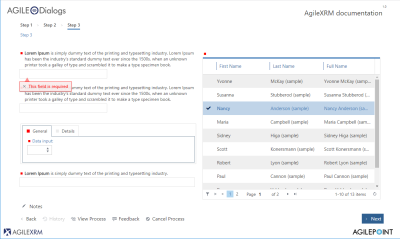|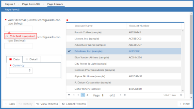

 | **Theme.crm** | **Theme** |
 | ------------- | --------- |
 | 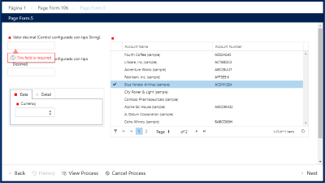|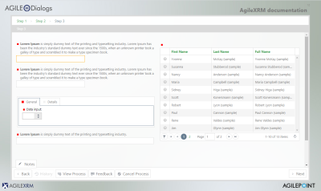
 
 | **Theme.01** | **Theme.02** |
 | ------------ | ------------ |
 | 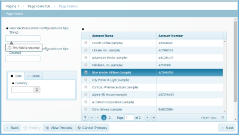|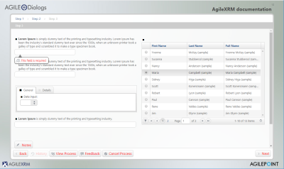
 

### AgileDialogs Page Layout

Basically customizing AgileDialogs is all about creating a custom CSS until the desired look  feel is achieved.

Customizing AgileDialogs is achieved by overriding the default behaviour with custom CSS. 
So, it is necessary to understand the page layout in order to write the new CSS rules.

AgileDialogs is a SPA (Single Page Application). 
This means that AgileDialogs loads a unique Page Layout, and dynamically updates its content.

This image represents the AgileDialogs page layout:

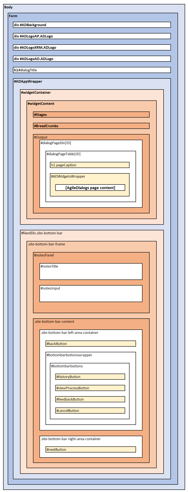

> AgileDialogs uses this page layout for all pages, and updates page content with the controls that were defined when modelling the dialog in Visio.

> Some advanced functionalities, such as Popup Render, use a different DOM layout, but they maintain the same CSS selectors.


| CSS Selector          | Description |
| --------------------- | ----------- |
| __#ADBackground__     | Background image. Hidden by default |
| __#ADLogoAP.ADLogo__  | Logo 1. Hidden by default |
| __#ADLogoXRM.ADLogo__ | Logo 2. Hidden by default |
| __#ADLogoAD.ADLogo__  | Logo 3. Hidden by default |
| __h1#dialogTitle__    | This element shows AgileDialogs Title. Only visible when not hosted |
| __#ADAppWrapper__     | This section contains the following three element |
| __#Output__           | This section is where AgileDialogs page will be rendered |
| __h2.pageCaption__    | Page Title |
| __#ADWidgetsWrapper__ | This is the element where all controls defined in a Page will be shown |


AgileDialogs page layout is represented in this image:

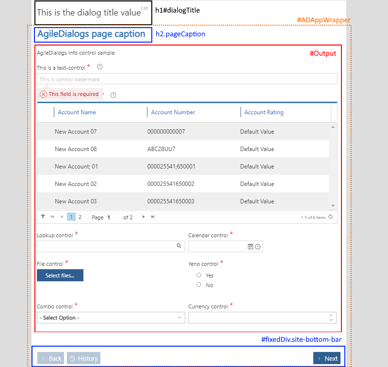

> Note: AgileDialogs Title is hidden when it is executed using _hosted=1_ parameter

AgileDialogs page content is dynamically built from process model definition. 
Each control is rendered within **#ADWidgetsWrapper** element in its own **.AgileDialogsControl** element.

This image represents this concept:

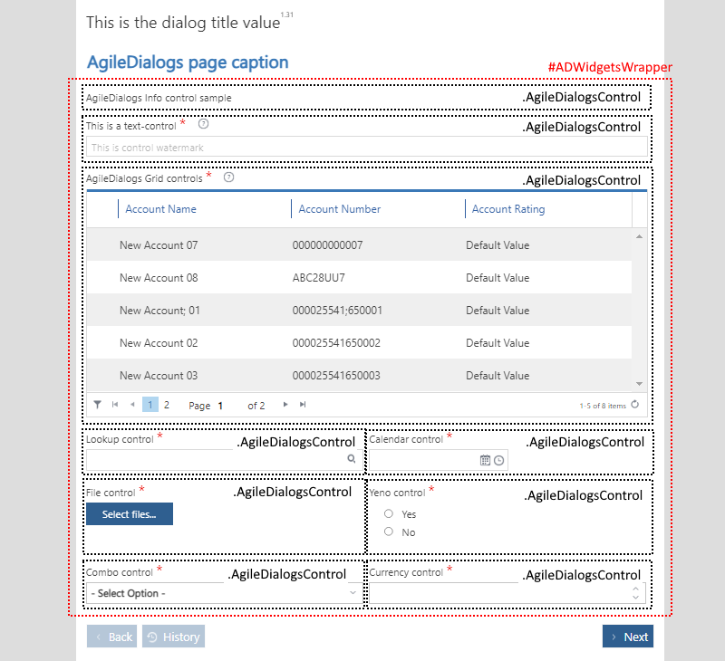

Every control in AgileDialogs page has the CSS class **.AgileDialogsControl** and its own layout.

Also, each AgileDialgs control has a `CssClass` property that allows customizing the controls individually.

See `CssClass` Property in this document: [Common Properties](common/ControlCommonProperties.md)

### AgileDialogs Control Layout

When modelling an AgileDialogs Page, controls are added and configured to show and get data from the user. 
Each of the controls has its own layout like this:


| CSS Selector                            | Description |
| --------------------------------------- | ----------- |
| __.AgileDialogsWidget__                 | The container of each control. The ID attribute depends on the proces model template | 
| __.AgileDialogsWidgetCaptionContainer__ | Where control caption is rendered. Also contains the control help and validation elements |
| __.questionCaption__                    | The control's label |
| __div[rel=tooltip]__                    | The control's help |
| __.k-widget.k-tooltip-validation__      | This is the element which render the control help XX |
| __.AgileDialogsWidgetControlContainer__ | The control's inputs. Each control renders this part and has its own CSS class to identity it |
| __.k-widget.k-tooltip-validation__      | The validation message |

> Note: _.k-widget.k-tooltip-validation_ can be located inside of _.AgileDialogsWidgetCaptionContainer_ element, 
or inside _.AgileDialogsWidgetControlContainer_, but not in both at the same time

> When an AgileDialogs control is configured as _Required_, the _.questionCaption_ element also has a _.required_ CSS class.

AgileDialogs control layout is represented in this image:

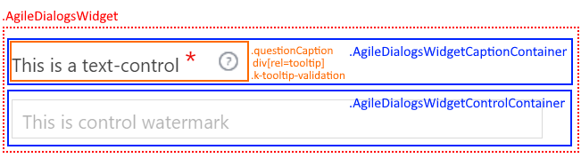

Control output varies depending on the kind of data to show and on control configuration.
Therefore the content of _.AgileDialogsWidgetControlContainer_ element varies by control type and its configuration. 

> For instance, a Text Control with the _Watermatk_ property set, would render with addicional element to show the watermark.
> Similarly, if the control was configured as _Multiline_, it would be rendered with a _textarea_ element instead of an _input_ element.
>
> 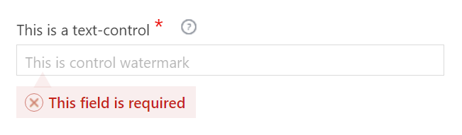

Listed below are the AgileDialogs Controls and their content layout.

---
### Info Control Layout

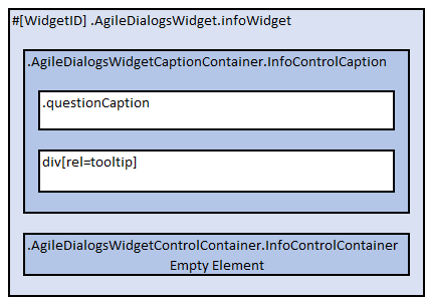
> Note: AgileDialogs Info control does not contains _.k-widget.k-tooltip-validation_ element

Below list represents **Info Control** layout:

- **.AgileDialogsWidget**    
    - <span>.AgileDialogsCaptionContainer</span>**.InfoControlContainer**
        - .questionCaption
        - div[rel=tooltip]
    - <span>.AgileDialogsControlContainer</span>**.InfoControlContainer**

See here: [Info control](common/Info.md)

---
### Text Control Layout
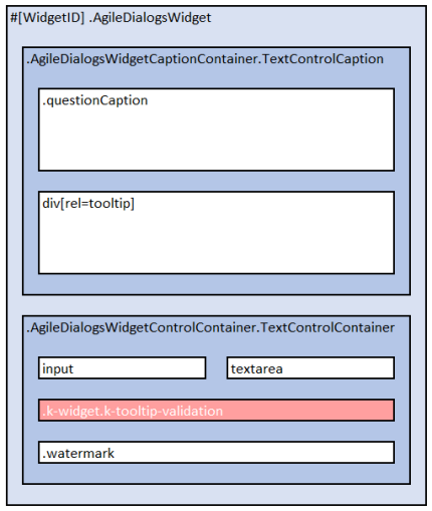

Below list represents **Text Control** layout:

- **.AgileDialogsWidget**
    - <span>.AgileDialogsCaptionContainer</span>**.TextControlCaption**
        - .questionCaption
        - div[rel=tooltip]
    - <span>.AgileDialogsControlContainer</span>**.TextControlContainer**
        - input | textarea
        - .k-widget.k-widget-validation
        - .watermark

See here: [Text control](common/Textbox.md)

---
### Numeric Control Layout

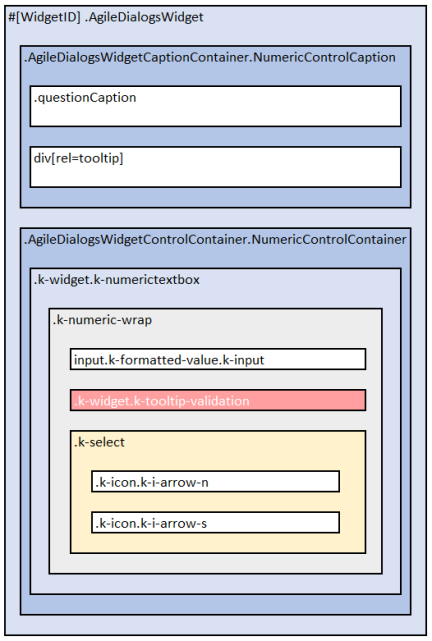

Below list represents **Numeric Control** layout:

- **.AgileDialogsWidget**
    - <span>.AgileDialogsCaptionContainer</span>**.NumericControlCaption**
        - .questionCaption
        - div[rel=tooltip]
    - <span>.AgileDialogsControlContainer</span>**.NumericControlContainer**
        - .k-widget.k-numerictextbox
            - .k-numeric-wrap
                - input.k-input.k-formatted-value
                - .k-widget.k-tooltip-validation
                - .k-select
                    - .k-icon.k-i-arrow-n 
                    - .k-icon.k-i-arrow-s 

See here: [Numeric control](common/NumericControl.md)

---
### Currency Control Layout

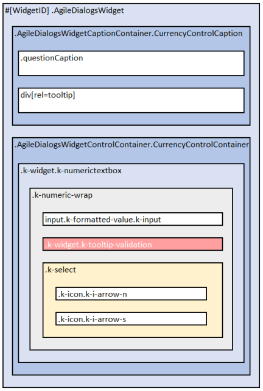

Below list represents **Currency Control** layout:

- **.AgileDialogsWidget**
    - <span>.AgileDialogsCaptionContainer</span>**.CurrencyControlCaption**
        - .questionCaption
        - div[rel=tooltip]
    - <span>.AgileDialogsControlContainer</span>**.CurrencyControlContainer**
        - .k-widget.k-numerictextbox
            - .k-numeric-wrap
                - input.k-input.k-formatted-value
                - .k-widget.k-tooltip-validation
                - .k-select
                    - .k-icon.k-i-arrow-n 
                    - .k-icon.k-i-arrow-s 

See here: [Currency control](common/CurrencyControl.md)

---
### Combo Control Layout

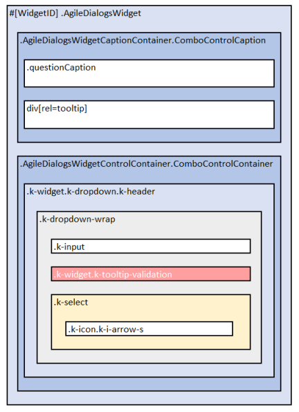

> Important: AgileDialogs internally uses KendoUI framework, hence
> the control layout is not as one can expect using select tag, instead, 
> options are rendered before document end in _.k-animation-container_ element

Below list represents **Combo Control** layout:

- **.AgileDialogsWidget**
    - <span>.AgileDialogsCaptionContainer</span>**.ComboControlContainer**
        - .questionCaption
        - div[rel=tooltip]
    - <span>.AgileDialogsControlContainer</span>**.ComboControlContainer**
        - .k-widget.k-dropdown.k-header
            - .k-dropdown-warp
                - .k-input
                - .k-widget.k-tooltip-validation
                - .k-select
                    - .k-icon.k-i-arrow-s 
- /* Rest of HTML elements */
- ...
- **.k-animation-container**
    - **.k-list-container** /* k-popup k-group k-reset */
        - ul
            - li 
            - ... li items
            - li

k-animation-container k-list-container k-popup k-group k-reset k-list k-reset k-item k-state-selected k-state-focused

See here: [Combo control](common/Combo.md)

---
### Radio Button Control Layout

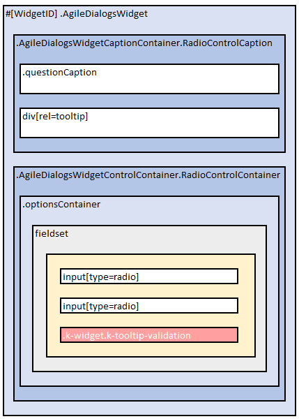

Below list represents **Radio button Control** layout:

- **.AgileDialogsWidget**
    - <span>.AgileDialogsCaptionContainer</span>**.RadioControlContainer**
        - .questionCaption
        - div[rel=tooltip]
    - <span>.AgileDialogsControlContainer</span>**.RadioControlContainer**
        - .optionsContainer
            - fieldset
                - input[type=radio]
                - ... input items
                - input[type=radio]
                - .k-widget.k-tooltip-validation

See here: [Radio Button](common/Radio.md)

---
### Checkbox Control Layout

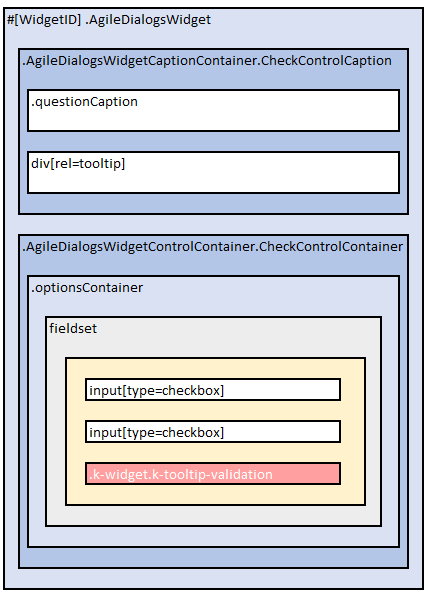

Below list represents **Checkbox Control** layout:

- **.AgileDialogsWidget**
    - <span>.AgileDialogsCaptionContainer</span>**.CheckControlContainer**
        - .questionCaption
        - div[rel=tooltip]
    - <span>.AgileDialogsControlContainer</span>**.CheckControlContainer**
        - .optionsContainer
            - fieldset
                - input[type=check]
                - ... input items
                - input[type=check]
                - .k-widget.k-tooltip-validation

See here: [Checkbox](common/Check.md)

---
### Yes/No Control Layout

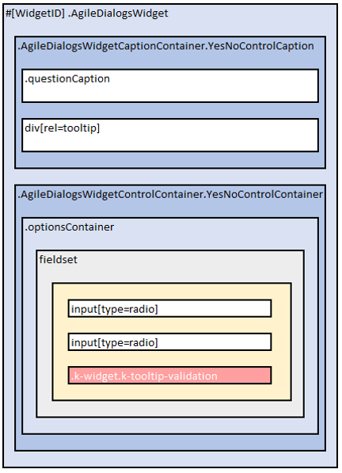

Below list represents **Yes/No Control** layout:

- **.AgileDialogsWidget**
    - <span>.AgileDialogsCaptionContainer</span>**.YesNoControlContainer**
        - .questionCaption
        - div[rel=tooltip]
    - <span>.AgileDialogsControlContainer</span>**.YesNoControlContainer**
        - .optionsContainer
            - fieldset
                - input[type=radio]
                - input[type=radio]
                - .k-widget.k-tooltip-validation

See here: [Yes/No](common/YesNoControl.md)

---
### Calendar Control Layout

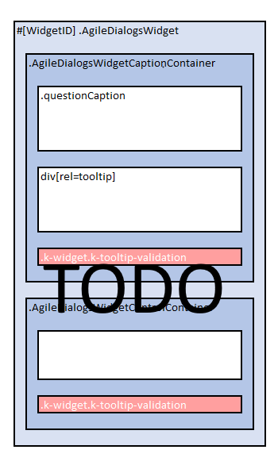

Below list represents **Calendar Control** layout:

- **.AgileDialogsWidget**
    - <span>.AgileDialogsCaptionContainer</span>**.CalendarControlContainer**
        - .questionCaption
        - div[rel=tooltip]
    - <span>.AgileDialogsControlContainer</span>**.CalendarControlContainer**

See here: [Calendar](common/Calendar.md)

---
### Lookup Control Layout

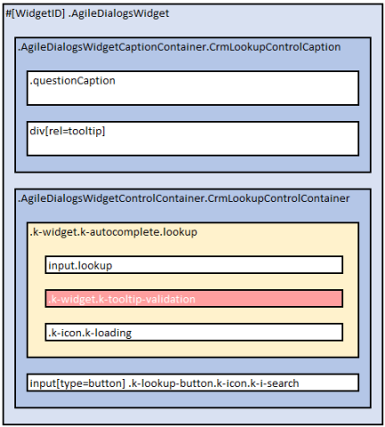

Below list represents **Lookup Control** layout:

- **.AgileDialogsWidget**
    - <span>.AgileDialogsCaptionContainer</span>**.CrmLookupControlContainer**
        - .questionCaption
        - div[rel=tooltip]
    - <span>.AgileDialogsControlContainer</span>**.CrmLookupControlContainer**
        - .k-widget.k-autocomplete.lookup
            - input.lookup
            - .k-widget.k-tooltip-validation
            - .k-icon.k-loading
        - input[type=button] .k-lookup-button.k-icon.k-i-search

Also, check lookup window in this document:[Lookup window](#a1)

See here: [Lookup](common/XRMLookup.md)

---
### Grid Control Layout


Below list represents **Grid Control** layout:

- **.AgileDialogsWidget**
    - <span>.AgileDialogsCaptionContainer</span>**.GridControlContainer**
        - .questionCaption
        - div[rel=tooltip]
    - <span>.AgileDialogsControlContainer</span>**.GridControlContainer**

See here: [Grid](common/XRMGrid.md)

---
### File Control Layout


Below list represents **File Control** layout:

- **.AgileDialogsWidget**
    - <span>.AgileDialogsCaptionContainer</span>**.FileControlContainer**
        - .questionCaption
        - div[rel=tooltip]
    - <span>.AgileDialogsControlContainer</span>**.FileControlContainer**

See here: [File](common/File.md)

---
### Password Control Layout

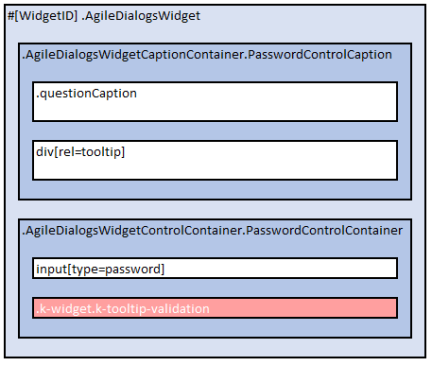

Below list represents **Password Control** layout.

- **.AgileDialogsWidget**
    - <span>.AgileDialogsCaptionContainer</span>**.PasswordControlContainer**
        - .questionCaption
        - div[rel=tooltip]
    - <span>.AgileDialogsControlContainer</span>**.PasswordControlContainer**
        - input[type=password]
        - .k-widget.k-tooltip-validation

See here: [Password](common/Password.md)

---
### Tab Container Control Layout


Below list represents **Tab container Control** layout:

- **.AgileDialogsWidget**
    - <span>.AgileDialogsCaptionContainer</span>**.TabContainerControlContainer**
        - .questionCaption
        - div[rel=tooltip]
    - <span>.AgileDialogsControlContainer</span>**.TabContainerControlContainer**

See here: [Tab container control](common/TabContainer.md)

---
### Group Container Control Layout

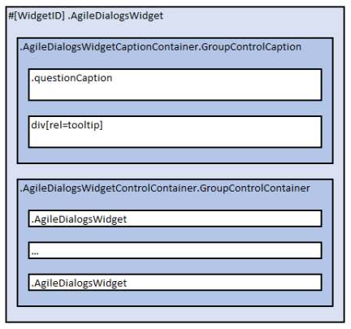
> Note: AgileDialogs Group control does not contains _.k-widget.k-tooltip-validation_ element

Below list represents **Group Container Control** layout:

- **.AgileDialogsWidget**
    - <span>.AgileDialogsCaptionContainer</span>**.GroupContainerControlContainer**
        - .questionCaption
        - div[rel=tooltip]
    - <span>.AgileDialogsControlContainer</span>**.GroupContainerContainer**
        - .AgileDialogsWidget
        - ...
        - .AgileDialogsWidget
> AgileDialogs group control contains as many .AgileDialogsWidget elements as controls have added at design time.

> When AgileDialogs group control has configured with `GroupType`property set to _fieldset_, the controls will be rendered wrapped inside _fieldset_ element.

See here: [Group container control](common/GroupContainer.md)

---
### IFrame Control Layout

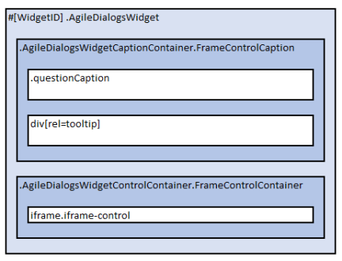
> Note: AgileDialogs IFrame control does not contains _.k-widget.k-tooltip-validation_ element

Below list represents **IFrame Control** layout:

- **.AgileDialogsWidget**
    - <span>.AgileDialogsCaptionContainer</span>**.FrameControlContainer**
        - .questionCaption
        - div[rel=tooltip]
    - <span>.AgileDialogsControlContainer</span>**.FrameControlContainer**
        - iframe.iframe-widget
       

See here: [IFrame control](common/Iframe.md)

---
### HTML Control Layout


Below list represents **HTML Control** layout:

- **.AgileDialogsWidget**
    - <span>.AgileDialogsCaptionContainer</span>**.HTMLControlContainer**
        - .questionCaption
        - div[rel=tooltip]
    - <span>.AgileDialogsControlContainer</span>**.HTMLControlContainer**

See here: [HTML Control](common/HtmlControl.md)

---
## Create a new Theme

Creating a new theme is done in this way:

- Create a new .less file (_mytheme.less_) 
- Assign new values to needed variables
- Write custom CSS rules, if needed
- Deploy the theme
 
In this file set values for needed variables values ... 

```css
@widget-background-color: #ffffff;
@widget-border-color: #94c0d2;
@widget-text-color: #003f59;
@header-background-color: #daecf4;
@header-text-color: #003f59;
@button-background-color: #daecf4;
@button-text-color: #003f59;
@group-background-color: #daecf4;
@group-border-color: #94c0d2;

/* Full variable list */

```
> It is possible to include in the theme, all elements that are needed: CSS rules, mixings, new variables ...

See AgileDialogs Customization variables list here: [AgileDialogs Customization variables list](AgileDialogs-CustomizationGuideVariablesList.md)

<details>
<summary>Full theme sample:</summary>
<div>

```css
@widget-background-color: #ffffff;
@widget-border-color: #94c0d2;
@widget-text-color: #003f59;
@header-background-color: #daecf4;
@header-text-color: #003f59;
@button-background-color: #daecf4;
@button-text-color: #003f59;
@group-background-color: #daecf4;
@group-border-color: #94c0d2;
@select-background-color: #daecf4;
@select-border-color: #7ec6e3;
@select-hover-background-color: #7dd3f6;
@select-group-background-color: #daecf4;
@hover-background-color: #7dd3f6;
@hover-border-color: #7ec6e3;
@hover-text-color: #005c83;
@hover-gradient: "#afe4fa 0px, #7dd3f6 100%";
@hover-shadow: none;
@selected-background-color: #58a5c6;
@selected-border-color: #58a5c6;
@selected-text-color: #ffffff;
@selected-gradient: "#12739d 0px, #58a5c6 100%";
@selected-shadow: none;
@active-background-color: #ffffff;
@active-border-color: #7ec6e3;
@active-text-color: #003f59;
@active-gradient: "none";
@active-shadow: none;
@focused-border-color: #7ec6e3;
@focused-item-shadow: rgb(126, 198, 227) 0px 0px 3px 1px inset;
@focused-active-item-shadow: rgb(53, 125, 156) 0px 0px 3px 1px inset;
@focused-shadow: rgba(18, 115, 157, 0.5) 0px 0px 3px 0px;
@error-background-color: #fff1f1;
@error-border-color: #ff7777;
@error-text-color: #f60000;
@disabled-text-color: #64a1bb;
@validation-background-color: #fff;
@validation-border-color: #000000;
@validation-text-color: #000000;
@tooltip-background-color: transparent;
@tooltip-border-color: #94c0d2;
@tooltip-text-color: #000000;
@main-border-radius: 3px;
@list-border-radius: @main-border-radius - 1;
@inner-border-radius: @main-border-radius - 2;
@slider-border-radius: 13px;
@draghandle-border-radius: 1px;
@draghandle-border-color: #94c0d2;
@draghandle-background-color: #ffffff;
@draghandle-shadow: none;
@draghandle-hover-border-color: @hover-border-color;
@draghandle-hover-background-color: @hover-background-color;
@draghandle-hover-shadow: none;
@default-icon-opacity: 0.8;
@numeric-selected-background: #58a5c6;
@alt-background-color: #eaf4f9;
@input-background-color: #ffffff;
@input-text-color: #003f59;
@shadow-color: rgba(18,115,157,0.5);
@link-text-color: #003f59;
@loading-panel-color: #ffffff;
@splitbar-background-color: #daecf4;
```
</div>
</details>


When custom theme is ready, it can be tested in these ways:
- Set _theme_ parameter to the theme name in the query string. This only applies to the particular dialog being run
  > For example:
  > https://domain.com/.../AgileDialogsKendoRuntime.aspx?...__&theme=mytheme
  
- Configure AgileDialogs theme using [AgileXRM Administration tool](XRMAdministrationTool-UserGuide.md) and set theme name as value.
  > This setting will apply to all dialogs.

---
## Inherit an exiting theme

It is also possible to inherit from an existing theme assinging **@extends-theme** variable, by this way:

```css
@extends-theme: "theme.uui";

@font-family: 'Candara', 'Candara Light';
@widget-font-size: 1.2rem;
```

---
## Customize existing theme from the Process Modeler

It is possible to customize an existing theme, overriding it with Custom CSS. 
From Process Modeller, open the `CSS Editor`from the AgileXRM `Ribbon`. 
> This method of customization only supports CSS. LESS is not supported.


```css
#ADAppWrapper #ADWidgetsWrapper .AgileDialogsWidget .k-widget.k-tooltip-validation {
  width: 100%;
  font-style: italic;
  border: none;
  margin: 0;
  padding: 2px;
  display: block;
  box-shadow: none;
  background-color: #ffffff;
  color: #cf114d;
  top: calc(100% + 1px);
}

.my.control-01{

    background-color: #0000FF;
}

.my.control-02{

    background-color: #00FF00;
}

.my.control-03{

    background-color: #FF0000;
}

```
> A theme can block its customization using **@allow-custom-css** variable. 

---
## Customize AgileDialogs Pages individually

AgileDialogs Pages can be customized individually by `CssClass` property.

To do so, set the `CssClass` property under `Page Settings` tab in AgileDialogs page editor.

The property value will be added to **#ADWidgetsWrapper** element, so if the value of `CssClass` is "my-form" , it can be customizeed in this way: 

```css
#ADWidgetsWrapper.my-form
{
    background-color: #c1e7ea4d;
}
```

Also, pseudo-elements can be used to prevent CSS affecting controls overlay:

```css
#ADWidgetsWrapper.my-form::before {
    height: 100%;
    width: 100%;
    content: " ";
    background-image: url(https://media.domain.com/.../image.png);
    position: absolute;
    z-index: -1;
    background-size: contain;
}

```

---
## Customize AgileDialogs Controls individually

AgileDialogs Controls can be customized individually by `CssClass` property.

To do so, set the `CssClass` property in the Control's property grid.
 
The property value will be added to **.AgileDialogsWidget** element of the control, so if the value of `CssClass` is "my-control" , it can be customizeed in this way: 

```css
.AgileDialogsWidget.my-control
{
    background-color: #c1e7ea4d;
    padding-left:1rem;
}
```

---
## Customize AgileDialogs breadcrumbs.
TO DO

---
## Customize AgileDialogs windows.

### <a id="a1">Lookup window </a>


AgileDialogs lookup window is shown from AgileDialogs lookup controls.

```css
.lookup-window .k-header
{
    /* Custom CSS ... */
}

#lookupWindow .top
{
    /* Custom CSS ... */
}

#lookupWindow .body
{
    /* Custom CSS ... */
}

#lookupWindow .bottom
{
    /* Custom CSS ... */
}

#lookupFilterButton
{
    /* Custom CSS ... */
}
```

---
### Validation window

AgileDialogs validation window is shown from AgileDialogs navigation, when form is invalid.

```css
#messageWindow
{
    /* Custom CSS ... */
}

#messageContent
{
    /* Custom CSS ... */
}

#messageWindow .message-content-buttons
{
    /* Custom CSS ... */
}
```

---
### Confirmation window

This window is shown when AgileDialogs needs user confirmation. Example of this are navigation confirmation from history, cancel current process ...

```css
#confirmWindow
{
    /* Custom CSS ... */
}

#confirmHistoryContent
{
    /* Custom CSS ... */
}

#confirmCancelProcessContent
{
    /* Custom CSS ... */
}

#confirmExitContent
{
    /* Custom CSS ... */
}
```

---
### Messaging window

This window is shown when AgileDialogs shows messages to user from DialogsEngine API.


```css
#messageWindow
{
    /* Custom CSS ... */
}

#messageContent
{
    /* Custom CSS ... */
}

.message-content-buttons
{
    /* Custom CSS ... */
}

#closeMessageWindowButton
{
    /* Custom CSS ... */
}
```

---
### Progress window

AgileDialogs Progress window can be customizeed in this way:

```css
#ADAppWrapper .imageSpin .notification-wrap .notification-text{
    font-style: italic;
}

#ADAppWrapper .imageSpin .notification-wrap .notification-advance{
    font-size: 3rem;
}

#ADAppWrapper .imageSpin .notification-wrap .notification-bar{
    background-color: rgb(206 18 162 / 65%);
}

```

Also, from Process Modller `Progress Message Editor`, a custom `CssClass` can be set for each message. 
So say, for "my-class" as class name, it can be customized in this way:

```css 
#ADAppWrapper .imageSpin.my-class .notification-wrap .notification-text{
    font-style: italic;
}

#ADAppWrapper .imageSpin.my-class .notification-wrap .notification-advance{
    font-size: 3rem;
}

#ADAppWrapper .imageSpin.my-class .notification-wrap .notification-bar{
    background-color: rgb(206 18 162 / 65%);
}

```


---
### Notes window

```css
#notesWindow {
    /* Custom CSS ... */
}

```
---
## Customization Samples


### Customize Loading Spinner

AgileDialogs Loading spinner can be customized in this way:

```css
#ADAppWrapper .imagespin 
{
    background: rgba(255, 255, 255, 0.8) 
                url(https://media ... myimage.gif) 
                no-repeat 
                center 
                center;
}
```
---
### Customize validation message

AgileDialogs validation message can be customized in these ways:

Assigning variable values:

```css
@validation-background-color: #246dbb;
@validation-border-color: #ffa500;
@validation-text-color: #ffffff;
```

Or override the CSS rule and extend it:

```css
#ADWidgetsWrapper .AgileDialogsWidget .k-widget.k-tooltip-validation
{
    border-color: #0cd7f3;
    background-color: #0e3762;
    color: #fff;
    z-index:10000;
}

#ADWidgetsWrapper .AgileDialogsWidget .k-widget.k-tooltip-validation::after {
    color: #ffa500;
    content: "▲";
    position: absolute;
    font-size: 22px;
    top: -23px;
    left: 15px;
    opacity: 0.5;
    zoom:0.5;
}
```
---
### Customize Required indicator

AgileDialogs shows an icon to identify required fields. 
This element can be customized using the CSS pseudo-elements `::before` and `::after`

To place the Required icon on the left-side, use a CSS snippet like this:

```css
#ADWidgetsWrapper .AgileDialogsWidget .questionCaption.required::before 
{
    color: #ea0600 !important;
    content: "*" !important;
    font-size: 21px !important;
    top: 0.5rem !important;
    padding-left: 4px;
    line-height: 0.5rem;
}
```

To place the Required icon on the right-side, use a CSS snippet like this:

```css
#ADWidgetsWrapper .AgileDialogsWidget .questionCaption.required::after 
{
    color: #ea0600 !important;
    content: "*" !important;
    font-size: 21px !important;
    top: 0.5rem !important;
    padding-left: 4px;
    line-height: 0.5rem;
}
```
---
### Customize Help icon

To customize AgileDialogs help icon use a CSS snippet like this:

```css
#ADWidgetsWrapper .AgileDialogsWidget.hastooltip div[rel=tooltip] .widget-help-click-image 
{
    background: url(https://.../myimage.png);
    background-size: contain;
}
```
---
### Customize Page Title

To customize Page Title, use a CSS snippet like this: 

```css
h1#dialogTitle {
    color: #5248a1;
    font-style: italic;
}
```
> Not visible when in Hosted mode

---
### Customize Page Caption

```css 
#ADAppWrapper #widgetContainer #Output h2.pageCaption {
    color: #b73b65 !important;
    background-color: #ffffff !important;
    padding-left: 10px;
}

```
---
### Customize background image

```css
#ADBackground 
{
    display: block !important;

    span {
        display: inherit;
        background-image: url("https://.../myimage.png") !important;
        background-size: 100% 100%;
        height: 100%;
        position: absolute;
        width: 100%;
    }
}
```
---
### Customize form margins

Assigning value for **@ad-centered-margin-background-color** variable (only can be used in theme file):

```css
@ad-centered-margin-background-color: #246dbb
```

Overrinding the CSS rules:

```css
div#ADAppWrapper::before {
    background-color: red !important;
}
div#ADAppWrapper::after {
    background-color: yellow!important;
}
```
---
### Customize Combo control items

 Many AgileDialogs controls internally use KendoUI framework,
 These controls' layout is not as one expects, instead, elements are rendered 
 before document ends within _.k-animation-container element_.


TO DO

```css
#ADAppWrapper #widgetContainer #Output 
    .AgileDialogsWidget .ComboControlContainer 
        .k-dropdown .k-dropdown-warp
{
    /* Custom css */
}

.k-animation-container .k-list-container{
    background-color: #00FF00;
}

.k-animation-container .k-list-container ul li{
    color: #FF0000;
}
```
---