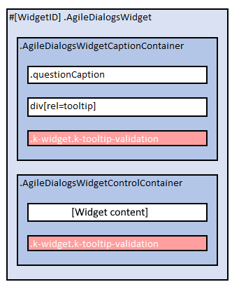

# AgileDialogs Customization Guide

**[Home](/) --> AgileDialogs Customization Guide**

---

## Overview

AgileDialogs allows customization of look & feel.

AgileDialogs customization is based on themes. A theme is a LESS file which defines the look & feel of the AgileDialogs pages.
> LESS is a CSS preprocessor that extends the standard CSS language by adding variables, rule nesting, mixins, and math operations.  
> CSS knowledge is required to customize AgileDialogs

By default, AgileDialogs has a set of six of themes available, but custom themes can be created from scratch or based on an existing theme.

AgileDialogs can be customized by either:

- [Creating a new theme](#create-theme)
- [Inherit an existing theme](#inherit-theme)
- [Customizing an existing theme](#customize-theme)

---

### Configure which AgileDialogs Theme to use

To configure the AgileDialogs theme used, go to the [AgileXRM Administration tool](XRMAdministrationTool-UserGuide.md) in the AgileDialogs section of the Integration Settings tab.
To set a Theme for AgileDialogs, simply type the name of the Theme in the corresponding field.

> Invalid theme names will be ignored and AgileDialogs will be rendered using the default theme

---

### AgileDialogs out-of-the-box themes

By default AgileDialgos provides these themes:

 | **Theme.uui** | **Theme.cds** |
 | ------------- | ------------- |
 | |

 | **Theme.crm** | **Theme** |
 | ------------- | --------- |
 | |

 | **Theme.01** | **Theme.02** |
 | ------------ | ------------ |
 | |

---

## Layout

---

### AgileDialogs Page Layout

Basically customizing AgileDialogs is all about creating a custom CSS until the desired look  feel is achieved.

Customizing AgileDialogs is achieved by overriding the default behaviour with custom CSS.
So, it is necessary to understand the page layout in order to write the new CSS rules.

AgileDialogs is a SPA (Single Page Application).
This means that AgileDialogs loads a unique Page Layout, and dynamically updates its content.

This image represents the AgileDialogs page layout:


> AgileDialogs uses this page layout for all pages, and updates page content with the controls that were defined when modelling the dialog in Visio.  
> Some advanced functionalities, such as Popup Render, use a different DOM layout, but they maintain the same CSS selectors.

| CSS Selector          | Description |
| --------------------- | ----------- |
| **#ADBackground**     | Background image. Hidden by default |
| **#ADLogoAP.ADLogo**  | Logo 1. Hidden by default |
| **#ADLogoXRM.ADLogo** | Logo 2. Hidden by default |
| **#ADLogoAD.ADLogo**  | Logo 3. Hidden by default |
| **h1#dialogTitle**    | This element shows AgileDialogs Title. Only visible when not hosted |
| **#ADAppWrapper**     | This section contains the following three element |
| **#Output**           | This section is where AgileDialogs page will be rendered |
| **h2.pageCaption**    | Page Title |
| **#ADWidgetsWrapper** | This is the element where all controls defined in a Page will be shown |

AgileDialogs page layout is represented in this image:


> Note: AgileDialogs Title is hidden when it is executed using *hosted=1* parameter

AgileDialogs page content is dynamically built from process model definition.

Each control is rendered within **#ADWidgetsWrapper** element in its own **.AgileDialogsControl** element.

This image represents this concept:


Every control in AgileDialogs page has the CSS class **.AgileDialogsControl** and its own layout.

Also, each AgileDialgs control has a `CssClass` property that allows customizing the controls individually.

See `CssClass` Property in this document: [Common Properties](common/ControlCommonProperties.md)

---

### AgileDialogs Control Layout

When modelling an AgileDialogs Page, controls are added and configured to show and get data from the user.

Each of the controls has its own layout like this:



| CSS Selector                            | Description |
| --------------------------------------- | ----------- |
| **.AgileDialogsWidget**                 | The container of each control. The ID attribute depends on the proces model template |
| **.AgileDialogsWidgetCaptionContainer** | Where control caption is rendered. Also contains the control help and validation elements |
| **.questionCaption**                    | The control's label |
| **div[rel=tooltip]**                    | The control's help |
| **.k-widget.k-tooltip-validation**      | This is the element which render the control help XX |
| **.AgileDialogsWidgetControlContainer** | The control's inputs. Each control renders this part and has its own CSS class to identity it |
| **.k-widget.k-tooltip-validation**      | The validation message |

> Note: *.k-widget.k-tooltip-validation* can be located inside of *.AgileDialogsWidgetCaptionContainer* element, or inside *.AgileDialogsWidgetControlContainer*, but not in both at the same time
> When an AgileDialogs control is configured as *Required*, the *.questionCaption* element also has a *.required* CSS class.

AgileDialogs control layout is represented in this image:


Control output varies depending on the kind of data to show and on control configuration.
Therefore the content of *.AgileDialogsWidgetControlContainer* element varies by control type and its configuration.

> For instance, a Text Control with the *Watermark* property set, would render with addicional element to show the watermark.
> Similarly, if the control was configured as *Multiline*, it would be rendered with a *textarea* element instead of an *input* element.
>
> 

Listed below are the AgileDialogs Controls and their content layout.

---

### Info Control Layout

Below image represents **Info Control** layout:


> Note: AgileDialogs Info control does not contains *.k-widget.k-tooltip-validation* element

Below list represents **Info Control** layout:

- **.AgileDialogsWidget**
  - <span>.AgileDialogsCaptionContainer</span>**.InfoControlContainer**
    - .questionCaption
    - div[rel=tooltip]
  - <span>.AgileDialogsControlContainer</span>**.InfoControlContainer**

See here: [Info control](common/Info.md)

---

### Text Control Layout

Below image represents **Text Control** layout:


Below list represents **Text Control** layout:

- **.AgileDialogsWidget**
  - <span>.AgileDialogsCaptionContainer</span>**.TextControlCaption**
    - .questionCaption
    - div[rel=tooltip]
  - <span>.AgileDialogsControlContainer</span>**.TextControlContainer**
    - <span>input | textarea</span>
    - .k-widget.k-widget-validation
    - .watermark

See here: [Text control](common/Textbox.md)

---

### Numeric Control Layout

Below image represents **Numeric Control** layout:


Below list represents **Numeric Control** layout:

- **.AgileDialogsWidget**
  - <span>.AgileDialogsCaptionContainer</span>**.NumericControlCaption**
    - .questionCaption
    - div[rel=tooltip]
  - <span>.AgileDialogsControlContainer</span>**.NumericControlContainer**
    - .k-widget.k-numerictextbox
      - .k-numeric-wrap
        - input.k-input.k-formatted-value
        - .k-widget.k-tooltip-validation
        - .k-select
          - .k-icon.k-i-arrow-n
          - .k-icon.k-i-arrow-s

See here: [Numeric control](common/NumericControl.md)

---

### Currency Control Layout

Below image represents **Currency Control** layout:


Below list represents **Currency Control** layout:

- **.AgileDialogsWidget**
  - <span>.AgileDialogsCaptionContainer</span>**.CurrencyControlCaption**
    - .questionCaption
    - div[rel=tooltip]
  - <span>.AgileDialogsControlContainer</span>**.CurrencyControlContainer**
    - .k-widget.k-numerictextbox
      - .k-numeric-wrap
        - input.k-input.k-formatted-value
        - .k-widget.k-tooltip-validation
        - .k-select
          - .k-icon.k-i-arrow-n
          - .k-icon.k-i-arrow-s

See here: [Currency control](common/CurrencyControl.md)

---

### Combo Control Layout

Below image represents **Combo Control** layout:


> Important: AgileDialogs internally uses KendoUI framework, hence the control layout is not as one can expect using select tag, instead,  options are rendered before document end in *.k-animation-container* element

Below list represents **Combo Control** layout:

- **.AgileDialogsWidget**
  - <span>.AgileDialogsCaptionContainer</span>**.ComboControlContainer**
    - .questionCaption
    - div[rel=tooltip]
  - <span>.AgileDialogsControlContainer</span>**.ComboControlContainer**
    - .k-widget.k-dropdown.k-header
      - .k-dropdown-warp
        - .k-input
        - .k-widget.k-tooltip-validation
        - .k-select
          - .k-icon.k-i-arrow-s
- ...
- **.k-animation-container**
  - **.k-list-container**
    - ul
      - li
      - ...
      - li

See here: [Combo control](common/Combo.md)

See here: [Animation container](#animation-container)

---

### Radio Button Control Layout

Below image represents **radio Control** layout:


Below list represents **Radio button Control** layout:

- **.AgileDialogsWidget**
  - <span>.AgileDialogsCaptionContainer</span>**.RadioControlContainer**
    - .questionCaption
    - div[rel=tooltip]
  - <span>.AgileDialogsControlContainer</span>**.RadioControlContainer**
    - .optionsContainer
      - fieldset
        - input[type=radio]
        - ...
        - input[type=radio]
        - .k-widget.k-tooltip-validation

See here: [Radio Button](common/Radio.md)

---

### Checkbox Control Layout

Below image represents **Checkbox Control** layout:


Below list represents **Checkbox Control** layout:

- **.AgileDialogsWidget**
  - <span>.AgileDialogsCaptionContainer</span>**.CheckControlContainer**
    - .questionCaption
    - div[rel=tooltip]
  - <span>.AgileDialogsControlContainer</span>**.CheckControlContainer**
    - .optionsContainer
      - fieldset
        - input[type=check]
        - ...
        - input[type=check]
        - .k-widget.k-tooltip-validation

See here: [Checkbox](common/Check.md)

---

### Yes/No Control Layout

Below image represents **Yes/No Control** layout:


Below list represents **Yes/No Control** layout:

- **.AgileDialogsWidget**
  - <span>.AgileDialogsCaptionContainer</span>**.YesNoControlContainer**
    - .questionCaption
    - div[rel=tooltip]
  - <span>.AgileDialogsControlContainer</span>**.YesNoControlContainer**
    - .optionsContainer
      - fieldset
        - input[type=radio]
        - input[type=radio]
        - .k-widget.k-tooltip-validation

See here: [Yes/No](common/YesNoControl.md)

---

### Calendar Control Layout

Below image represents **Calendar Control** layout:


> Important: AgileDialogs internally uses KendoUI framework, hence the control layout is not as one can expect,  calendar elements are rendered before document end in *.k-animation-container* element

Below list represents **Calendar Control** layout:

- **.AgileDialogsWidget**
  - <span>.AgileDialogsCaptionContainer</span>**.CalendarControlContainer**
    - .questionCaption
    - div[rel=tooltip]
  - <span>.AgileDialogsControlContainer</span>**.CalendarControlContainer**
    - .k-widget.k-datetimepicker.k-header
      - .k-picker-wrap.k-state-default
        - input.k-input
        - .k-widget.k-tooltip-validation
          - .k-icon.k-warning

See here: [Calendar](common/Calendar.md)

See here: [Animation container](#animation-container)

---

### Lookup Control Layout

Below image represents **Lookup Control** layout:


Below list represents **Lookup Control** layout:

- **.AgileDialogsWidget**
  - <span>.AgileDialogsCaptionContainer</span>**.CrmLookupControlContainer**
    - .questionCaption
    - div[rel=tooltip]
  - <span>.AgileDialogsControlContainer</span>**.CrmLookupControlContainer**
    - .k-widget.k-autocomplete.lookup
      - input.lookup
      - .k-widget.k-tooltip-validation
      - .k-icon.k-loading
    - input[type=button] .k-lookup-button.k-icon.k-i-search

Also, check lookup window in this document: [Lookup window](#a1)

See here: [Lookup](common/XRMLookup.md)

See here: [Animation container](#animation-container)

---

### Grid Control Layout

Below image represents **Grid Control** layout:


> **Note**: Selected row has *.k-state-selected* class

Below list represents **Grid Control** layout:

- **.AgileDialogsWidget**
  - <span>.AgileDialogsCaptionContainer</span>**.CrmGridControlContainer**
    - .questionCaption
    - div[rel=tooltip]
    - .k-widget.k-tooltip-validation
  - <span>.AgileDialogsControlContainer</span>**.CrmGridControlContainer**
    - .k-content
      - .k-widget.k-grid
        - .k-grid-header
          - .k-grid-header-wrap
            - .k-selectable
              - .k-header
        - .k-grid-content
          - .k-selectable
            - td
              - span
            - td.k-alt
              - span
            - ...
        - .k-grid-pager
          - .k-link.selected-data-filter
          - .k-link.k-pager-nav.k-pager-first
          - .k-link.k-pager-nav
          - .k-pager-numbers
          - .k-pager-input
          - .k-link.k-pager-nav
          - -k-link.k-pager-nav.k-pager-last
          - .k-link.k-pager-refresh
          - .k-pager-info.k-label

See here: [Grid](common/XRMGrid.md)

---

### File Control Layout

Below image represents **File Control** layout:


Below list represents **File Control** layout:

- **.AgileDialogsWidget**
  - <span>.AgileDialogsCaptionContainer</span>**.FileControlContainer**
    - .questionCaption
    - div[rel=tooltip]
  - <span>.AgileDialogsControlContainer</span>**.FileControlContainer**
    - .k-widget.k-upload.k-header /\*.k-upload-empty */
      - .k-dropzone
        - .k-button.k-upload-button
          - .k-widget.k-tooltip-validation
        - .k-upload-status.k-upload-status-total
        - .k-upload-files
          - .k-file /\* .k-file-success | .k-file-error */
            - .k-icon
            - a
              - .k-filename
            - .k-upload-status
              - .k-upload-pct
              - .k-button.k-button-bare.k-upload-action
                - .k-icon.k-delete /\* .k-refresh */

See here: [File](common/File.md)

---

### Password Control Layout

Below image represents **Password Control** layout:


Below list represents **Password Control** layout.

- **.AgileDialogsWidget**
  - <span>.AgileDialogsCaptionContainer</span>**.PasswordControlContainer**
    - .questionCaption
    - div[rel=tooltip]
  - <span>.AgileDialogsControlContainer</span>**.PasswordControlContainer**
    - input[type=password]
    - .k-widget.k-tooltip-validation

See here: [Password](common/Password.md)

---

### Tab Container Control Layout

Below image represents **Tab Container Control** layout:


Below list represents **Tab container Control** layout:

- **.AgileDialogsWidget**
  - <span>.AgileDialogsCaptionContainer</span>**.TabContainerControlContainer**
    - .questionCaption
    - div[rel=tooltip]
  - <span>.AgileDialogsControlContainer</span>**.TabContainerControlContainer**
    - .k-tabstrip-wrapper
      - .k-widget.k-tabstrip.k-header.tabs-container
        - ul.k-tabstrip-items
          - li.k-item
            - a.k-link
          - ...
          - li.k-item
        - .k-content.tab-item  /\* .k-state-active */
          - .AgileDialogsWidget
          - ...
          - .AgileDialogsWidget
        - ...
        - .k-content.tab-item  /\* .k-state-active */
          - .AgileDialogsWidget
          - ...
          - .AgileDialogsWidget

> Tab container control will contains as many *li.k-item* as tabs have been defined.  
If tab contains **empty** required controls inside, the *li.k-item* element will has the *.has-required-inputs* CSS class , otherwise will has *.no-required-inputs* CSS class.
Tab container control will contains as many *.k-content.tab-item* as tabs have been defined.  
Each tab-item will contain as many *.AgileDialogsWidget* elements as have been defined in Visio.

See here: [Tab container control](common/TabContainer.md)

---

### Group Container Control Layout

Below image represents **Group Container Control** layout:


> Note: AgileDialogs Group control does not contains *.k-widget.k-tooltip-validation* element

Below list represents **Group Container Control** layout:

- **.AgileDialogsWidget**
  - <span>.AgileDialogsCaptionContainer</span>**.GroupContainerControlContainer**
    - .questionCaption
    - div[rel=tooltip]
  - <span>.AgileDialogsControlContainer</span>**.GroupContainerContainer**
    - .AgileDialogsWidget
    - ...
    - .AgileDialogsWidget

> AgileDialogs group control contains as many .AgileDialogsWidget elements as controls that have been added at design time.  
> When AgileDialogs group control is configured with `GroupType` property set to *fieldset*, the controls will be rendered wrapped inside a *fieldset* element.

See here: [Group container control](common/GroupContainer.md)

---

### IFrame Control Layout

Below image represents **IFrame Control** layout:


> Note: AgileDialogs IFrame control does not contains *.k-widget.k-tooltip-validation* element

Below list represents **IFrame Control** layout:

- **.AgileDialogsWidget**
  - <span>.AgileDialogsCaptionContainer</span>**.FrameControlContainer**
    - .questionCaption
    - div[rel=tooltip]
  - <span>.AgileDialogsControlContainer</span>**.FrameControlContainer**
    - iframe.iframe-widget

See here: [IFrame control](common/IFrame.md)

---

### HTML Control Layout

Below image represents **HTML Control** layout:


Below list represents **HTML Control** layout:

- **.AgileDialogsWidget**
  - <span>.AgileDialogsCaptionContainer</span>**.RichTextEdiorControlContainer**
    - .questionCaption
    - div[rel=tooltip]
  - <span>.AgileDialogsControlContainer</span>**.RichTextEdiorControlContainer**
    - .content
      - .k-widget.k-editor-widget.k-header
        - tr
          - td.k-editor-toolbar-wrap
            - ul.k-editor-toolbar
              - li.k-tool-group.k-button-group
                - a.k-tool.k-group-start
                  - .k-tool-icon
                - a.k-tool
                  - .k-tool-icon
                - ...
                - a.k-tool.k-group-end
                  - .k-tool-icon
              - ...
              - li.k-tool-group.k-button-group
                - a.k-tool.k-group-start
                  - .k-tool-icon
                - a.k-tool
                  - .k-tool-icon
                - ...
                - a.k-tool.k-group-end
                  - .k-tool-icon
        - tr
          - td.k-editable-area
            - iframe.k-content
            - .k-widget.k-tooltip-validation

See here: [HTML Control](common/HtmlControl.md)

---

## Create a new Theme

<a id="create-theme"></a>Creating a new theme is done in this way:

- Create a new .less file (*mytheme.less*)
- Assign new values to needed variables
- Write custom CSS rules, if needed
- Deploy the theme

In this file set values for needed variables:

```css
@widget-background-color: #ffffff;
@widget-border-color: #94c0d2;
@widget-text-color: #003f59;
@header-background-color: #daecf4;
@header-text-color: #003f59;
@button-background-color: #daecf4;
@button-text-color: #003f59;
@group-background-color: #daecf4;
@group-border-color: #94c0d2;

/* Full variable list */
```

> It is possible to include in the theme, all elements that are needed: CSS rules, mixings, new variables ...

See AgileDialogs Customization variables list here: [AgileDialogs Customization variables list](AgileDialogs-CustomizationGuideVariablesList.md)

When custom theme is ready, it can be tested in these ways:

- Set *theme* parameter to the theme name in the query string. This only applies to the particular dialog being run
  > For example:  
  https://domain.com/.../AgileDialogsKendoRuntime.aspx?...&**theme=mytheme**  
  
- Configure AgileDialogs theme using [AgileXRM Administration tool](XRMAdministrationTool-UserGuide.md) and set theme name as value.
  > This setting will apply to all dialogs.

---

## Inherit an exiting theme

<a id="customize-theme"></a>It is also possible to inherit from an existing theme assinging **@extends-theme** variable, by this way:

```css
@extends-theme: "theme.uui";

@font-family: 'Candara', 'Candara Light';
@widget-font-size: 1.2rem;
```

---

## Customize existing theme from the Process Modeler

<a id="inherit-theme"></a>It is possible to customize an existing theme, overriding it with Custom CSS.
From Process Modeller, open the `CSS Editor`from the AgileXRM `Ribbon`.

> This method of customization only supports CSS. LESS is not supported.

```css
#ADAppWrapper #ADWidgetsWrapper .AgileDialogsWidget .k-widget.k-tooltip-validation {
  width: 100%;
  font-style: italic;
  border: none;
  margin: 0;
  padding: 2px;
  display: block;
  box-shadow: none;
  background-color: #ffffff;
  color: #cf114d;
  top: 1rem;
}

.my.control-01{

    background-color: #0000FF;
}

.my.control-02{

    background-color: #00FF00;
}

.my.control-03{

    background-color: #FF0000;
}
```

> A theme can block its customization using **@allow-custom-css** variable.

---

## Customize AgileDialogs Pages individually

<a id="customize-pages-ind"></a>AgileDialogs Pages can be customized individually by `CssClass` property.

To do so, set the `CssClass` property under `Page Settings` tab in AgileDialogs page editor.

The property value will be added to **#ADWidgetsWrapper** element, so if the value of `CssClass` is "my-form" , it can be customizeed in this way:

```css
#ADWidgetsWrapper.my-form
{
    background-color: #c1e7ea4d;
}
```

Also, pseudo-elements can be used to prevent CSS affecting controls overlay:

```css
#ADWidgetsWrapper.my-form::before {
    height: 100%;
    width: 100%;
    content: " ";
    background-image: url(https://media.domain.com/.../image.png);
    position: absolute;
    z-index: -1;
    background-size: contain;
}
```

---

## Customize AgileDialogs Controls individually

<a id="customize-controls-ind"></a>AgileDialogs Controls can be customized individually by `CssClass` property.

To do so, set the `CssClass` property in the Control's property grid.

The property value will be added to **.AgileDialogsWidget** element of the control, so if the value of `CssClass` is "my-control" , it can be customizeed in this way:

```css
.AgileDialogsWidget.my-control
{
    background-color: #c1e7ea4d;
    padding-left:1rem;
}
```

---

## Customize AgileDialogs breadcrumbs

Breadcrumbs is a list of links to allow the user to go pack to a previous page by clicking the link.

> Breadcrumbs must be enabled in the process model template, otherwise they will not be displayed.  
To enable bradcrumbs check the `Show Bredcrumbs` option in process settings window.

Check: [Breadcrumns](common/Breadcrumbs.md)

---

### Breadscrumbs

Breadcrumbs are rendered into `#BreadCrumbs` element. Each page adds it own breadcrumb, into `#BreadCrumbsSteps .breadCrumbsTemplateLink`, except the last breascrumb (active page) which is rendered `#BreadCrumbsSteps span:last-child`.

Bradscrumbs are render into `#BreadCrumbs` element

```css
#BreadCrumbs {
    background-color:#10a3a3 !important;    
}

#BreadCrumbsSteps .breadCrumbsTemplateLink {
    color: #f7f7f7 !important;    
}

#BreadCrumbsSteps span:last-child {
    font-size:2rem;
}

/* Breadcrumbs separation icon */
#BreadCrumbsSteps span:after {
    content: ">";
    font-size: 1.5rem;    
    color: red ;
}
```

When breadcrumbs overwide the available space, oldest breadcrumbs are hidden, and `[+]` button is shown. Clicking that button will expand the hidden breadcrumbs and a `[-]` button is shown. Can customize `[+]` and `[-]` buttons by this way:

```css
#BreadCrumbs .k-button.showmore .{
  border-color: #fff !important;
  background-color: #FFF!important;  
}

#BreadCrumbs .k-button.showless {
  border-color: #fff !important;
  background-color: #FFF!important;  
}
```

---

## Customize animation containers

 <a id="animation-container"></a>Many AgileDialogs controls internally use KendoUI framework.

 These controls' layout is not as one expects, instead, elements are rendered before document ends within *.k-animation-container* element.

 Listed below customization samples:

- [Combo control sample](#s01)
- [Lookup control sample](#s02)
- [Calendar control sample](#s03)

--

## Customize AgileDialogs windows

---

### Lookup window

<a id="a1"></a>AgileDialogs lookup window is shown from AgileDialogs lookup controls when popup button is clicked.

Can customiza by this way;

```css
.lookup-window .k-header
{
    /* Custom CSS ... */
}

#lookupWindow .top
{
    /* Custom CSS ... */
}

#lookupWindow .body
{
    /* Custom CSS ... */
}

#lookupWindow .bottom
{
    /* Custom CSS ... */
}

#lookupFilterButton
{
    /* Custom CSS ... */
}
```

---

### Validation window

AgileDialogs validation window is shown from AgileDialogs validation (usually before navigation).

Can customize by this way:

```css
#messageWindow
{
    /* Custom CSS ... */
}

#messageContent
{
    /* Custom CSS ... */
}

#messageWindow .message-content-buttons
{
    /* Custom CSS ... */
}
```

---

### Confirmation window

This window is shown when AgileDialogs needs user confirmation. Examples of this are navigation confirmation from history, cancel current process ...

Can customize by this way:

```css
#confirmWindow
{
    /* Custom CSS ... */
}

#confirmHistoryContent
{
    /* Custom CSS ... */
}

#confirmCancelProcessContent
{
    /* Custom CSS ... */
}

#confirmExitContent
{
    /* Custom CSS ... */
}
```

---

### Messaging window

This window is shown when AgileDialogs shows messages to user from DialogsEngine API.

Can customize by this way.

```css
#messageWindow
{
    /* Custom CSS ... */
}

#messageContent
{
    /* Custom CSS ... */
}

.message-content-buttons
{
    /* Custom CSS ... */
}

#closeMessageWindowButton
{
    /* Custom CSS ... */
}
```

---

### Progress window

AgileDialogs Progress window can be customizeed in this way:

```css
#ADAppWrapper .imageSpin .notification-wrap .notification-text{
    font-style: italic;
}

#ADAppWrapper .imageSpin .notification-wrap .notification-advance{
    font-size: 3rem;
}

#ADAppWrapper .imageSpin .notification-wrap .notification-bar{
    background-color: rgb(206 18 162 / 65%);
}
```

Also, from Process Modller `Progress Message Editor`, a custom `CssClass` can be set for each message.
So say, for "my-class" as class name, it can be customized in this way:

```css
#ADAppWrapper .imageSpin.my-class .notification-wrap .notification-text{
    font-style: italic;
}

#ADAppWrapper .imageSpin.my-class .notification-wrap .notification-advance{
    font-size: 3rem;
}

#ADAppWrapper .imageSpin.my-class .notification-wrap .notification-bar{
    background-color: rgb(206 18 162 / 65%);
}
```

---

### Notes window

This window is shown when "Enable feedback funcionality" and `Feedback` button is clicked.

Can customize by this way:

```css
#notesWindow {
    /* Custom CSS ... */
}
```

---

## Customization Samples

---

### Customize Loading Spinner

AgileDialogs loading spinner can be customized in this way:

```css
#ADAppWrapper .imagespin 
{
    background: rgba(255, 255, 255, 0.8) 
                url(https://media.tenor.com/oGoY4h0pGYUAAAAi/updatess.gif) 
                no-repeat 
                center 
                center
                !important;
}
```

---

### Customize validation message

AgileDialogs validation message can be customized in these ways:

Assigning variable values:

```css
@validation-background-color: #d3dbf8;
@validation-border-color: #d3dbf8;
@validation-text-color: #173ab7;
```

Or override the CSS rule and extend it:

```css
#ADWidgetsWrapper .AgileDialogsWidget .k-widget.k-tooltip-validation
{
    border-color: #0cd7f3;
    background-color: #0e3762;
    color: #fff;
    z-index:10000;
}

#ADWidgetsWrapper .AgileDialogsWidget .k-widget.k-tooltip-validation .k-icon.k-warning 
{
        background-image: url(https://repository-images.githubusercontent.com/107711917/48e09b00-a983-11e9-9733-7240916c8197);
        background-position: -52px -534px !important;
        background-repeat: no-repeat;
        height: 2.5rem;
        width: 2.5rem;
        border-radius: initial !important;
        filter: none !important;

}

#ADWidgetsWrapper .AgileDialogsWidget .k-widget.k-tooltip-validation::after {
    color: #ffa500;
    content: "▲";
    position: absolute;
    font-size: 22px;
    top: -23px;
    left: 15px;
    opacity: 0.5;
    zoom:0.5;
}
```

---

### Customize Required indicator

AgileDialogs shows an icon to identify required fields.
This element can be customized using the CSS pseudo-elements `::before` and `::after`

To place the Required icon on the left-side, use a CSS snippet like this:

```css
#ADWidgetsWrapper .AgileDialogsWidget .questionCaption.required::before 
{
    color: #ea0600 !important;
    content: "*" !important;
    font-size: 21px !important;
    top: 0.5rem !important;
    padding-left: 4px;
    line-height: 0.5rem;
}
```

To place the Required icon on the right-side, use a CSS snippet like this:

```css
#ADWidgetsWrapper .AgileDialogsWidget .questionCaption.required::after 
{
    color: #ea0600 !important;
    content: "*" !important;
    font-size: 21px !important;
    top: 0.5rem !important;
    padding-left: 4px;
    line-height: 0.5rem;
}
```

---

### Customize Help icon

To customize AgileDialogs help icon use a CSS snippet like this:

```css
#ADWidgetsWrapper .AgileDialogsWidget.hastooltip div[rel=tooltip] .widget-help-click-image 
{
    background: url(https://.../myimage.png);
    background-size: contain;
}
```

---

### Customize Page Title

To customize Page Title, use a CSS snippet like this:

```css
h1#dialogTitle {
    color: #5248a1;
    font-style: italic;
}
```

> Not visible when in Hosted mode

---

### Customize Page Caption

```css
#ADAppWrapper #widgetContainer #Output h2.pageCaption {
    color: #b73b65 !important;
    background-color: #ffffff !important;
    padding-left: 10px;
}
```

---

### Customize background image

```css
#ADBackground {
    display: block !important;
}

#ADBackground span {
        display: inherit;
        background-image: url("https://.../myimage.png") !important;
        background-size: 100% 100%;
        height: 100%;
        position: absolute;
        width: 100%;
    }
```

---

### Customize form margins

Assigning value for **@ad-centered-margin-background-color** variable (only can be used in theme file):

```css
@ad-centered-margin-background-color: #246dbb
```

Overrinding the CSS rules:

```css
div#ADAppWrapper::before {
    background-color: red !important;
}
div#ADAppWrapper::after {
    background-color: yellow!important;
}
```

---

### Customize Combo control items

<a id="s01"></a>AgileDialogs combo control renders its items into animation container.

Can customize by this way:

```css
#ADAppWrapper #widgetContainer #Output 
    .AgileDialogsWidget .ComboControlContainer 
        .k-dropdown .k-dropdown-warp
{
    /* Custom css */
}

.k-animation-container .k-list-container ul.k-list li.k-item
{
  background-color:green;
  color:red;
}

```

> **Important**: The customizations of the combo control items will also affect the inline items of the lookup control.

---

### Customize Lookup control items

<a id="s02"></a>AgileDialogs lookup control renders inline search results into animation container.

Can customize by this way:

```css
#ADAppWrapper #widgetContainer #Output 
    .AgileDialogsWidget .CrmLookupControlContainer 
        .k-dropdown .k-dropdown-warp
{
    /* Custom css */
}

.k-animation-container .k-list-container ul.k-list li.k-item
{
  background-color:green;
  color:red;
}
```

> **Important**: The customizations of the lookup control inline items will also affect the  items of the combo control.

---

### Customize Calendar control items

<a id="s03"></a>AgileDialogs calendar control renders its items into animation container.

Can customize by this way:

```css
#ADAppWrapper #widgetContainer #Output 
    .AgileDialogsWidget .CalendarControlContainer 
        .k-datetimepicker .k-picker-wrap
{
    /* Custom css */
}

.k-animation-container .k-calendar-container .k-calendar .k-header
{
  background-color:#6ba76b;
  color:#c08a8a;
}

.k-animation-container .k-calendar-container .k-calendar .k-content
{
  background-color:#9ecbe2;
  color:#370372;
}

.k-animation-container .k-calendar-container .k-calendar .k-footer
{
  background-color:#e29ebf;
  color:#e8e3ed;
}
```

---

## Disclaimer of warranty

[Disclaimer of warranty](common/DisclaimerOfWarranty.md)
