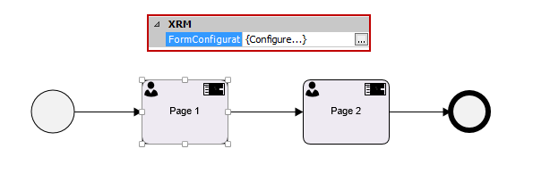

__[Home](/) --> AgileDialogs Design Guide__

---
# AgileDialogs Design Guide
---

## Introduction

This document describes the usage of AgileDialogs from dialog-designer perspective.

With AgileDialogs, a designer can create dialogs or scripts to gather
information from users and save this information either in Microsoft Dynamics
365 or other systems.

The terms 'AgileDialog' and 'dialog' are used interchangeably in the rest of the
document. To avoid confusion, *Dynamics' own dialogs*, are referred to as such,
in *italic*.

## AgileDialogs Basics

An AgileDialog is a visually designed model comprising of a set of UI steps
(Page Forms) and optionally, automatic system steps. The interface presents data
and questions to an end-user to inform or get input from the end-user. The flow
is modeled using MS Visio.

AgileDialogs can be used for many purposes, for example:

-   Self-help guides
-   Troubleshooting wizards
-   Call Scripts in Call Centers
-   Help users fill out complex forms
-   Create Surveys
-   Create Tests & Exams

**AgileDialogs** can be executed standalone, meaning the dialog is not part of an
**AgileXRM** process, or they could be part of a business process, that is, the
execution of the dialog is a task assigned to an end-user.

From the end-user's perspective, a dialog is a set of questions that he/she must
answer in order to perform a task. Within the dialog, the user can go forward or
backward in order to fulfill the required task. The dialog is presented to the
end-user using an HTML5-based Dialog Render Engine.

## AgileDialogs Design Concepts

These are the basic concepts that an AgileDialog designer must know.

### Dialog Model

An AgileDialog Model is a business process drawn and configured in Envision (MS
Visio), used for "holding a conversation" with an end-user. This process is
different from other **AgileXRM** processes, as all the tasks are executed
**synchronously** by the end-user; there are no task assignments or tasks lists
involved.

AgileDialogs can contain manual tasks (form Pages), decision points (based on
context data) and automatic activities (to interact with XRM repository or other
systems).


### Question

This is the basic unit of a dialog. Each question corresponds to a control (e.g.
Textbox, List box, Radio Button, etc.) that is presented at runtime to show to
or get information from the user. Each question has a caption, where the
designer can specify the content of the question. Beside this caption, the
designer can optionally add a tooltip and further help. The content of the
controls can be static or dynamic. For example, there is a control that presents
a grid using a query to retrieve data from the XRM repository.

### Page

Dialog questions are grouped in Pages (a Page is a form with a set of controls).
Each Page is a step in an AgileDialog model as defined in Envision. Between
Pages, the modeler can include decisions and automatic activities to control the
flow and interact with the XRM repository or other systems.


### SubDialog

This is for calling an AgileDialog from another AgileDialog. It helps organize
complex dialogs into manageable pieces, as well as for creating reusable
SubDialogs that can be reutilized in different dialogs.  
A SubDialog can be called at any point in the parent dialog (not just as the
last step) and the Back-Next functionality works as expected between dialogs and
SubDialogs.

### Validation

AgileDialogs provides validation features.

All controls have a *Required* property, when this is TRUE, the user must fill
the control to continue with the dialog.


The Validation error message is customizable via the *ValidationMessage*
property.


In the case of Text controls, there is specific validations to check max length
for strings, validate using regular expressions or type (validate that a string
is an integer, decimal). Additionally, the designer can include JavaScript code
to perform more complex validations.


We also have the *CustomValidationMessage* property available for input controls that allows us to configure and locate a message for custom validations.

### Context

The dialog has access to a context. These are dynamic values which are used in
the dialog.

The context available depends on these criteria:

|| Context available in dialog |
|--------------------------------------------------------------|---------------------------------|
| **No Main Entity set (Recommended for performance reasons)** | Preset Process Variables        |
| **Main Entity Set (Not recommended for AgileDialogs)**       | Preset Process Variables        |

1.  Responses from Questions
2.  Responses from Questions
3.  Main Entity Schema

The following 4 Preset Process Variables are only usable if the AgileDialog is
executed as a Task in an AgileXRM Process, and help to interact with the parent
process and the entity record it is managing:


-   *ParentProcessRecordID*: ID of the main entity in the parent process that
    contains the task. This ID can be used to work with the record in the dialog
    (e.g. Update its status)

-   *ParentProcessRecordType*: Type of the main entity in the parent process
    (e.g. *account*)

-   *RunDialogTaskPIID*: Process instance ID of the process that contains the
    task that corresponds to the execution of the Dialog. This can be used, for
    example, to update a variable in the context of the parent process from
    within the dialog.

-   *RunDialogTaskWID*: ID of the *Workitem* that corresponds to the execution
    of the Dialog. This is for information purpose only and has no other use.

Besides these variables, there are generic purpose variables (image below):


The most important ones are described in depth here:

-   *CrmBeId*: This is the record id of the main entity.

-   *CrmBeType*: This is the type of the process main entity, for example
    *account* or *incident*.

-   *organizationname*: This is the name of the CRM organization that the
    process record belongs to.

-   *DialogTaskCRMActivityId*: If part of Dialog Activity, this property holds
    the CRM Activity ID that launched the current dialog instance.

[This document list all available variables under *Generic* node](common/SchemaGenericVariables.md)

### Render Modes

AgileDialogs Pages can be configured to be shown in three different types of
views, from a User Experience point of view. When Designing an AgileDialogs
Process Template, it is possible to manipulate the way that every Page Form is
shown on Screen, for decorative / functional purposes. It is also possible to
combine different types of visualization in a Process, as each Page Form has its
own visualization setting.

To Change the visualization style for the Page, perform the following steps
(Pictures below):



>   Figure 1. Access to the Page Form and click "Options"


>   Figure 2. Once we are inside the Page Form designer, we click on "Options"


>   Figure 3. Once there, you can choose your preferred render mode for the
>   current Page

The three view modes to be described are:

-   **Default Render**. Every time we access to the next Dialog Page, we remove
    the previous page. Set by default when creating a new Dialog Page. 

    

-   **Continuous Render**. When moving forward through our process instance, the
    previous pages of the dialog remain on screen, and if we click on any of
    them, we would go back to that page.


>   Figure 4. Clickable history on main screen

-   **Popup Mode**. The page form marked with this Render mode, will be shown as
    a popup over the current page.  
    

    

>   Figure 5. Page Form shown on "Popup Mode"

## AgileDialogs Design

There is a specific Visio template to create AgileDialogs:


When this template is selected a new AgileDialog is created. The first thing to
do is to configure the interaction between the dialog and CRM in *XRM
Connection* window.

[XRM Connection Window](common/XRMConnectionWindow.md)

[AgileDialogs Security](common/AgileDialogsSecurity.md)

### AgileDialogs Shapes

In Envision, these stencils contain the shapes specific to AgileDialogs:


There are 5 shapes in total, four in the *XRM AgileDialogs* stencil and one in
the *XRM External Connector* stencil:

1.  **[Page Form](common/PageFormShape.md)**: is a step in an AgileDialog where the form is configured. The
    form can contain multiple controls of various types

2.  **[Start Page](common/StartPageShape.md)**: is a step in an AgileDialog where the form is configured, but it does not creates an AgilePoint process until its completed. The
    form can contain multiple controls of various types

3.  **[SubDialog shape](common/SubDialogShape.md)**: allows calling another AgileDialog where this step is used.
    There are two important differences with *CRM's own sub-dialog*
    functionality:

    1.  A SubDialog step can be used anywhere in an AgileDialog, and not just as
        the last step

    2.  The *Back* button works correctly no matter how complex the hierarchy.
        In *CRM dialogs*, it is not possible go back to the parent dialog;
        limiting the end-user experience.

4.  **[Dialog Task](common/DialogTask.md)**: is used in an **AgileXRM** Process (and not in an AgileDialog
    model) as a Task for a Full User. Upon opening the task in CRM, the user is
    presented with the associated AgileDialog.

5.  **[Intranet Dialog Task](common/IntranetDialogTask.md)**: is used in an **AgileXRM** Process as a Task for a
    Process Participant User. Upon opening the task in the Portal, the user is
    presented with the associated AgileDialog. The Task is *Completed* when the
    user completes the dialog.

6.  **[Internet Dialog Task](common/InternetDialogTask.md)**: used in an **AgileXRM** Process (and not in an
    AgileDialog model) as a Task for an External User. Upon opening the task in
    the Portal, the user is presented with the associated AgileDialog. The Task
    is *Completed* when the user completes the dialog.

Apart from these, most shapes in the *AgileXRM Automatic Activities* stencil can
be used in dialog models. The following shapes *cannot* be used in an
AgileDialog model:

- [Wait for Update](../ref/WaitforUpdate.md)
- [Page Form Shape](common/PageFormShape.md)

### Control Types

Currently the following control types are available, and each type has specific 
configuration besides the common properties.

- [Calendar](common/Calendar.md)
- [Check](common/Check.md)
- [Combo](common/Combo.md)
  - [Populating a Combo](common/PopulatingCombo.md) 
- [Currency Control](common/CurrencyControl.md)
- [File](common/File.md)
- [Group Container](common/GroupContainer.md)
- [IFrame](common/IFrame.md)
- [Info](common/Info.md)
- [Password](common/Password.md)
- [Radio](common/Radio.md)
- [Tab Container](common/TabContainer.md)
- [Textbox](common/Textbox.md)
- [Numeric](common/NumericControl.md)
- [Widget Control](common/WidgetControl.md)
- [XRM Grid](common/XRMGrid.md)
- [XRM Lookup](common/XRMLookup.md)
- [XRM Search](common/XrmSearchControl.md)
- [Variable Control](common/VariableControl.md)
- [Yes/No](common/YesNoControl.md)

### Advanced Features

[Breadcrumbs](common/Breadcrumbs.md)

[User Feeback](common/UserFeeback.md)

[Localization](common/Localization.md)

[Performance Window](common/PerformanceWindow.md)

[JavaScript Extensions](common/JavaScriptExtensions.md)

[Hosting dialogs inside a Portal](common/HostingAgileDialogsInsidePortal.md)

#### Exporting and Importing Page configuration

The form definition can be exported to an XML file or imported from an XML file
using the menu options available in Tools menu:


#### Launching a Dialog using a URL

AgileDialogs can be launched using a URL, there is no need to have an associated
XRM record nor an AgileXRM task.

An AgileDialog can be used, for instance, to create a record in XRM helping the
user to fill the data avoiding the use of complex forms or to get data to call
other system using a web service.

The format of the URL to launch a dialog is:

```xml
http://<SERVER_URL>/AgileDialogs/AgileDialogsKendoRuntime.aspx?orgname=<ORGANIZATION_NAME>&DefaultProcessTemplate=<PROCESS_TEMPLATE_NAME>
```

This URL can be used in portals to allow the users starting dialogs on demand.

In order to make this work, the user must have permission to start instances of
the dialog template.

##### Language Setting

When the dialog is localized and the link must open a specific language, the URL
can contain the Locale ID of the language, the format of the URL in this case
is:

```xml
http://<SERVER_URL>/AgileDialogs/AgileDialogsKendoRuntime.aspx?orgname=<ORGANIZATION_NAME>&DefaultProcessTemplate=<PROCESS_TEMPLATE_NAME>&lcid=<USER_LOCALE_ID>
```

For a list of Locale IDs see
<http://msdn.microsoft.com/en-us/library/0h88fahh(v=vs.85).aspx>.

The value to pass is in the column *Decimal Value*, for instance for 3082 for Spanish
 or 1036 for French.

##### Action after dialog finishes

When creating a link to open a dialog it is also possible to specify what to do
when the dialog is finished. There are several options based on the use of the
query string parameter *AfterSubmit*:

-   Close the window when dialog finishes. This is useful when opening the
    dialog in a new window  
      
```xml
    http://<PROCESS_TEMPLATE_NAME>/AgileDialogs/AgileDialogsKendoRuntime.aspx?orgname=<ORGANIZATION_NAME>&DefaultProcessTemplate=<PROCESS_TEMPLATE_NAME>&AfterSubmit=Close
```

-   Redirect to another URL. This approach is used to return to the calling page
    instead of closing the window

```xml
   http://<PROCESS_TEMPLATE_NAME>/AgileDialogs/AgileDialogsKendoRuntime.aspx?orgname=<ORGANIZATION_NAME>&DefaultProcessTemplate=<PROCESS_TEMPLATE_NAME>&AfterSubmit=\<URL_TO_REDIRECT_TO\>
```

#### Creating links to complete a Dialog Task

Sometimes the process modeler needs to send an email to a user with a link to
complete a task that consists of a dialog. The email needs to be sent using the
Notification mechanism of the Dialog Task shape so that the WorkItem ID can be
sent.

The format of this URL is:

```xml
  http://<PROCESS_TEMPLATE_NAME>/AgileDialogs/AgileDialogsKendoRuntime.aspx?orgname=<ORGANIZATION_NAME>&DefaultProcessTemplate=<PROCESS_TEMPLATE_NAME>&wid=<AGILEXRM_WORKITEM_ID>
```

When the user opens this URL the dialog is either started (the first time that
the user opens this URL) or resumed if the user is returning to this dialog.

[Customizing Look and Feel](common/CustomizingLookAndFeel.md)
<!--
[Custom Controls SDK](common/CustomControlsSDK.md)
-->
#### Accessibility

##### Enable/Disable Section 508 mode.

AgileDialogs has a mode that will render the UI compatible with the US
Government's Section 508 requirements.

To enable this mode, the URL to initiate the dialog should contain the *s508*
parameter set to 1:

```xml
 http://<PROCESS_TEMPLATE_NAME>/AgileDialogs/AgileDialogsKendoRuntime.aspx?orgname=<ORGANIZATION_NAME>&DefaultProcessTemplate=<PROCESS_TEMPLATE_NAME>&s508=1
```

#### Cancelling a dialog

There are various ways that a dialog may be cancelled:

##### By User

AgileDialogs that are associated to a task (Dialog Task, Intranet Dialog Task
and Internet Dialog Task) can be cancelled by the user if the modeler allows it
by setting the *Enable Cancelation* parameter to *true*:


When the dialog is canceled the corresponding task in the parent process is
canceled and the process continues.

##### By System

Dialogs will also be automatically canceled when the Expected Time property
which is set at the dialog level is surpassed.

While the dialog is not canceled the user can suspend and open it in the last
page whenever he wants.

Dialogs that are run on demand (that is, they are not associated with a task)
are automatically canceled when Expected Time parameter of the dialog is
exceeded:


