# AgileDialogs User Guide

**[Home](/) --> AgileDialogs User Guide**

---

## Introduction

This document describes the usage of **AgileDialogs** from end user's perspective.

With **AgileDialogs** Users can fill out dialogs to save information in Microsoft Dynamics CRM or other systems.

A dialog is a set of steps to be executed in a specific order as defined by the dialog designer (See *AgileDialogs Designer Guide*). The user responses guide him/her through the dialog.

---

## AgileDialogs basics

An AgileDialog is a set of pages (forms) comprising of prompts and responses, to convey and get information from a user, using a flow modeled as a Business Process in MS Visio.

**AgileDialogs** can be used for many purposes, for example:

- Self-help guides
- Troubleshooting wizards
- Call Scripts in Call Centers
- Help users to fill out complex forms
- Create Surveys
- Create Tests & Exams

During the dialog the user can go forward or backwards (either one step or several steps) in order to fulfill the required information. The dialog is presented to the user using a web page.

---

## AgileDialogs concepts

These are the basic concepts that an **AgileDialogs** user must know.

---

### Page

Dialog questions are grouped in pages (a page is like a form with a set of controls).

When the page questions have been fulfilled the user can click the *Next* button.

Questions can include validations so that the page cannot be completed until all controls have been validated successfully.

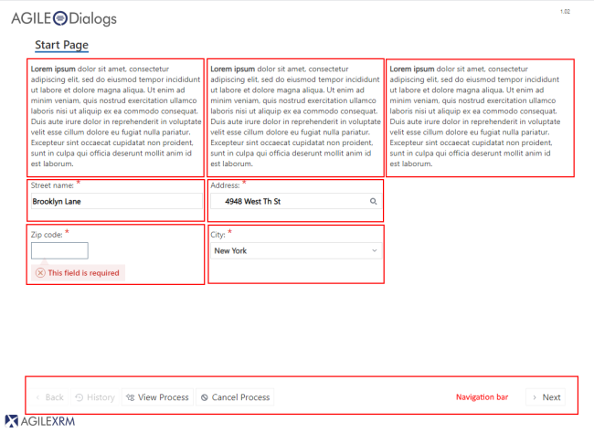

> AgileDialogs controls and navigation bar.

---

### Control

This is the basic unit of a dialog. Each question has a caption that describes the input.

Beside this caption, the question can have a tooltip and if needed, more extended help (presented in a modal window).

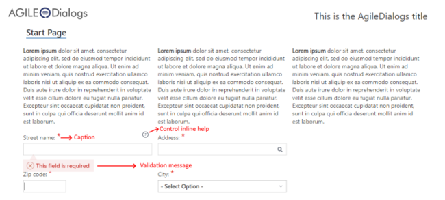

> AgileDialogs control basics

---

### Sub-Dialog

This is a dialog called from another dialog. It helps organize complex dialogs
into manageable pieces, as well as for creating reusable sub-dialogs that can be
called in different dialogs.

---

## AgileDialogs Execution

When an AgileDialog is opened, the user must respond to the questions and using
the *Next* button, navigate to the following pages.

The user can go back to the previous page using the *Back* button, or to any
other page previously presented, using the *History* button.

Each page has the following parts:

- Dialog Title
- The Breadcrumb container
- Page Title
- The Page Questions container
- The Comments container
- The Action Buttons container

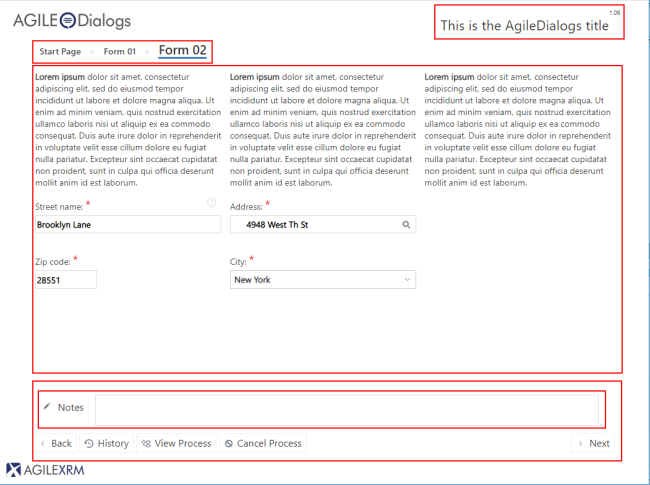

> AgileDialogs page structure

---

### Dialog Title

This part of the dialog window contains a descriptive title of the dialog.

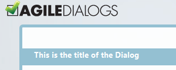

---

### Breadcrumbs

If the dialog designer wishes so, the dialog may show a breadcrumb at the top of the pages, as way of guiding the user as to which stage of the dialog he/she is at.

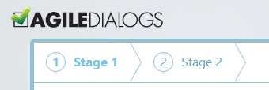

### Page Title

This part contains the descriptive name of the page.

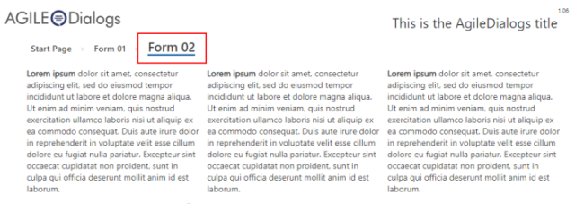

### Controls Container

This part contains the questions that are configured for the current step. Here is where the user must introduce the values required to continue the dialog. The content of this container is dynamically updated when the user clicks *Next* and a new page is presented.

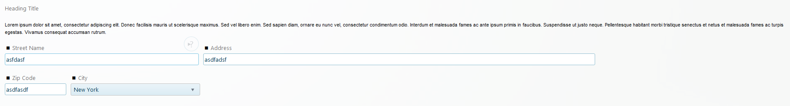

The dialog cannot continue until all validation is passed. While the response is not valid, the question is surrounded with a warning rectangle, and hovering the mouse over the warning icon, the validation error message is shown.

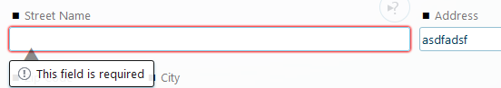

Validation information is dynamically updated while the control is being updated, so that the user can easily see if all control has passed validation. For instance, *Street name* field is required; when a value is introduced the validation warning is automatically hidden:

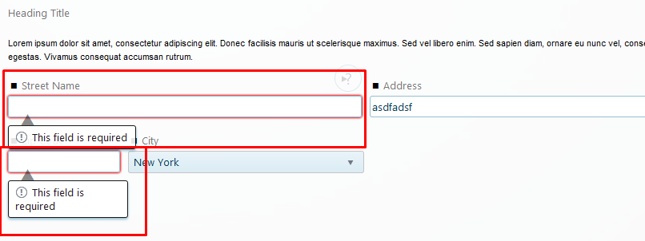

These are the question types that this container can include:

- **[Textbox](common/Textbox.md)**: this question type is used to introduce a text value

    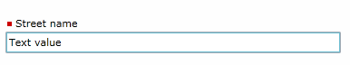

- **[HTML](common/HTMLControl.md)**: this question type is used to introduce a HTML value

    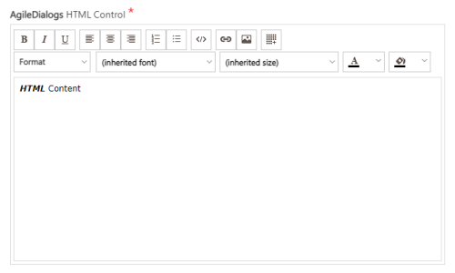

- **[Numeric](common/NumericControl.md)**: this question type is used to introduce a numeric value

    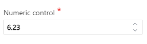

- **[Drop-Down List](common/Combo.md)**: this question type is used to select a single value from a list

    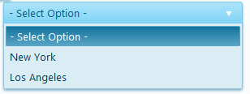

- **[Radio Button](common/Radio.md)**: this question type is used to select a single value

    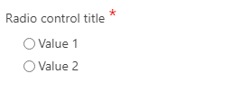

- **[Button Set](common/Radio.md)**: This question type is the same as the Radio button but represented as a set of buttons. Clicking on one button is like selecting that option AND clicking *Next* in one go

    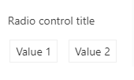

- **[Checkbox](common/Check.md)**: This question type allows selecting multiple values

    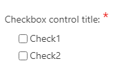

- **[Info](common/Info.md)**: This question type presents information to the user. This
    information can include images, formatted text and hyperlinks.

    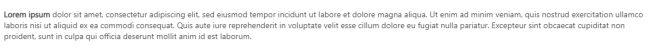

- **[Yes/No](common/YesNoControl.md)**: This question type is used to select Yes or No as the response to a question. It is just a common use of Radio Buttons

    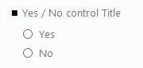

- **[Calendar](common/Calendar.md)**: This question type is used to select either a Date or a Date and Time

    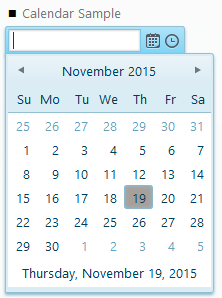

- **[Lookup](common/XRMLookup.md)**: this control is used to select an item in a list. The value can be filled using auto- complete feature. Just Click on the button to get the    list of values to choose:

  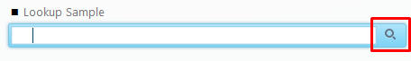
  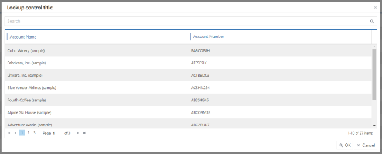

  It is possible to filter the results by typing on the Textbox. After clicking on the "filter" button, the filtered results are shown:

  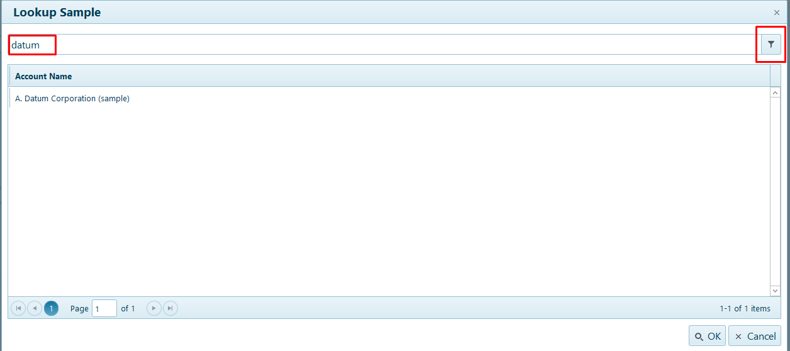

- **[Data Grid](common/XRMgrid.md)**: This question type shows a list of items in a table for selecting one of them:

    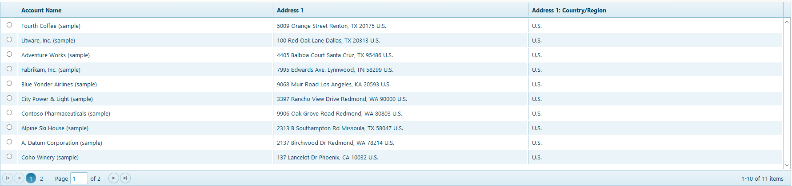

    >   ...or selecting multiple items:

    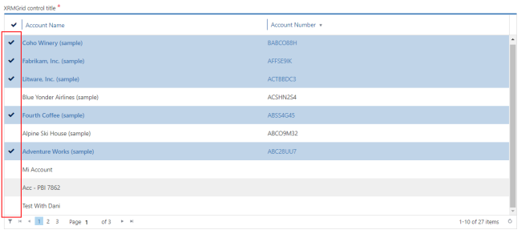

    >   ...or just show the list for information purposes:

    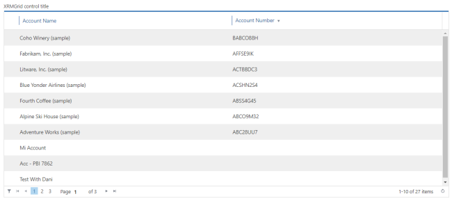

- **[File](common/File.md)**: This allows selecting a file from the user's PC. Click on the button and the selected file will start uploading:

    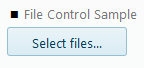

    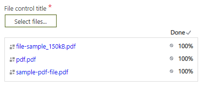

- **[Password](common/Password.md)**: It is used to get passwords:

    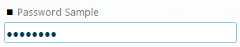

- **[Tab container control](common/TabContainer.md)**: Tab container control allows organize our Form information for structural and / or validation
purposes.

    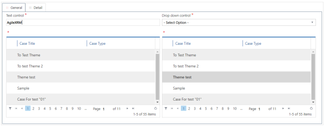

- **[Group container control](common/GroupContainer.md)**: The Group Container allows us to build a certain set of controls inside a same group container, for functional and / or decorative purposes

  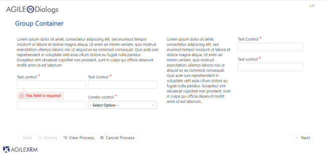

- **[Search control](common/XrmSearchControl.md)**: Search control allows to perform a XRM FetchXML, JSON and REST search in **AgileDialogs** page and set the data retrieved to page controls.

- **[Variable Control](common/VariableControl.md)**: Variable control allows to create process context variables.

- **[Custom Control](common/WidgetControl.md)**: This type of question is for adding your own controls,  using **AgileDialogs** extension mechanisms

---

### Notes Container

When the dialog designer configures the dialog to allow including comments, this notes box becomes available for adding comments throughout the dialog. This is very common in Call Centers:

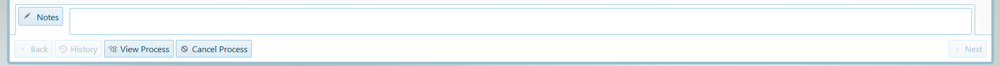

The Notes box is collapsible to increase the available space of the window.

---

### Action buttons

Depending on the configuration of the dialog, the buttons available may be different.

All dialogs have the buttons *Back* (enable from second step), *History* (enabled from second step too) and *Next*. The other buttons are based on configuration.

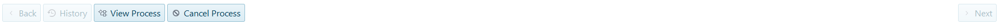

---

#### Next button

This button is used to naviagte to the next step.

---

#### Back button

This button is used to return to the previous step. This button is not enabled for the first step and could be disabled if the dialog designer has configured it so.

---

#### History button

This button opens a scrollable list of previous pages that have already been visited. This allows checking the values introduced previously, or optionally, returning to a previous page.

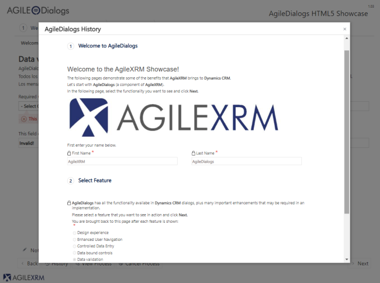

To return to a specific page, click it in the History window and confirm:

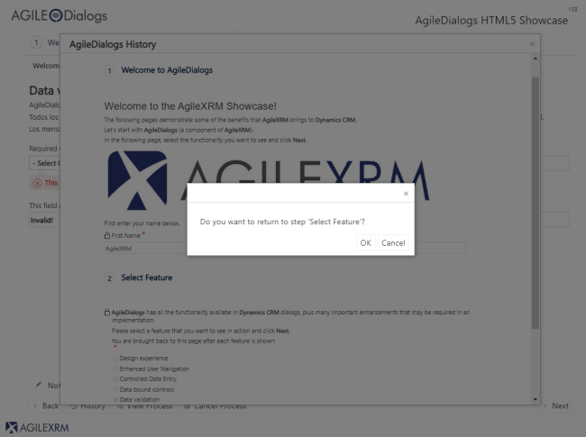

---

#### Viewer button

This button will be enabled if the modeler has configured it so (normally, it is not). This feature is used to view the dialog status. Each shape represents an activity.

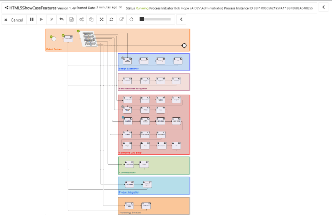

---

#### Cancel button

This button is used to cancel the dialog execution. This button is visible if the dialog modeler has configured it so.

---

#### Feedback button

During the dialog design the modeler of the dialog can enable feedback comments gathering to help him/her improve the dialog. This button is used to open this window:

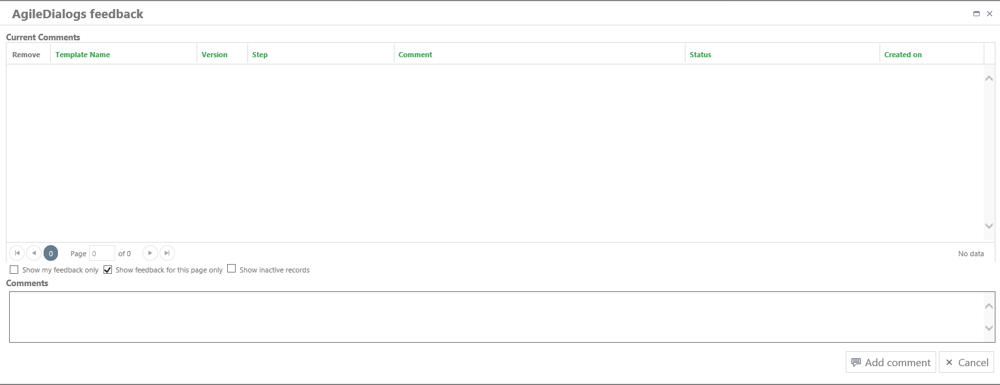

That allows including comments regarding the dialog configuration.

The comment is linked to the current step, dialog version, user and dialog template. Comments are stored in XRM repository for further review by the dialog designer.

This window allows removing comments using the button Remove on the left of each item.

---

## Disclaimer of warranty

[Disclaimer of warranty](common/DisclaimerOfWarranty.md)
