__[Home](/) --> AgileXRM Quick Start__

# Envision Remote App configuration
---

## Configure the ENVISION remote connection

This section defines how to create a RemoteApp connection  to **AgileXRM** Envision Modeller. This steps are only needed if this is the very first time you use **AgileXRM**.

- Open control Panel and navigate to RemoveApp and Desktop connections. 

	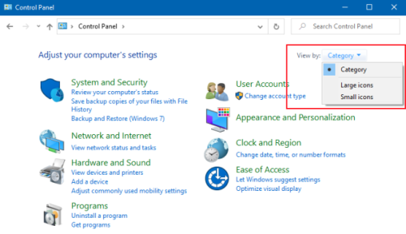

- From control panel, Open RemoteApp and Desktop connections 

	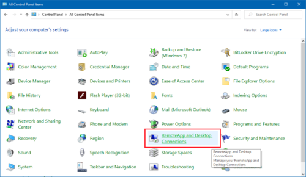

- Configure a new remote app connection to AgileXRM Envision server:
	Connection URL value is: [https://envisiononline4a.autords.com/RDWeb/Feed/webfeed.aspx]()

	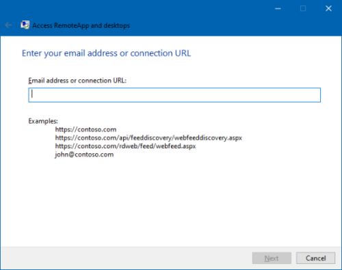

  > All other data needed is provided by onboarding email notification

- Once RemoteApp configuration is successfuly completed we must see our connection under "Work Resources"

	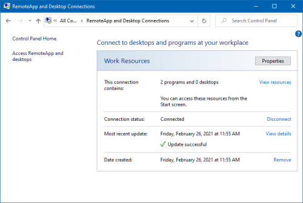

	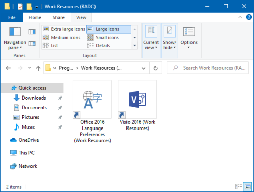

Once remote app connection is created, we strongly recommend create a desktop shortcut to future uses.

## Connect to ENVISION RemoteApp

RemoteApp will prompt if you trust in the application publisher. Choose "Connect" to launch AgileXRM Modeller - ENVISION.

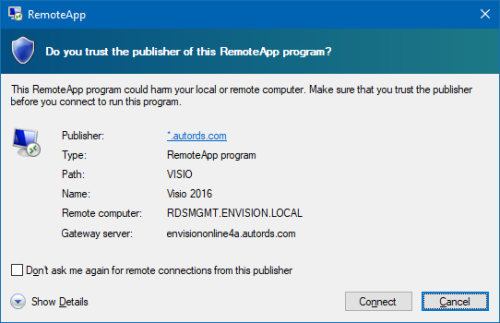

> Check "Don't ask me agin for remote connections from this publisher" to avoid this message

Needed credential to connect will be provided with onboarding mail.

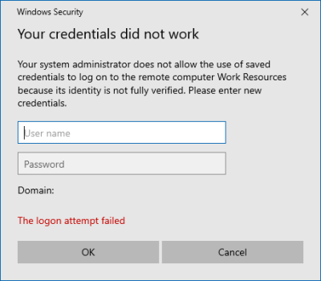

## Connect to your CDS environment

When app is loaded, first of all we need to login to our Microsoft Environment.
 We should provide the credentials.

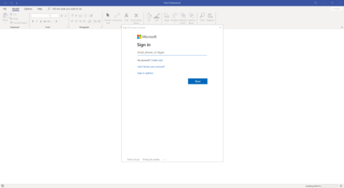

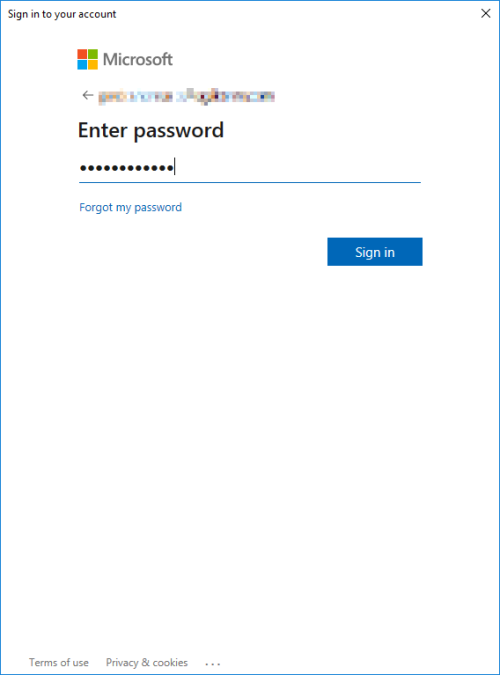

Once we are loged to ....

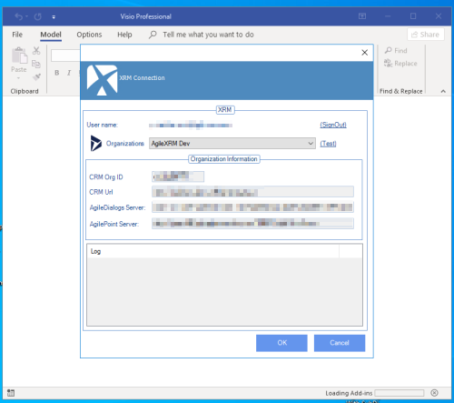

Choose which CDS organization you want to connect, and connect.

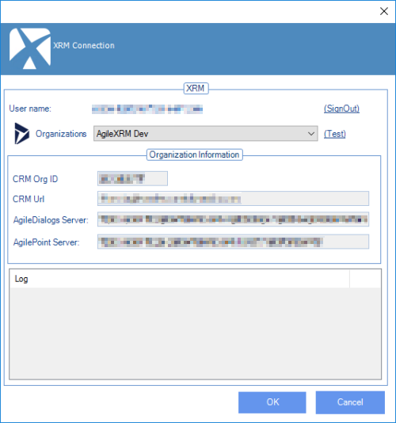

