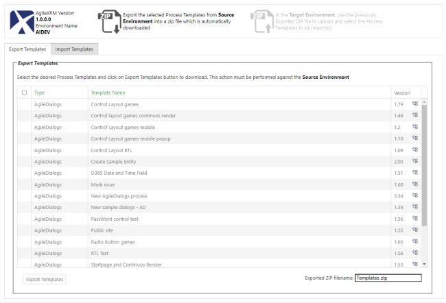

__[Home](/) --> AgileXRM Import/Export Utility__

# AgileXRM Import/Export Utility

The **AgileXRM** Import/Export utility allows move AgileXRM process templates from one environment to other easily.

## Introduction

**AgileXRM** Import/Export utility allows moving process templates between environments. Its needed to do this work in two different stages by this way:

- Connect to environment which contains the process templates you want move, and Export the templates. This is the **Source Environtment** and export operation generates a .zip file with selected templates.
- Connect to environment where you want deploy the process templates. This is the **Target Environtment**. Use the .zip file previously generated in Source Environment to upload and publish it to Target Environment. 

### Export process templates

- Launch Import/Export utility from environment which contains the process templates you want move. **Source Environment**
- From Export tab, choose which process templates whish export. Can choose alll publised templates using the header click button.
- Click on `Export Templates` button to export process templates. This action will generate an .zip package that contains selected templates.

> Optionally you can set the output filename
 
### Import process templates

- Launch Import/Export utility from environment where you want deploy process templates. **Target Environment**
- Upload the .zip package
- Choose which templates you want to import 
- Choose target organizations
- Publish templates.

> When selected process template already exists in Target Environment with the same version, process template will be skipped.

> Version Mismatch validation. Lorem ipsum ...

## Disclaimer of warranty

[Disclaimer of warranty](common/DisclaimerOfWarranty.md)