# AgileXRM OnBoarding Guide

## I need a Trial Dynamics 365 CE Org or CDS Database
**Note**: If you already have an available D365 Organization or CDS DB to test out AgileXRM on it, you can skip this section
1. Navigate to this [link](https://signup.microsoft.com/Signup?OfferId=bd569279-37f5-4f5c-99d0-425873bb9a4b&dl=DYN365_ENTERPRISE_PLAN1&Culture=en-us&Country=es&ali=1)
2. Provide info. Make sure to select European Country

   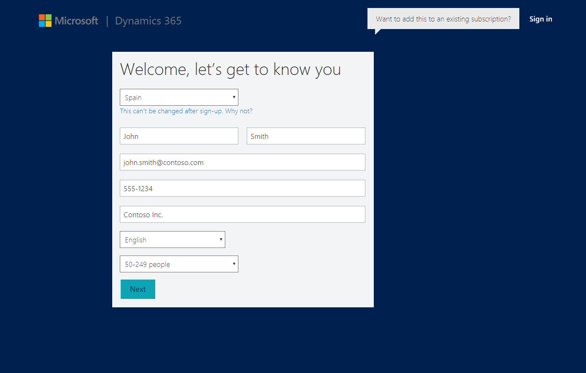

3. .
   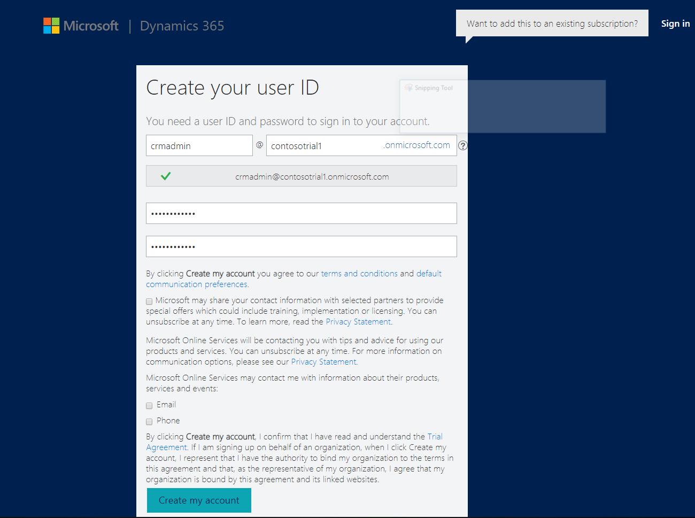

4. .
   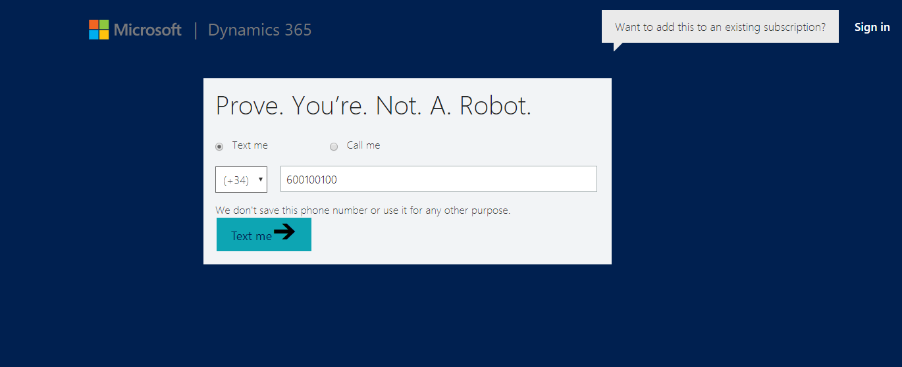

5. .
   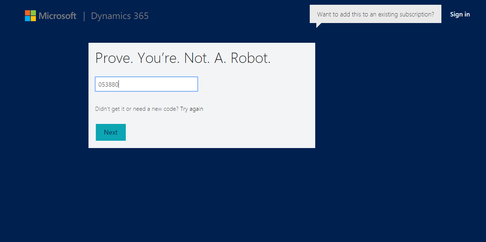

6. .
   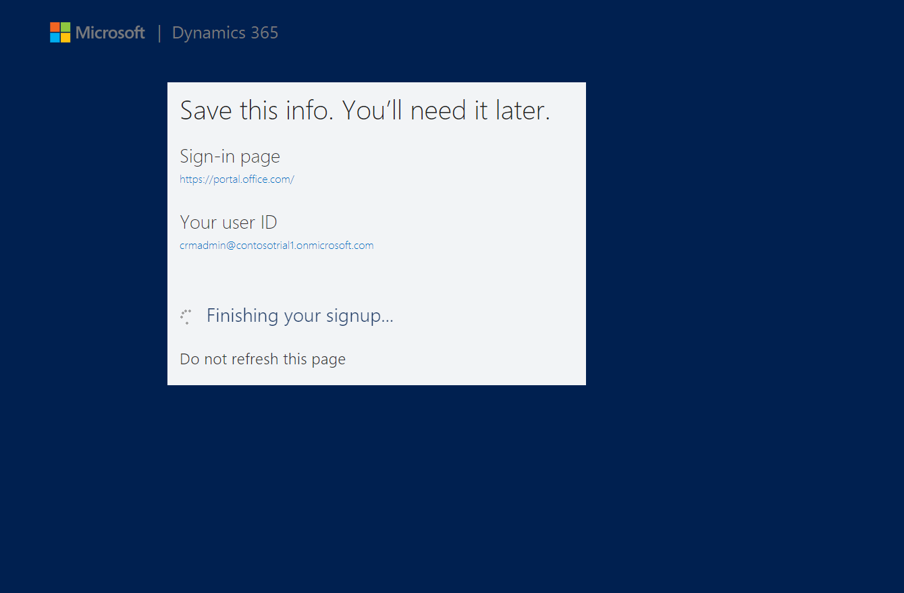

7. .
   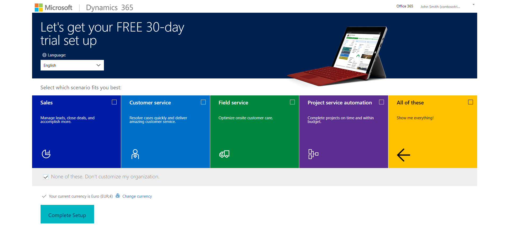

8. .
   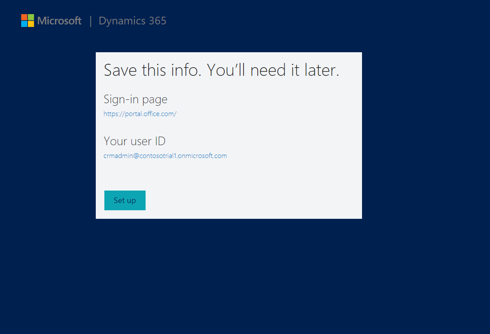

9. .
   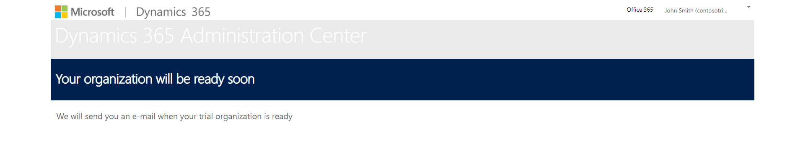

## You already have a Dynamics 365 CE Org or CDS Database to test on

### Deploy AgileXRM Solution
1. Navigate to the offer in AppSource here: [link](https://appsource.microsoft.com/en-us/product/dynamics-crm/agilepointinc.agilexrm-preview?flightCodes=x3gvdAYcrkxQaR9L&pub_source=email&pub_status=success)

2. Click on **Free Trial** button (make sure to be logged in with CRM Admin User: e.g. *crmadmin@contosotrial1.onmicrosoft.com*)

   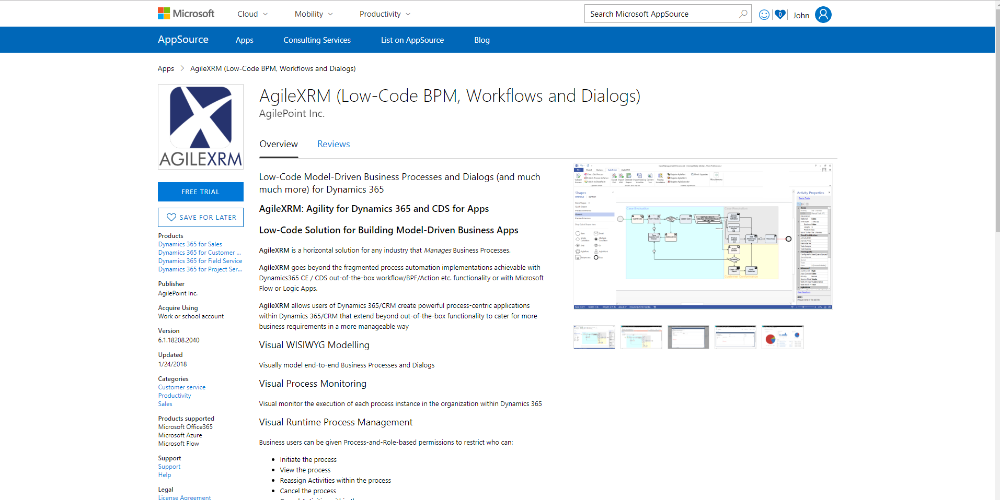

3. Authorize

   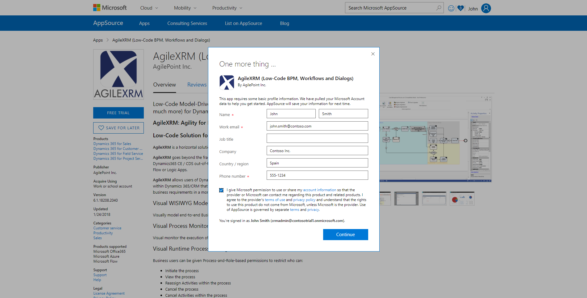

4. Agree

   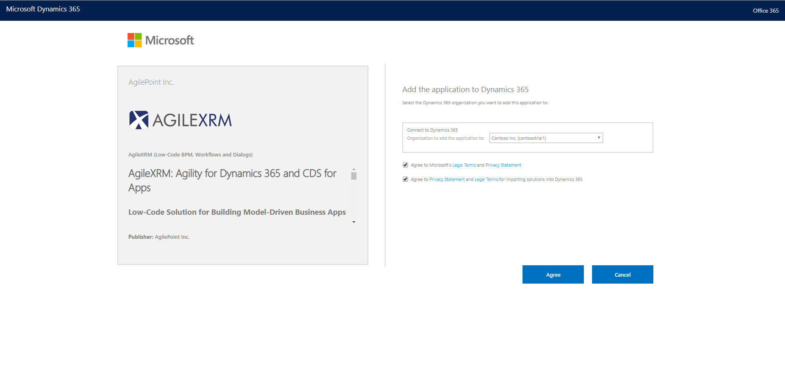

5. Installing

   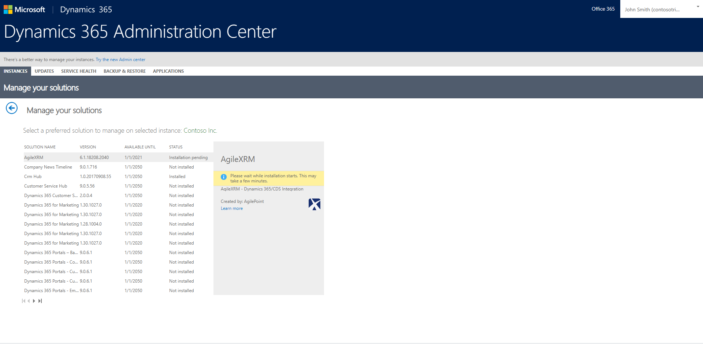

6. Installed

   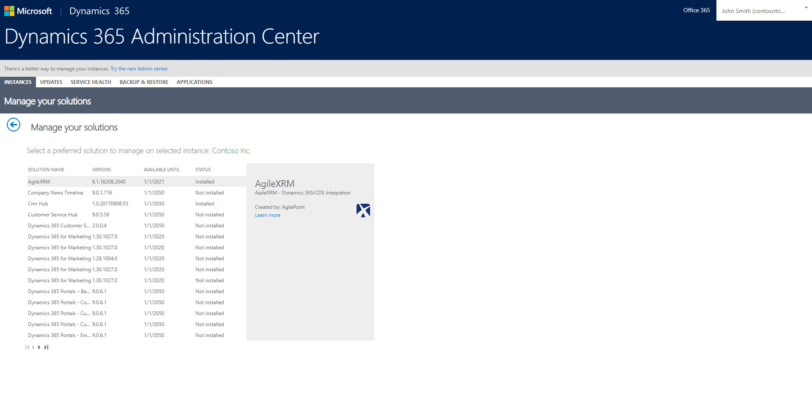

7. Check

   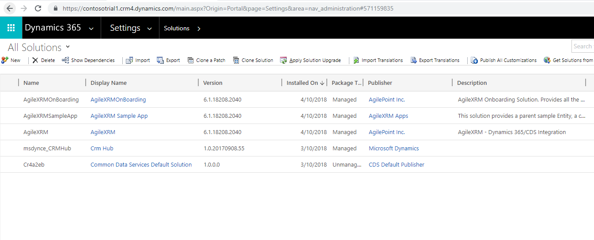

## Start AgileXRM OnBoarding Process
1. Logon as admin (e.g. *crmadmin@contosotrial1.onmicrosoft.com*) in D365 Organization (https://contosotrial1.crm4.dynamics.com)

2. Navigate to "Settings>AgileXRM Administration"

   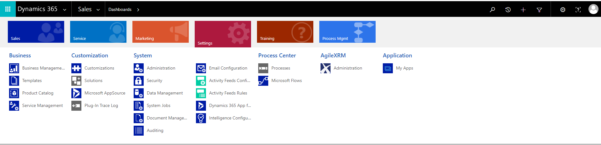

3. Click "Start AgileXRM Onboarding" button. 

   

4. Logon as admin

   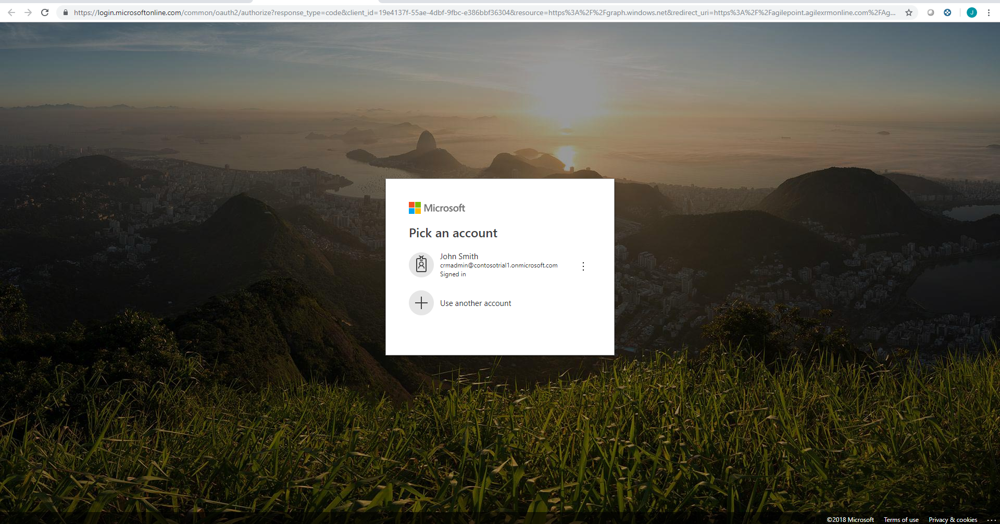

5. Consent Services

   

6. ConsentPortal 

   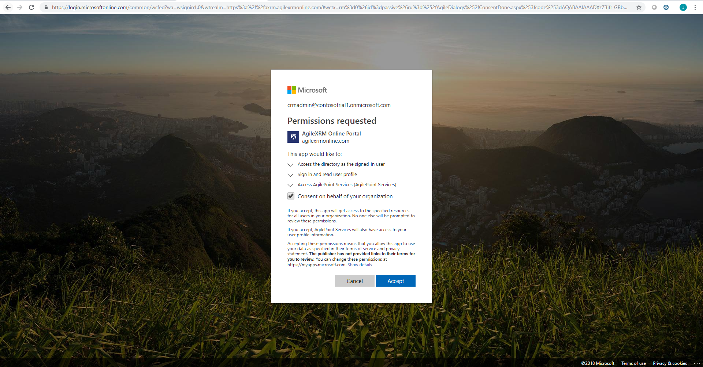

7. Dialog Page to provide AgileXRM Onboarding Code

   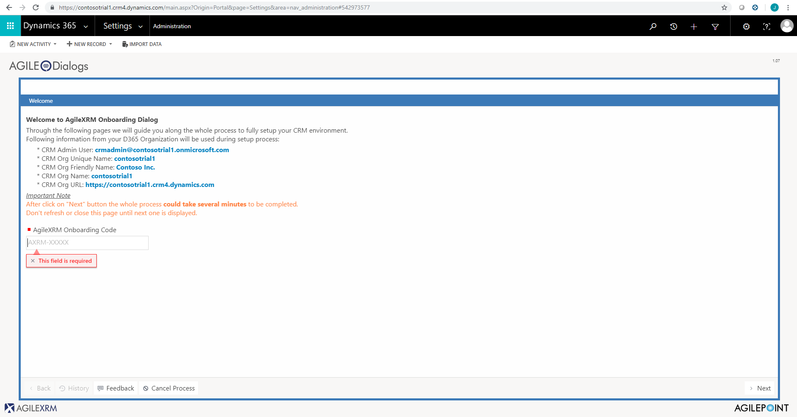

8. Wait

   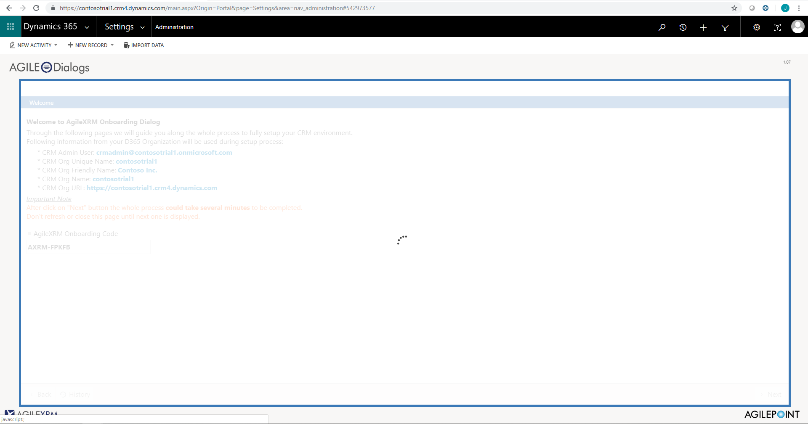

9. Onboarding Done

   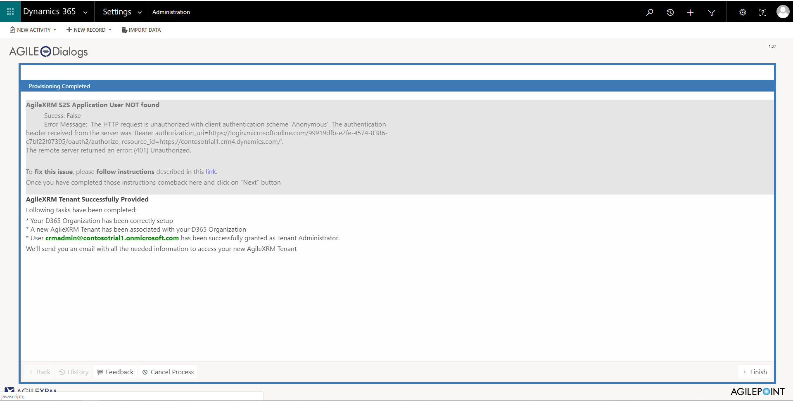
