# Process Manager

**[Home](/) --> Process Manager**

---

Process Manager is an integrated **AgileXRM** tool that allows you manage **AgileXRM** and **AgileDialogs** process instances in real time.

## Introducction

Process Manager is an integrated and powerfull tool, to view and manage **AgileXRM** and **AgileDialogs** process instances.

Some of Process manager features are:

* Real time monitoring for **AgileXRM** and **AgileDialogs** process instances.
* Integrated process instance diagram viewer.
* **AgileXRM** and **AgileDialogs** process instance tracking
* Process detail information.
* Process hierarchy navigation.
* Change flow
* Process Migration

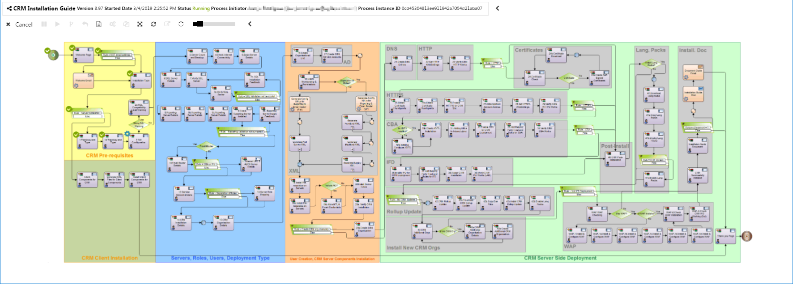

## Process Manager overview

Process Manager divides the screen in two sections. Upper section contains the toolbars area, and the process diagram viewer below.

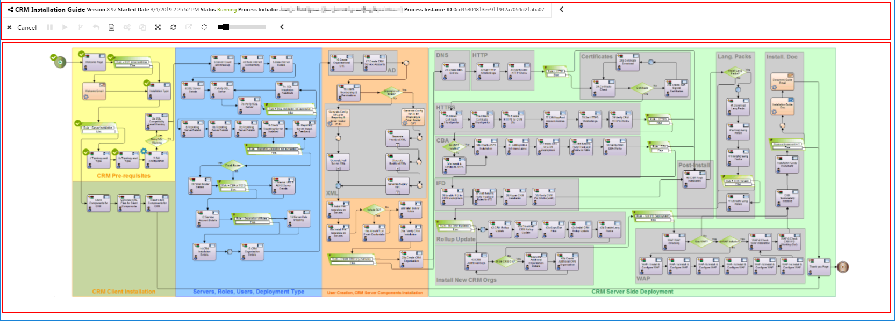

### Process instace information toolbar

Process instance `Information toolbar` is placed at the top of the screen and contains the general process instance information:

* Process template name.
* Version: The process template definitionversion used to create the process instance.
* Started Date. The date on which the process instance began.
* Status. The **AgileXRM** process instance status. Possible values are: `Running`, `Completed`, `Canceled`, `Faulting` and `Suspended`
* Process Initiator. The user name thats has initiated the process instance.
* Process Instance. The process instance identifier.

Process instace information toolbar can be hiden/shown by arrow button. 

### Actions toolbar

Actions toolbar is placed immediately below from `Information toolbar`. This toolbar contains the command buttons to perform process instance actions.

Process instace information toolbar can be hiden/shown by arrow button. 

### Process diagram

Each **AgileXRM** process instance is based on process definition template, this area shows the image that corresponds with current process instance. This diagram is updated by providing information on the status of the process in real time. It is also interactive, the user can get details of any activity by clicking on it.

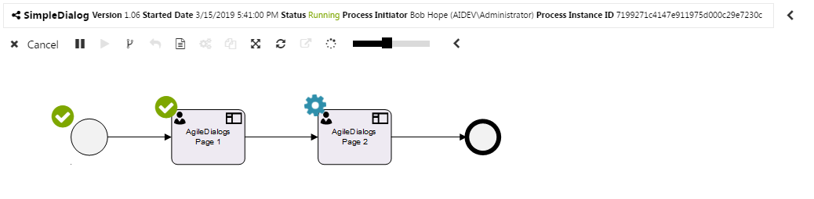

Also, each activity has an icon to easily get information about its execution.

* Executed activities has a green icon. 

* Current executing activities has a running gear icon. 

* Cancelled activities has a red cross icon. 

* Failed activities has a red warning icon. 

By choosing an activity we can see the activity detail window, that contains information about current status, timing dates and when its a manual task also contains participants names.

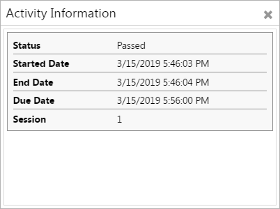

## Actions
### Cancel process instance

This action cancels the active process instance and its child processes if exists. Use `Cancel button`
 to perform this action.

One a process instance is cancelled the status of process instance will set to `Cancelled` and will not allow more actions.

### Suspend process instance

This action allows a user with the appropriate permissions to suspend an **AgileXRM** process instance to avoid changes. It is generally used to migrate process instances as explained below in the process migration section.
Use `Suspend button`
 to perform this action.

One a process instance is suspended the status will set to `Suspended` and will not allow user perform tasks with process until its resumed.

### Resume process instance

This action allows a user with the appropriate permissions resume a previously suspeded **AgileXRM** process instance.Use `Resume button`
 to perform this action.

Once a process instance is resumed the status will set back to `Running` and user can perform with process tasks again.

### Change flow

Change flow allows user with appropiate permision (usually a system Administrator), to change the current executing activities to others. By this way, we can modify the flow path in order to solve posible problems with process instance.

Press `Change flow button`  to show change flow utillity, and next choose the source and target activities by clicking the diagram activities.

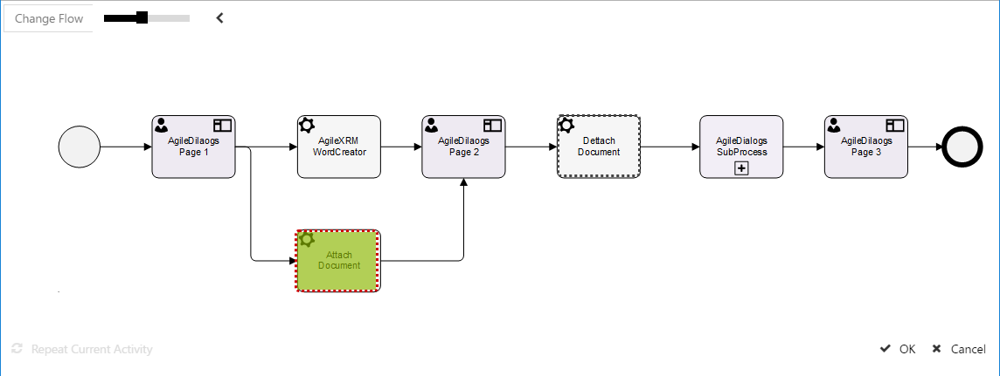

> **Note:** The executing activities has green background fade effect, and target activities has a dashed border to identify it easily.  
**Note:** Change flow allows choose multiple source and target activities.

One we had select source and target for change flow operation press `Ok`  button to confirm or `Cancel`  button to cancel.

> **Note:** Change flow operation are not allowed in **AgileDialogs** process instances.

### Process navigation

When an activity process is a subprocess itself, we can navigate to child process. Simplily,  we must select the subprocess activity, and when pop up window has displayed click on child instance button. Once done, subprocess is shown in process manager.

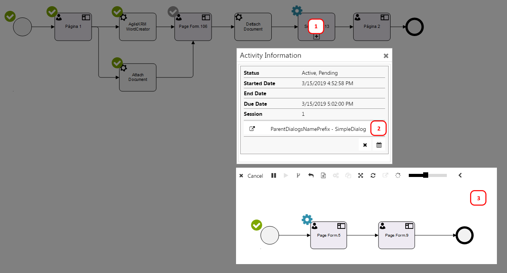

By same way, when the process instance is a subprocess, we can navigate to the parent process using `Parent process navigation button`.

### Migrate process instance

This action allows user with appropiate permission(usually a system Administrator),migrate an **AgileXRM** process instance from one process definition version to other. Migration can be performed from an older version to newer version, and vice versa: from newer version to older. 

First of all we need to suspend the process instance, in order to prevent other users to interact with process instace while its migrating. To supend the execution of process instance press the `Suspend button` and then press the `Migrate button`. 

Both buttons are placed in the `Actions toolbar` .

Once its done, the migration tool is shown. This screen shows the current executing version at the left side, and we need to choose the targeting version for migration operation from version dropdown at the right of screen.

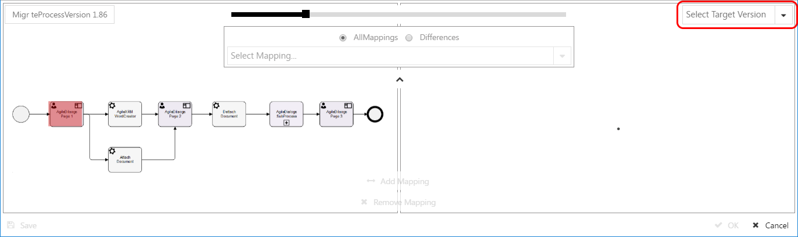
> **Note:** The executing activities has red background fade effect

Once we select the target version, it is displayed on the screen right side. At this point, we can see the diagrams of the two versions together.

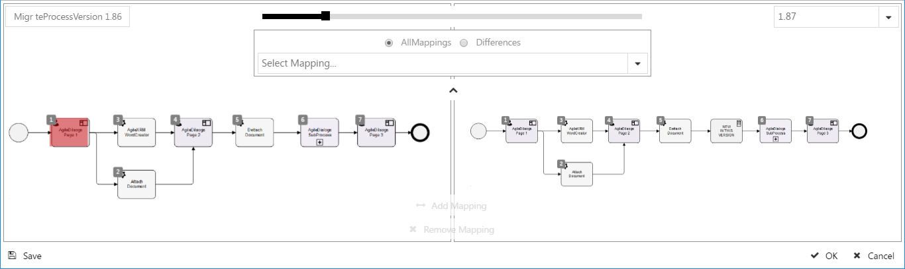
> **Note** that new process definition version has an additional activity that is not present in source diagram

The next step is create a mapping for process template activities on each  version.
When activity is present in both source and target version, **AgileXRM** creates a automatically the mappings between both version (identified at diagram images with number icon).

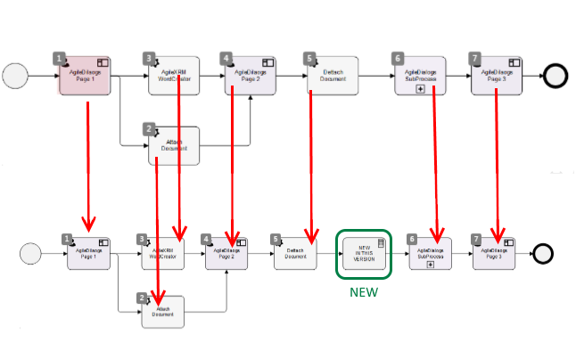

When an activity is not present in both versions, we can manage version differences with mapping tool, that allows define how it activities should be migrated.

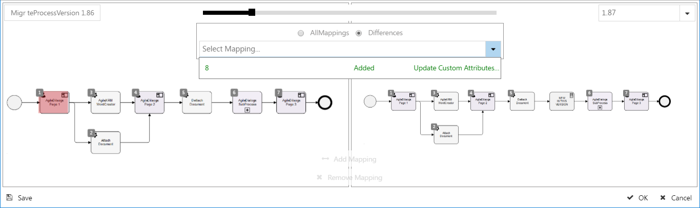
> **Note:** When we need to apply this migration to multiple process instances, we can download the migration instruction file, by `Save button`  and apply it to selected instances. **This multiple migration operation must be performed with extreme caution by a system administrator.**

Once we had finished with mappings, we can press `Ok` button to perform version migration.

Finally, we need to resume the process instance, by `Resume button`, in order to allow users interact with process.

### Process instance details

This action allows get process details window. Use `Details button`
 to perform this action.

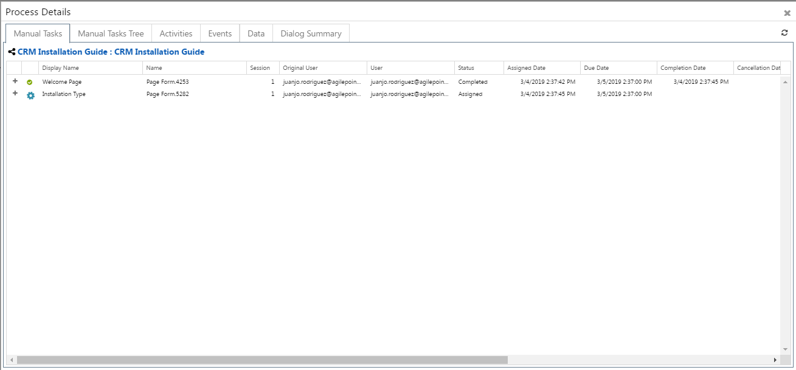

`Process details window` contains several tabs that are explained below.

#### Manual Tasks 

This tab shows a list of manual tasks. This is a list of process activities without the automatic activities.

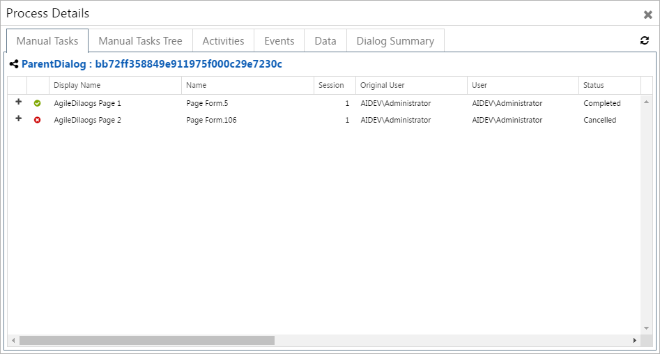

By pressing `Plus Icon button`  we get all information about manual task.

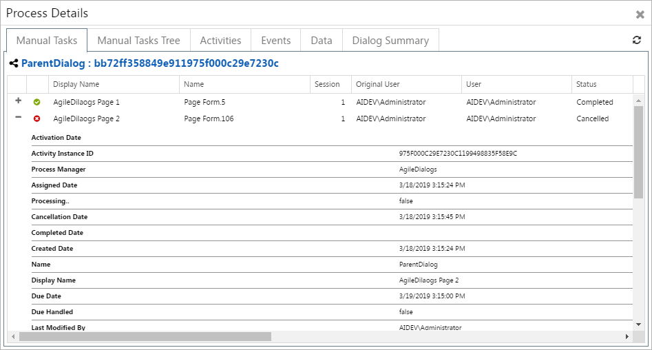

#### Manual Tasks Tree

This tab shows a list of manual tasks including subprocesses tree. 
 
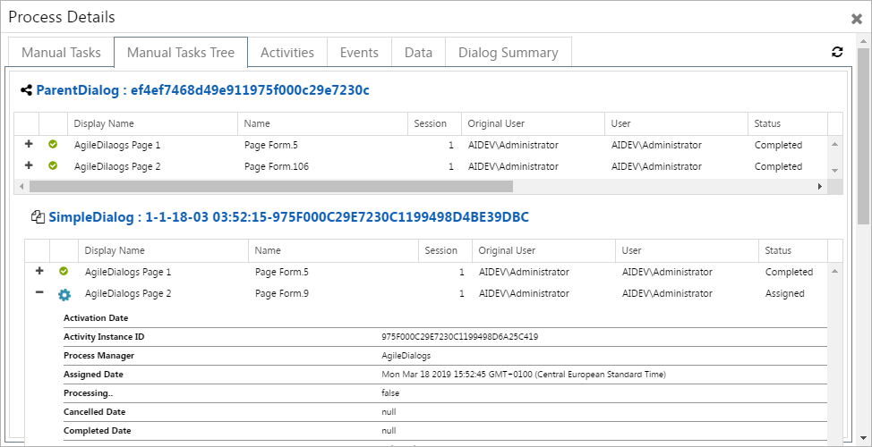

> **Note:** As we do with `Manual Taks tab`, by pressing `Plus Icon button`  we get all information about manual task.

#### Activities
This tab shows a list of all activities that contains process instance.
 
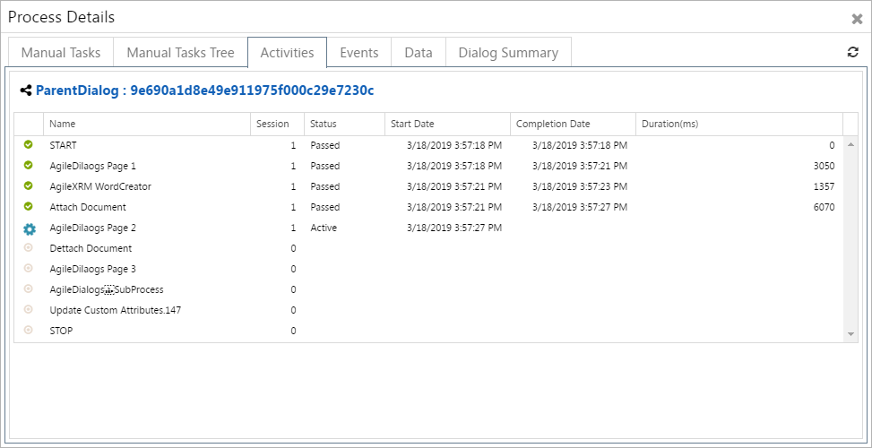

#### Events

This tab shows a list of all the events that occurred for the process instance.

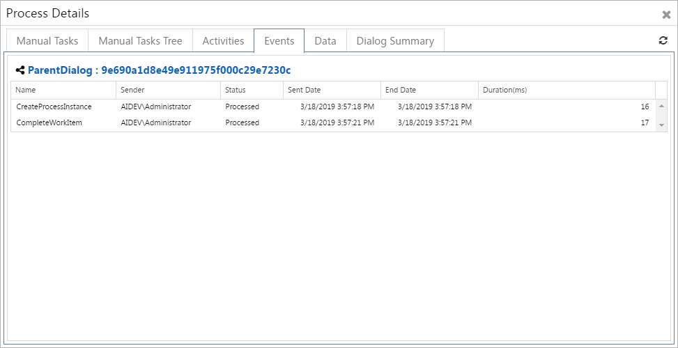

#### Data
This tab shows a list of process instance variables and its data. 

Usually, processes has many variables that can makes hard find specific variable, we can use search textbox to search variable name or value easily.

Also, a user with appropiate permission(usually a system Administrator) can modify variable value using `Set Variable Value button` .

#### Dialogs summary

This tab shows the summary view of **AgileDialogs** process instance. This tab is only available for **AgileDialogs** process.

The content of this tab  vary depending of process instance status. When process is not completed this tabs shows information about each page of **AgileDialogs** process.

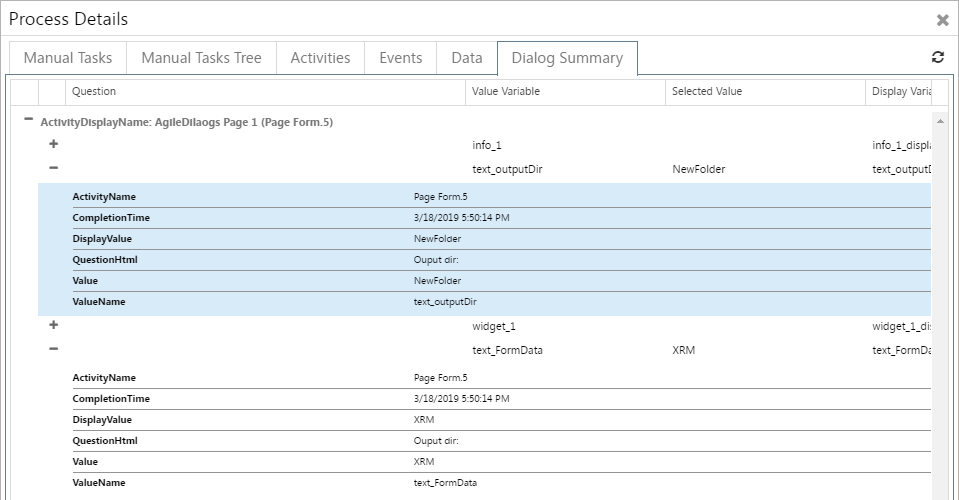

Once process instance is completed this tab will show the **AgileDialogs** history in readonly mode.

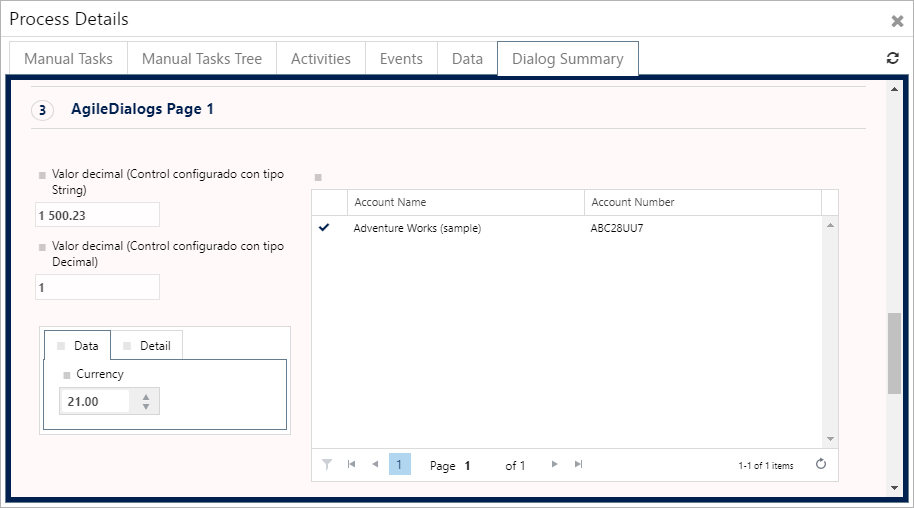

> **Note:** This behaviour only is available when process instance template is configured to save history at design time, by **AgileXRM** configuration window from Envision.  
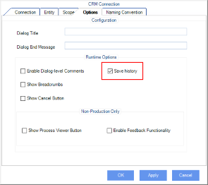

### Show Other processes

Each **AgileXRM** process can be related to Dynamics CRM entity, know as `Main Entity`.
This option allows user to navigate between process instances related to Dynamics CRM entity.
Use `Show other processes button` to perform this action.

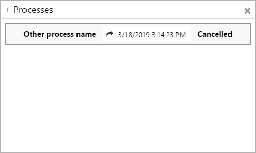
> **Note:** This window only shows process instances that are not archived.

### Full screen

This option shows Process Manager in full screen mode when this feature is supported by browser. Use `Fullscreen button`  to perform.

### Refresh

This option allows user manually refresh Process Manager content. Use `Refresh button`  to perform this action.

### Popout

This option allows user execute ProcessManager in separate window when it is running embedded inside Dynamics CRM. Use `Popout button`  to perform this action.

### Center on current activity

This action allow user to center process diagram in current activity, useful to manage large process diagrams. Use `Center activity button`  to perform this action.

### Diagram zoom

This action allow user to set diagram size, by zoom in and zoom out.

To view correctly large process diagrams, Process Manager has a zoom tool to zoom in zoom out the diagram.

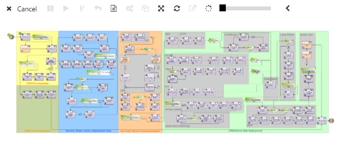

> **Note:** Zoom tool is integrated with mouse wheel, so we can use it to zoom in and zoom out process diagram as well.

### Integration with Dynamics 365/CDS
Once that a D365/CDS entity has been enabled to be used with AgileXRM, that entity will have an additional tab (called "View Process") as part of its main form (see following image).
Inside of this new tab there will be a view of the Process Manager.
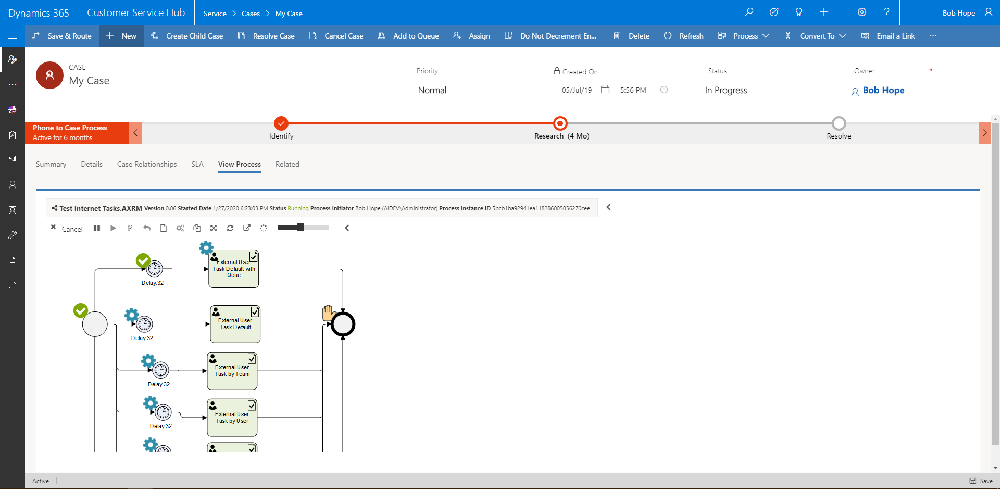

In this view, only those processes that belongs to selected entity record will be displayed. In addition, following criterias also applies:
* Only AgileXRM process (Not AgileDialogs)
* Not archived
* Without parent
* Ordered by Created On date Descending

## Disclaimer of warranty

[Disclaimer of warranty](common/DisclaimerOfWarranty.md)