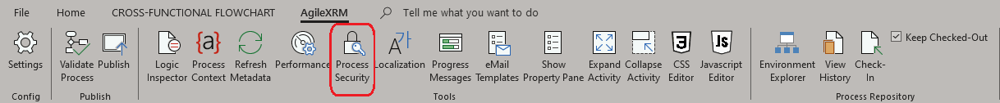
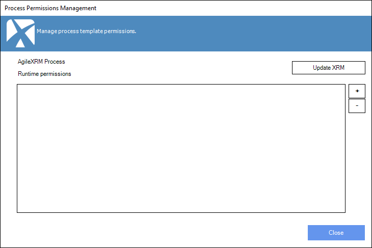
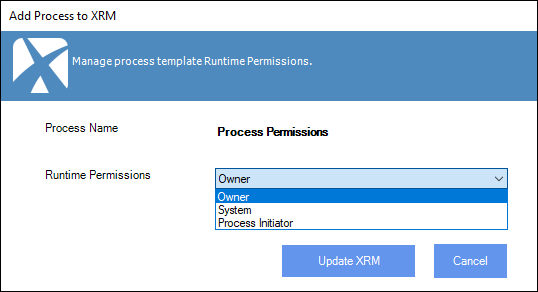
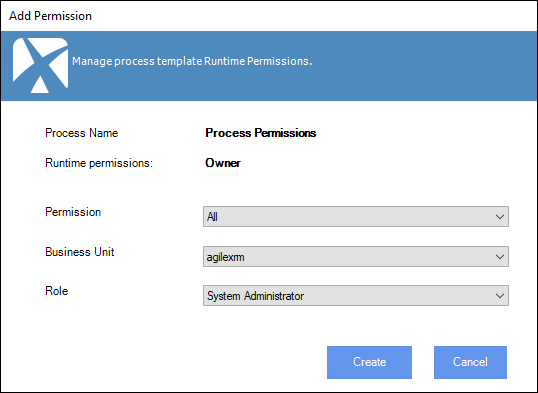
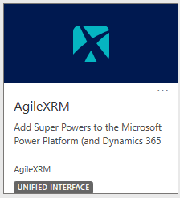
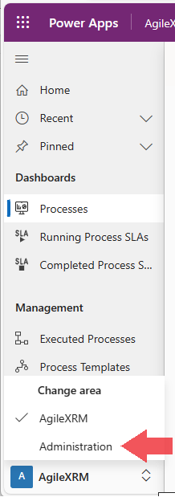
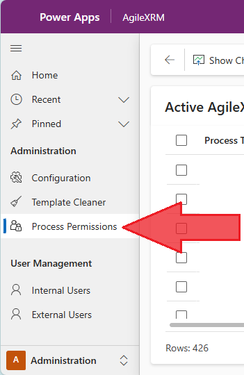
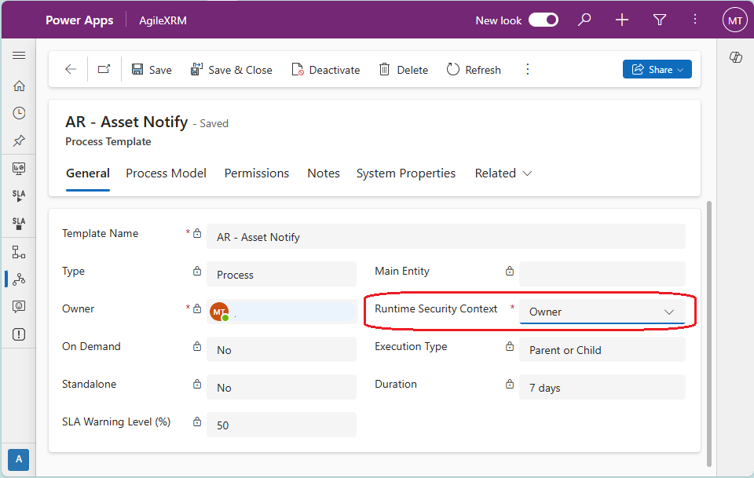
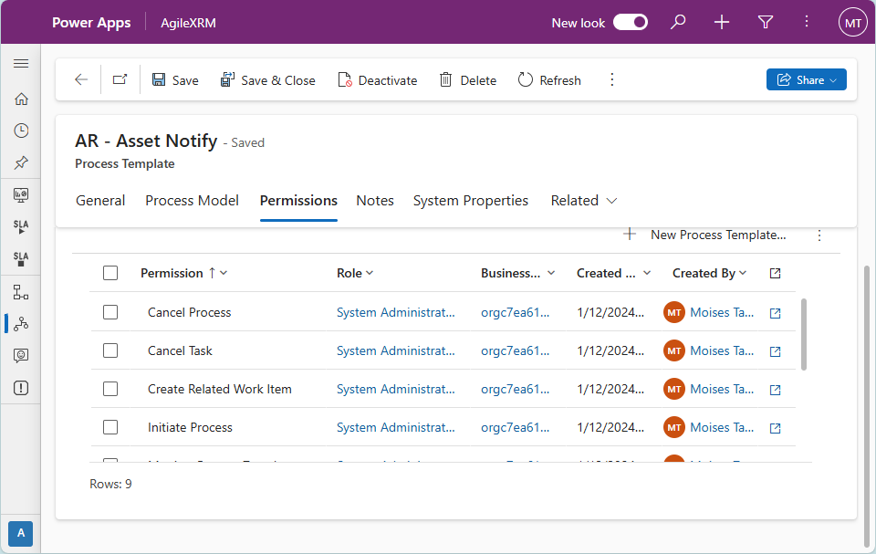
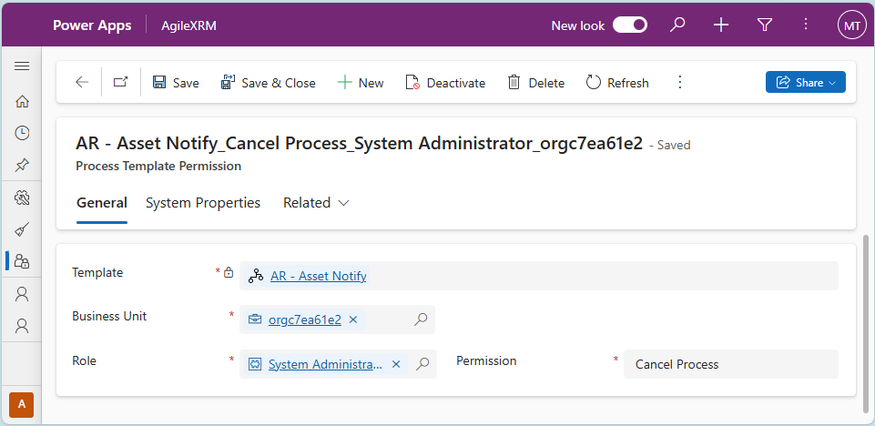

# AgileXRM Process Template Permissions

**[Home](/) -->  AgileXRM Process Template Permissions - Guide**

---

## Runtime Security Context

Each Process Template (AgileDialog or Process) has configured a "Runtime Permissions" property which represents the Runtime Security Context of the running process instance.

This configuration determines the runtime security context user that AgileXRM will use to complete Automatic Activities. For example, to create, update or delete table rows (records of an entity), create or complete Activities (such as Tasks). You may notice Tasks created by AgileXRM as part of a Process, are owned by the user configured in this property. 
 

This property can be set to:

-	**Owner**: This is the user that published the template using AgileXRM Process Modeler tool (Microsoft Visio add-on). Configuring the Runtime Permissions to "Owner" means all process instances will use this same user.

-	**Process Initiator**: This is the user that initiates each process instance (or starts the Dialog). This means each process instance may have a different user.

## Individual Permissions

In addition, there are several individual permissions that apply to different actions that can be done to interact with the process instance using AgileXRM Process Manager:

-	**Cancel Process**: A user with this permission may cancel a running process instance.

-	**Cancel Task**: A user with this permission can cancel running tasks such as Wait for Update, Delays and Activities. Cancelling a task makes the process continue with the next step.

-	**Create Related Work Item**: Allows the user to create a related work item for an active Manual Activity. *This is a legacy permission and no longer has any effect.*

-	**Initiate Process**: This permission is necessary to launch a Dialog or start a Process. 

-	**Monitor Process Template**: *This is a legacy permission used for a process monitoring tool. This permission no longer has any effect*

-	**Reassign Work Item**: Allows the user to reassign an active work item to a different user. This also enables the functionality to change a Task Due Date.

-	**Rollback Process Instance**: *This is a legacy permission and its no longer used.**

-	**Suspend-Resume Process Instance**: Enables the options to Suspend and Resume a Process Instance. This enables the mechanism to Migrate a Process Instance to an older or newer Process Template version. This permission also enables the functionality to Change Flow.

-	**View Process**: Allows the user to visualize the process instances in Process viewer.

Each of these permissions is granted to "Security Role" of a "Business Unit". You may create new Security Roles to tailor your individual permissions. See Microsoft’s documentation on this topic. [Create or edit a security role to manage access - Power Platform | Microsoft Learn](https://learn.microsoft.com/en-us/power-platform/admin/create-edit-security-role)

> NOTE: These permissions apply to the action buttons shown in AgileXRM Process Manager making them may appear disabled if you don't have the appropriate permission.

## Where to assign or modify these permissions

### Option 1: Using AgileXRM Process Modeler
 
1.	Open AgileXRM Process Modeler.

2.	Open the Process or AgileDialog template desired.

3.	In the AgileXRM ribbon, select "Process Security"
 
    

4.	The "Process Permissions Management" window appears.
 
    
    
    a.	Click the button "Update XRM" to change the "Runtime Permissions".

    

    b.  Select an option and click "Update XRM" to confirm selection.

    > NOTE: This action updates, or creates if it doesn't exist yet, a "Process Template" row in Dataverse to store the runtime permissions.
 
    c.	Click the "+" button to add an individual permission.

    

    d. Select the Permission, Business Unit and Role to apply the permission to.

    >NOTE: You can select "All" as the permission and all the permissions will be granted individually to the selected Role.

    e. Click "Create" to add the selected individual permission to the selected role.

    > NOTE: This creates a "Process Template Permission" row in Dataverse for the selected Permission, Business Unit and Role for the Process Template we are editing. This combination is unique and cannot be repeated. Meaning you cannot add the same permission, to the same role for the same process twice.
    > If you select the permission "All", multiple rows are created instead. One for each permission.

    f.	Select and click the "-" button to remove an individual permission. No confirmation is required.

Please note that these changes are applied immediately. There is no need to publish a new version of the Process or AgileDialog template for the new permissions to take effect.

### Option 2: In AgileXRM App in Dataverse

1.	Open your organization’s root page. (i.e. https://{OrgName}.crm4.dynamics.com).

2.	Open "AgileXRM" App.
 
	

3.	Switch to the "Administration" area (bottom left menu).

	

4.	Click on "Process Permissions" on the left menu.

    

5.	Select the Process template you want to manage and click "Edit"

6.	In the "General" tab, the "Runtime Security Context" represents the "Runtime Permissions". 

    

a.	You may change the value of this property and click "Save" to apply any changes.
 
7.	In the "Permissions" tab, you can see the existing assigned individual permissions.

    

a.	You may Add, Edit or Delete individual Process Template permissions by using the corresponding buttons.

    
 
8.	Click "Save" to apply the changes.

## Disclaimer of warranty

[Disclaimer of warranty](DisclaimerOfWarranty.md)
