__[Home](/) --> AgileXRM Quick Start__

# AgileXRM Quick Start
---

## Introduction

> **NOTE:** This guide assume you selected the **Install QuickStart Samples**
option in the Installer.

This QuickStart document describes how to create a sample process from scratch.

The content of the process is oriented to show several **AgileXRM** features using
the components of the platform:

- **AgileXRM Envision**: For Modeling the Process and the Dialog

- **AgileXRM Process Manager**: For viewing and visually managing the Process

The sample process here is not based on a real scenario; the idea is to show the
basic concepts of AgileXRM.

The walkthrough starts with a very simple Process and through the following
stages, new activities and steps are added.

The time needed to complete this walkthrough is around **50 minutes**.

## Disclaimer of warranty

[Disclaimer of warranty](common/DisclaimerOfWarranty.md)

## Quick Start Pre-requisites

This document assumes that:

-   Publish the managed solution **AgileXRMQuickStart_1_0_0_1_managed.zip** to
    CRM. It contains all the necessary entities and customizations to run this
    QuickStart guide successfully.

-   Publish the Dialog called **Update Children Entity Dialog**. It contains a
    predefined SubDialog that we will be using along with this walkthrough
    guide.

-   There are some sample Contact records (if not add them now).

-   You have an Activated and working copy of Visio 2010 / 2013 (can be Trial
    version, but should be Activated)

-   The following actions need to be done only once, the very first time you use
    the modeler, and should have been carried out in the Post Install steps of
    the Quick Installer. If not, do them now:

-   Open the modeler **StartAll ProgramsAgilePointAgilePoint Envision**

-   If you get a message box that says *AgilePoint Envision requires macro
    enabled. Do you want to enable it?* Click **Yes**

-   In the message box that says *AgilePoint Envision has updated template path.
    Please Restart Visio* click **OK**  
    (This window may be behind the Visio window - click on the Taskbar icon to
    bring it in view)

-   Close **Visio**

### Stage 1: Designing and running your first process

Duration: **10 minutes**

Objectives: Show basic concepts of modeling, publishing and running a process

### Scenario

We have a custom entity in CRM called *Parent Entity.* The process will manage
the lifecycle of *Parent Entity*. We will create a CRM Task and when this Task
is *completed*, the Status of the record will be changed to *Inactive*.

### Create the process template

-   Open **StartAll ProgramsAgilePointAgilePoint Envision**

-   Go to FileNewAgilePoint Template CategoryAgileXRM 2011Create

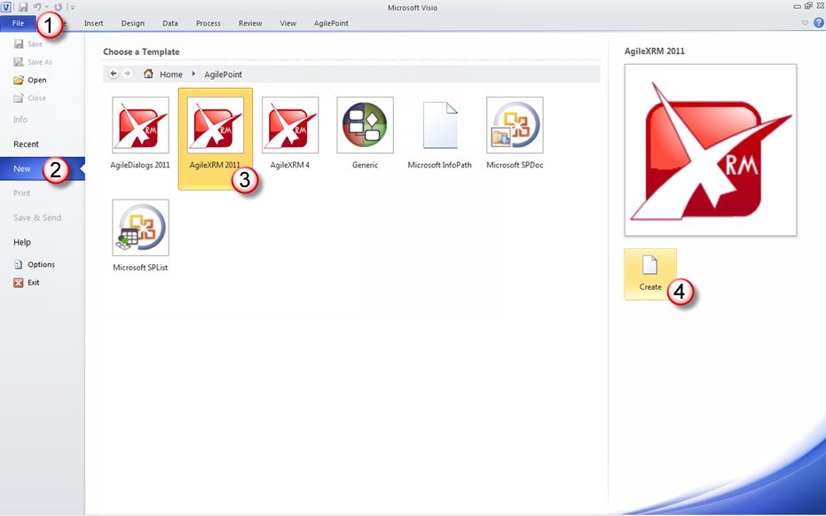

The **XRM Connection** window opens.

### Configure Connection Settings

Enter the **CRM Server URL**, **Organization name** (use your own values) and **AgileDialogs Server**

-   Click the **Connect** button to check connectivity to your organization

### Configure Main Entity

-   Go to **Entity** tab

-   Click **Retrieve Entities** button to get the list of AgileXRM-enabled
    entities for selected organization

-   Open the **Main Entity** drop-down list and select **Parent Entity**

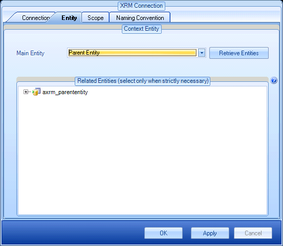

### Set Process Name

-   Click on the Naming Conventions tab

-   Type the name as **AgileXRM QuickStart Process** (**IMPORTANT**: Make sure
    the name is exactly typed as shown)

-   Click **Apply** and then **OK** to close *XRM Connection* window

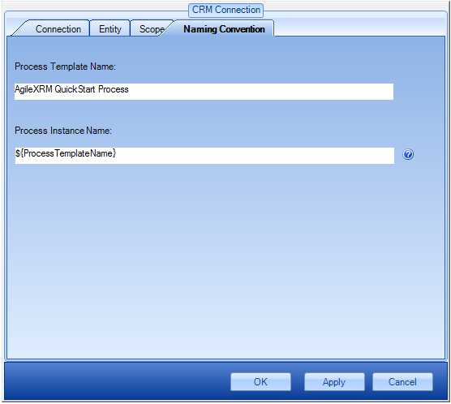

### Add steps (shapes)

-   From the **Generic** stencil, drag a **Start** shape to the canvas

-   Drag a **Stop** shape to the canvas

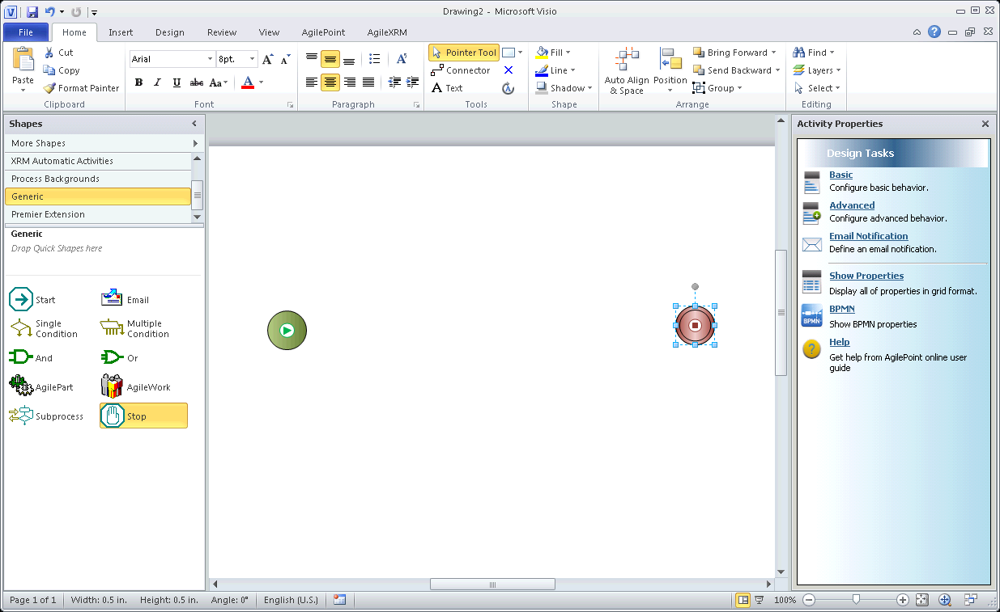

-   Click the **XRM Manual Activities** stencil to open it

-   Drag a **Create Task** shape to the canvas

-   Double-click the shape to change the text to *Task 1*

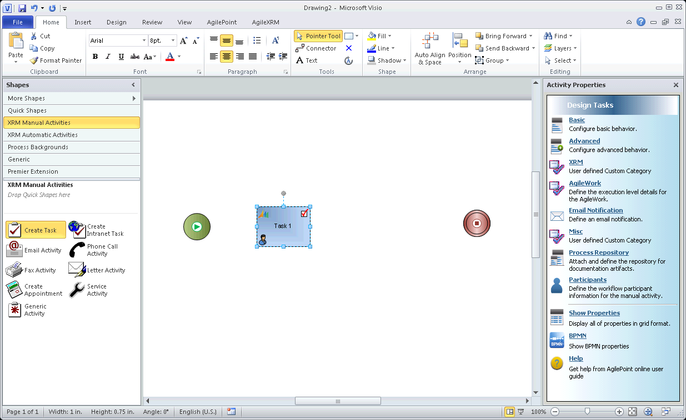

-   Click the **XRM Automatic Activities** stencil to open it

-   Drag a **Set Status** shape to the canvas and name it *Set Inactive Status*

-   While the shape is selected, click the **XRM** category in **Design Tasks**
    to open the property window

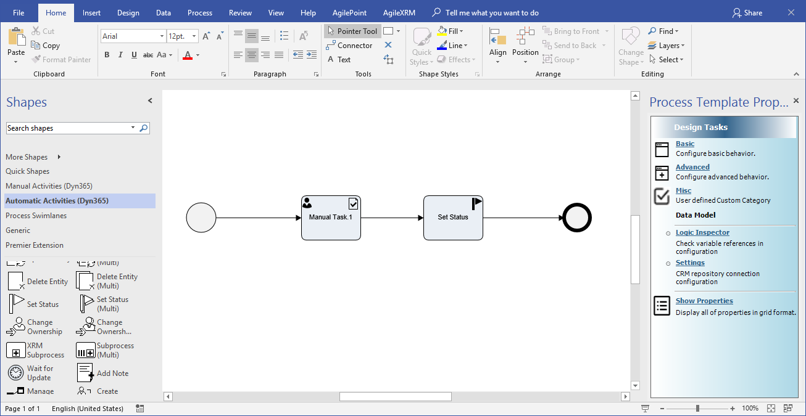

-   In the **Status** property, select *Approved-Inactive*

-   In the **AfterSubmitAction** property, select *Mark as completed*. Once
    finished the work, the CRM task will autocomplete itself and will keep
    moving forward through the process flow.

-   Click **OK** to close this window

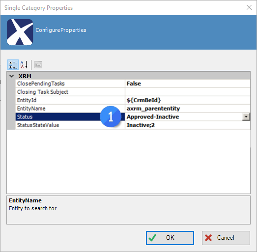

-   Click the **Connector Tool** in the Ribbon

-   **Connect the shapes** to define the flow of the process

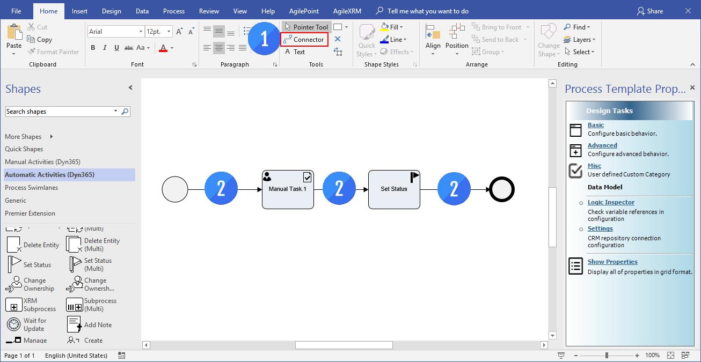

The process is modeled and ready to be published.

### Publish Process

-   Open the **AgilePoint** Ribbon

-   Click **Publish Process to Server** to open the publish window

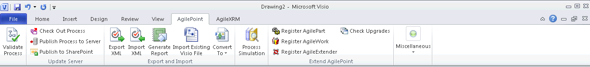

-   Set the AgilePoint **Server URL** (might be on a different port)

-   Click **OK** to close this window

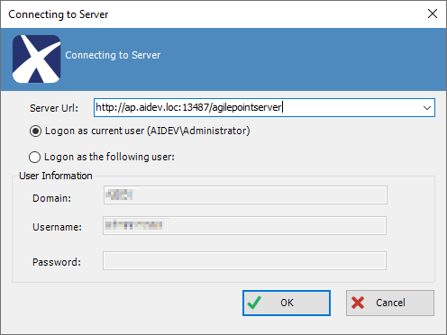

Review process information and verify **Release Option** is **Release Now** and
click **OK**

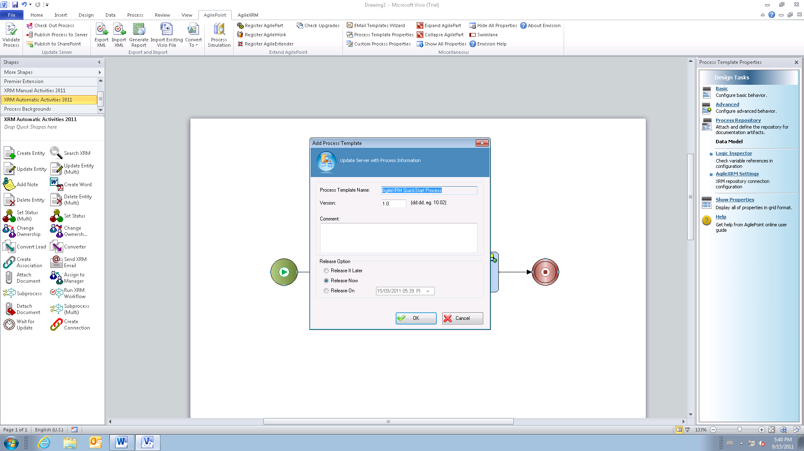

-   To add Process Template to Dynamics CRM, click **OK** to open the permission
    window

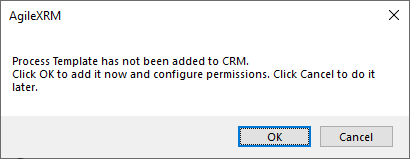

-   Click the **Update CRM** button

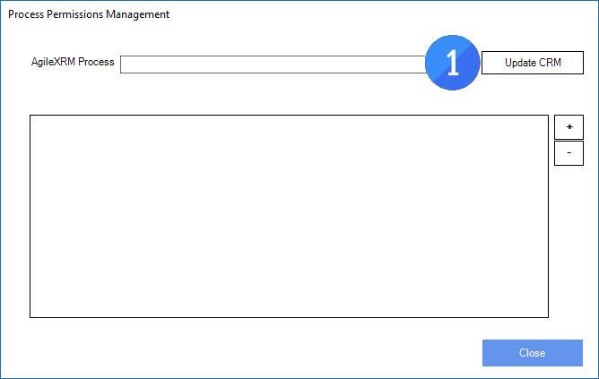

-   Leave Runtime Permissions as *Owner* and click the **Update CRM** button

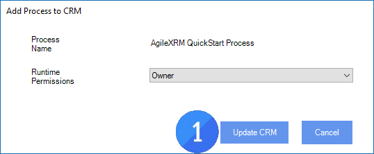

-   Click the **+** button to open the **Add Permission** window

-   In **Permission** select *All*

-   Select *System Administrator* in **Role**

-   Click the **Create** button

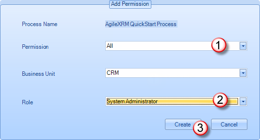

-   Click the **Close** button

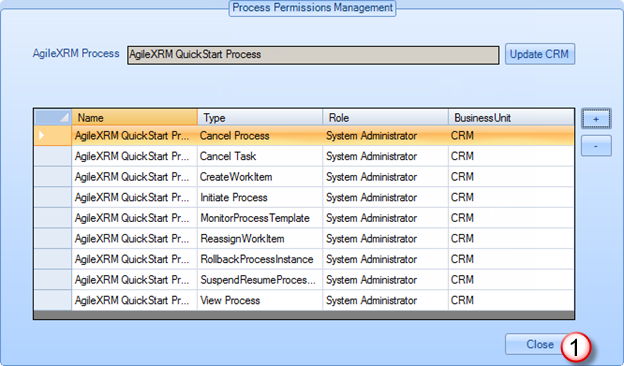

-   Save the Visio file, name it *AgileXRM QuickStart Process.vsdm*

The process is deployed and ready to be executed.

### Running the process

An AgileXRM process can be initiated in several ways:

-   From a portal using a URL

-   From AgileXRM web parts in a SharePoint site

-   By calling AgilePoint web services

-   By AgilePoint Event Service (scheduler, file drop, incoming email etc.)

-   Using a CRM Workflow or Plugin

In this example, we are going to create a CRM Workflow to start the process:

-   In CRM, go to Settings Processes New

-   In Create Process window, type **Process name** as *Launch AgileXRM
    QuickStart Process,* Select *Parent Entity* in **Entity** drop-down and set
    **Category** to *Workflow* and click OK.

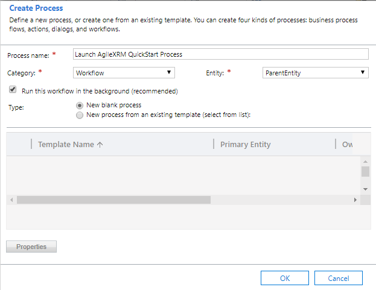

-   A new Workflow is created for the *Parent Entity*

-   Select to start when **Record is created**

-   **Add Step**: *Start AgileXRM Process*

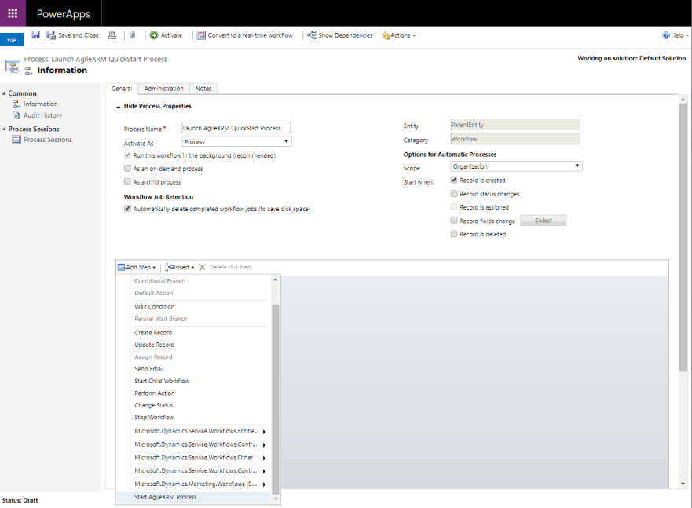

Configure the step to launch the previously created process:

-   Select *AgileXRM QuickStart Process* in the **ProcessName** lookup

-   **Save** the Workflow and **Activate** it, confirm activation and **Close**
    the Workflow

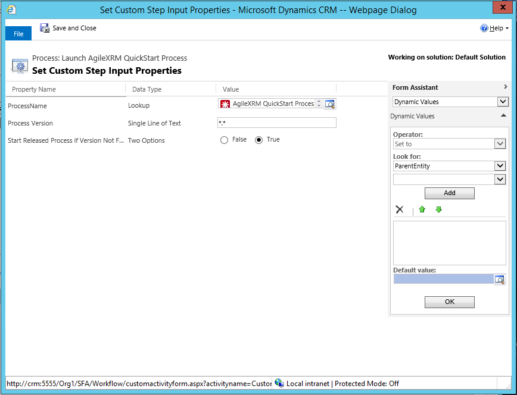

-   Create a new *Parent Entity* record and call it *Parent Record 1*

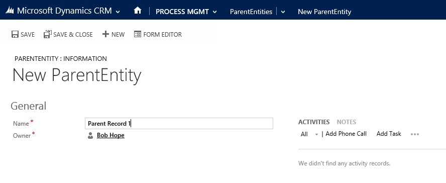

-   Click **Save & Close**, wait a few seconds so that CRM Workflow is executed
    and then click F5 to refresh the record

-   Double-click on the created Parent Record, and notice that the attached
    process has been executed.  
    (If such process instance does not appear, it means that the environment has
    not been set up correctly - Please create a Post in the Forum
    [forum.agilexrm.net](http://forum.agilexrm.net/) under **Installation &
    Setup Discussions** to get help)

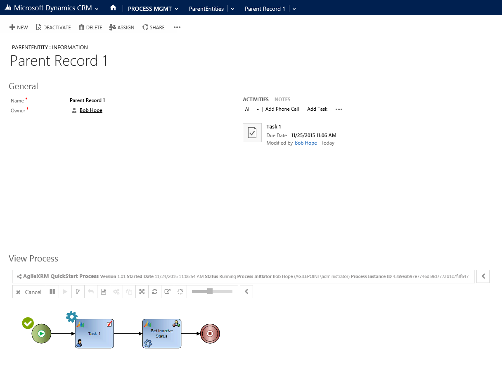

Congratulations! You've successfully launched your very first AgileXRM Process!

Now let's complete the Task created by the process and see the process move
forward:

-   On **Activities** section, focus on **Task 1** and click **Complete.**

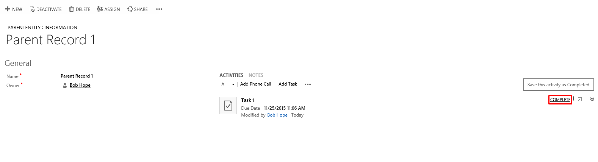

-   Refresh the screen (by pressing **F5**), check **View Process** section and
    notice that the process has continued past *Task 1* to *Set Inactive Status*
    and inactivated the record and finished  
    (This record will now be under the **Inactive Parent Entities** View)

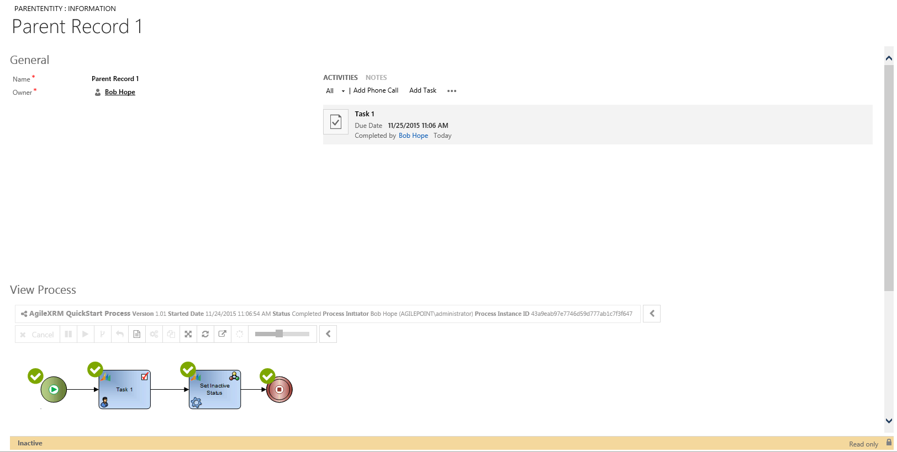

-   Click **F5** to refresh the record and notice that **Status** is now
    *Inactive* and **Status Reason** is *approved* and all fields are now
    read-only. The second activity in the process made this change.

This concludes this stage.

### Stage 2: Using Activity-based Forms with AgileDialogs

Duration: **5 minutes**

Objectives:

-   Show the use of activity-based forms in processes - each activity has its
    own specific form

-   Show that these forms can expose all the fields necessary to complete the
    task without having to navigate elsewhere, including fields from related
    entities.

### Scenario

In this stage we are going to add an AgileDialogs Form to be used in Task 1;
such Form is going to contain the input fields to be filled in by the user. We
will also add a second shape which will update the underlying entity with the
chosen values.

### Associate a form to a Task

-   Open the process in Envision (Visio) that was created in Stage 1

    Select the shape *Task 1* and in the **Design Task**, click **XRM** category

-   In the **PageForm property**, click the **ellipsis** button to show a new
    AgileDialogs Form, ready to be configured
    
    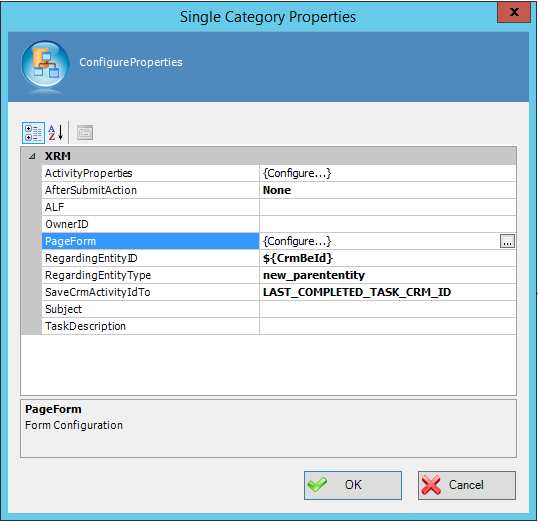

-   Now, we will be associating an AgileDialogs form to Task 1. For that
    goal, a predefined template is going to be used. Once the AgileDialogs Form
    is opened, click on **Import Form**.

    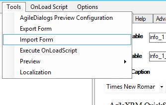

-   Look for the provided template **AgileDialogs_Task1.xml** and click
    **Open**. If the importation process has succeeded, the form should be visible
    and ready to be saved and deployed, as shown below.

    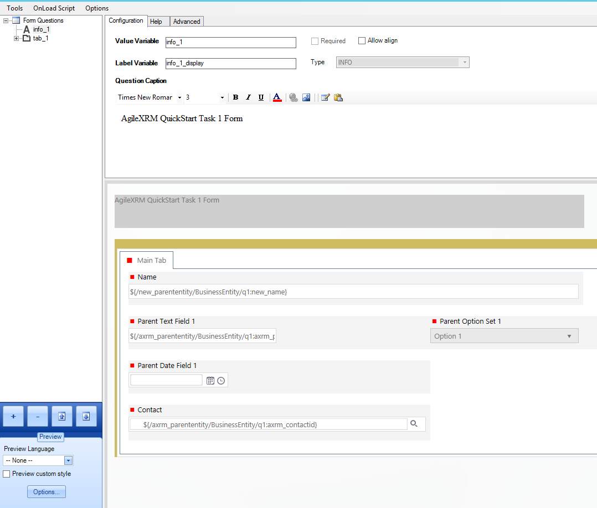

-   Click on **Save** to persist changes on *Task 1* shape.

-   Back on the main menu, drag and drop another **Update Entity** shape (from
    the **XRM Automatic Activities** stencil) on to the canvas.

-   Name it *Update Parent Entity*.

-   Select the shape, and click on **XRM**. Then, choose
    **EntitySpecification**, clicking on the ellipsis button.

    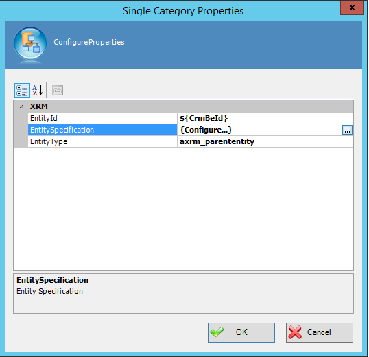

-   **Link** the Parent Entity fields against the process context variables that
    we have created in **Task 1**, accordingly. This can be accomplished by
    choosing the entity field name (on the left handside of the properties
    menu), and map it against the process context variable name (on the right
    handside, as shown below).

    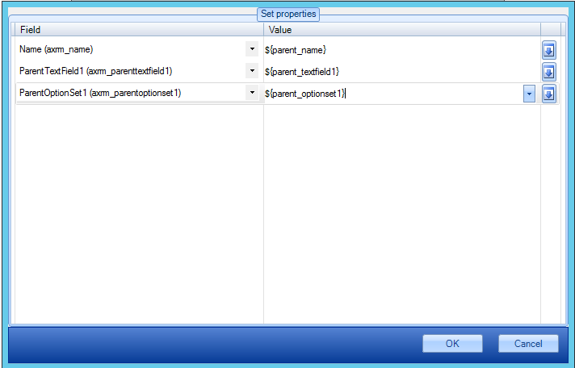

-   **Connect it** as shown, between *Task 1* and *Set Inactive Status* shapes

    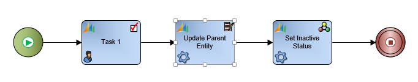

-   **Click on **Update Parent Entity** and select **Help** in the menu to
    open contextual help for this shape (You can also right-click the shapes in
    the stencil and click **Help** to see contextual help).

-   **Close** the Help window.

### Publish and test new process

-   In **AgilePoint ribbon,** click **Publish Process to Server** to deploy new
    version of process.

-   **Save** the Visio diagram (Hint: Name the file the same as the Process
    name, that is *AgileXRM QuickStart Process*)

-   In CRM, create a new *Parent Entity* record to kick-off the new version of
    the process called **Parent Record 2**

    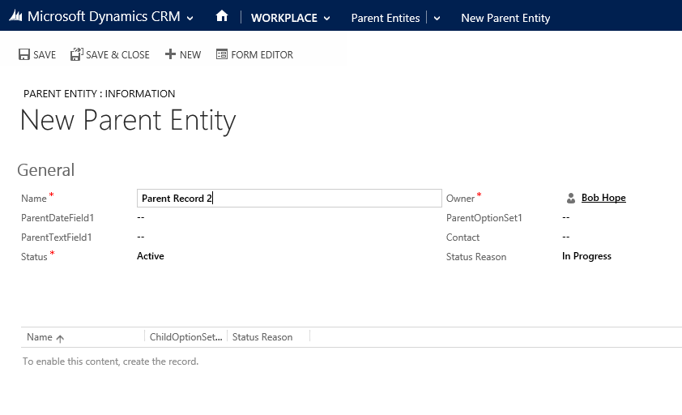

-   The process is started automatically. Click on **Task 1** and then, click
    again on **Open Task**.

    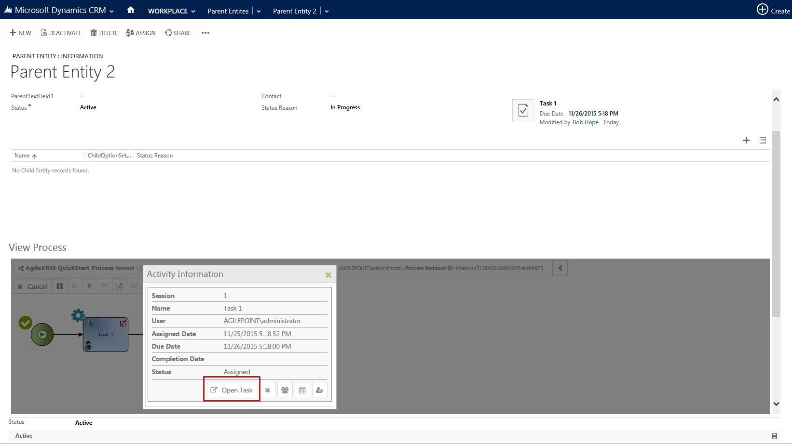

-   The AgileDialogs Form will be shown on screen. Type the values you want to
    update for **Parent Entity 2**. Finish by pressing **Submit**, and click on
    **Mark Complete** afterwards.

    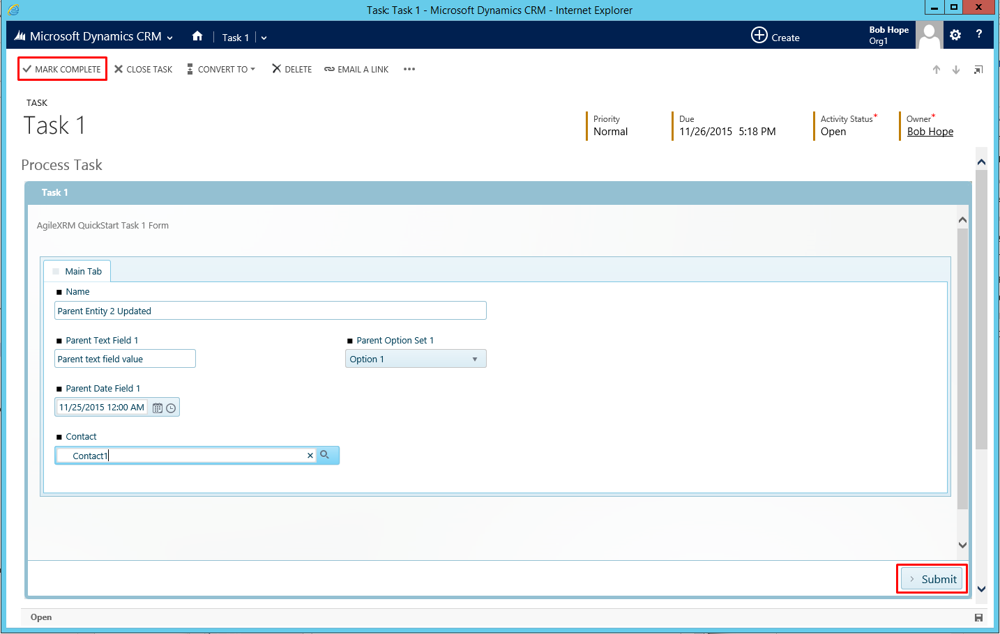

-   Back to the main screen, it is noticed that the process flow has kept going
    forward, the shape *Update Parent Entity* has been processed automatically
    and the process has been terminated. Please note the updated fields on
    *Parent Entity 2*.

    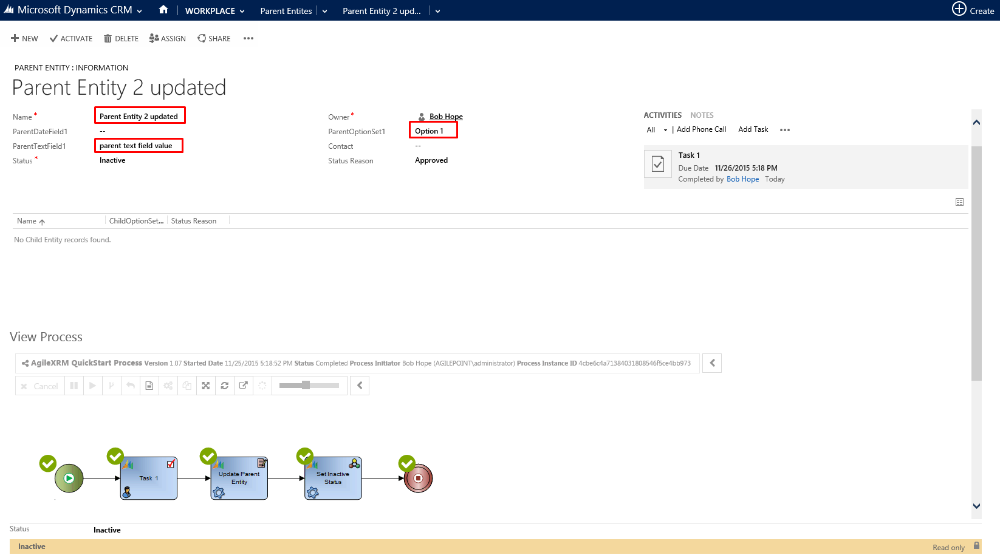

This concludes this stage.

### Stage 3: Updating Child Entity records

Duration: **5 minutes**

Objectives:

-   Show that certain shapes can make use of predefined SubDialogs that take
    parallel actions to the main process.

-   Show that Option Set fields can be set based on a variable (not hardcoded).

-   Show that you can update the mentioned child entities making use of
    predefined shapes.

-   Show the use of Schema Picker window and the Query Expression window.

### Scenario

In this stage we are going to create children entities of *Child Entity* type
attached to our *Parent Entity* record in CRM, all by using our process
template. For that goal, a new shape will be added with functionality to add
those children entities through AgileDialogs interface.

### Adding new Dialog Task shape

-   In the Visio diagram, drag and drop a **Dialog Task** shape from **XRM
    Automatic Activities 2011** stencil, and name it *Update Children Entity 
    Dialog*, as it is being shown below.

    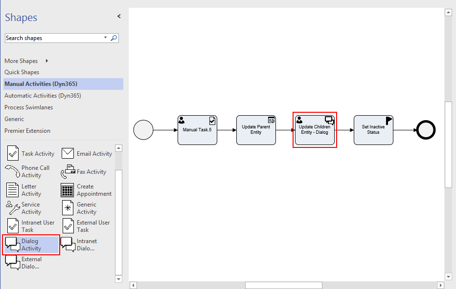

-   **Select the shape** and, in the Property Grid, select the value **Mark as
    completed** for the property **AfterSubmitAction**.

-   Click on the property **Dialog** by clicking on its ellipsis button. If
    asked, connect to the server clicking **OK**.

    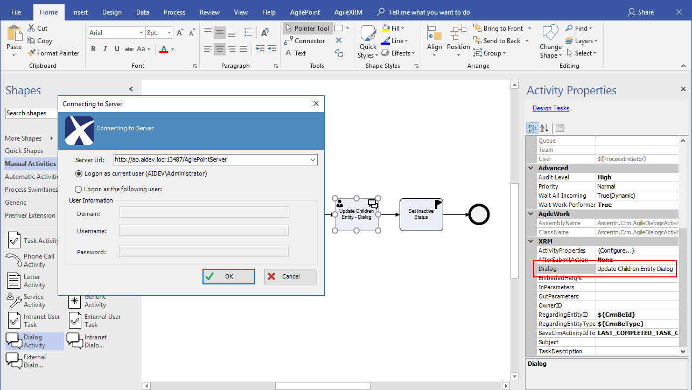

-   After connecting, select the previously published Dialog *Update Children
    Entity Dialog* (provided along with the rest of the necessary resources) as
    the chosen process template.

    

-   Later, click on the property **InParameters**; on the left handside, type
    the name **parentBeId** (SubDialog inner variable name); on the right
    handside, type **\$\{CrmBeId\}** (business entity Id that we will be passing to
    the mentioned dialog dynamically).

    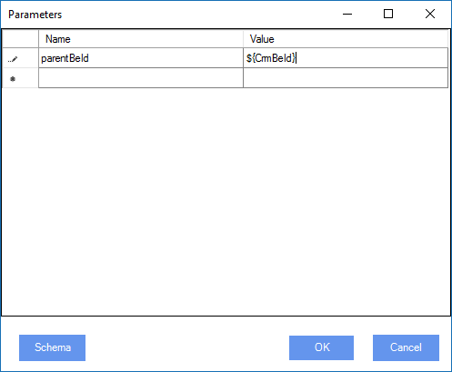

-   The SubDialog called *Update Children Entity Dialog* creates a whole new
    Dialog behind the scenes that executes itself in parallel, and depending of
    our main process. It will be getting the business entity Id (of type *Main
    Entity*), and will create / update entities of type *child entity* depending
    of the main entity running in the first place (picture of the template
    below). Go to **Parent Entities** and change the View to **Inactive Parent
    Entities** (to see the records created before).

    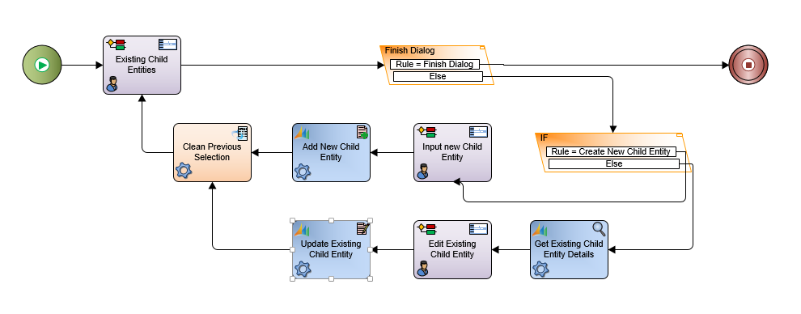

-   Now, publish the main process against CRM, by clicking **Publish Process to
    Server**.

-   Once published, we should run a new instance of the process. For that goal,
    go to **WorkPlace** and select **Parent Entities**.

    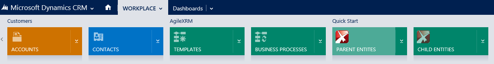

-   Choose the entity we used before and click on **Activate**. Once done, click
    on the ellipsis menu for the entity record, and choose **Run Process**.

    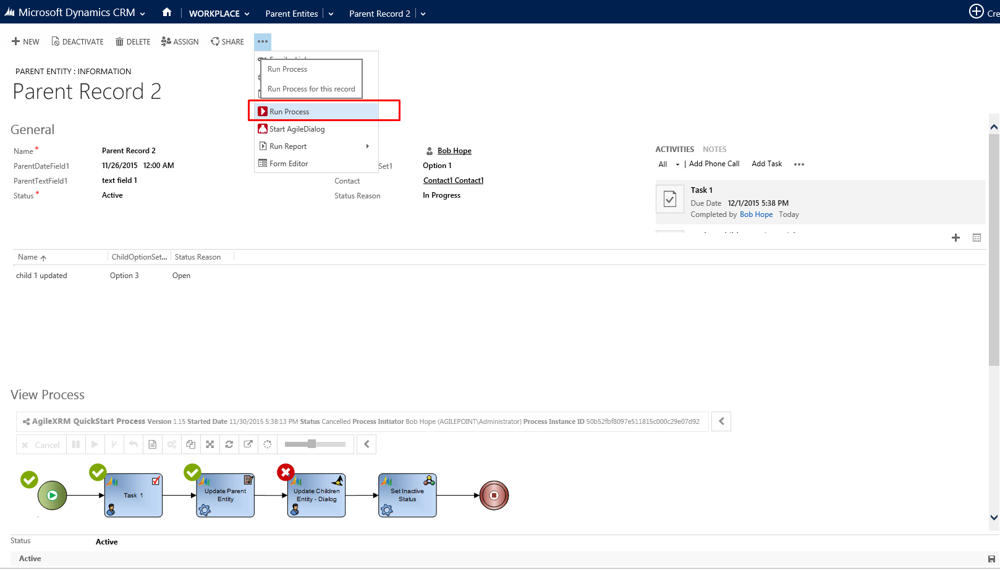

-   A pop-up menu comes up. Click on the **play** button for the *AgileXRM
    Quickstart process*.

    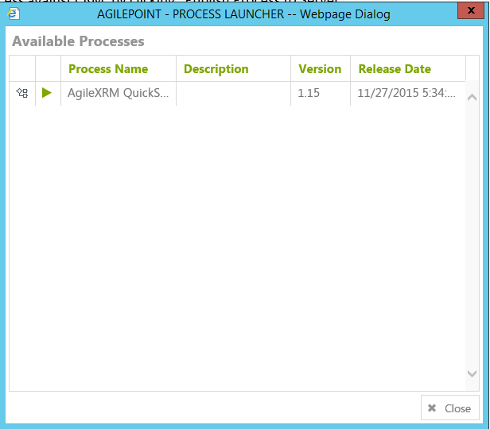

-   Refresh the page, and a new instance for the process will be launched. Click
    again on **Task 1**, **Open Task**, and fill in the form as you did on **Stage
    2**.

-   If everything went as expected, the process flow will be reaching the
    SubDialog. That means, that a new dialog has been launched on parallel and
    it is ready for showing its associated dialog.

    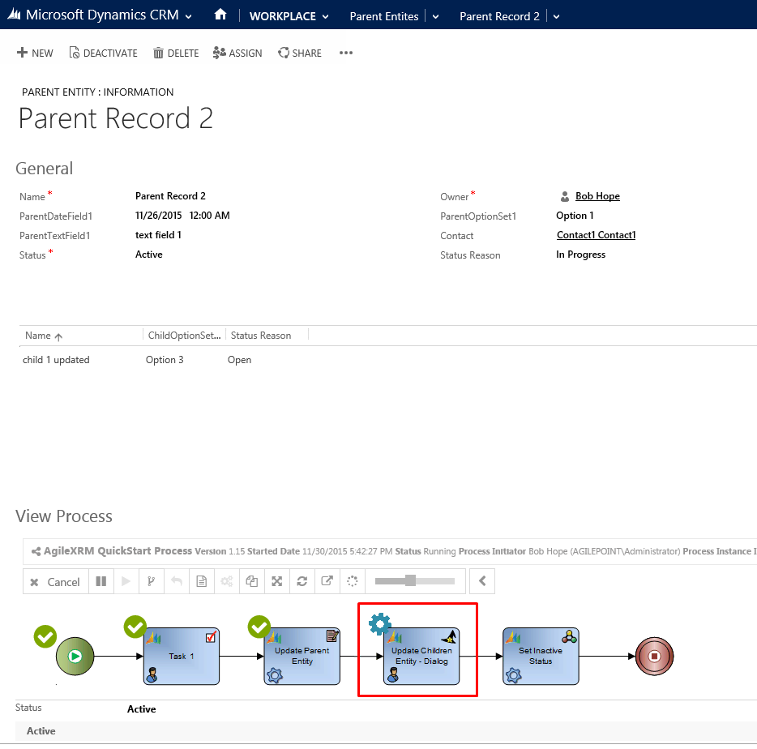

-   Click on the shape, and select **Open Task**. Such task will be opened on a
    new popup window. The first form is showing us the list of child entity
    records that are associated to this main record of type *main entity* (image
    below).

    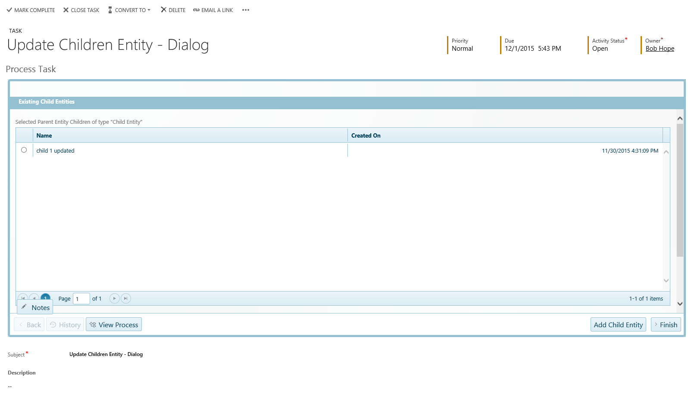

-   We can edit the records inside the grid to update values, or adding new
    records by pressing **Add Child Entity**. Press that button and a new form is
    shown, to type the record values (*name* and *child option set* fields).
    Type those, and press **Next**.

    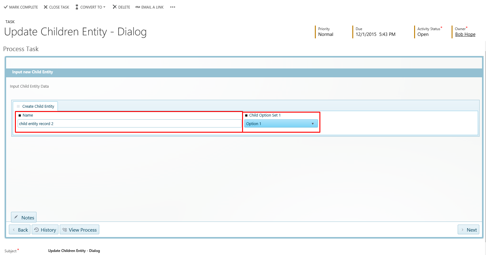

-   We have gone back to the main form, and the new record is being shown. If we
    want to edit the mentioned field, we will click on the row we want to edit
    (record).

    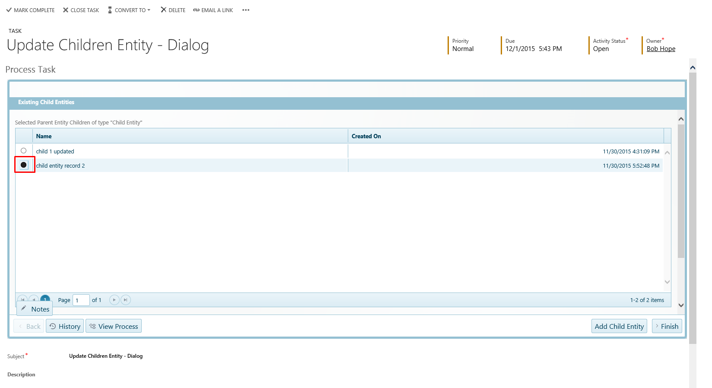

-   The edition form is shown as well. Type the new values you want and press
    **Next** again.

    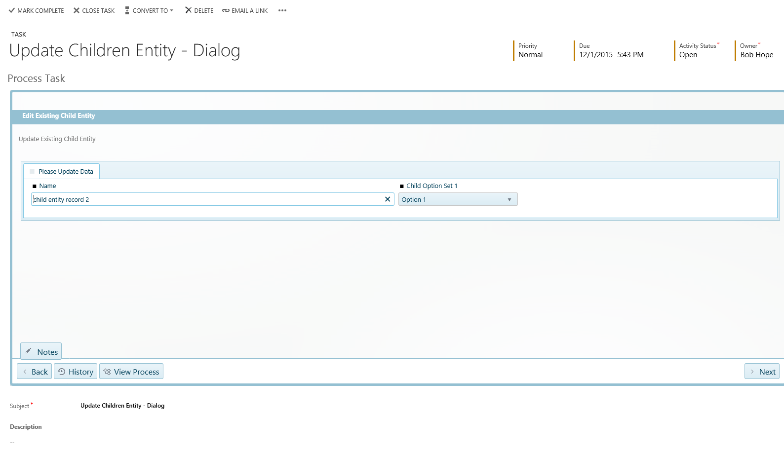

-   Lastly, press **Finish**, and the whole SubDialog will have come to an end.
    The flow will have gone back to the main process, that it is going to be
    over after the entity is deactivated.

    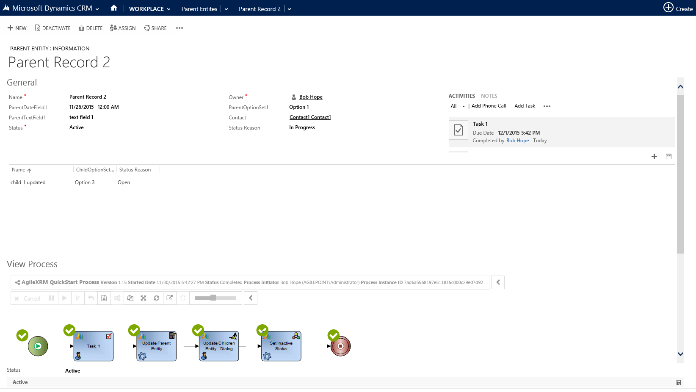

This concludes this stage.

### Stage 4: Changing process flow at runtime

Duration: **5 minutes**

Objectives:

-   Show that end users with the right permissions can control the flow of the
    process (jump from any step to any step - forward or backward) while
    maintaining details for audit purposes.

### Scenario

In this stage we are going to skip a process activity at runtime.

### Change the flow

-   Create a new *Parent Entity* record and make sure to select a Contact. This
    will start a new process

-   In the record form go to **View Process** section and click the **Change
    Flow** button

    

-   In the **Real-Time Flow Change** window select *Task 1* (the red square
    means that this task will be cancelled) and *Task 2* (the green square means
    that this is the destination activity) and click **OK**  
    (Observe how the flow has changed and affected the CRM Tasks)

    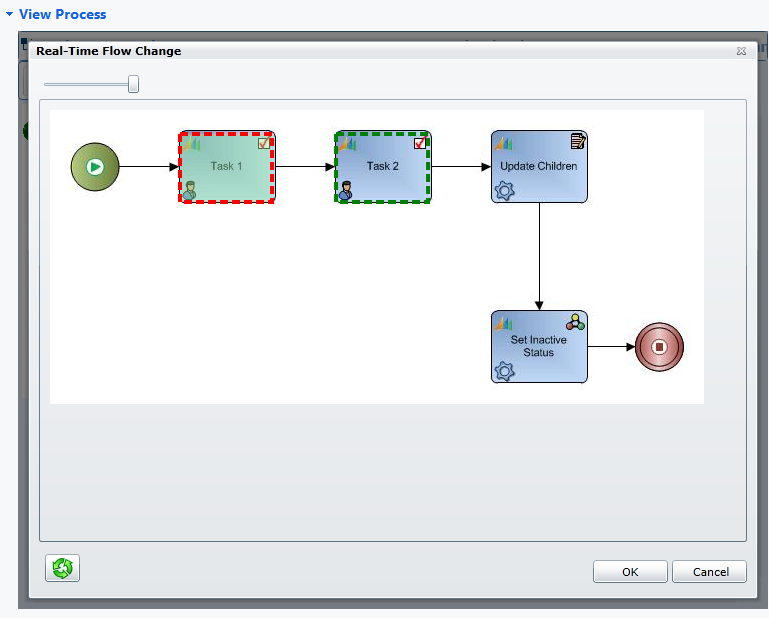

-   Leave this process instance running. Do not complete *Task 2*. It is needed
    in the next Stage

This concludes this stage.

### Stage 5: Process migration

Duration: **10 minutes**

Objectives:

-   Show how a user with the right permissions, can migrate a running instance
    of a process to a new version of the process definition, to handle changing
    business requirements.

-   Show branching mechanisms in processes and how these can loop back if
    required

### Scenario

In this stage we are going to modify the process definition and migrate the
process instance that we have left running in the previous stage to the new
version of the process. The new process definition will include a multiple
condition shape with a loop and a shape to update the Status of all child
records.

### Add the multiple condition shape

We want to go back to *Task 1* if the Option Set field in Task 2 is set to the
value *Option 1*:

-   Drag and drop a **Multiple Condition** shape from **Generic** stencil onto
    the canvas  
    (when this shape is added, the configuration window opens automatically)

-   In the **New Condition Activity** window, enter *Parent Option Set 1* in the
    **Name** field in the **Data Binding** field click the **ellipsis** button
    to open **Schema Picker** window

-   Type *option* in the **Search Variable** field to help locate the desired
    field

-   Select the *name* attribute of **ParentOptionSet1** field to use it in the
    condition

-   Click **OK** to close the window

    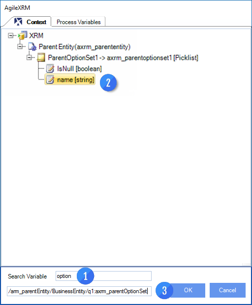

-   Click **OK** to open the Condition window

    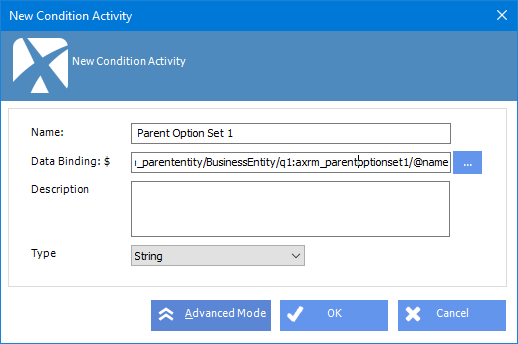

-   Click the **New** button to open the **Expression** window

-   Type *Option 1* in **Value** and click **OK** to close the **Expression**
    window

    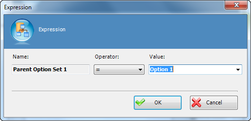

-   Click **Close** to close the Condition window

    

### Add the multiple change status shape

-   Drag and drop a **Set Status (Multi)** shape from the **XRM Automatic
    Activities** stencil and name it *Set Children Status*

-   Under **XRM category** in Property Grid, set **Entity Name** property to
    *Child Entity* and set **Status** property to *Closed-Inactive*

As the query expression for this shape is the same as the earlier *Update
Children* step, let's copy the query definition:

-   Click on the *Set Children OptionSet* shape to see its properties in the
    grid

-   In the **QueryExpression** property, double-click on the value part to
    select the content

-   Right-click the selected content, select **Copy** menu item to copy the
    content  
    (Do NOT use CTRL+C as it copies the whole shape and not just the value of
    the property grid)

-   Click the *Set Children Status* shape to see its properties in the grid

-   Right-click on the value part of the **QueryExpression** property and select
    **Paste**  
    (Do NOT use CTRL+V as it pastes the whole shape and not just the property
    value)

-   Connect the shapes as shown

    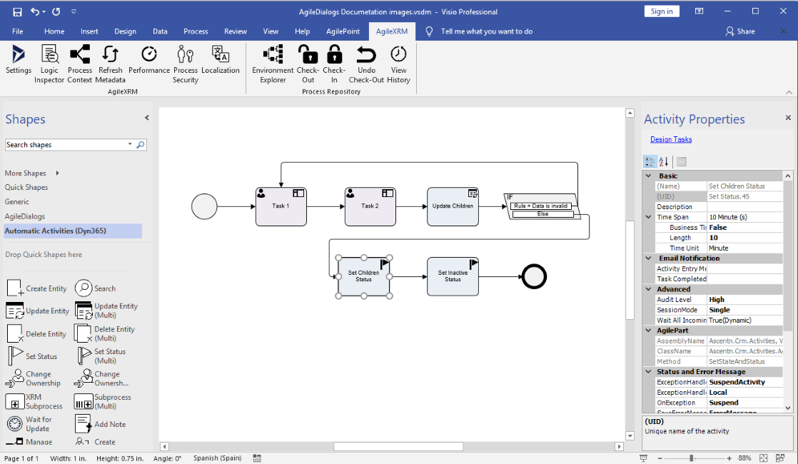

-   Publish new version of process like before (in **AgilePoint ribbon** click
    **Publish Process to Server**), and **Save** Visio diagram

-   Open the **Parent Entity** record that we left running in the last Stage and
    go to **View Process** section

-   In the Process Manager, click the **Suspend** button
    so that users cannot interact with the process  

-   Click the **Migrate** button to open the **Real-Time Process Migration** window 

-   Select the latest version of the process

-   Use the **Zoom Slider** to visually compare the two versions of the process

-   Click **OK** to migrate the running process to the new version

    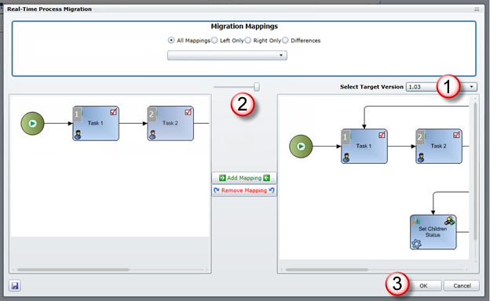

You can see that the process is now running with the latest version of the
process definition.

-   Click the **Resume** button to resume the process 

-   In *Task 2* choose *Option 1*, and make sure it has some child records
    added. Then **Save Data** and **Mark Complete**

-   In Process Manager note how process goes back to *Task 1* because of the
    conditional shape

-   In Process Manager click on *Task 1* and notice that the details of the
    shape shows 2 sessions

-   Open *Task 1* again

-   This time in *Task 2* make sure not to select *Option 1*, click **Save
    Data** button and **Mark Complete**

-   In the Parent Entity, refresh the child grid and note how the
    Status/StatusReason has changed to *Inactive/Closed* for all child records

This concludes this stage.

### Stage 6: Using AgileDialogs.

Duration: **10 minutes**

Objective:

-   Show the use of dialogs instead of forms in completing a task.

### Scenario

An AgileXRM task can be associated to a dialog created using AgileDialogs
instead of an AgileLightForm. These dialogs are used to gather information from
the user via a wizard-like interface.

We are going to change *Task 1* to use a predefined dialog instead of an
AgileLightForm.

### Deploy the Dialog

The dialog is already modeled and is stored in a Visio file where the SDK is
installed (normally in C:\\Program Files
(x86)\\AgileXRM\\SDK\\Samples\\QuickStart )

-   Locate the *QuickStart AgileDialog.vsd* file

-   Open the file with Visio - You'll get an *Unable to connect to the remote
    server* error. Click **OK**.

-   The Connection window pops-up. Ensure that the connection configuration is
    pointing to your CRM Server and organization, and click **OK**

-   Publish this dialog following the same instructions under Publish Process in
    Stage 1, including adding the Process Permissions

### Adding the Dialog Task

-   In Visio switch to **AgileXRM QuickStart Process model**, remove *Task 1* by
    clicking it to select it and then pressing **Delete**

-   Click on **ShapesMore > ShapesAgilePointXRM > AgileDialogs** to open the stencil

    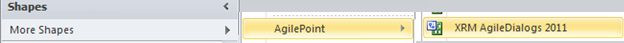

-   Drag and drop a **Dialog Task** shape and name it *Dialog 1*

    In the property grid, under XRM, click the ellipsis button of the **Dialog**
    property to open *Process Selector* window

-   Select *QuickStart AgileDialog* under Process Template and click **OK**

    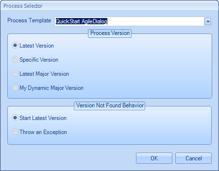

-   Connect the shapes and publish the process as before

    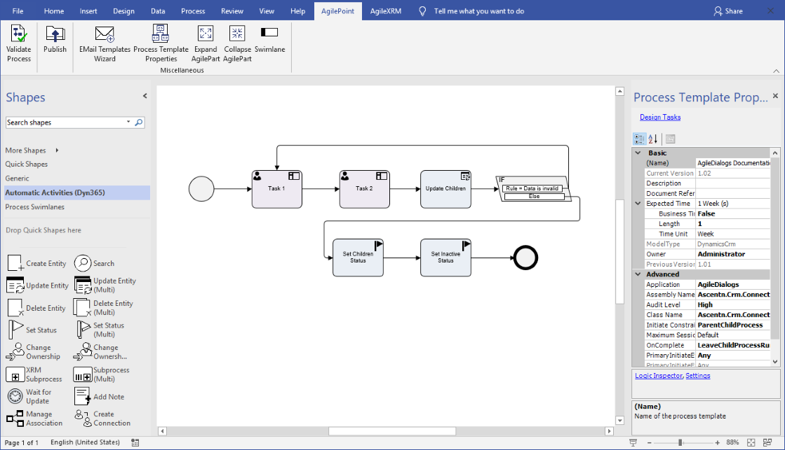

-   Create a new *Parent Entity* record to start a new process instance

-   Open *Dialog 1* activity and notice this time a dialog is presented to us

-   Fill the different controls on this page and click the **Next** button  
    (Notice there are validations, CRM Option sets, CRM Lookups and Datetime
    controls)

    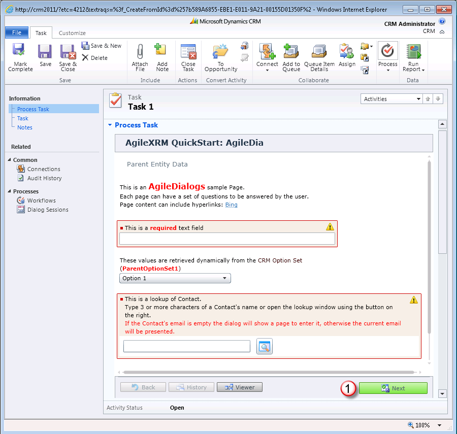

-   Click the **Back** button and change some of the fields and click **Next**
    again

-   Click the **Viewer** button to see the model for the dialog  
    (This button is not normally visible to end-users)

-   Click Next until the dialog is completed

Notice that when the dialog is finished the process continues to the next step.

This concludes this stage.

### Stage 7: Starting Processes from SharePoint

> **NOTE**: This stage assumes you enabled a SharePoint Web Application when you
installed AgileXRM via the Quick Installer. If you did not, this stage cannot be
completed.

Duration: **5 minutes**

Objectives: Show that people outside CRM or even outside the company can
initiate and interact with processes (and dialogs)

### Scenario

We are going to start a process using a pre-created Start-Up Form from
SharePoint.

### Preparing SharePoint

It is assumed you are familiar with SharePoint.

-   Go to any page in any site in the Web Application that you enabled as part
    of the installation and Edit the page to add the 3 AgileXRM WebParts
    (similar to this below)

    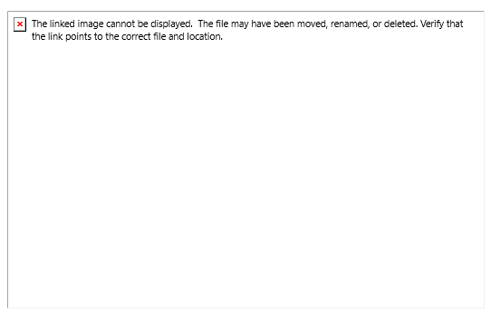

### Setting StartUp Form

In order to allow starting a process from SharePoint, the process must have a
start-up form.

-   Open the previous **AgileXRM QuickStart Process** in Visio.

-   In AgileXRM Ribbon, click **AgileXRM Settings**

-   Go to **Start Up** tab and select *AgileXRM QuickStart StartUp Form* by
    clicking the ellipsis button and click **OK**

    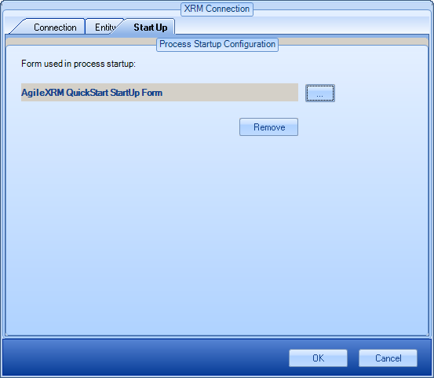

-   Publish the process as before

Since we are changing the launch method (via external web instead of via CRM
WF), we need to deactivate the CRM Workflow we created in Stage 1 so that we do
not end up with two instances of the process for the same record.

-   In CRM, go to **Settings > Processes** and **Deactivate** the launcher Workflow

### Initiate Process via SharePoint

-   In the **Initiate AgileXRM Process** WebPart, click on the process named
    *AgileXRM QuickStart Process* and on the menu that appears, click **Initiate
    New Process**

The start-up form is opened:

-   Fill the fields and click **Save Data** button

-   Note how a new *Parent Entity* record is created with its corresponding
    process initiated

This concludes this stage.

### Manual Installation Instructions

