__[Home](/) --> AgileXRM Administration tool__

# AgileXRM Administration tool

The **AgileXRM** administration tool allows you to manage the AgileXRM configuration and how Dymanics CRM entities and tasks interact with AgileXRM processes.

## Introduction

AgileXRM administration tool is integrated inside Dynamics CRM. In order to launch AgileXRM administration tool navigate to `Settings` > `Agile XRM - Administration`.

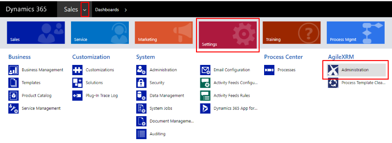

First time execute AgileXRM Administration tool is needed set administration URL in order to launch the application.

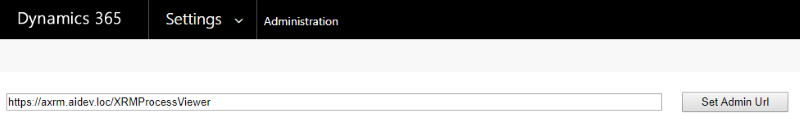

Once previous steps are done, AgileXRM administration tool is shown.

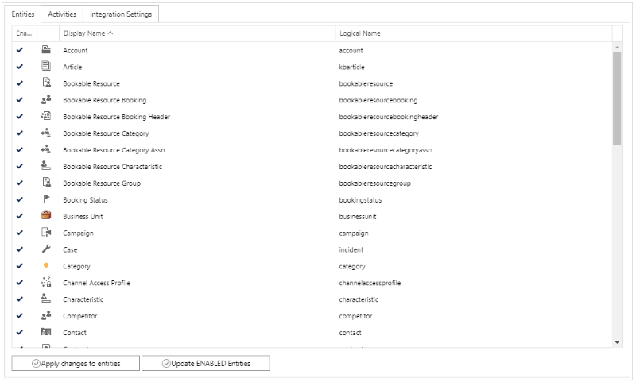

### Enable / Disable entities

This section allows enable/disable AgileXRM deep integration for Dynamics CRM Entities.

Dynamics CRM entities must be enabled in order to allow AgileXRM deep integration. To enable a CRM entity for AgileXRM deep integration simply choose the entity from entities list and click on `Apply changes to entites` button. When an entity is going to be enabled, the selected row is shown with green background color. 

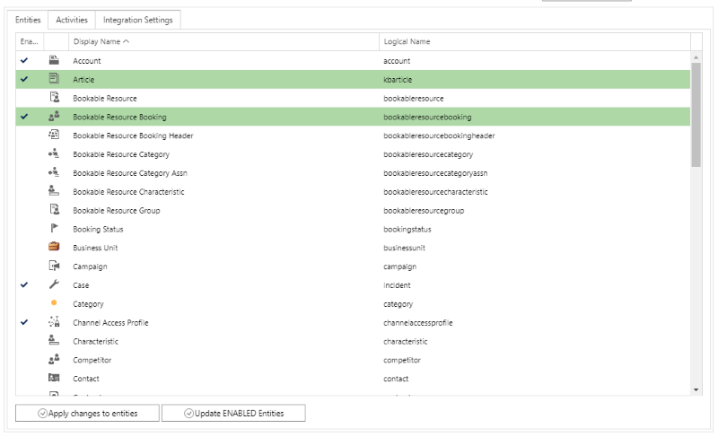

> **Note:** Only enabled CRM entities can be used as `MainEntity` for AgileXRM process.   

When a Dynamics CRM entity is enabled for AgileXRM deep integration, many features and customizations are enabled for each entity. These features are explained below.

**Command bar integration**: Enabled entities has `Run process` and `Start AgileDialog` buttons in its command bar.

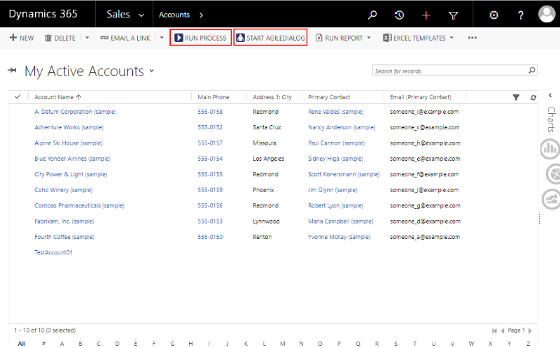

These buttons allows executing AgileXRM and AgileDialogs process by launch new window with available proccess list.

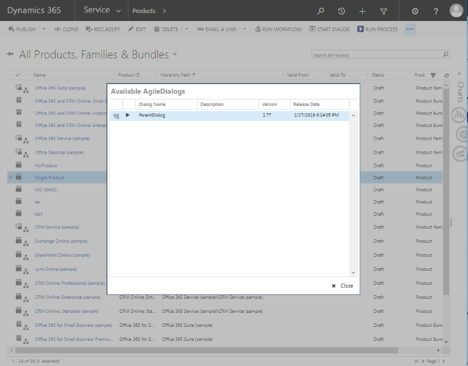

The AgileDialogs process will be executed and displayed within Dynamics CRM, avoiding the need to constantly change applications.

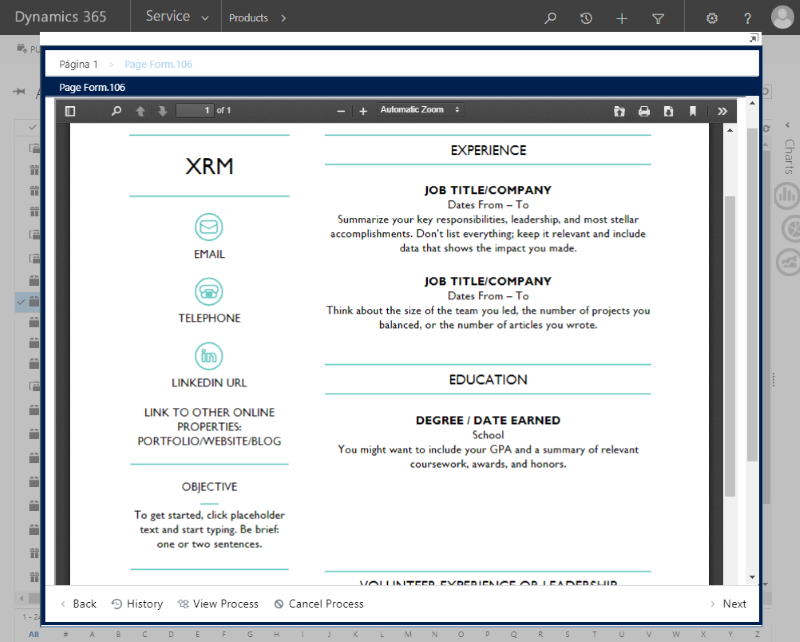

**Form integration**: Enabled entities has `View process`option in its menu bar.

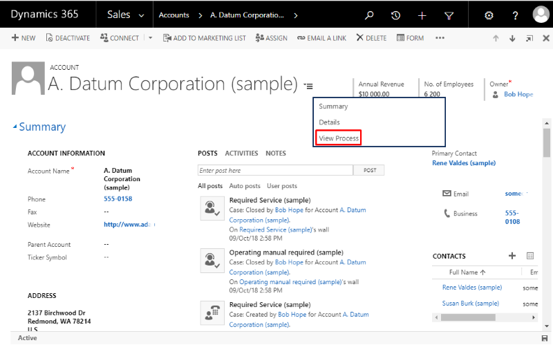

Real time process tracking is shown inside Dynamics CRM entity main form with ProcessManager. We can perform all available ProcessManager actions within Dynamics CRM, as Migrate process version, change flow, navigation between process and subprocess , list process details...

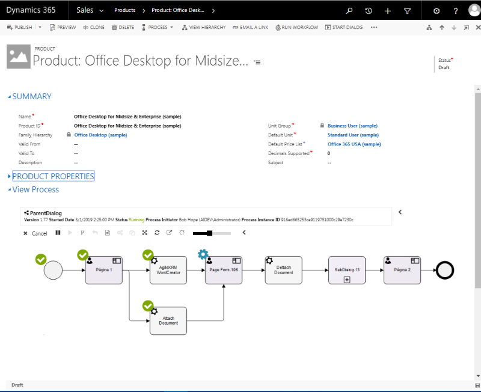

Also, Enabled entities has `Run process` and `Start AgileDialog` buttons in its command bar as we do in list views.

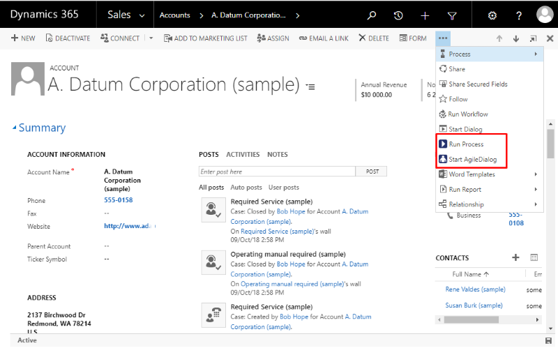

**Workflow integration**: Enabled entitites has Dynamics CRM Workflows full integration, by this way Dynamics CRM Entities can trigger AgileXRM process when records are created or modified.

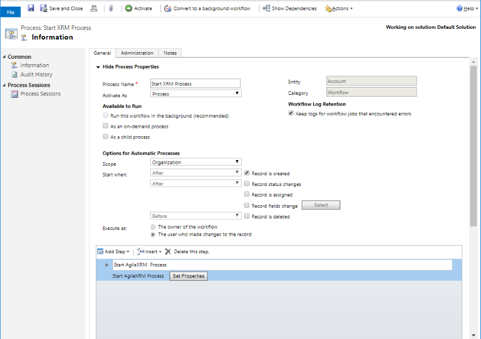

To disable a previously enabled CRM entity, choose the entity from entities list and click on `Apply changes to entites` button. When an entity is going to be disabled, the selected row is shown with red background color. 

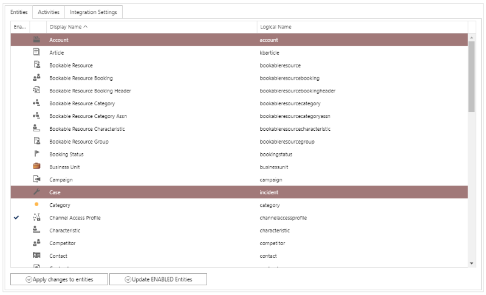

It is possible to enable / disable multiple entities at same time

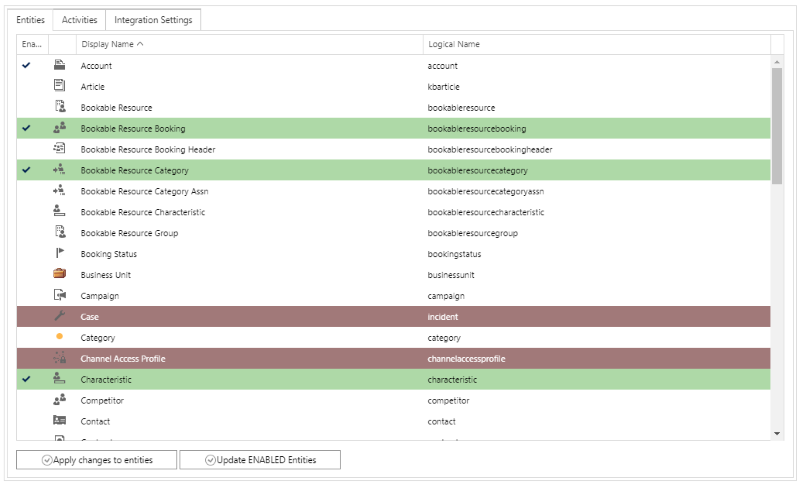

`Update enable entities` button allows update Dynamics CRM customizations when new version of AgileXRM product is installed.

### Enable / Disable Activities

This section allows enable/disable AgileXRM deep integration for Dynamics CRM activities.

Dynamics CRM activities must be enabled in order to allow AgileXRM deep integration. To enable a Dynamics CRM Activity for AgileXRM deep integration simply choose the activity from activities list and click on  `Apply changes to activities` button. When an activity is going to be enabled, the selected row is shown with green background color.

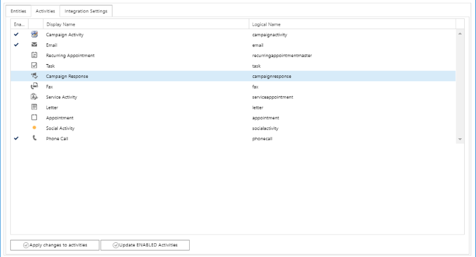

The process to enable / disable a Dynamics CRM Activity is equal to Activities process.

When a Dynamics CRM activity is enabled for AgileXRM deep integration, many features and customizations are enabled for each activity. These features are explained below.

**Activities integration**: Enabled Dynamics CRM Activities can run AgileDialogs process and pages within Dynamics CRM actity form. Also, Dynamics CRM activities can be completed from AgileXRM or AgileDialogs process.

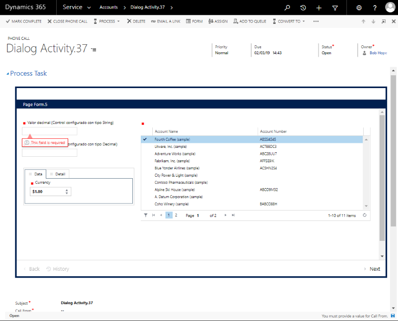

`Update enable activities` button allows update Dynamics CRM customizations when new version of AgileXRM product is installed.

### Manage AgileXRM settings

This section allows to manage AgileXRM settings and configuration.

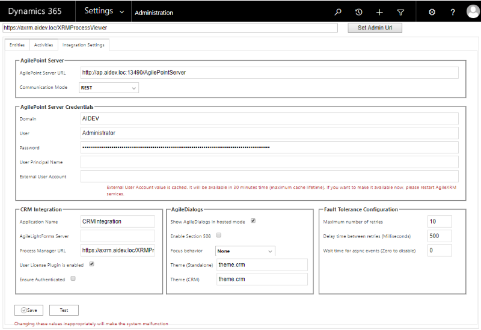

#### AgilePoint Server

This section defines AgilePoint server settings.

**AgilePoint Server URL:** The URL of AgilePoint server.

**Communication mode:** The commucation mode that is going to be used to connect with AgilePoint server. Available options REST and WCF.

> **Note:** When Communication mode is set to REST, the value of AgilePoint server URL must be the REST URL. Same way, when communition mode is set to WCF the AgilePoint server URL must be the WCF URL.

#### AgilePoint Server Credentials

This section defines the credential that is going to be used by Dynamics CRM to connect with AgilePoint Server

**Domain:** The domain of the account that is going to be used to connect Dynamics CRM.

**User:** The user name of the account that is going to be used to connect Dynamics CRM.

**Password:** The password that will be used to connect Dynamics CRM. This value is stored encrypted.

**User principal name:** The AgilePoint service account in UPN format. This field is only required when WCF communication mode is enabled.

**External user account:**  The user account that is going to be used by External users. This value must be a valid AgilePoint user account.

#### CRM Integration

* **Application Name:** TODO.
* **AgileLightForms Server:** Deprecated.
* **Process Manager URL:** The URL where ProcessManager server is running.
* **User License Plugin is enabled:** TODO.
* **Ensure Authenticated:** TODO.

#### AgileDialogs

* **Show AgileDialogs in hosted mode**: Sets the behaviour of AgileDialogs screens when executes inside Dynamics CRM. When this option is disabled, AgileDialogs screens will be shown in a new standalone window.
* **Enable Section 508:** Enable / disable the Section 508 feature, to make AgileDialogs accessible to people with disabilities.
* **Focus behavior:** Sets the behaviour of AgileDialogs controls when its gets focus. Available optios are: None, Text Hithlight and 'Control Box'
> **Note**: This table shows differences between `Focus behaviour` modes
> 
>  |**Value**|**Sample**||
> |-------------|---------|---|
> |**None**| None| None|
> |**Text Hithlight sample**|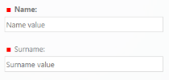|Text of focused control is bold|
> |**Control Box**|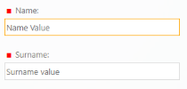|Border of focused control is highlight|

* **Theme (Standalone):** Sets the theme is going to be used when AgileDialogs runs on standalone mode (outside Dynamics CRM).
* **Theme (CRM):** Sets the theme is going to be used when AgileDialogs runs on integrated mode (inside Dynamics CRM)

> **Note:** AgileDialogs has available these themes:
> 
> |**Theme.crm**|**Theme.cds**|**Theme.uui**
> |-------------|---------|---------|
> |||
> 
> |**Theme**|**Theme.01**|**Theme.02**|
> |------------|------------|------------|
> ||||
> 

#### Fault Tolerance Configuration

This section defines the fault tolerance configuration for system integration.

* **Maximum number of retries** This field defines the maximum number of retries that is going to execute before fault.
* **Delay time between retries (Milliseconds)** This field defines the delay time that is going to apply between retries.
* **Wait time for async events (Zero to disable)** This field defines a time interval to wait for AgilePoint async events. Zero value disables this feature.

## Disclaimer of warranty

[Disclaimer of warranty](common/DisclaimerOfWarranty.md)