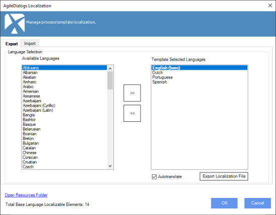
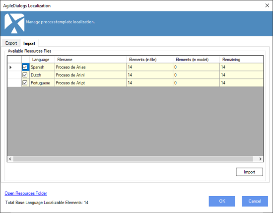
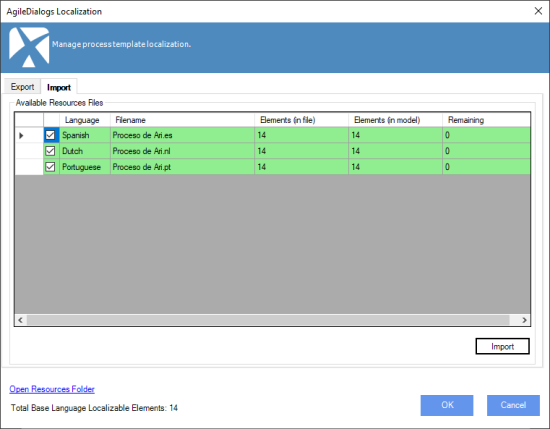
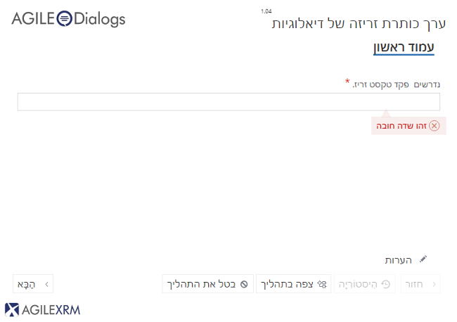

__[Home](/) --> [AgileDialogs Design Guide](/guides/AgileDialogs-DesignGuide.md) --> AgileDialogs Localization__

# AgileDialogs Localization

AgileDialogs provides localization features that allows translate any text within process model.

By default, AgileDialogs render its pages using a base languague - that is the languague that modeller uses to build the process template. Once you add a translation to AgileDialogs, the page content can be rendered using that languague.

In order to add translations to AgileDialogs launch it from `Localization` ribbon button.

We can translate texts for the Process Template (like title, messages, breadcrumbs ...), and for all AgileDialogs controls included within model pages (labels, helps, validation messages, watermarks,...).

When Agile Dialogs is executed from CRM/CDS the Language is set automatically with the same languague used in CRM..

Also we can modify the display languague using `lcid` param. 

When requested languague is not available, AgileDialogs will render its pages using the base languague.

> When requested languague is partially translated, by way which some elements has translation and others not, AgileDialogs will uses the translation when it available and the base languague when not.

## Translation

Once `Localization` button is clicked, the translation window is shown. 

This window allows manage localizations for AgileDialogs process template model.

> This window is divided in two section tabs. `Import` and `Export`. Export tab allows to generate the resource files which will contains the translations. Import tab allows load that translations into process model template. 

Steps:
- Choose languages to translate from the available languages list.
- Export localization files. 
- Translate files. This step ussually is performed by traductor person, but Automatic translation is also available.
- Import localization files.

### Export Resource files

`Available languages list` and the `Selected languages list` options are placed under `Export` section tab. Choose a language from `Available languages list` and include it into `Selected languages list` using the `>>` button. You can remove a languague by the same way using the `<<` button.

> AgileDialogs stores its translations with ProcesTemplate model, be careful to not include a large number of languages. Include only the languages which you need.

If `AutoTranslate` option is checked, AgileDialogs will translate any text defined in base language to that languages.

Perform the export by clicking the `Export localization file`. This operation is going to generate multiple resource files:
1. A single base languague resource file. This file contains the texts which Process Template Model contains. This file is named with the same model name and resx extension (sample.resx). 
2. A file for each selected languague. These files are named with the same model name, an localized extension (sample.es.resx, sample.nl.resx, etc...).

> The automatic translation is performed by external service, so we strongly recommend you an human review.

Once these files are created, translations must be placed into theses files. 

### Import Resource files

Once we had our translations files ready, we can `Import` it into process model.

This section lists the generated localiztion files. This window also indicates the number of translation items which exists into resource file and the number of translation items that has been previously imported in model.    

Choose which files we want to import and click `Import` button to perform.

Languages will not be available until translations are imported into model and publish it.
> Each version of a process model usually add, removes and changes its texts. When it happends, we need to mantain these localizations.

## RTL Support

AgileDialogs provides support for **RTL** (Right to Left) languages.

> CRM package languague should be installed

## Disclaimer of warranty

[Disclaimer of warranty](DisclaimerOfWarranty.md)