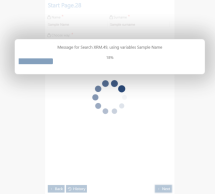

# AgileDialogs Progress Messages

**[Home](/) --> [AgileDialogs design guide](/guides/AgileDialogs-DesignGuide.md) --> Progress Messages and advance**

---

## Introduction

An AgileDialogs process template, can contains AgileDialogs activity shapes, but also, can contain automatic activities, which can perform search, generate documents, call extenal services ...

Using AgileDialogs Progress messages can send messages to notify the user these activities are performing its work.

## Define Progress Messages

Click on `Progress Messages` Ribbon button to show the progress messages editor.

Process Messages editor is shown:

> If our process model does not contain automatic activities, no records will shown. By default, all automatic activities are shown, but can select a group of activities to show only selected activities in editor.

Process Message editor allows define for each automatic activity:

- **Progress messages value**: Type the message to show to the user.
- **CSS class name**: Type the CSS class.
- **Progress advance**: Set the progress advance value.

> It not needed to define messages for all automatic activities, define progress messages only when want send a feedback to the user.

If Selecting a group of automatic activities before open the Progress Messages Editor, the records shown are the scope of our selection, making easy defining the messages and the advance values.

When AgileDialogs executes the automatic activities, defined messages and its advance are shown:

||
|
|

Can use context variables into progress message to shown fully customize message.

---

## Localization of Progress Messages

AgileDialogs localization system is fully compatible with Progress Messages.

Check Localization guide here; [AgileDialogs Localization](AgileDialogsLocalization.md)

---

## Customization of Progress Messages

Also, can customize the look & feel of each progress message, setting a custom CSS class.

Check Customization guide here: [Cutomization guide](../AgileDialogs-CustomizationGuide.md)

---

## Disclaimer of warranty

[Disclaimer of warranty](common/DisclaimerOfWarranty.md)
