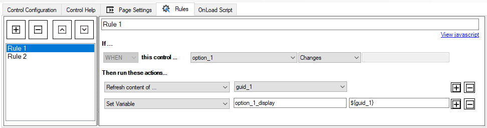
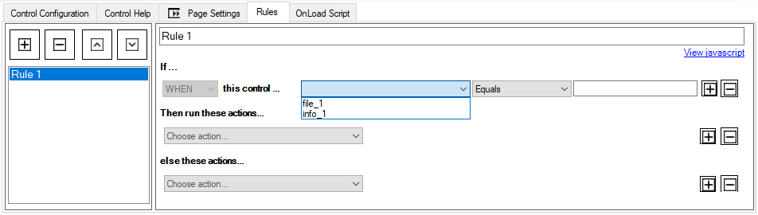

# AgileDialogs Rules editor

**[Home](/) --> AgileDialogs Rules editor**

---
AgileDialogs contains a rule editor for AgileDialogs pages.

A rule is a set of instructions that will be executed when a certain condition is met. An AgileDialogs page can contains many rules as needed.

> AgileDialogs rule editor is placed in its own tab, on AgileDialogs Page editor.

---

## Creating an AgileDialogs rule

To create a new AgileDialogs click the add `+` button.

AgileDialogs rules are build with IFTTT (if this then that) paradigma.

AgileDialogs rule can be readed by this way:  
*if "option_1" control value is equal to "A" then clear "option_2" control value.*

Each rule contains these areas where needs provide data.

- `if ...` : Under this section will define the condition to execute the rule.
- `Then run these actions ...` : In this section we will define the actions to be carried out when the previous condition is met.
- `else these actions ...` : In this section we will define the actions to be carried out when the previous condition is NOT met.

So need to provide this information in order to create an AgileDialogs rule.

Under `if ...` section:

- **Rule name**: This can be any unique value to identify rule easily.
- **Control name**: Choose a control name for the rule condition.
- **Comparer**: Choose a comparer operator.
- **Value**: The value to compare.

Under `Then run these actions ...`

- **Action**: The action to be performed.
- **Control name**: The control name to which action affect.
- **Value**: When action needs a value, will need provide that here.

Under `else this actions ...`

- **Action**: The action to be performed.
- **Control name**: The control name to which action affect.
- **Value**: When action needs a value, will need provide that here.

> This section is optional

---

### Rule operator list

The available operator list is shown below:

- **Equals**. Set this operator to compare if value is equal with known value or variable.
- **Does not equals**. Set this operator to compare if value does not equal with known value or variable.
- **Greater than**. Set this operator to compare if value is greater than a known value or variable.
- **Smaller than**. Set this operator to compare if value is greater than a known value or variable.
- **Contains this**. Set this operator to compare if value contains a known value or variable.
- **Contains data**. Set this operator to compare if value contains data.
- **Does not contain data**. Set this operator to compare if value does not contains data.
- **Changes**. Set this operator to make the condition true when the control changes it value.

---

### Rule action list

The available action list is shown below:

- **Enable control**. Choose this action to enable a control. Target control name must be provide.
- **Disable control**. Choose this action to disable a control. Target control name must be provide.
- **Show control**. Choose this action to show a control. Target control name must be provide.
- **Hide control**. Choose this action to hide a control. Target control name must be provide.
- **Set control to required**. Choose this action to set control as required field. Target control name must be provide.
- **Set control to not-required**. Choose this action to set control as non-required field. Target control name must be provide.
- **Set control value**. Choose this action to set the value of a control to a known value or variable. Target control name must be provide.
- **Clear control value**. Choose this action to clear control value. Target control name must be provide.
- **Set variable**. Choose this action to set variable value. Target variable name must be provide.
- **Refresh the content of ...** . Choose this action to refresh the content of other control. Target control name must be provide. *This option will execute an http request*.

---

## Editing an AgileDialogs rule

Editing an AgileDialogs rule is easily as creting one is. Simple choose the rule to edit and modify it.

Alse, rule can be removed clinking on `-` button.

---

## Rule order ejecution

AgileDialogs rules will be executed in same order as defined.

If need to change, can use the up `˄` and down `˅` buttons to order.

---

## Disclaimer of warranty

[Disclaimer of warranty](DisclaimerOfWarranty.md)
