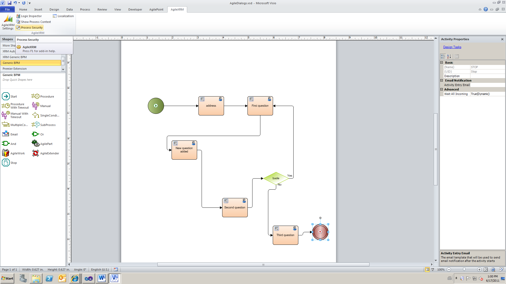
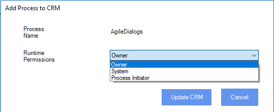
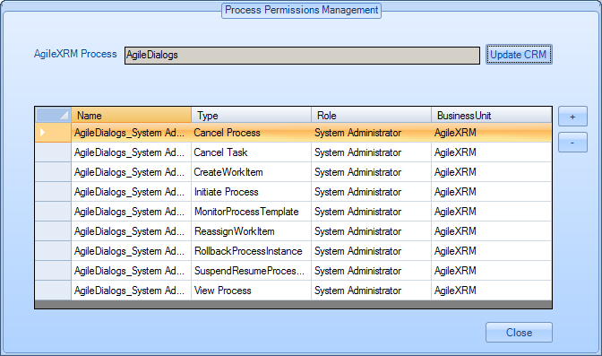

__[Home](/) --> [AgileDialogs Design Guide](/guides/AgileDialogs-DesignGuide.md) --> XRM Connection Window__

# AgileDialogs Security

Configuring permissions for AgileDialogs works like configuring permissions for
AgileXRM processes. When a Dialog is deployed to server the modeler can
configure permissions using the same mechanism.

Process permission can be managed using Process Security button in AgileXRM Ribbon.

Runtime Permissions have the same configuration options as for AgileXRM processes

And permission can be assigned based on XRM roles:

In order to launch a Dialog the user must belong to a role that has *Initiate Process* permission.
