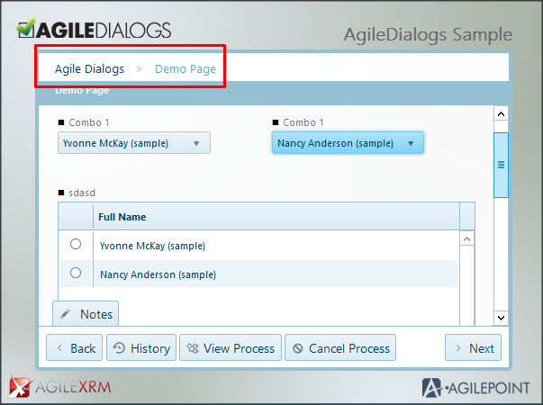
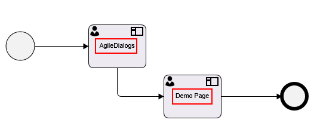
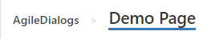
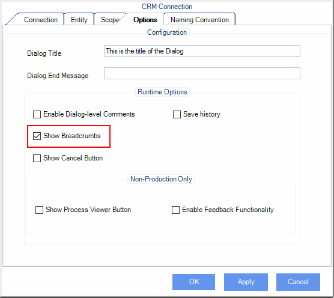
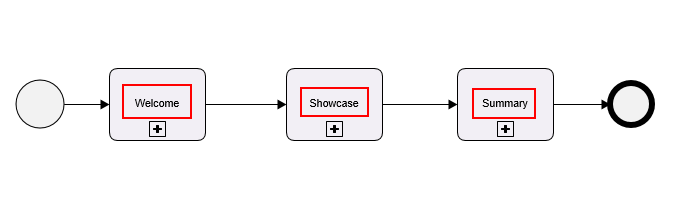

# Breadcrumbs

**[Home](/) --> [AgileDialogs design guide](/guides/AgileDialogs-DesignGuide.md) --> BreadCrumbs**

---
AgileDialogs has a feature that allows including Breadcrumbs while the dialog is
executed by the user.

These are presented in the top of the AgileDialogs interface:

Breadcrumbs is a list of links to allow the user to go pack to a previous page
by clicking the link.

The text shown in the link is the text of the Shape itself.

To enable Breadcrumbs, in XRM Connection window check *Breadcrumbs Enabled*.

Note that only this setting is only used as defined in the main parent dialog.

So for example, if the main dialog has this setting checked but the child
sub-dialogs not, then breadcrumbs WILL be shown. And if say, the main parent
dialog does not have this setting checked but the child sub-dialogs do have it
set, then breadcrumbs WILL NOT be shown.

---

<!-- ## Stages

If the main parent dialog is exclusively comprised of a set of sequential
SubDialog shapes, these are shown as Stages:

The text shown in the Stages is the text of the Shapes themselves. This feature
can be used only in processes where all phases must be fulfilled, there cannot
be decisions between phases, and parent process only allows SubDialogs shapes. -->

## Disclaimer of warranty

[Disclaimer of warranty](DisclaimerOfWarranty.md)
