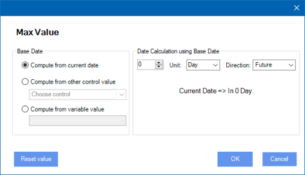

__[Home](/) --> [AgileDialogs Design Guide](/guides/AgileDialogs-DesignGuide.md) --> Calendar__

# Calendar control

This control shows a date picker and an optional time picker to the user:

In order to only show the date picker, in the *Advanced* tab set *DateOnly*
property to *true*.

In order to set the current datetime in the calendar control, use the special
value **Now** in the *Default Value* property (note: the values range go from
1900 to 2099).

Calendar control uses **ISO-8601** format to store the value for value variable value,
and the localized screen display for display variable.

Example:

>   **Value variable** saves: 1975-05-12T22:00:00Z
>   
>   **Display variable** saves: 13/05/1975 0:00 for es-ES culture

By default, AgileDialogs calendar control shows its content using CRM timezone settings so we can change this behavior by *TimeZoneIndependent* property.

Either type the date/time or select them using the mouse:

> **Note**: Calendar control uses the **ISO-8601** format to store its value variable.

> **Note**: The control does not have the ControlWidth property.

## Min Value and Max Value

Calendar control can define the max and min values which control allows. Values can be computed or fixed as well. 

To define a min value for calendar control use the **Min Value** property.

To define a max value for calendar control use the **Max Value** property.

> Example. If we define the `Max Value` property computed starting from Current Date and ending in 2 week in future direction, Calendar control will set the max value from the Current Date to 2 weeks in the future disabling others dates.

When calendar control has `Min Value` or `Max Value` properties defined, the dates out of its range will not be presented to the user and it values will be validated within form validation.

### Computed value

This option allows to define the `Min Value` and `Max Value` values computed from a starting point to end point. 

We can define thats value from a computed date set the `Use computed date` checkbox checked.

The starting point can be defined from `Current Date`, `Other control value` in the page or a `Variable Value` )

> When the value is computed from `Variable value` its contents must be a valid **ISO-8601** date expression.

To define the ending point we need provide an amount, the unit to compute (day, week, month or year) and the direction from the starting point (Future or pass)

### Static value

Also we can set the `Min Value`and `Max Value` properties using a fixed date value. We can define this value choosing a static value or defining it from a variable value.

> When the value is defined from `Variable value` its contents must be a valid **ISO-8601** date expression.

## Disclaimer of warranty

[Disclaimer of warranty](DisclaimerOfWarranty.md)

