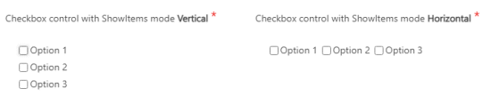

# Checkbox control

**[Home](/) --> [AgileDialogs Design Guide](/guides/AgileDialogs-DesignGuide.md) --> Checkbox**

---

This control is used to show a set of checkboxes to the user and allows multiple selections.

Checkbox control can populate its items from one of these values:

- **Static**: Checkbox control shows a list of static items with predefined label and associated value.
- **XRM**: Checkbox control populates its items from the results of XRM query
- **XRM Optionset**: Checkbox control populates its items from XRM optionset.

<!-- Also, check control can show *«MultiSelect Option Sets»*  by **FieldAndEntity** property.-->

Once selected, the internal result set of data to store would be a literal of all the checked values separated by a semicolon (e.g. *One;Two;Three*)

**ShowItemsMode**: Set  how items are rendered within AgileDialogs. Possible values are `Vertical` and `Horizontal`. If this property does not have value items are rendered in vertical way.

---

## Common properties

- [AgileDialogs control common properties](ControlCommonProperties.md)

---

## Related

- [Populating a Combo](../common/PopulatingCombo.md)

---

## Disclaimer of warranty

[Disclaimer of warranty](DisclaimerOfWarranty.md)
