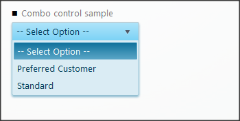
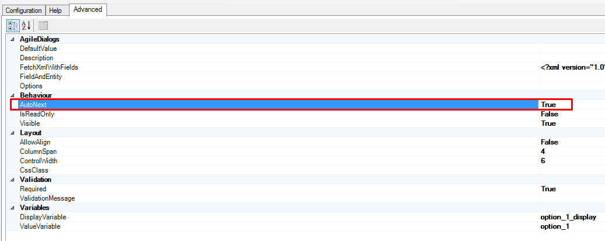
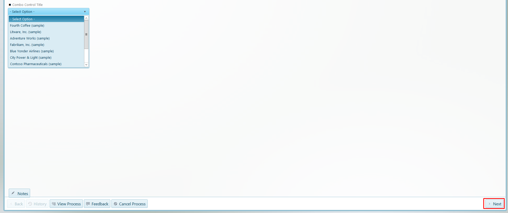

# Combo control

**[Home](/) --> [AgileDialogs Design Guide](/guides/AgileDialogs-DesignGuide.md) --> Combo**

---
This control presents a set of options in a combo box (Currently the edit part
of the combo is disabled and the combo control behaves as a standard drop-down
list box).

Combo can show:

- Static values
- Dynamic values

The **AutoNext** property, if set to **true**, enables the control to move
forward, once the user has filled in the control with the desired value.

For instance, if we have a Page Form composed of one Combo control, with its
*Required* property set to **true** we would need to select an item inside our
control, and press the predefined **next** button afterwards to move forward
in the dialog (image below); however, if we set **AutoNext** to *true*, the
process will continue as soon as we select a value for our Combo control,
without pressing the *next* button.

> **Important**:  
> if there is any other control  in the current form with its *required* property set to true, the process will not  move forward automatically.

---

## Common properties

- [AgileDialogs control common properties](ControlCommonProperties.md)

---

## Related

- [Populating a Combo](../common/PopulatingCombo.md)

---

## Disclaimer of warranty

[Disclaimer of warranty](DisclaimerOfWarranty.md)
