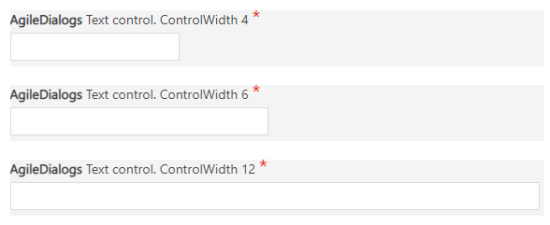

__[Home](/) --> [AgileDialogs design guide](/guides/AgileDialogs-DesignGuide.md) --> AgileDialogs common control properties__

## AgileDialogs common control properties

- **ValueVariable**: This is the name of the variable which will store the control value into process context.
  > The `ValueVariable` value will be stored in process context when `Next` button was clicked.
  
  > The `ValueVariable` value can be used typing `${ValueVariable}`.
  
  > The `ValueVariable` value also is used in all references to AgileDialogs API.
- **DisplayVariable**: This is name of the variable which will store the display value of the control into process context. 
  > The `DisplayVariable` property is not available for all controls. Only for controls, like combo, that display one value and store another.
   
- **Required**: This property defines if control data is mandatory.
  >  

- **ValidationMessage**: This property allow customize the validation message shown to the user when a required control validation fails. 
  >
  
- **CustomValidationMessage**: This property allow customize the validation message shown to the user when a custom validation fails.

- **AllowAlign**: This property allows you to define the way the control is displayed on the page.
  > If the value of `AllowAlign` property is `false`, the control will be presented stacked with respect to the previous control.
  > 
  >
  
  > If the value of `AllowAlign` property is `true`, the control will be rendered inline with respect to the previous control.
  >
  >

- **ColumnSpan**: This property defines the width of the control into the screen. Value must be between 1 (min) and 12(max).
  >  
 
- **ControlWidth**: This property defines the width of the input field into the control. Value must be between 1 (min) and 12(max).
  > 

- **Question**: This property allow define the control caption.
  > 

  > When a control is required, AgileDialogs adds a visual required indicator. This indicator and its position can be modified through style customization. 

- **Notes**: This property allow define the help for control. When this property has value, a help icon will be shown and clicking on it help its shown.
  > 

- **DefaultValue**: This property allows set a default value for the control.

- **Description**: This property allows set a context help for the control. When control receives the focus this help will shown.
  > 

- **IsReadOnly**: This property defines if control executes in readonly mode.
  > When control has the `ReadOnly` property set to `true`, all validations for the control are disabled. This occurs to avoid blocking the user by applying validations to a control that they cannot manipulate.

- **Visible**: This property defines if control is visible or not.
  > When control has the `Visible` property set to `false`, all validations for the control are disabled. This occurs to avoid blocking the user by applying validations to a control that they cannot manipulate.

- **CssClass**: This property allows adding CSS classes to the control, in this way we can customize how each control is displayed 

## Disclaimer of warranty

[Disclaimer of warranty](DisclaimerOfWarranty.md)