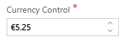
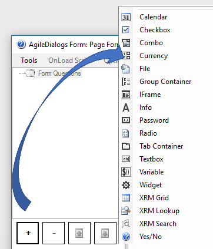

__[Home](/) --> [AgileDialogs Design Guide](/guides/AgileDialogs-DesignGuide.md) --> Currency Control__

# Currency Control

The Currency control is helpful for entering non-string currency values into
our Page Form (image below). It is composed of a customizable Textbox that does
not allow non-numeric values to be entered, and we also could increase /
decrease its value by pressing the vertical arrows at the right part of the
control.

Once the control loses its focus (by clicking somewhere else or moving onto the
next Form control), it automatically takes a currency format according to the
regional settings of the server hosting our App (Image above). It also shows the
currency symbol configured on our properties (through the *Symbol* property,
detailed below in the *properties* section).

Currency control uses the dot as decimal position indicator for value variable,
and the localized screen display for display variable.

Example:

>   **Value variable** saves: 5.25
>   
>   **Display variable** saves: \$5,25

**How to create a Currency Control**

The way to add a currency would be through the add control / currency options.

The **properties** for the Currency control are:

-   **Decimals**: Number of decimals that the control will handle (two by
    default)

-   **DefaultValue**: Default amount to be shown inside the Textbox
    before user interaction

-   **Description**: Tooltip value that will describe the currency control
    details before user interaction

-   **Symbol**: Currency Symbol to be shown in our control
