__[Home](/) --> [AgileDialogs design guide](/guides/AgileDialogs-DesignGuide.md) --> Customizing look and feel__

# Customizing Look and Feel

AgileDialogs provides us various personalization mechanisms:

-   Theme personalizations
-   Theme specifications for runtime executions
-   AgileDialogs Viewport customization
-   Branding
-   Advanced personalization

### Themes Customization

AgileDialogs allows layout customization through themes, using LESS technology
([www.lesscss.org](http://www.lesscss.org)) and the tool KendoUI ThemeBuilder
(<http://demos.telerik.com/kendo-ui/themebuilder/web.html>).

Themes customization is really useful for the goal of modifying the AgileDialogs
controls (typography, font colors, etc.).

The customization process stands for generating a new stylesheet with the
desired values, using **Kendo UI Theme Builder** and deploy it over
AgileDialogs. 

Starting from the AgileDialogs installation path, in
\[AgileDialogsRoot\]/Kendo/less/kendo, we should find the **theme.custom.less** file.

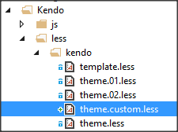

Through an internet browser, the next step would be to access to the tool **Kendo
UI Theme Builder** (<http://demos.telerik.com/kendo-ui/themebuilder/web.html>)
and generate our customized theme, following these steps:

1.  Select the base theme we want to take as the template for our styles:

    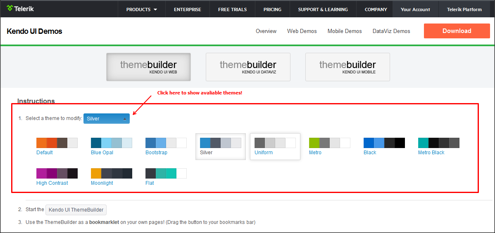

2.  Launch the tool *Kendo UI Theme Builder* and modify the available
    parameters the way you like:  

    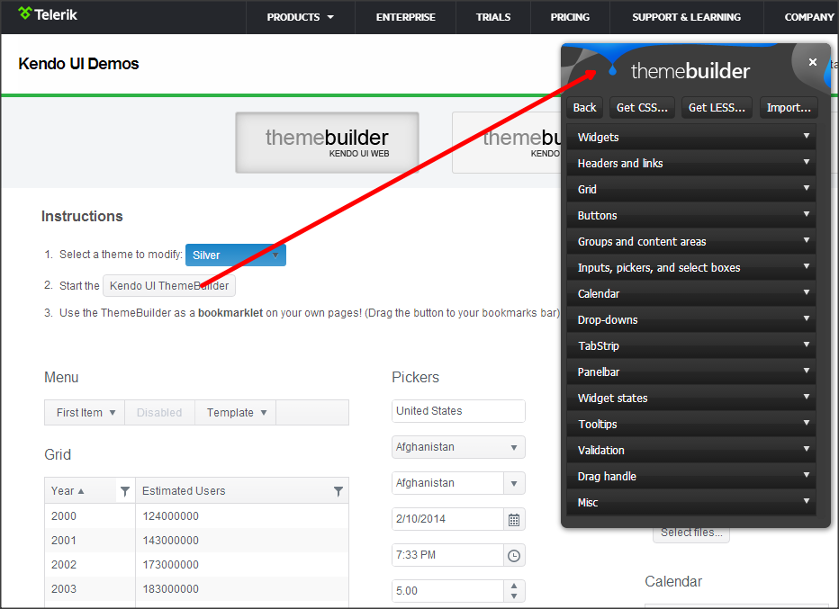

    The tool groups styles and colors in groups, and it is possible to extend or
    modify values in depth.

    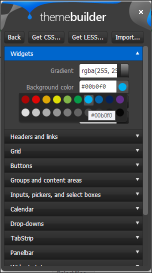
    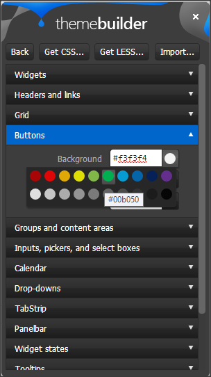

    Once we are done with the customization, the final content for the
    **theme.custom.less** file will be obtained, through the **Get less** option:

    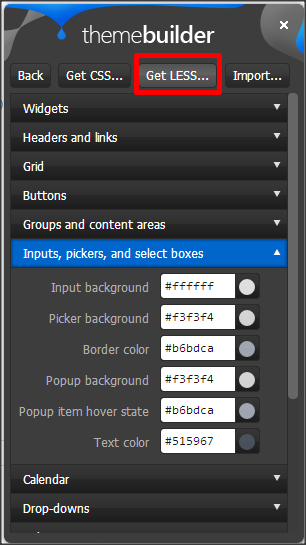
    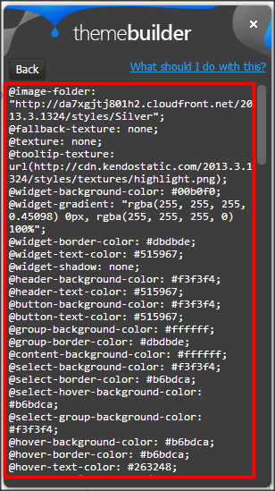

3.  Locate the **theme.custom.less** file in the main installation route, and paste
    the content obtained previously.

4.  In the file *theme.custom.less*, locate and modify the following variables
    manually:

```css
    @image-folder: "styles/Metro";  
    @texture: none;  
    @import "template.less";
```

5.  Modify the *web.config* file, *appSettings* section, in order to point to our
    new theme.

```xml
    <add key="LessThemeFile" value="less/kendo/theme.custom.less" \>
```

Different examples of theme customization:

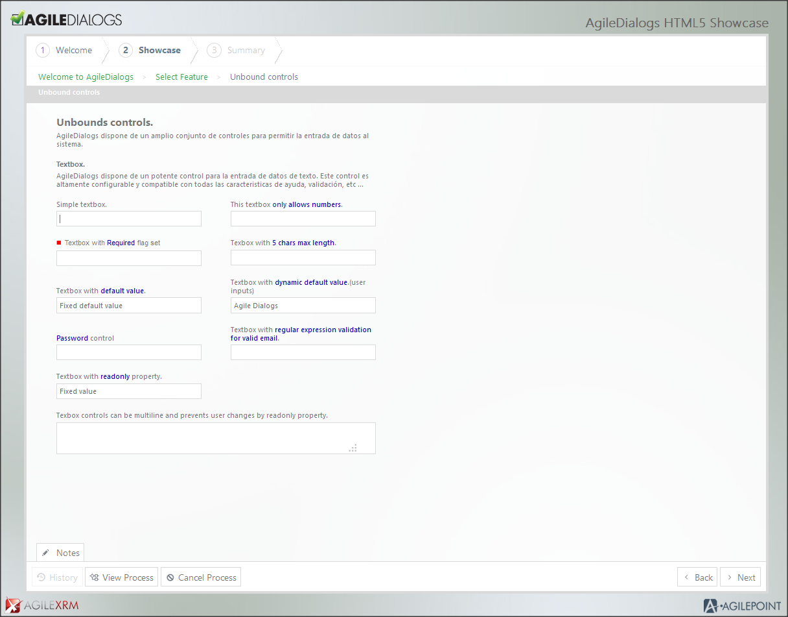
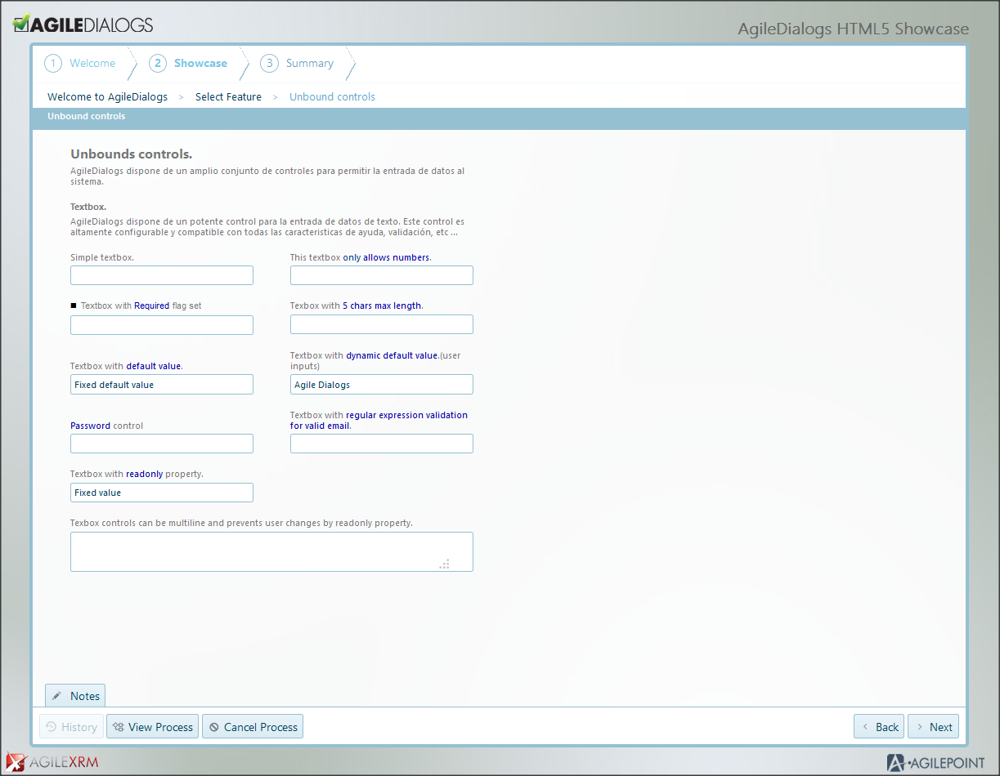
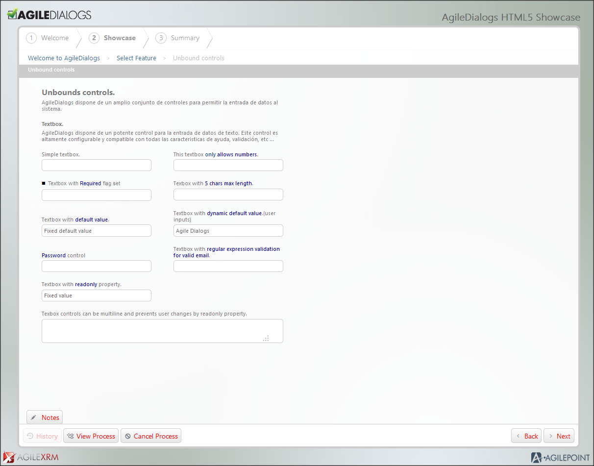

### Theme runtime specifications

It is possible to specify particular themes for the current runtime, through the
**theme** querystring parameter in the starting Dialogs Url.

Example:
```xml
http://<server>/AgileDialogs/AgileDialogsKendoRuntime.aspx?orgName=<org>&DefaultProcessTemplate=<processTemplate>&theme=theme.01
```

The parameter value must be a name of an existing .less file relative to the
\[AgileDialogsRoot\]/Kendo/ directory (without the file extension).

As an example, three files are included:

-   **AgileDialogsStyles.less**, Default Theme applied in web.config

-   **AgileDialogsStyles.theme.01.less**, example visual layout theme -
    less/kendo/theme.01.less  
    
    

-   **AgileDialogsStyles.theme.02.less**, example visual layout theme
    less/kendo/theme.02.less  

    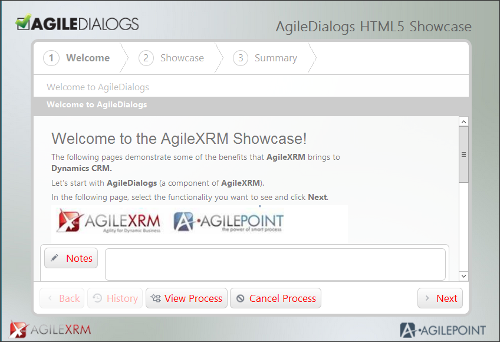

### Window frame customization for AgileDialogs.

Various options are available to show / hide AgileDialogs frame.

-   Using the **hosted** parameter, affects the current execution. We can send
    this parameter on the queryString petition (http / https).

-   Modifying the **AgileDialogs.cumtom.css** file. This option is more suitable for
    scenarios in which we only want to remove the frame for the current
    execution of a dialog.

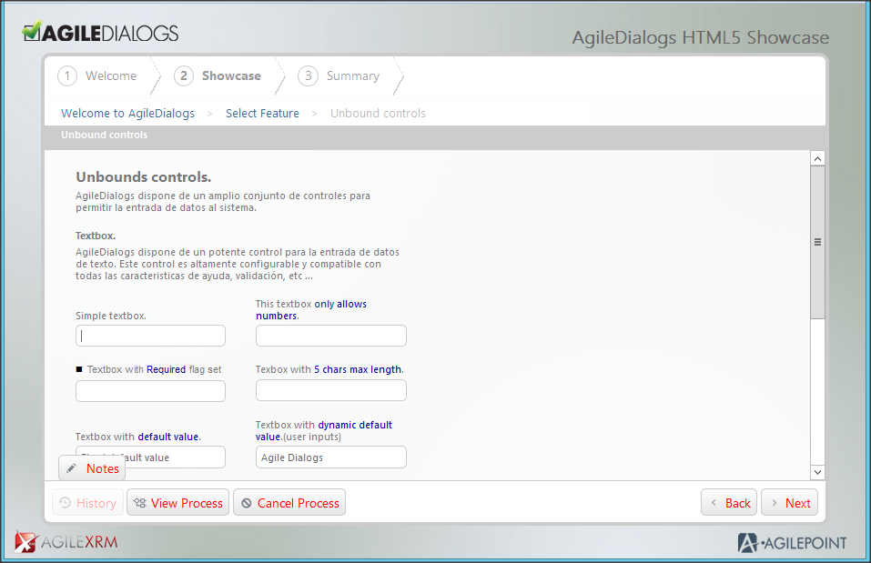

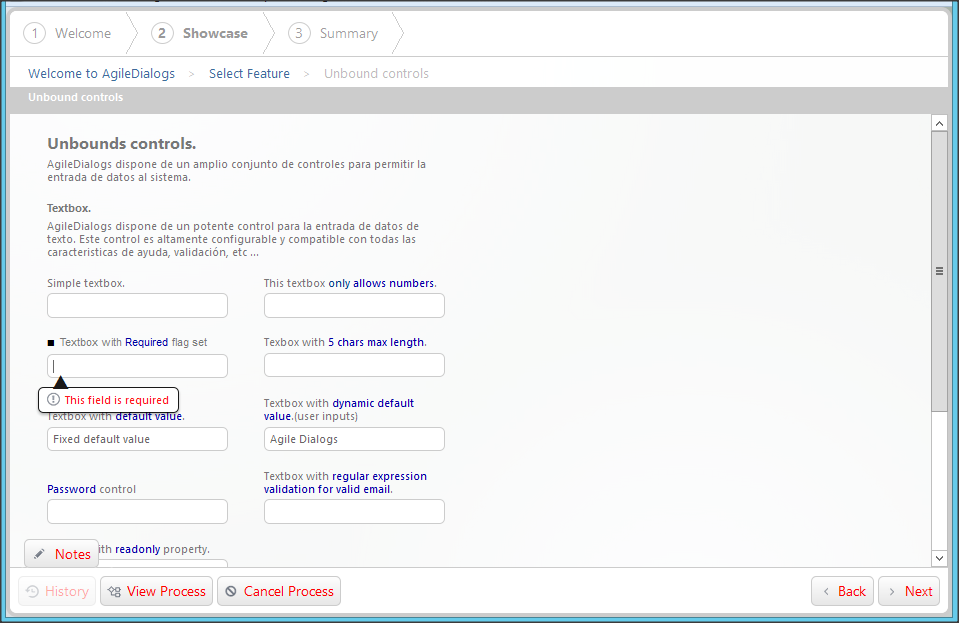

**Hosted** parameter possible values:

-   **1** - Hides AgileDialogs frame.

-   **0** - Shows AgileDialogs frame.

In case the **hosted** parameter is not specified, the AgileDialogs frame will be
shown.

It is also possible to remove the AgileDialogs frame customizing the
*AgileDialogsStyles.custom.css* file. This file is created during the
installation of AgileDialogs and it is initially empty. It is going to be shown
in detail shortly.

This option is the most suitable one for removing the frame for all runtime
executions.

### Branding.

#### Custom themes personalization for AgileDialogs.

We can tailor AgileDialogs as much as we like, and modifying the visual theme
layout we can overwrite the css rules of the applied theme; we can do so using
*AgileDialogsStyles.custom.css* or *AgileDialogsStyles.custom.less*. When
configured and set, it overwrites the default styles file and it is useful for
extending the website Look and Feel. Both files are placed in the **css**
directory inside AgileDialogsWeb source files (picture below).

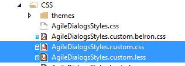

The custom styles are initially empty, but they are ready to include any new css
new rule and style we want to apply on AgileDialogs.

All customizations included in this file will affect to all AgileDialogs runtime
executions.

Important. Choose your default configuration file by changing the **value**
parameter in the application web.config (example below).

\<add key="CustomStyleFile" value="**CSS/AgileDialogsStyles.custom.css**"/\>

#### Window Frame personalization for AgileDialogs.

In order to customize AgileDialogs frame for all executions, it is necessary to
include the next css rules in the *AgileDialogsStyles.css* file:

```css
 #ADAppWrapper {
    margin: 0px !important;
 }
 .ADLogo, \#dialogTitle {
    display:none;
 }
```

> **Important**: Depending on its personalization level, it could be necessary to
include additional css and properties.

#### Logo customization.

To customize logos, it is necessary to include the next css rules in
*AgileDialogsStyles.cumtom.css* (the URLs and image sizes will depend on our
customization, being important to have them correctly set).

```css
  #ADLogoAD.ADLogo {
       background-image: url("http://<url>/your-logo.png") ;
       background-repeat: no-repeat;
       background-size: 192px 28px;
       min-height: 30px;
       min-width: 128px;
   }
  #ADLogoXRM.ADLogo {
      background-image: url("http://<url>/your-logo.png") ;
      background-repeat: no-repeat;
      background-size: 192px 28px;
      min-height: 30px;
      min-width: 128px;
  }
  #ADLogoAP.ADLogo {
      background-image: url("http://<url>/your-logo.png") ;
      background-repeat: no-repeat;
      background-size: 192px 28px;
      min-height: 30px;
      min-width: 128px;
  }
```

Important. Depending on personalization level, it could be necessary to include
additional properties and rules.

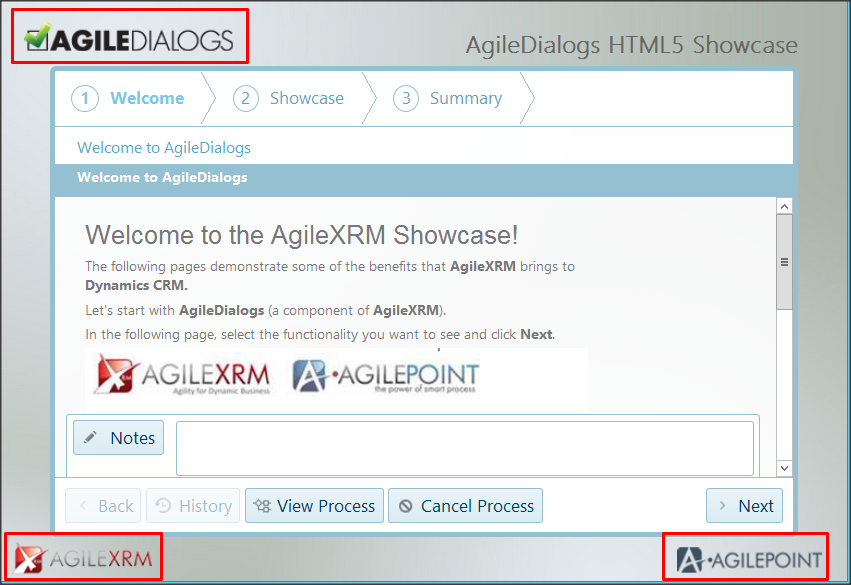

#### Background Customization.

For Customizing AgileDialogs Background, it would be mandatory to include the
following css rules in *AgileDialogsStyles.custom.css*.

```css
  #ADBackground span {
      background-image: url("https://<url>/your-background.png");
      background-size: 100% 100%;
      height: 100%;
      position: absolute;
      width: 100%;
  }
```

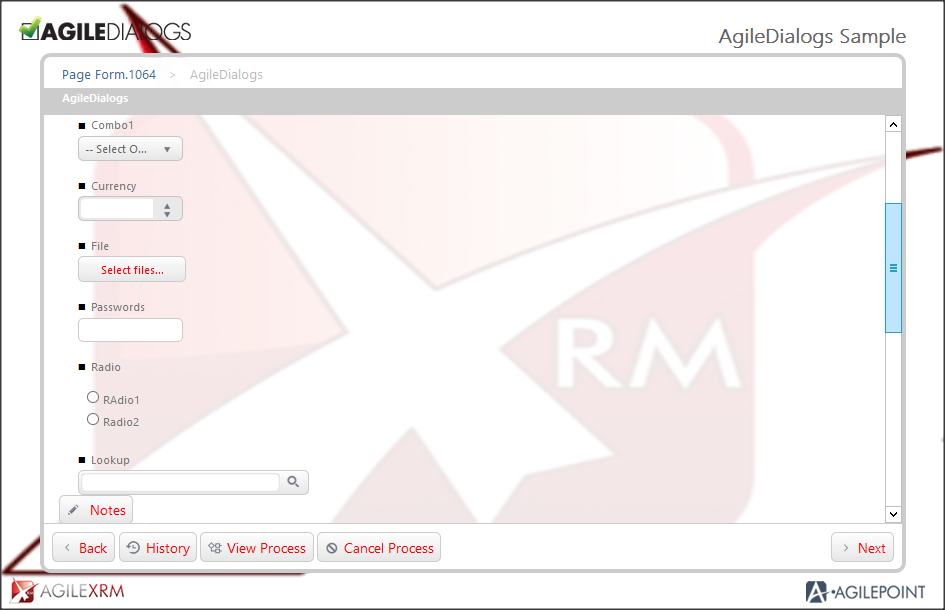

> **Important**. Depending on personalization level, it could be necessary to include
additional properties and rules.

#### Controls personalization.

In the customization file *AgileDialogsStyles.cumtom.css*, we can create new css
rules to modify the layout of certain controls and leave the others as per
design.

Note: To modify the layout of all controls, please check [Personalization of
Theme](#themes-customization).

In this example, a new css rule *myCustomClass* is created.

```css
  .myCustomClass {
    background-color:pink;
  }
  .myCustomClass input {
    background-color:yellow;
  }
```

In design-time, we can apply new rules created for certain controls only,
specifying the *CssClass property*.

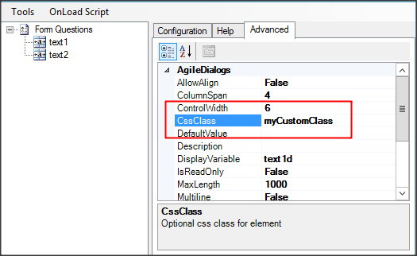

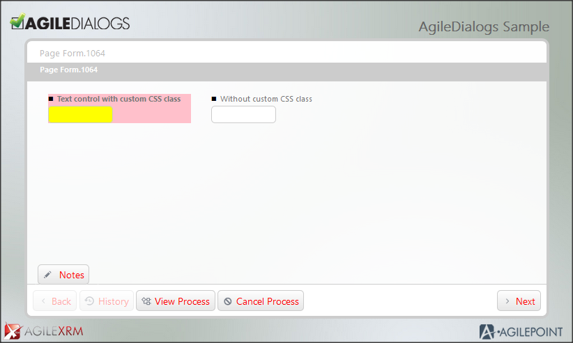

It is possible to apply the same rule for more than one control, through the
**CssClass** property of each control we want to modify.

#### Highlight focused controls.

There is a quick way to change how the controls that got the focus on our form
are shown. There is a web.config key that can do the trick for us:

```xml
<add key="HighlightBehavior" value="box"> <!--text, box, none-->
```

Describing effects according to set every possible value;

-   **Text**: When we set the focus on a control and this value is selected, the
    actual caption text belonging to the mentioned control gets highlighted in
    bold so the user can see it better (picture below).

    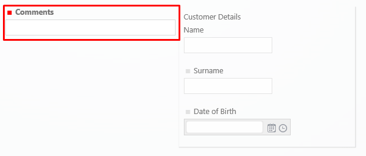

-   **Box**: When we set the focus on a control and this value is selected, the
    surrounding borders of the control are highlighted instead of the text
    (picture below).

    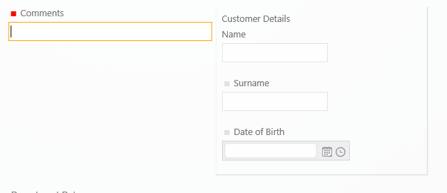

-   **None**: no highlight effects.

#### Section 508 Customization.

The Section 508 standard stands for the set of design best practices to apply in
a website, to ensure full access and remove barriers for people with
disabilities, and to encourage development of technologies that will help to
achieve these goals. The law applies to all U.S.A. Federal agencies when they
develop, procure, maintain, or use electronic and information technology. You
have more information about the standard and its particularities through this
link: <http://www.section508.gov/>

AgileDialogs offers us the possibility of activating this feature, either for a
particular page or for the whole AgileDialogs website. This will result on a
rendered html that will include all the features that would make it
Section508-compliant.

-   To activate the whole AgileDialogs web to accomplish Section 508 standards,
    it is necessary to set to true this key in our configuration file:

```xml
<add key="Section508" value="true"></add>
```

That would be all we need to make our website accomplish the Section 508
requirements.

-   There could be cases in which we do not need to have the Section508 key
    activated for the general use of the website, but we do in certain cases.
    For example, a specific user with impaired vision needs to have these
    settings activated when accessing the website, but the rest of the users do
    not need to. In those cases, we should add the literal **s508=true** to the
    QueryString parameter, like in the url below:

>   http://websiteName/AgileDialogs/AgileScriptsSLRunTime.aspx?orgname=Org1&DefaultProcessTemplate=Dev&s508=true

>   This feature must be configured in the caller app (e.g. CRM) that holds the
>   URL literal to start our DialogsEngine process.

### Advanced Customization.

#### Modify the Runtime Page Layout.

Additionally, we could modify AgileDialogs layout modifying its actual .aspx
page.

In order to do so, it is necessary to make a backup of the original page,
AgileDialogsKendoRuntime.aspx, y modify its contents (adding new elements to the
page, adding features to the existing ones, etc.).

To activate a customized .aspx page, we should modify the *web.config*
configuration.

Example: Backup of *AgileDialogsKendoRuntime.aspx*, to
AgileDialogsKendoRuntime.custom.aspx and activation of this brand new customized
page.

```xml
<add key="runtimeURL" value="~/AgileDialogsKendoRuntime.custom.aspx" \>
```

As you can see, in this example a **Cancel** button has been moved to the right
and a new footer has been included:

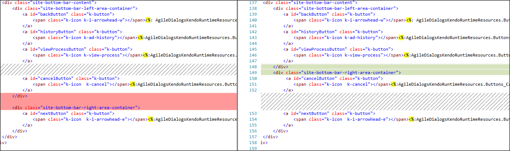

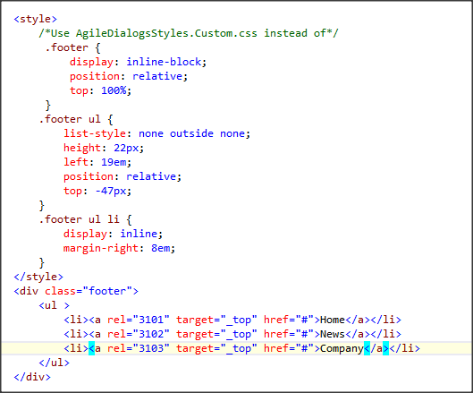

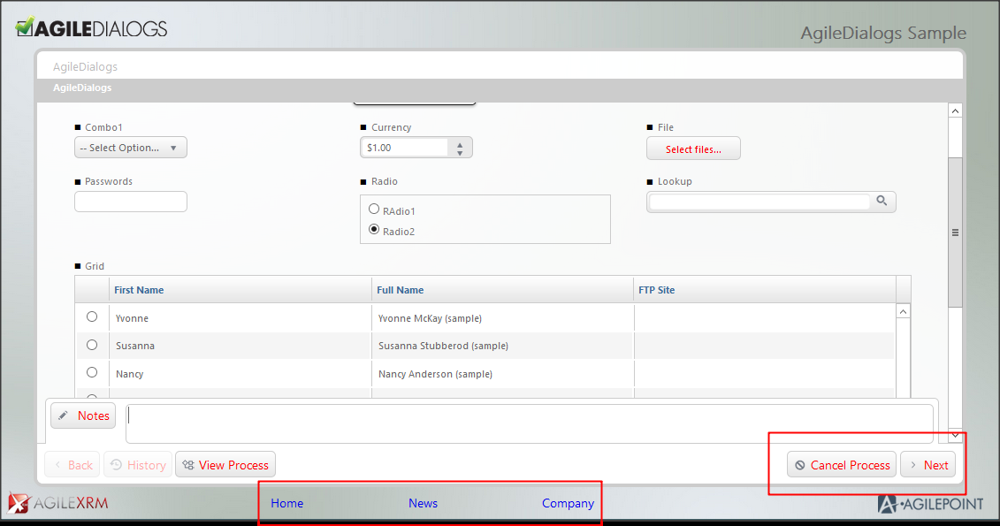

#### Customize the Default Error Page.

There is a Default Error Page set for unexpected errors that we could have on
our AgileDialogs Application. If some error is occurring, the application will
be redirected to the Default Error page automatically (picture below). According
to our needs, we could need to customize, extend, or rebuild its look and feel
to adapt our purposes.

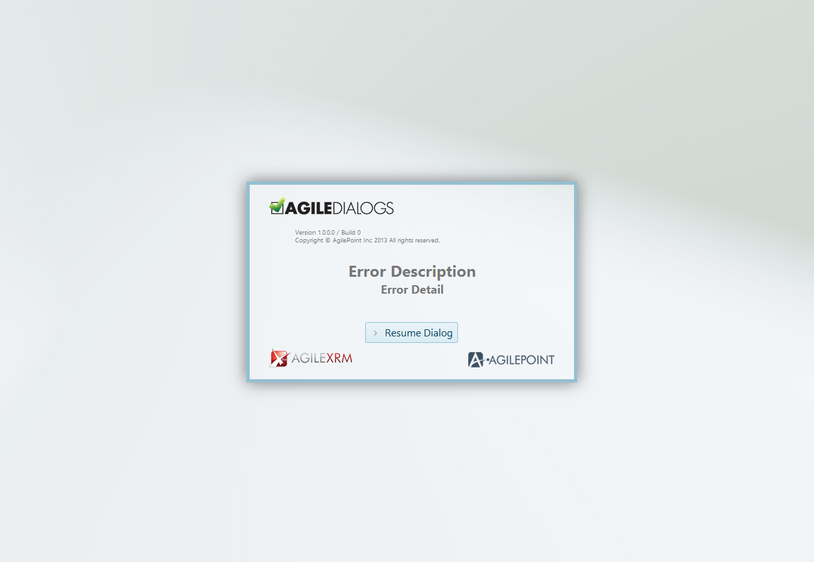

The Default error page it is placed in the root directory of the AgileDialogs
web application, as it is shown on the picture below:

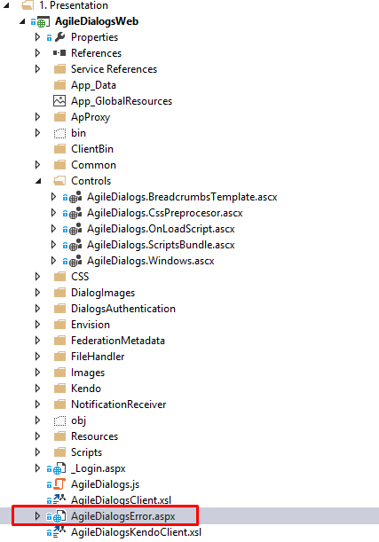

The Error Page html code can be extended as much as we want to. To reach that
goal we should follow these steps:

-   Create another .aspx page with the features we desire it to have. It is
    preferred to place the new page on the root directory, as
    AgileDialogsError.aspx is. Note the picture below in which a new .aspx file
    called *AgileDialogsCustomError.aspx* is created, in order to have an
    extended version of the default error page.

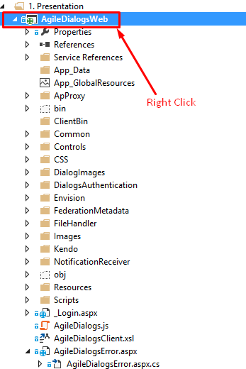
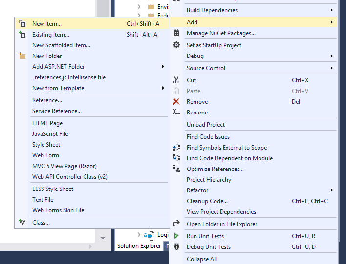
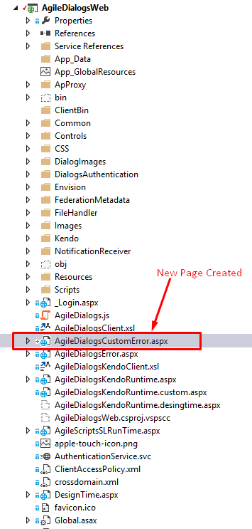

-   In the Web app. Configuration file Web.config, there is a key called
    **DialogErrorUrl** that holds the path in which the Default error page for the
    application is contained. If some error occurs, the flow will be redirected
    to the .aspx that is referenced in the **value** path of this tag.

```xml
    <add key="DialogErrorUrl" value="~/AgileDialogsError.aspx"></add>
```

We should change that path, and replace it for the path (file name included)
of the .aspx we have just created. Once that is done, we can customize our
new page as much as we want to (we can copy the html code from the Default
page into our new page and continue from there). There are multiple
enhancements you can have on your new customized error page (links to your
own bug reporting tool, customized links to user guides and help, etc.).
