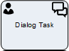
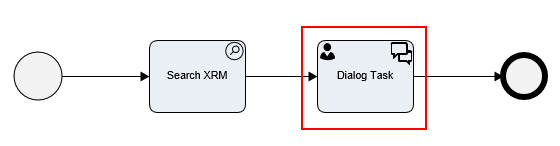
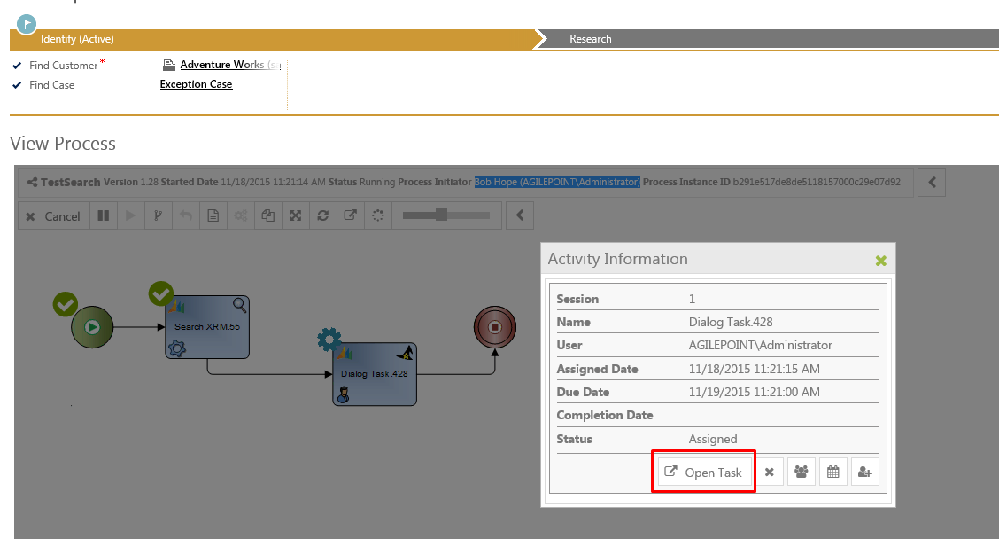
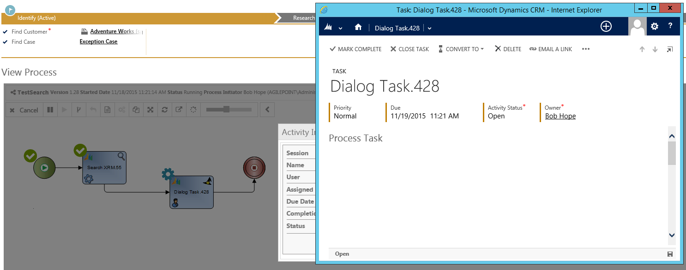
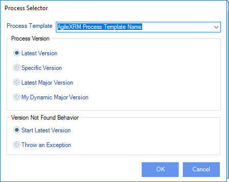
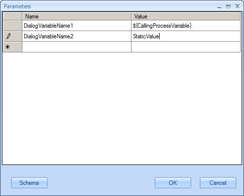

# Dialog Task

**[Home](/) --> [AgileDialogs design guide](/guides/AgileDialogs-DesignGuide.md) --> Dialog Task**

---

> **NOTE**: This activity can only be used in an **AgileXRM** process template. It
cannot be used in AgileDialogs templates.

The shape creates a manual Task in CRM. The **AgileXRM** process will continue when
the CRM Task is Mark complete. The dialog is presented in an IFrame in CRM Task
form. Let's illustrate the Dialog Task inner mechanics by showing an example:

- Here we have this process template definition, which executes a search
    operation and opens a Dialog Task afterwards.  

- Once a process instance is created in CRM, as the flow reaches the Dialog
    Task shape, the user can click on the shape, and choose **Open Task** option,
    to execute its associated Dialog, and continue moving forward within the
    process (images below).

> Figure A. Clicking on the shape will open a modal Dialog. Select "Open Task"

> Figure B. A new window is shown on screen on top of CRM. It contains the CRM
> Description for the task, and the actual Dialog to be executed, embebbed
> within the mentioned CRM window. After this form is processed, the current
> flow will move forward.

---

## Configuration

The configuration is the same as the **AgileXRM** Manual Task shape; the only
difference is that there is a *Dialog* property instead of a *Form* property.

---

### Dialog property

The dialog to be executed by the user is selected using *Dialog* property:

|**Property**|   |
|------------|---|
| **Process Template** | Select which dialog to run, from the list of AgileDialogs already deployed to the Process Engine                                                                                                                                                                          |
| **Latest Version** |  The latest version of the SubDialog will be used at runtime |
| **Specific Version (\*)** | The selected version will always be used |
| **Latest Major Version (\*)** | The highest minor version of the selected major version is used |
| **My Dynamic Major Version (\*)** | The same as Latest Major Version but the major version number is the calling dialog's Major Version |
| **Start Latest Version (if not found)** | This configures the behavior of the shape if the version setting above is one of the ones with an (\*) and that version does not exist at runtime. In the case it will behave as if Latest Version was selected |
| **Throw an exception (if not found)** | This configures the behavior of the shape if the version setting above is one of the ones with an (\*) and that version does not exist at runtime. In the case it will make the shape throw an Exception (i.e. process hangs in this shape until the problem is remedied) |

---

### InParameters property

The dialog can receive input parameter from the calling process. These parameters can be either static values or dynamic values using the *\${variable}* syntax.

---

### OutParameters property

This configuration is used to set context variables in calling process from
values gathered in the dialog.

The **Name** column contains the name of the variable to create in calling process
and **Dialog Variable** column contains the name of the variable in dialog to get
value from.

---

## Disclaimer of warranty

[Disclaimer of warranty](DisclaimerOfWarranty.md)
