__[Home](/) --> [AgileDialogs Design Guide](/guides/AgileDialogs-DesignGuide.md) --> Group Container Control__

# Group Container control

The Group Container allows us to build a certain set of controls inside a same
group container, for functional and / or decorative purposes. We can group
different kinds of controls (textboxes, combos, calendars, etc.) inside this
container, and we also can validate all these inner elements as a whole or
toggle its visibility through the container properties.

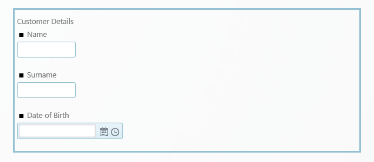

**How to create a Group Container in a Form**

The way to add a new group container would be through the add control / Group
Container options.

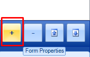

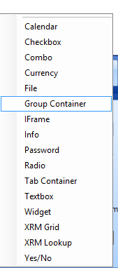

Once we added the group container to the form, we will proceed to place our
inner controls inside it. We have to position into our control and add the
desired elements right-clicking on it

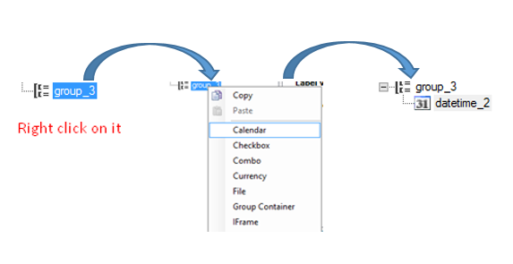

The properties for the Group Container control are:

-   **AllowAlign**:

-   If activated, the container would position inline to the other elements next
    to it.

    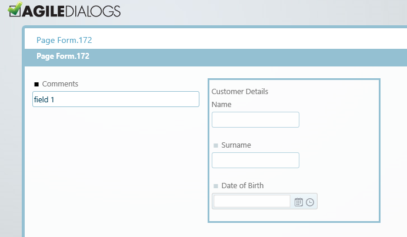

-   If set to false, the group container will be aligned as a block and will not
    allow other elements to be positioned beside it.

    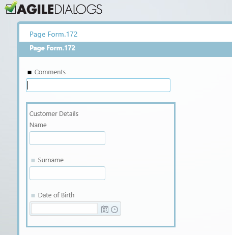

-   **ColumnSpan**: this property can be modified for the element to adjust its
    width inside the canvas, from a minimum of 1 column to a maximum of 12 (the
    actual canvas width).

-   **GroupType**: this property controls the appearance of the actual group
    container to be shown in the canvas.

    -   **None**: the group container will not have any special appearance or borders to
    separate it from the rest of the canvas elements.

    -   **FieldSet**: the group container will have a leading title and a line
        delimiter. There will be a margin between the container and the elements
        surrounding it.

        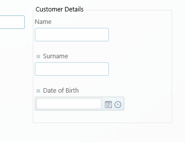

    -   **Panel**: the group container will be locked inside a thicker delimiter (title
    included). There will be a margin between the container and the elements
    surrounding it.

    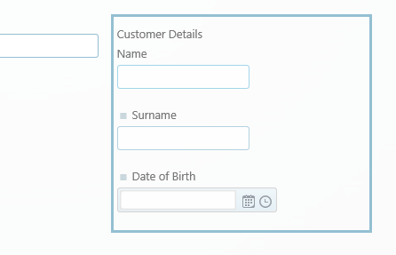

    -   **Box**: the group container will be locked inside a thin delimiter (title
    included). There **will not be** a margin between the container and the
    elements surrounding it.

    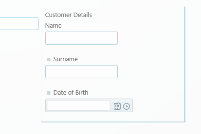

**Visible**: controls if the control is visible to the user. This can be
adjusted on runtime to improve performance or include new application
functionalities.

**Height**: Optional property. Handles the height of the Group Container (in
    pixels). Useful in cases in which there are various group containers,
    aligned horizontally, with different content, and we want them to have the
    same height for layout purposes (image below).

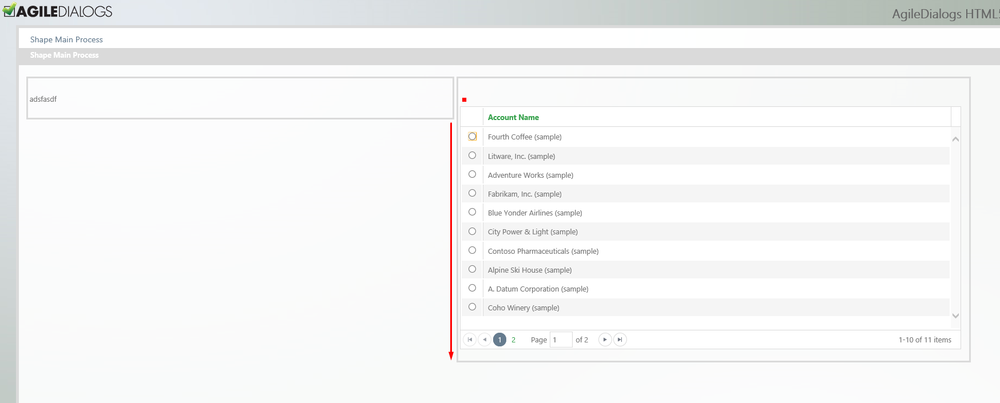

>   Figure 6. Two aligned group containers, the first one does not have the
>   height property set.

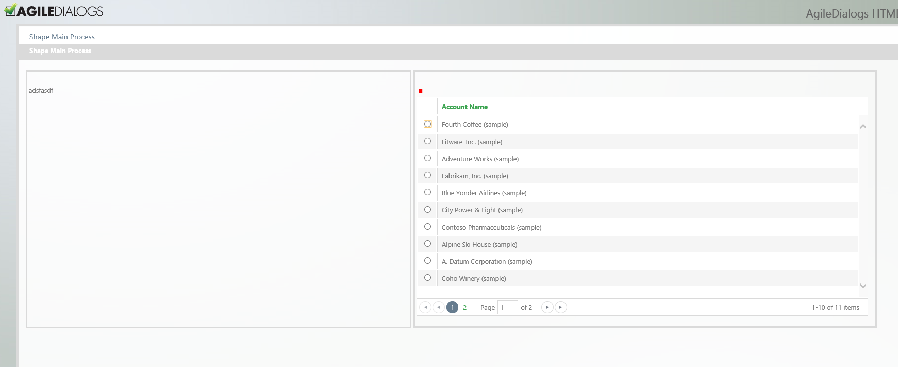

> Figure 7. "Height" property set in the first group container, to match the same
> height of the second group container
