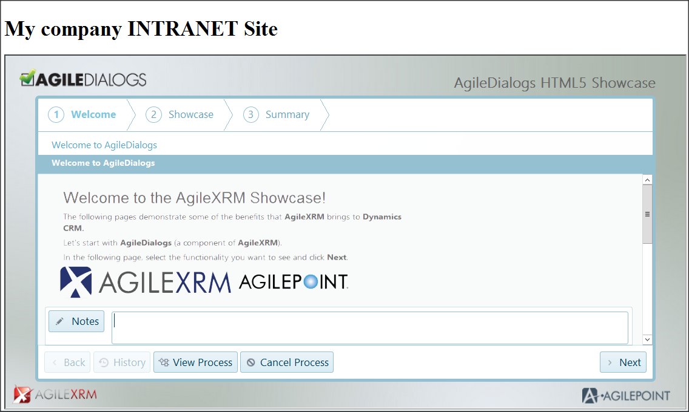
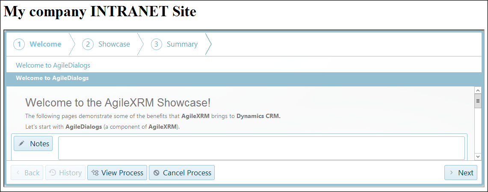
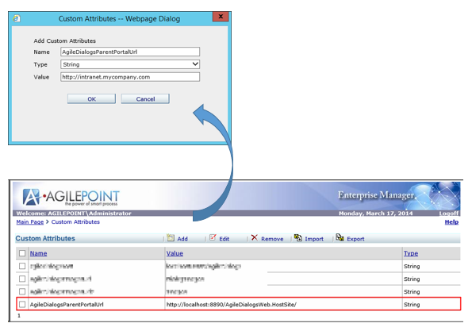
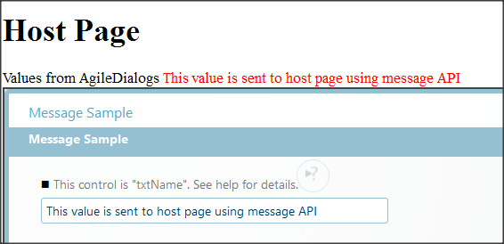
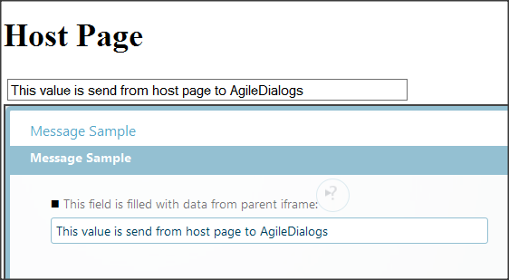

__[Home](/) --> [AgileDialogs design guide](/guides/AgileDialogs-DesignGuide.md) --> Hosting AgileDialogs inside portals__

# Hosting AgileDialogs inside a Portal

## Hosting inside an IFRAME

To host AgileDialogs inside another application like an intranet site or portal,
we need to use a standard HTML tag IFRAME.

```xml
<iframe
    id="DialogsFrame"
    src="<SERVER_URL>?orgname=<ORG_NAME>&DefaultProcessTemplate=<PROCESS_TEMPLATE>">
</iframe>
```

The following image show AgileDialogs running inside simple Intranet Site:



Use the *hosted* parameter to remove the AgileDialogs branding frame:

```xml
 <iframe
     id="DialogsFrame"
     src="<SERVER_URL>?orgname=<ORG_NAME>&DefaultProcessTemplate=<PROCESS_TEMPLATE>&hosted=1">
  </iframe>
```

The following image show AgileDialogs running inside simple Intranet Site
without branding frame:



### AgileDialogs messaging API

When AgileDialogs is running inside an IFRAME, it is possible to pass
AgileDialogs data to the host application.

To do this, we need to follow these steps:

1.  Set up Messaging in Enterprise Manager

2.  Send messages from AgileDialogs

3.  Receive message in hosting application

    1.  Set up messaging in Enterprise Manager

For security reasons, we need to first enable the messaging API to a particular
host in Enterprise Manager.

In Enterprise Manager main page click on *Shared Custom Attributes*, and create
a new string item called *AgileDialogsParentPortalUrl* and set the value to the
URL of the host site.



### Send data to host site from AgileDialogs

To send data to the host use the *DialogsEngine*.*postMessage* method:

```javascript
DialogsEngine.postMessage(<MESSAGE_KEY>, <MESSAGE>);
```

Where:

-   **Message Key**, is a literal to help identify the message in the host

-   **Message**, is the message we want to send. It accepts literales, arrays
    and JSON objects

On the receiving side, the host page that contains the AgileDialogs IFRAME,
should subscribe to the *message*:

```javascript
 window.addEventListener("message", <HANDLER>);
```

Where:

-   **Handler**, is a javascript functiona that processes the data sent from
    AgileDialogs. This function receives an *event* parameter, which is a string
    convertible to JSON with following info:

    -   **message**: contains the value of *MessageKey* set when sending the
        message

    -   **params**: contains the value of *Message* set when sending the message

Example 1:

AgileDialogs OnLoadScript code:

```javascript
DialogsEngine.postMessage("notificationKey", "The value to send");
```

Host page code:

```javascript
 window.addEventListener("message", function (event) {
     // use JSON.parse(event.data) if not jQuery
     var dialogData = $.parseJSON(event.data);
     switch (dialogData.message) {
        case "notificationKey":
          window.alert(dialogData.params);
          break;
        default: // sample purpose!
          window.alert("No listener for message:" + dialogData.message);
          break;
    }
 });
```

Example 2:

Send the value of a control called *txtName* to the host, when its value
changes.

AgileDialogs OnLoadScript code:

```javascript
 DialogsEngine.addChangeEventHandler("txtName", function (value,display) {
    DialogsEngine.postMessage("txtNameChange", value);
 });
```

Host page code:

```javascript
 window.addEventListener("message", function (event) {
     // use JSON.parse(event.data) if not jQuery
     var dialogData = $.parseJSON(event.data);
     switch (dialogData.message) {
         case "txtNameChange":
            // use getElementById if not jQuery
            // page requires a <div id="log" /> tag
            $("\#log").html(dialogData.params);
            break;
        default: // sample purpose!
            window.alert("No listener->" + dialogData.message);
            break;
    }
});
```



### Receive data from host site

Also is possible to receive data from the host site, using the
*DialogsEngine.postMesssage* with a function, using a third parameter:

```javascript
 DialogsEngine.postMessage(<MESSAGE_KEY>, <MESSAGE>, <CALLBACK>);
```

Where:

-   **Message Key**, is a literal to help identify the message in the host

-   **Message**, is the message we want to send. It accepts literales, arrays
    and JSON objects

-   **Callback,** function handler to manage received data from host site

To send data we need to set the *notify* property of event parameter and call
the *postMessage* method of the IFRAME object.

Example:

AgileDialogs receive values from the host page.

AgileDialogs OnLoadScript code:

```javascript
 // this sample shows the returned data in textControl
 DialogsEngine.postMessage("receiveDataKey", "", function (data) {
    DialogsEngine.setSelectedValue("textControl", data);
 });
```

Host page code:

```javascript
  window.addEventListener("message", function (event) {
      // use JSON.parse(event.data) if not jQuery
      var dialogData = $.parseJSON(event.data);
      switch (dialogData.message) {
           case "receiveDataKey":
              // Set notify property to send data back to AgileDialogs 
              dialogData.notify = "This data is from host page";
              // Get the IFRAME object 
              var iframe = document.getElementsByTagName('iframe')[0];
              // Send the message to AgileDialogs 
              iframe.contentWindow.postMessage(JSON.stringify(dialogData), dialogData.source);
              break;
           default:
              window.alert("No listener->" + dialogData.message);
              break;

      }
  });
```


