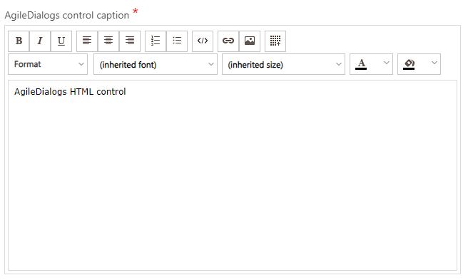

# HTML Control

**[Home](/) --> [AgileDialogs design guide](/guides/AgileDialogs-DesignGuide.md) --> HTML Control**

---

## HTML Control properties

- **StorePlainText**: This property defines if the plain text of HTML should be stored in display variable.
- **StoreStyle**: This property defines if the CSS should be stored together with the HTML. Activate this property if you plan to send the content of the control via email..
- **EmailTemplate**: This property allows us to establish an email template as a default value, so that the user can modify it in execution.
- **Lines**: This property defines the height of the control based on the number of lines.

---

## Common properties

- [AgileDialogs control common properties](ControlCommonProperties.md)

---

## Disclaimer of warranty

[Disclaimer of warranty](DisclaimerOfWarranty.md)
