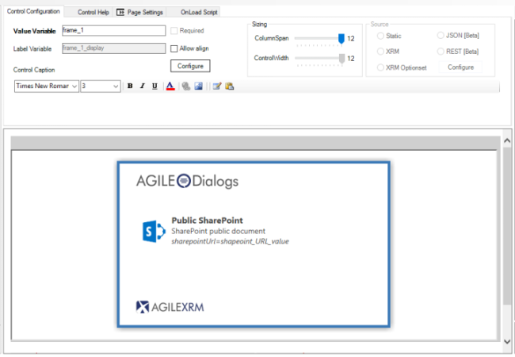
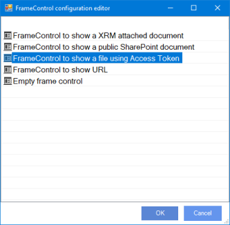
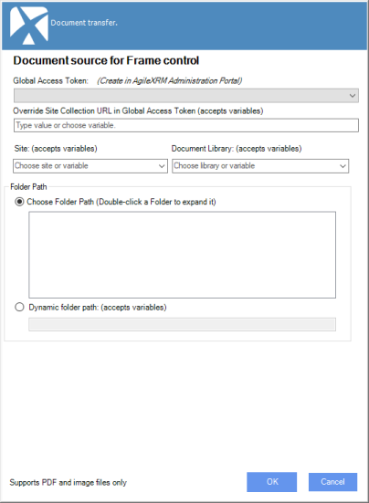
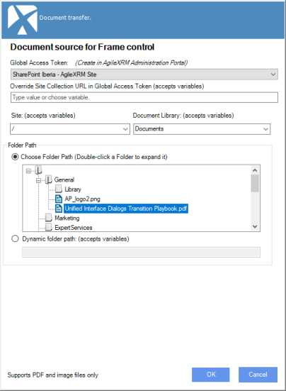
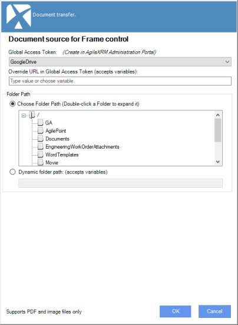

# IFrame

**[Home](/) --> [AgileDialogs Design Guide](/guides/AgileDialogs-DesignGuide.md) --> IFrame**

---

This control allows to show an external web page, file or application inside the AgileDialogs page. Very useful for information purposes, we could attach to our dialog some webpage embedded inside an IFrame, shown along with the rest of the Page Form controls.

> Figure H: Example of a request form with two input textboxes, and an IFrame attached below them, showing a custom URL designed by the process modeler.

If we want to /add a new IFrame to our form, we would follow these steps:

- Press the plus button, and chose to attach the **IFrame** control inside our
    Page Form canvas.

  

- Afterwards, Click on **Configure** to select the IFrame Type we want to build;
    a popup menu will come up:

  

There are these types of IFrame to be configured:

- FrameControl to show a **XRM attached document**.
- FrameControl to show a **public SharePoint document**.
- FrameControl to show a **file using Access Token**.
- FrameControl to show a **URL**.
- FrameControl to show the **Content of variable**.
- FrameControl to show **JSON Value**.
- FrameControl to show **XML Value**.
- FrameControl to show a **Empty Iframe**.

## Show a XRM attached file

To show a XRM attached document: We want the IFrame to show a document content in our Page (an image, internal pdf...). If we choose this option (clicking OK), AgileDialogs will ask us for the process variable which will feed the IFrame inner content, **this variable should contains the document ID in XRM platform**  

> Supported files types are: Jpeg and Png images, text and pdf formats.*

Once the value is selected, the IFrame will be shown in the Canvas View of the modeler:

If we check on the control property grid, we could notice that the needed details are automatically filled in for us; The *QueryString* and *URL* properties get configured values to show the content (important: do not modify these).

After finishing the configuration customization and publish the process template, we'll see the
document content inside our IFrame on the Dialog execution.

> Figure J. Showing IFrame content (a PDF document within the Dialog)

## Show a public SharePoint document

To show a public SharePoint document choose this option from available configurations, AgileDialogs will ask us for the process variable which will feed the IFrame inner content, **this variable must contains the SharePoint document URL**.

Once the value is selected, the IFrame will be shown in the Canvas View of the
modeler:

> Supported files types are: Jpeg and Png images, text and pdf formats.

> Important: This option only is valid for public sharepoint sites.
>
> If you need to show a file stored in a private SharePoint server you must use an Access Token as will be described below.

**Tip: Store the URL of SharePoint site as Shared Custom attribute.**

---

## Show a file using Access Token

To show a file using a Access Token, choose the "FrameControl to show a **file using Access Token**" option from configuration window.

Once the option is selected a new window is shown to choose the document source system. Each source system is represented as an icon, choose it an accept.

> Disabled icons means that there is no any Access Token defined. Global AccessToken must be created from Administration Portal.

Once document source is selected, the next screen allows to select the document to be shown. Can choose an static document or dynamic one. A dynamic path to document means that we use **AgileXRM** process variables to define the path to document.

To end configure the control we must provide these data:

- **Global Access Token**: The access token to use to retrieve the document. Choose one available Global Access Token from dropdown.
  > For ShapePoint, Global Access Token must be defined with *SiteCollection* URL. We can override the site collection URL value at runtime with an **AgileXRM** variable.
  > Leave the field empty to use the URL value defined in Global Access Token.
  
- **Site**: This option is only available if document source is SharePoint. Indicates the SharePoint site. Also can use **AgileXRM** variables.
- **Library**: This option is only available if document source is SharePoint. Indicates the SharePoint library. Also can use **AgileXRM** variables.
- **Path**: The document path. Could be an static or dynamic path value.  
For static paths, we can use the folder viewer to show the content of selected folder.
  
  

  When document source is diferent to SharePoint, site and library fields are not needed.

  

---

## Show a URL

Obviously, we can show the content of an URL, choose the "FrameControl to show a URL" option from configuration window.

AgileDialogs will ask us for the process variable which will feed the IFrame inner content by the same way of previous options.

> **Important:** Some sites does not allow render its contents within an IFrame.
> For these cases we can configure IFrame control as external as described below.

---

## Other properties

There are various ways to show the IFrame, as it will be explained next.

The properties for the IFrame control are:

- **Mode:** Frame control can render its contents in three different ways:
  - **Embedded:** Default value. The IFrame will be shown inside the main container canvas, being
    in the same browser as the main process flow.  

  

  - **Window:** The IFrame will be shown as a new window outside the container
    canvas.  

  
    > Keep in mind that when IFrame control is shown as Window, the user can close it anytime. In this case the Frame control its rendered in the container canvas as a link to allow user to open it again.

  - **External:** external window outside the container canvas. The default behavior of this window will not allow the user to interact with the main window as it is going to remain locked until our external dialog has been closed.  

  

    > Keep in mind that when IFrame control is shown as Window, the user can close it anytime. In this case the Frame control its rendered in the container canvas as a link to allow user to open it again.

- **AutoLoad**: If activated, it will launch the IFrame on the Form loading
    process. If false, the IFrame will wait for a triggering event (click on a
    button/link) to launch the IFrame content.

    > This property can be used with "Window" and "External" modes.
    >**Important**: if *Mode* is set to *embedded*, this property will not be
    able to toggle to *false*, as this mode makes the IFrame load on the page
    initialization by default.

- **LauncherMode:** When IFrame control is rendered with "Window" or "External" modes, the content will shown inside a window and user can close it anytime. For this case, IFrame control provides a launcher to open it again. This property defines if Frame control will render a link or button as launcher to open the window.
  - *Button.* A button interface is placed to launch the IFrame.  
  

  - *-Link.* A link interface is placed to launch the IFrame.  
  

    > This property can be used with "Window" and "External" modes.
    >
    > **Important:** If *Mode* is set to *embebbed*, the property *LauncherMode* will have no effect, because there will be no user interaction for loading such IFrame content.

- **LauncherText**: Allows personalize the text within the launcher.

- **ModalWindow**: If set to *true*, the user will not be allowed to press any
    option or button in the parent window, until the modal window is closed. If
    set to *false*, the new opened window would be independent to its *parent*,
    and will permit the process flow to keep going if the user desires to, no
    matter if the modal window is still opened.

- **URL**: Address of the web page to insert in the IFrame. Needs to be
    absolute and valid URL:  
    e.g.: <http://mysite.com/myresource.aspx>
  > This property is filled automatically by configuration wizard.

- **QueryString**: set of parameters to be sent to the IFrame web page who is
    responsible to deal with them accordingly. Given a case in which we are
    having an IFrame that requires two values passed by querystring, we should
    type those *namevariable=valuevariable* separated by **&**. The IFrame mechanism
    will do the rest (no need to type the **?** character to separate such
    querystring, as you would normally do typing the whole URL).
    > This property is filled automatically by configuration wizard.

- **Width:** The width of control. Can be any valid expression or a number (in this case pixel is used as unit)
    >   500px, 85% , 100em ... are valid values for Width property.

- **Height**: The height of control. Can be any valid expression or a number (in this case pixel is used as unit)
    >   500px, 85% , 100em ... are valid values for Height property.

- **ShowContentInHistory**: Sets if IFrame content is rendered in History view.

---

## Common properties

- [AgileDialogs control common properties](ControlCommonProperties.md)

---

## Disclaimer of warranty

[Disclaimer of warranty](DisclaimerOfWarranty.md)
