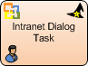
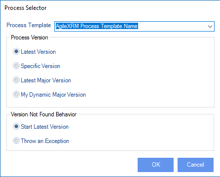

# Intranet Dialog Task

**[Home](/) --> [AgileDialogs design guide](/guides/AgileDialogs-DesignGuide.md) --> Intranet Dialog Task**

---

> **NOTE**: This activity can only be used in an **AgileXRM** process template. It
cannot be used in AgileDialogs templates.

The activity creates a CRM Process Task that is completed when the Dialog is completed. The **AgileXRM** process will continue when the dialog is completed. If the dialog is canceled, a process variable called *DialogCanceled* is set to *true.* This variable can be used to take decisions in the process.

The dialog can be consumed by non-CRM users from say SharePoint or other portal.

---

## Configuration

The configuration is the same as the **AgileXRM** Manual Task shape; the only difference is that there is a *Dialog* property instead of a *Form* property.

---

### Dialog property

The dialog to be executed by the user is selected using **Dialog** property:

| **Property** | Description |
|---|---|
| **Process Template** | Select which dialog to run, from the list of AgileDialogs already deployed to the Process Engine |
| **Latest Version** | The latest version of the SubDialog will be used at runtime |
| **Specific Version (\*)** | The selected version will always be used |
| **Latest Major Version (\*)** | The highest minor version of the selected major version is used |
| **My Dynamic Major Version (\*)** | The same as Latest Major Version but the major version number is the calling dialog's Major Version |
| **Start Latest Version (if not found)** | This configures the behavior of the shape if the version setting above is one of the ones with an (\*) and that version does not exist at runtime. In the case it will behave as if Latest Version was selected |
| **Throw an exception (if not found)** | This configures the behavior of the shape if the version setting above is one of the ones with an (\*) and that version does not exist at runtime. In the case it will make the shape throw an Exception (i.e. process hangs in this shape until the problem is remedied) |

---

### InParameters property

The dialog can receive input parameter from the calling process. These
parameters can be either static values or dynamic values using the
`${variable}` syntax.

---

### OutParameters property

This configuration is used to set context variables in calling process from
values gathered in the dialog.

The *Name* column contains the name of the variable to create in calling process and *Dialog Variable* column contains the name of the variable in dialog to get value from.

---

## Disclaimer of warranty

[Disclaimer of warranty](DisclaimerOfWarranty.md)
