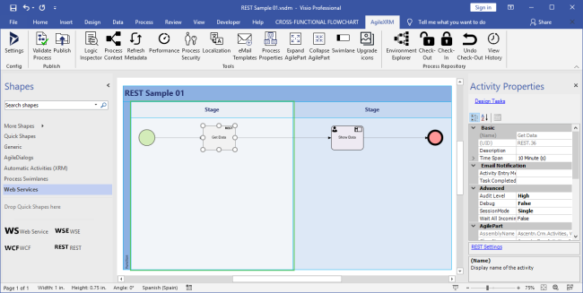
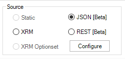
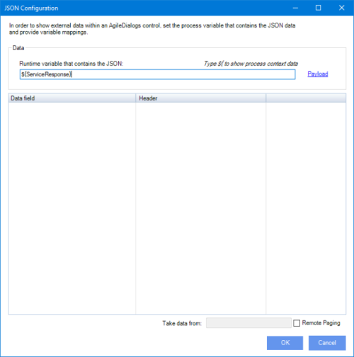
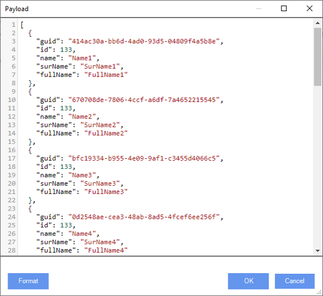
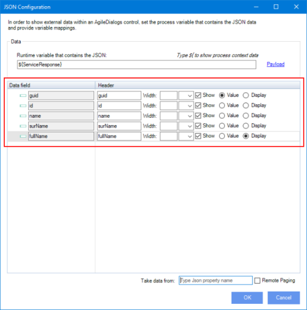
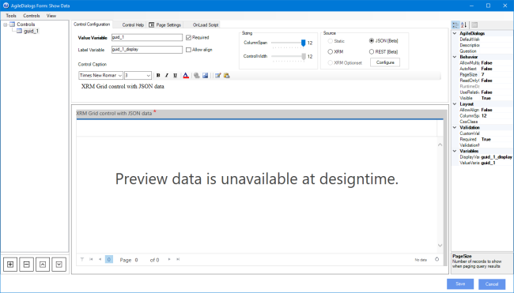
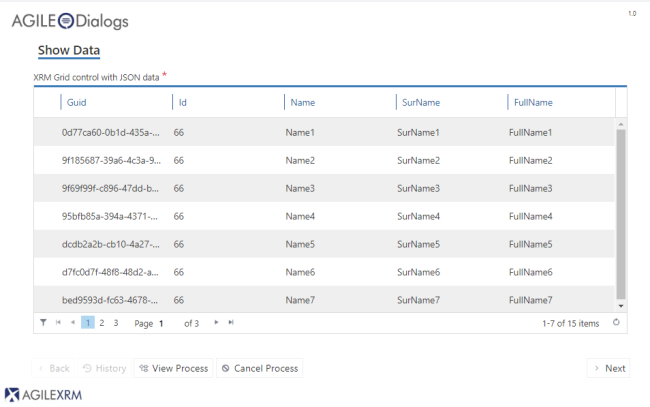
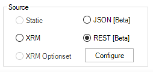
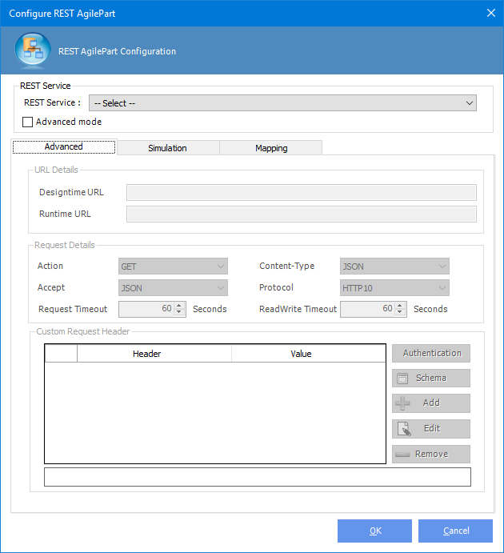

# Show JSON data in AgileDialogs

**[Home](/) --> [AgileDialogs design guide](/guides/AgileDialogs-DesignGuide.md) --> JSON Data in AgileDialogs**

--- 
AgileDialogs allows show JSON data from **AgileXRM** variable or REST calls within AgileDialogs Controls.

These controls are compatible with this feature:

- Grid Control
- Lookup Control
- Search Control

We can get data from existing JSON data (**AgileXRM** variable) or REST call (REST Shape)

## Show data from JSON data

This option allows show JSON data from an **AgileXRM** variable. This use case is usually a REST shape which stores the service response in the **AgileXRM** variable, but we can get that JSON data by any other way (JSON value can comes from a XRM field, etc ).

Process model should be similar to this:

- A step to store the JSON data in **AgileXRM** variable (usually REST shape).Check [REST Shape](../../ref/REST.md) configuration if needed.
- An AgileDialogs Page Form with compatible control (Grid) to consume the data.

  

Configure the AgileDialogs Grid Control by this way:

  Under Source group, choose the JSON option and click `Configure` button:  

  

  Configuration window is shown. First of all we need provide the runtime variable that contains the JSON value.

  

  Next, we should provide the expected JSON Payload (structure). Click `Payload` link and set the Payload value.

  
  > Service Payload must be provided by the service owner

  Once Payload is provided, configuration window populates the columns information. We can customize the column header, width and visibility.

  

  Click `Ok` button to finish control configuration. Form editor must looks similar to this:

  
  > AgileDialogs preview is not available for this configuration

Publish and execute the AgileDialgs process.

AgileDialogs shows the data as expected.

---

## Show data from REST call

AgileDialogs can performs a inline REST call to fill controls with the response data.

Configure the AgileDialogs Grid Control by this way:

  Under Source group, choose the REST option and click `Configure` button:  

  

  REST configuration window is shown. Configure it as any REST shape.

  
  > Check [REST Shape](../../ref/REST.md) if needed.

---

## Related

- [REST Shape](../../ref/REST.md)
- [External Data](../../ref/common/ExternalData.md)

---

## Disclaimer of warranty

[Disclaimer of warranty](DisclaimerOfWarranty.md)
