# JavaScript Extensions (OnLoadScript)

**[Home](/) --> [AgileDialogs design guide](/guides/AgileDialogs-DesignGuide.md) --> Javascript Extensions**

---

Process modeler can add JavaScript code in order to extend AgileDialogs default behavior.

AgileDialogs page includes a reference to jQuery 1.9, so jQuery can be used while adding code to AgileDialogs.

To add code to a Dialog click *On Load Script* in AgileDialogs form window:

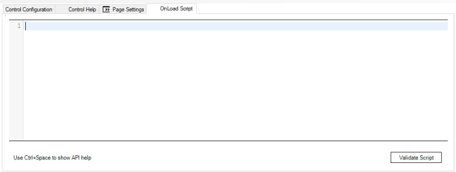

When the current form has a script set, the tab item shows an icon to indicate
this.

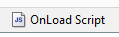

Doing so the script editor is opened to include custom code:

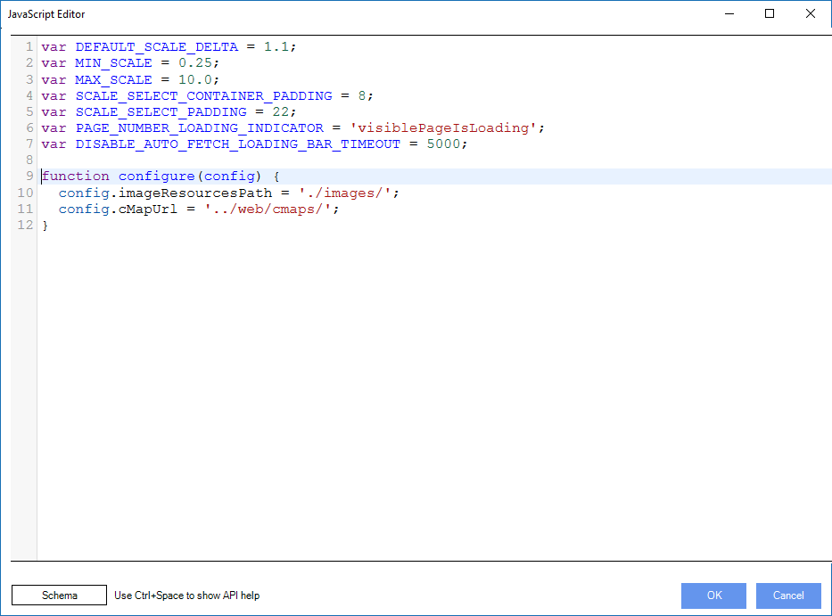

The code included in this window is executed after the form has been loaded in
the client.

---

## Using context variables in OnLoadScript

The values selected in other pages by the user can be accessed using the values
of customs attributes directly in OnLoadScript:

```javascript
 var contextValue = "${attrName}";
 // user code ...
```

---

### Get Control Value

To get a control's value, use this code:

```javascript
DialogsEngine.getSelectedValue(<controlName>);
```

> Where:  
> **controlName** is the value of `ValueVariable` parameter in the target control.

If the control is mapped to data (for instance in a Grid control), this
method will return the value of the column that is mapped to the Value Variable.

---

### Get Display Value

To get a control's display value, use this code:

```javascript
DialogsEngine.getDisplayValue(<controlName>);
```

> Where:  
> **controlName** is the value of `ValueVariable` parameter in the target control.

If the control is mapped to data (for instance in a Grid control), this
method will return the value of the column that is mapped to the Display
Variable.

---

### Get and set question label

To get a control's label, use this code:

```javascript
DialogsEngine.getLabel(<controlName>);
```

> Where:  
> **controlName** is the value of `ValueVariable` parameter in the target control.

To set a control's label, use this code:

```javascript
DialogsEngine.setLabel(<controlName>, <value>);
```

> Where:  
> **controlName** is the value of `ValueVariable` parameter in the target control.  
> **value** is the value to set in control´s question label. Value can be a literal string or HTML content as string.

---

### Change Control Value

To change a control's value, use this code:

```javascript
DialogsEngine.setSelectedValue(<controlName>, <newValue>);
```

> Where:  
> **controlName** is the value of `ValueVariable` parameter in the target control.  
> **newValue** is the value to set.

---

### Check if a control is read-only

Through the API, it is possible to check if a control is set to read-only or
editable.

This would be the method to use:

```javascript
DialogsEngine.isReadOnly(<control>);
```

> Where:  
> **control**, is the control that we want to check

Returns *true* or *false*, depending on the read-only property of the control

---

### Toggle a control read-only property

The Engine API allows us to modify the read-only property of a control at
Runtime.

In order to perform this, this code should be added:

```javascript
DialogsEngine.setReadOnly(<control>,<value>);
```

> Where:  
> **control**, meaning the control we want to modify.  
> **value**, *true* to convert the control to read-only, *false* otherwise.

---

### Enable/disable a control

To enable/disable a control, use this code:

```javascript
DialogsEngine.disable(<controlName>); // Disable

DialogsEngine.enable(<controlName>); // Enable
```

> Where:  
> **controlName** is the value of `ValueVariable` parameter in the target control.

Also, we can use the setEnabled method as such:

```javascript
   DialogsEngine.setEnabled(<controlName>, <isEnabled>);
```

> Where:  
> **controlName** is the value of `ValueVariable` parameter in the target control.  
> **isEnabled** Boolean value, true to enable control, false to disable control.

If a control is disabled, its validation event is not fired. So say, it is
Required or has a RegEx, these will not be executed and are ignored.

---

### Hide/Show controls

To hide or show a control and its caption, add this code:

```javascript
   DialogsEngine.setVisible(<controlName>, <isVisible>);
```

> Where:  
> **controlName** is the value of `ValueVariable` parameter in the target control.  
> **isVisible** Boolean value, true to show control, false to Hide control.

If a control is hidden, its validation event is not fired. So say, it is
Required or has a RegEx, these will not be executed and are ignored.

---

### Subscribe to control value changes

In order to manage value changes in a control this code must be added:

```javascript

    DialogsEngine.addChangeEventHandler(<controlName>, function (value,display){
        // user code ...
    });
```

> Where:  
> **controlName** is the value of `ValueVariable` parameter in the target control.

### Add options to a selection control

To add an option to a combo, radio or checkbox control, add this code:

```javascript
 DialogsEngine.addOption(<controlName>, <newOptionDisplay>,<newOptionValue>, <index>);
```

> Where:  
> **controlName** is the value of `ValueVariable` parameter in the target control.  
> **newOptionDisplay** is the display value of the new option.  
> **newOptionValue** is the value of the new option.  
> **index** is the list index in which we want to add the new value.

The new item would be shown on screen immediately (picture below):

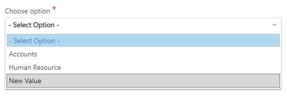

Examples:

```javascript
/* Adds a new option to "option_1" control */
DialogsEngine.addOption("option_1", "New Value","NV");
```

```javascript
/* Adds a new option to "option_1" control at the first psotion in the list */
DialogsEngine.addOption("option_1", "New Value","NV", 0);
```

---

### Remove options from a selection control

To remove an option from a combo, radio or checkbox control, add this code:

```javascript
DialogsEngine.removeOption(<controlName>, <optionValue>);
```

> Where:  
> **controlName** is the value of `ValueVariable` parameter in the target control.  
> **optionValue** is the value of the option to remove.

---

### Inter-Control dependency

A control's value can depend on the value of other control(s) by registering it
as such:

```javascript
DialogsEngine.register("sourceComboControl", "targetComboControl");
```

> Where:  
> **sourceComboControl** is the name of the control that triggers the change.  
> **targetComboControl** is the name if the subcribed control.

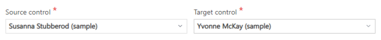

Optionally, we can specify a callback function to execute:

Example: Add an option to the target combo control when register invoke ends:

```javascript
DialogsEngine.register("sourceComboControl", "targetComboControl",
    function (source, target){
        DialogsEngine.addOption(target, "-- Choose value --", "");
        DialogsEngine.setSelectedValue(target, "");
});

```

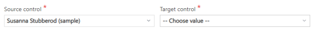

> **Important**: Use of the *register* method implies an http(s) call to the
AgileDialogs server.

> **Note**: If the source control allows multiple selections (checkbox, XRM Grid), the query in the target control should cater for it using operator IN or NOT IN.

---

### Check if a control has a value

Through the API, it is also possible to know if a control to be filled in has
already a value in runtime. The method to do so would be the following one:

```javascript
DialogsEngine.hasValue(<control>);
```

> Where:  
> **control** is a control that can contain a value at runtime.  

> Returns:  
> **true** if the control is filled in with a value, **false** otherwise.

---

### Add custom validation for a single control

JavaScript code can be added to validate control values. To do that subscribe to
form validation event and the event handler will be called when the validation
is performed by AgileDialogs engine.

If validation is not OK return a string with the message that will be presented
to the user. Successful validations must return an empty string.

In order to subscribe to validation events add this code:

```javascript
   DialogsEngine.addCustomValidation( <key>,<control>, <function>,<message>);
```

> Where:  
> **Key**, is the validation key, can be any a unique string to identify the validation.  
> **Control**, is the value of `ValueVariable` parameter in the target control to apply the custom validation.  
> **handler**, is the function with the validation. If validation fails, this function must return a non empty string. If validation success, return an empty string.  
> **Message** [Optional],  is the error message to be show if validation fail. If this parameter is ommited, the return of `handler` parameter will shown as error message.

Example:

```javascript
  // add custom validation to control called textControl
 
  DialogsEngine.addCustomValidation(  
      "key1",  
      "textControl",  
      function (controlname, value, display){  
        if (value.length > 5 ) return "error"  
      },  
      "Value cannot be longer that 5");
```

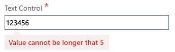

Also, we can return a localized string with the custom validation error message. To do this, first we must configure the CustomValidationMessage property of the control and use the location mechanism of AgileDialogs.  
Once the property is configured and localized, we can use the DialogsEngine.getCustomValidationMessage (*controlname*) method to return the localized message.

```javascript
   DialogsEngine.getCustomValidationMessage(<controlname>);
```

```javascript
  // add custom validation to control called textControl
 
  DialogsEngine.addCustomValidation(  
     "key1",  
     "textControl",  
     function (controlname, value, display){  
       if (value.length > 5 ) {
        return DialogsEngine.getCustomValidationMessage(controlname);
        }
     });
```

---

### Add validation extensions for all controls in the page

You can add code to validate control values. To do that subscribe to form
validation event and the event handler will be called when the validation is
performed by AgileDialogs engine.

If validation is not OK return a string with the message that will be presented
to the user.

In order to subscribe to validation events add this code:

```javascript
  // add validation to control called textControl
 
  function myValidationFunction(controlName, controValue){  
      if(controlName == "textControl"){ 
          // Add your validation logic  
          return "This value is not valid";  
      }  
  }  
  validationHandler.addHandler(myValidationFunction);
```

*addHandler* method will add a handler to be called when controls are validated
by AgileDialogs Runtime Engine. The method added (in this sample
myValidationFunction) will receive 2 parameters:

> Where:  
> **controlName**: Name of the control to be validated.  
> **controValue**: Current value of the control.  

To show a validation message the validation function should return a string
message.

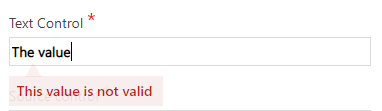

---

### Apply format to control

To apply custom format to a control use this code:

```javascript
 DialogsEngine.applyFormat(<controlName>,<format>);
```

> Where:  
> **controlName** is the value of `ValueVariable` parameter in the target control.
> **format** is the format to apply to control. Can be:  
> \- Valid JSON object. See <http://api.jquery.com/css/>  
> \- CSS rule (the CSS rule must exists, see customization Guide).

Example:

```javascript
// apply custom format to currency control called currencyControl

var theFormat = {  
    "color":"white", // css-property : value  
    "background-color": "red" // css-property : value  
};  
DialogsEngine.applyFormat("currencyControl", theFormat);
```

Which will show as such at runtime:

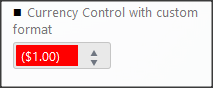

**Note**: See [Customization Guide](../AgileDialogs-CustomizationGuide.md)

### Apply conditional format to a control

To apply conditional format to a control add a change handler as such:

Example:

```javascript
// apply contitional format to textcontrol
// depending on the value of a combo

var conditionalFormat = function (value, display){
    var format = { "color" : (value == "M" ? "blue" : "pink") };
    DialogsEngine.applyFormat("textControl", format)
};

DialogsEngine.addChangeEventHandler("gender", conditionalFormat );
```

Runtime:

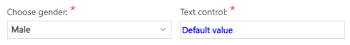
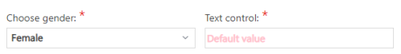

---

### Show/Hide Notes control

This is different to .toggleNotes() in the way that it hides the control
totally, not just collapse it:

```javascript
DialogsEngine.setNotesVisible(<value>);
```

> Where:  
> **value**, *true* if we want the *notes* tab to be shown, *false* otherwise.

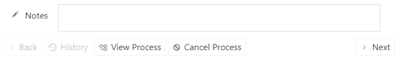

---

### Collapse/Expand Notes control

Use to expand or collapse the Notes control using this code:

```javascript
 DialogsEngine.toggleNotes();
```

---

### Get Notes content

To get content of the Notes programmatically.

In order to do so, this code should be added:

```javascript
 var myNotes = DialogsEngine.getNotes();
```

---

### Append Notes content

To append to the content of the Notes programmatically.

In order to do so, this code should be added:

```javascript
  DialogsEngine.appendNotes(<notes>);
```

> Where:  
> **notes**, stands for the literal we want to add to the note.

``` javascript
DialogsEngine.appendNotes("Add this to my notes");
```

---

### Set Notes content

To set content of the Notes programmatically.

In order to do so, this code should be added:

```javascript
  DialogsEngine.setNotes(<notes>);
```

> Where:  
> **notes**, stands for the literal we want to add as a note.

```javascript
DialogsEngine.setNotes('New Notes added to our form');
```

> Output:  
> 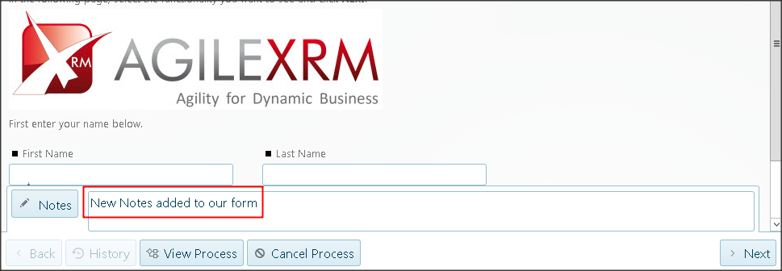

---

### Show a message window

To show a simple message window to user we need to use this code:

```javascript
 DialogsEngine.message(<title>, <message>);
```

> Where:  
> **title** is the title of message window.
> **message** is the content of message window.

Example:

```javascript
 DialogsEngine.message("The title", "The message body");
```

> Output:  
>
> 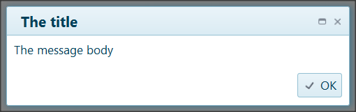

---

#### Show a formatted message window

To show a formatted message, use this code.

```javascript
 var theMessage = "This is the message.<a href='\#'>This is a link</a>";  
 DialogsEngine.message("The title", theMessage);
```

> Output:  
>
>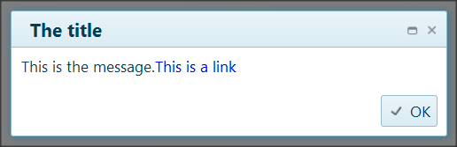

---

### Enable/Disable the **You are leaving the Page** warning message

By default, if the user navigates away from the Page they would get a warning
message.

This warning can be disabled using:

```javascript
  DialogsEngine.disableBeforeUnloadScript();
```

And re-enabled using:

```javascript
 DialogsEngine.enableBeforeUnloadScript();
```

---

### Global validations

The Engine can be personalized and extended similar to the way that the visual
aspects can be customized and extended.

It is recommended to use objects to encapsulate functions.

Example:

```javascript
 var myCompanyUtils = {
     reverse: function (input) {
        return input.split("").reverse().join("");
     }
 }
```

> **Important**: Errors in the custom code can cause the whole application to
fail, given the way javascript works.  
> **Errors in user custom code are NOT supported**.  
> **Modifications to the DOM are NOT supported**.  

Once our code is in this file, we can use the *OnLoadScript* event to invoke our
custom functionality:

```javascript
 DialogsEngine.addChangeEventHandler("text1", function (value, display){
     DialogsEngine.message("Reverse works", myCompanyUtils.reverse(value));
 });
```

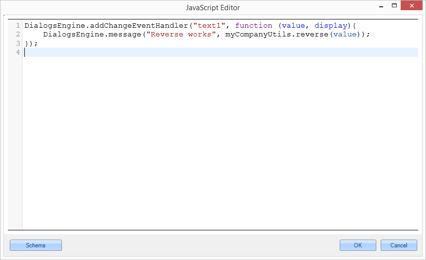

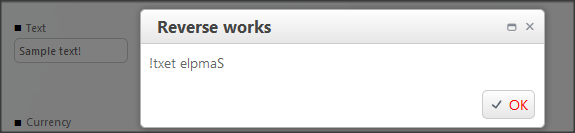

---

<!--
### Load external resources

AgileDialogs provides a mechansim to load external resources using the
*requires* library *(*<http://requirejs.org> *)*.

DialogsEngine has a wrapper around this libaray and provides the function
*requiere*.

-->


<!--
### Load javascript files

AgileDialogs allows dynamically loading external javascript files using
*DialogsEngine.require* method.

```javascript
 DialogsEngine.require(<RESOURCES>);
```

Where:

-   **Resources** is an array of the resources that we want to load

The file(s) should exist somewhere under the Scripts directory in the
AgileDialogs site (you can create a subdirectory under Scripts to hold your
custom files). Please note that loading external files (external to the
AgileDialogs site) are not supported.

```javascript
 DialogsEngine.require(["Scripts/01.jsfile"]);
```

Note that the .js file extension should not be added.

It is possible to include multiple files this way:

```javascript
 DialogsEngine.require(["Scripts/01.jsfile","Scripts/02.jsfile" ]);
```

The files are loaded asynchronously and a callback function can be called upon
finishing the loading:

```javascript
  DialogsEngine.require(["Scripts/01.jsfile"], function (){
 
  // your code here
 
  });
```

Example:

In this example we have created a new file called *01.jsfile.js* which contains
the definition of the function *Foo.* Using *DialogsEngine.require()* we are
loading this file and calling the *hello* method of *Foo.*

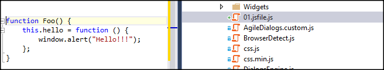

OnLoadScript code:

```javascript
 DialogsEngine.require(["Scripts/01.jsfile"], function () {
 
    new Foo().hello();
 
 });
```

-->


<!--
### Load CSS files

CSS files can be loaded in a similar way to javascript files, except that we
need to add a prefix of *css!* to the resource and the files should be hosted
somewhere under the CSS directory in the AgileDialogs site.

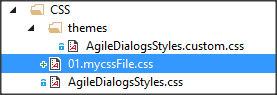

Example:

```javascript
 DialogsEngine.require(["Scripts/01.jsfile", "css!CSS/01.mycssFile"],
 
     function () {
 
        new Foo().hello();
 
     });
```

-->

<!--

### Get Dialog Context (for use in custom Widgets) 

Another way to get the values selected in other pages by the user is by using
the *getDialogContext()* method:

```javascript
DialogsEngine.getDialogContext("variable");
```

Where:

-   variable, stands for the context variable value that we want to know of.

Example (we want to know the value of a system context variable called
*dialogRootCulture* that displays the current environment language):

```javascript
DialogsEngine.getDialogContextValue('dialogRootCulture');
```

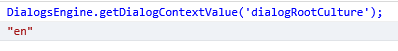

We can also pass a set of variables to this method in order to get all their
values, instead of a single variable.

It is possible to toggle the availability of getDialogContext and
getDialogContextValue commands through the application configuration file
web.config, modifying the following value to *true* or *false* according to our
needs:

```xml
<add key="EnableGetDialogsContextMethod" value="false|true"></add>
```

-->

### Enable / Disable a control for validation requirement

In a form, we have the possibility of setting a control as required. This means
that, when moving to the next stage of our defined process, we will be stopped
by the application if that control does not have its default value filled in.

However, we can customize this feature on runtime using the method setRequired.

In order to toggle on/off our required control validation, this code should be
added:

```javascript
 DialogsEngine.setRequired(<control>, <value>, <message>);
```

> Where:  
> **control**, stands for the control id that we want to customize.  
> **value**, true in case we want the control to be required or false in the
    opposite case.  
> **message** is the error message to be shown to request the user to fill in the
    required value for the control.  

```javascript
 // enable validation to control called textbox_1
 
 DialogsEngine.setRequired("textbox_1", true, "A default value is required for this field");
```

> Output:
>
> 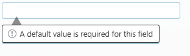

In the opposite case (setting the value to false) we would not need to set any
message, so we can leave out the *message* parameter from the function:

```javascript
DialogsEngine.setRequired("textbox_1",false);
```

---

### Set a regular expression in a control to be validated

We also can set an advanced validation pattern on our controls in order to
control the correct format or our fields' content.

In order to perform the advanced control validation, this code should be added:

```javascript
 DialogsEngine.setRegularExpression(<control>, <regularExpression>, <message>);
```

> Where:  
> **control**, stands for the control id that we want to customize.  
> **regularExpression**, string that conforms the regular expression.  
> **message** is the error message to be shown to request the user to fill in the
    required value for the control.  

Example (we are setting a text field to be validated as an US phone number):

```javascript
DialogsEngine.setRegularExpression(  
    "textbox_1", 
    "\^(\\([0-9]{3}\\)\|[0-9]{3}-)[0-9]{3}-[0-9]{4}\$",  
    "You should enter a valid U.S. phone number");
```

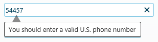

---

### Arrange a custom set of actions before every navigation callback

We could want the application to perform a custom set of actions or message
before every callback (e.g. everytime we press *next* to move from a process
stage to another we could want to show a predefined message to the user, etc.)

In order to perform this set of actions, we can define a custom function with
our desired commands / steps, loading this predefined method onto the **OnLoad
Script**:

```javascript
DialogsEngine.beforeNavigate(<function>);
```

> Where:  
> **function**, stands for the function that we want to pass as a parameter. This
    anonymous function will contain the commands to be performed before every
    navigation inside the process.

Example (we want to show an informative message to the user everytime we press
*next* on our form and move forward inside the main process flow):

```javascript
DialogsEngine.beforeNavigate(function () {
    window.alert ('Form process finished. Moving to the next step...');
});
```

---

<!--

### Add custom handler at the initial Form Load

We could need to perform special actions on our application due to special needs
or requirements when the page is loaded. For that reason, the Engine method
*addInitHandler* would be useful to that purpose.

In order to perform this, this code should be added:

```javascript
   DialogsEngine.addInitHanlder(<function>);
```

> Where:
>-   *function*, stands for the function which will contain the routine or custom
    functionality that we want to add our process. This function gets an object
    parameter that has the organization name, the current culture , the process
    template name and an object with the localized string resource of the
    application.

>   Example:

```javascript
DialogsEngine.addInitHandler(function (data) {

    /* This code changes the default title for validation error window */
    data.resources.validations.validationFailsTitle = "My title";

});
```

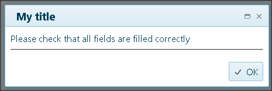

-->

### Set custom variables or methods for the initial Form Load

We could probably need to set some special variables or methods that we want on
our application due to special needs or requirements. For that reason, the
Engine method *addStartHandler* would be useful to that purpose.

In order to perform this, this code should be added:

```javascript
   DialogsEngine.addStartHanlder(<function>);
```

> Where:  
> **function**, stands for the anonymous function which will contain the routine
    or custom functionality that we want to add our process.

Things are going to be clearer using one example. For this example, we need to
load a logo URL that will be placed on a form inside our process, inside an
element already created and called *logoContainer*. For that goal, we already
have a defined variable that contains the URL address:

```javascript
 DialogsEngine.addStartHandler(function () {

    // Accesing the already created variable, containing the logo url
    var url =DialogsEngine.getDialogContextValue("logoBaseUrl");

    // now we are setting our image to be shown on our container "logoContainer",
    // on the initial loading of the page.
    $("#logoContainer").css("background-image", "url(" + url + ")");

   });
```

---

### Arrange a new *Description* literal for our controls

If we want to add or update a previous tooltip description that is being shown
when positioning on a page control, we can do so by using the predefined engine
method *setDescription*.

```javascript
   DialogsEngine.setDescription(<control>,<description_value>);
```

> Where:  
> **control**, is the control that we want to modify
> **description_value**, is the new message that we want for our control to be
    shown when changing the focus on it.

```javascript
    DialogsEngine.setDescription("text_2","this is the new description");
```

> Output  
>  
> 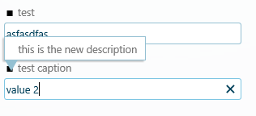

---

### Set a watermark literal inside our text controls

The Dialogs Engine gives us the possibility of setting a description watermark
to help the process users to identify the text inputs functionality.

To do so, this code should be added:

```javascript
DialogsEngine.setWatermark(<control>, <literal>);
```

> Where:  
> **control**, stands for the control id that we want to customize.  
> **literal**, string that conforms the literal we want to appear on the control  

Example (we are setting a description text to be shown on a textbox called
*text_1* :

```javascript
DialogsEngine.setWatermark("text_1", "Enter address");
```

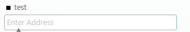

---

### Find out if a control exists

There is an Engine method for checking if a control exists, passing its Id as a
parameter. We will be receiving a *true* value in case it exists, *false*
otherwise.

To do so, this code should be added:

```javascript
DialogsEngine.exists(<control>);
```

> Where:  
> **control**, stands for the id of the control we want to look for.

> Returns:  
> **true** if the control exists, *false* otherwise.  

---

### Change the text of the *Next* button

If we want to change the text of the predefined *Next* button inside a form
(picture below), we have a method using the Engine that covers that
functionality.

```javascript
DialogsEngine.setNextButtonText(<value>);
```

> Where:  
> **value**, text that we want to set as the caption for the *next* button.  
>  
> 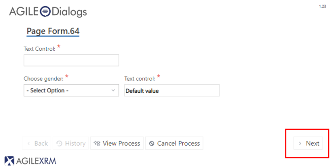

The result will be immediately updated on AgileDialogs *Next* button, showing
the new caption:

```javascript
DialogsEngine.setNextButtonText("Click To Continue");
```

> Output:  
>  
> 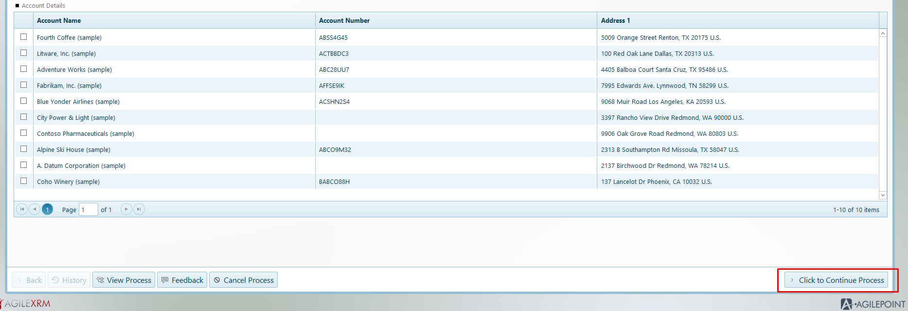

---

### Change the text of the *Back* button

If we want to change the text of the predefined *Back* button inside a form
(picture below), we have a method using the Engine that covers that
functionality.

```xml
DialogsEngine.setBackButtonText(<value>);
```

> Where:  
> **value**, text that we want to set as the caption for the *back* button.  
>  
> 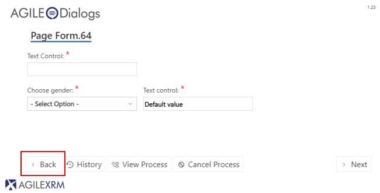

The result will be immediately updated on AgileDialogs *Next* button, showing
the new caption:

```javascript
DialogsEngine.setBackButtonText("Click To Back");
```

> Output  
> 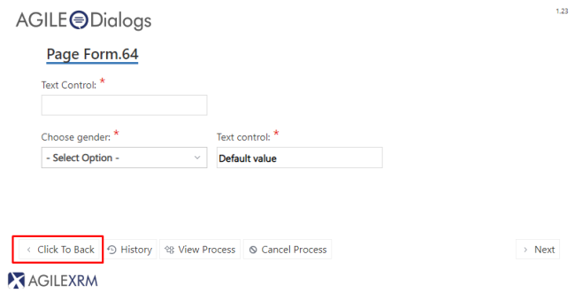

---

### Disable / Enable the Form navigation buttons and commands

Sometimes, could be useful to make the user wait in a form, until a certain set
of information or requirements have been satisfied (getting data from a service,
perform some custom validations, etc...). For that goal, the API engine has two
methods available for enabling / disabling the predefined Form buttons (*Back*,
*History*, *Next*...). It also disables the keyboard commands that perform the
same functionalities.

In order to disable them:

```javascript
DialogsEngine.off();
```

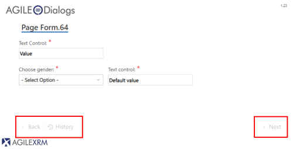

It has an immediate effect over the buttons. To get the opposite effect, the
engine command is:

```javascript
DialogsEngine.on();
```

---

### Moving forward and backwards

In a defined process, we could move through its different stages using the
*Next* and *Back* buttons. But we also can achieve the same results
programmatically, using the DialogsEngine API.

In order to do so, this code should be added:

```javascript
   DialogsEngine.next(); //moves forward to the next Page in our dialog
   DialogsEngine.back(); //moves backwards to the previous Page in our dialog
```

---

### Get all the data of the selected Control

In complex controls (like a Grid), we could want to get all the information
about the item or items (if any) that we have selected. There is a way to do
that using DialogsEngine API (meant to be used against Grid controls):

```xml
 DialogsEngine.getSelectedDataItem(<control>);
```

> Where:  
> **control**, stands for the control id that we want to collect the selected data from.  
> 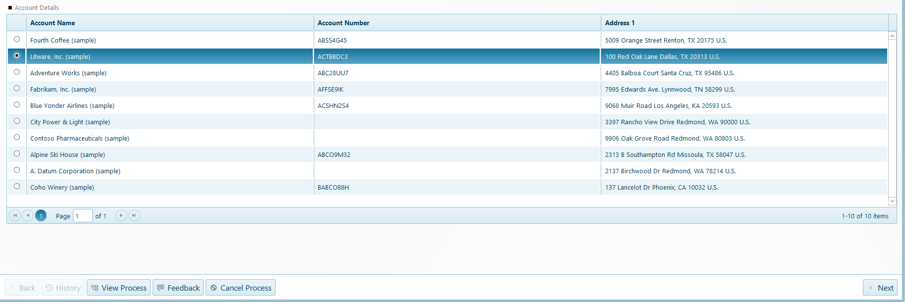

```javascript
/* we want to know all the inner details about the selected item chosen by the user, 
inside a grid called guid_1 */
var result = DialogsEngine.getSelectedDataItem("guid_1");
console.log(result);
```

Console will show us all the details about the selected row as JSON object.

``` json
{
  "accountid":"{DC0DFC69-9654-E911-822F-00505637DF91}",
  "name":"Coho Winery (sample)",
  "accountnumber":"BABCO88H"
}
```

In case we have a Grid with its *AllowMultipleSelection* property set to
*true,* we would also receive all the needed details for each selected row
(**Important**: only for the current grid page being shown on screen):

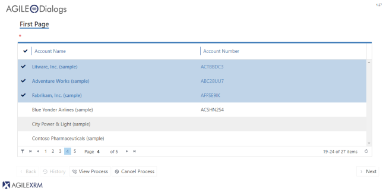

``` json
[
 {
   "accountid": "{CC0DFC69-9654-E911-822F-00505637DF91}",
   "name": "Litware, Inc. (sample)",
   "accountnumber": "ACTBBDC3"
 },
 {
   "accountid": "{CE0DFC69-9654-E911-822F-00505637DF91}",
   "name": "Adventure Works (sample)",
   "accountnumber": "ABC28UU7"
 },
 {
   "accountid": "{D00DFC69-9654-E911-822F-00505637DF91}",
   "name": "Fabrikam, Inc. (sample)",
   "accountnumber": "AFFSE9IK"
 }
]
```

In case no row is selected, we will receive a *null* as the return value.

---

### Set focus in a specific control

To set the focus in a specific control we should use this method:

```javascript
   DialogsEngine.setFocus(<control>);
```

> Where:  
> **control** is the value of ValueVariable property of control.

---

### Check if a control is required

In Design-time, we can configure if the controls inside a form are required to
be completed before moving on to the next process stage. We also can know, in
runtime, if a certain control is required or not, using the following API
method:

```javascript
  DialogsEngine.isRequired(<control>);
```

> Where:  
>**control** is the name of the control at runtime we want to know about.

> Returns:  
> **true** if the control is required, **false** otherwise.

### Show/hide page spinner

To show/hide the page spinner, use this code:

```javascript
   DialogsEngine.spinner(<value>);
```

> Where:  
> **value** is a *true/false* expression. Use true to show the spinner and false
    to hide it.  

> Output:  
> 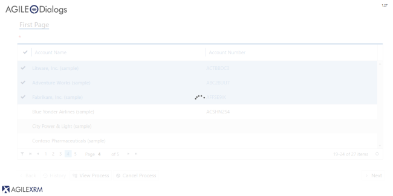

---

### Change the required fields default validation message for customized messages

When the user moves through the AgileDialogs forms sequence, the AgileDialogs
runtime engine configures automatically some validation messages that pop up in
case some required field has not been filled in (images below).

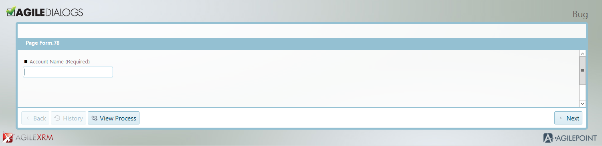

Figure 12. A required textbox is not filled in before pressing "Next"

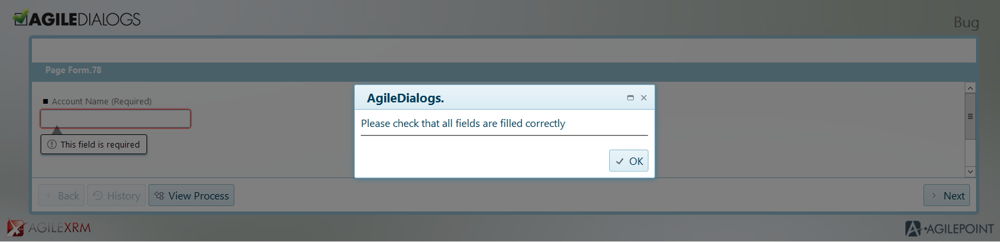

Figure 13. Default message shown when the required fields have not been filled
in.

If we are interested in personalize the information message, we can customize it
by following the steps detailed below.

AgileDialogs API contains two properties that can be tailored in order to change
the message title and the message body contents. If we want to change these
information for a particular page, we should:

Open AgileDialogs Designer, and click on **OnLoad Script**.

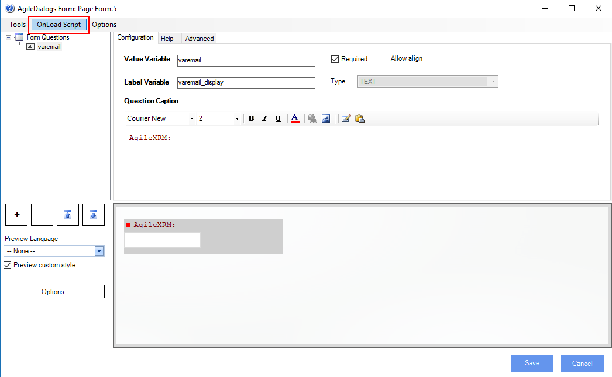

Manipulate the properties described below to change the messages:

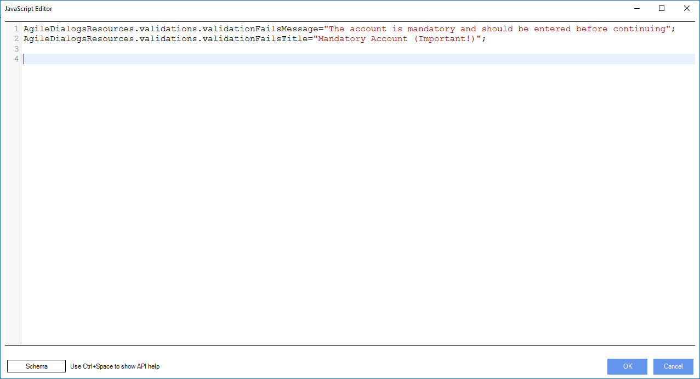

Once published, the page will show the desired messages when needed:

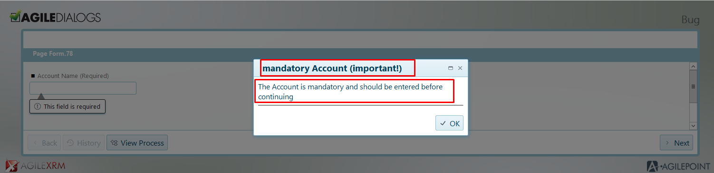

---

### Create customized confirmation messages associated to events

Inside a Page form, sometimes it is necessary to warn or inform the user about
the consequences of an action (choosing an item inside a combo, pressing a
button, selecting a Grid's element), moreover, if the information to show has to
be specific, we need a method to perform that task. For that goal, use this
code:

```xml
   DialogsEngine.confirm(<title>,<message>,<confirmFunc>,<cancelFunc>, <okButtonText>, <cancelButtonText>);
```

> Where:  
> **title** is a **mandatory** parameter. Represents the message title header that
    we want to show inside the confirm frame.  
> **message** is a **mandatory** parameter. Represents the message body that we
    want to show inside the confirm frame.  
> **confirmFunc** is a **mandatory** parameter. Represents the handler function in
    which we will group the action or actions that we want to perform when the
    user will press the **OK** button inside the confirm frame (explained in
    detail in the practical example below).  
> **cancelFunc** is an **optional** parameter. Represents the handler function in
    which we will group the action or actions that we want to perform when the
    user will press the **Cancel** button inside the confirm frame (explained in
    detail in the practical example below).  
> *okButtonText* is an **optional** parameter. Represents the text for the **OK**
    button of confirmation window.  
> **cancelButtonText** is an **optional** parameter. Represents the text for the
    **Cancel** button of confirmation window.  

Example. Let's suppose we have a Page form with a combo, which is composed of
different values. We want to configure the page in a way that will warn us if we
try to change the combo's selected value.

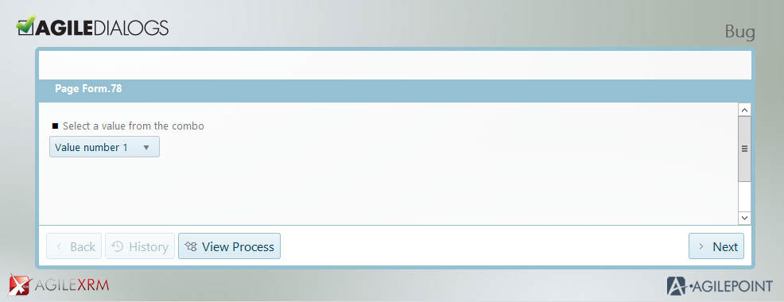

For that goal, we should open the OnLoad Task inside AgileDialogs designer, and
type the following command (image below):

```javascript
DialogsEngine.addChangeEventHandler( "combo", function (value, display){

    DialogsEngine.confirm("Warning Title", "You are about to change the default value. Are you sure?",
        function(){ window.alert("You have pressed OK")},
        function(){ window.alert("You have pressed Cancel")});

});
```

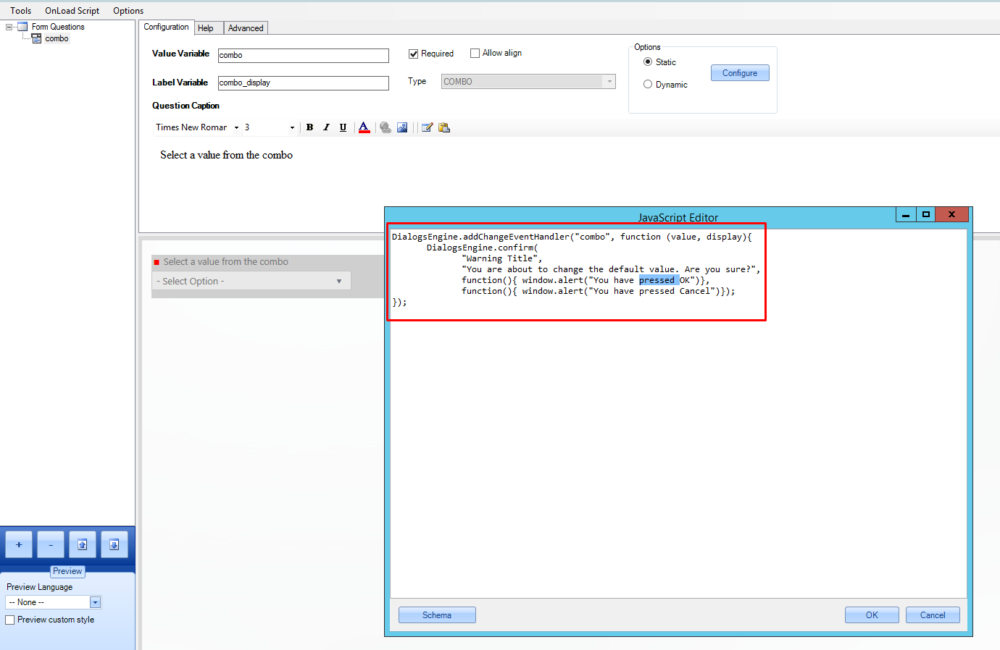

As we can see, when the combo changes its value, we have set a personalized
confirmation message, composed of the title, the customized message, the message
after the user has pressed **OK** and the analog message for the **Cancel** handler.
The result (after such changes are published) is easy to see:

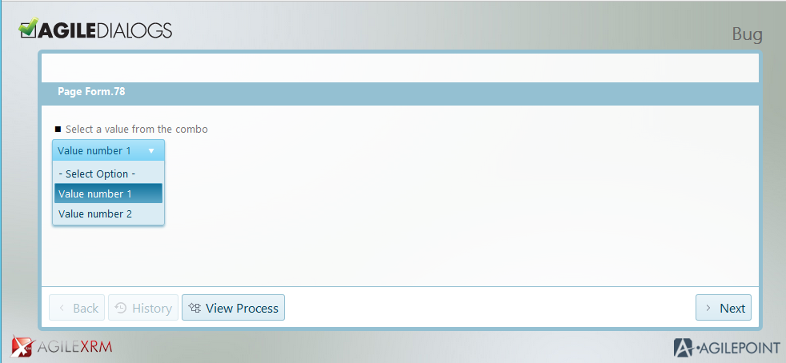

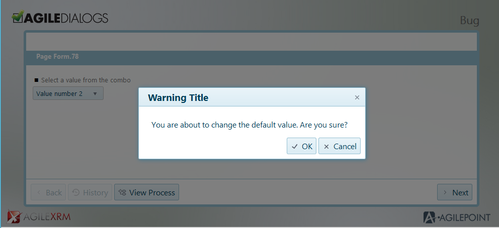

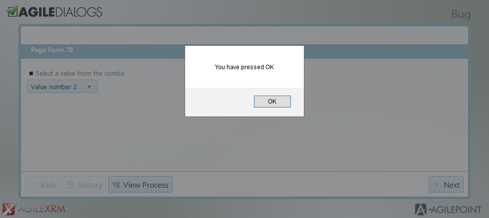

### Check if a condition is true

DialogsEngine API has a feature that allows to check if a certain condition or
property we are checking is returning a Boolean value or not. We may use this
functionality for multiple purposes, and it is simple to implement.

```javascript
   DialogsEngine.bool(<value>);
```

> Where:  
> **value** is a string literal that conforms a condition, property or value to be
    checked.  

> Returns:
> **true** if the value is true, True, TRUE or combination of upper/lowercase,
**false** otherwise.  

```javascript
DialogsEngine.bool('True');
```

---

### Check if variable contains value

DialogsEngine API has a feature that allows to check if a certain variable has value thats returns a Boolean value. We may use this
functionality to avoid check some javascript values like null and undefinied, and it is simple to implement.

```javascript
   DialogsEngine.isNullOrEmpty(<value>);
```

> Where:  
> **value** is a string literal that conforms a condition, property or value to be
    checked.  

> Returns:  
> **true** if the value has content, **false** otherwise, that is when does not have content, or its null or undefined.

```javascript
DialogsEngine.isNullOrEmpty('value');
```

---

### Enable/Disable selected data filter for Grid controls

DialogsEngine API allow to activate and disactivate the selected data filter of
Grid controls. This method will be ignored for control of any other type.

```javascript
DialogsEngine.filterSelection(<xrm_grid_control_name> , value );
```

> Where:  
> **xrm_grid_control_name** is the name of the Grid control on which we want
    activate or deactivate the filter.  
> **value** Boolean value to activate or deactivate the filter.  


```javascript
DialogsEngine.filterSelection("MyGridControl",true);
```

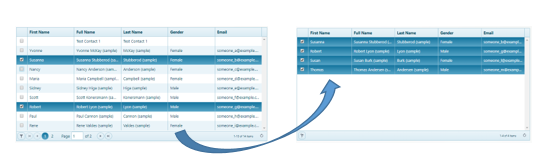

---

### Resume an unfinished previous Process

**AgileXRM** gives us the possibility of picking up a process inside our current
form, needing a unique identifier. This is really useful for continuing
unfinished processes that we need to work with and resume.

In order to perform this, this code should be added:

```javascript
DialogsEngine.resume(<unique_identifier>);
```

> Where:  
> **unique_identifier**, process identifier belonging to the actual process that
    we want to take over of, in our current flow.

Once set, we will continue through the recovered process in the exact point it
was abandoned before.

---

### Sava data explicity

By default, AgileDialgs saves all data when the "Next" button is clicked. However, sometimes we need to save the current data to continue with the work later.

```javascript
DialogsEngine.saveDialogContext(<interval>, <callback>);
```

> Where:  
> **interval**, `optional` set the interval os time to save data. This value is mesured in miliseconds. Minimum value for this param is 1500.  
> **callback**, `optional` a function to execute when data is succesfully saved.  

```javascript
/* Saves AgileDialogs data explicity, single time */
DialogsEngine.saveDialogContext();
```

```javascript
/* Saves AgileDialogs data each 5 seconds */
DialogsEngine.saveDialogContext(5000);
```

```javascript
/* Saves AgileDialogs data explicity , single time and executes a callback function */
DialogsEngine.saveDialogContext(function (){
/* your code goes here*/
});
```

```javascript
/* Saves AgileDialogs data each 5 seconds and executes a callback function */
DialogsEngine.saveDialogContext(5000, function (){
/* your code goes here*/
});
```

---

### Define min a max values for Calendar control

AgileDialgos calendar controls can define a range of valid inputs by setting minimum and maximum values. These values can by set using DialogsEngine by this way:

```javascript
DialogsEngine.setMinValue(<controlname>, <value>);
```

```javascript
DialogsEngine.setMaxValue(<controlname>, <value>);
```

> Where:  
> **controlname**, is the name of the control in which apply the expression.  
> **value**, its the value to set in controlname. Can be a valid ISO-8601 dateexpression or a date object.  

```javascript
/* set Min value */
DialogsEngine.setMaxValue("datetime_2", '2021-12-25T14:55:37Z');
```

```javascript
/* set Min value */
DialogsEngine.setMinValue("datetime_2", '2021-12-25T14:55:37Z');
```

Also, DialogsEngine API defines methods to get the configured values for `Min Value` and `Max Value`

```javascript
DialogsEngine.getMinValue(<controlname>);
```

```javascript
DialogsEngine.getMaxValue(<controlname>);
```

> Where:  
> **controlname**, is the name of the control to get the value.

By the same way, we can get thats values

```javascript
/* Get Min value */
var min = DialogsEngine.getMinValue("datetime_2");
// Return a min date expressed as ISO-8601. Example: returns '2021-12-25T14:55:37Z'
```

```javascript
/* Get Min value */
var min = DialogsEngine.getMaxValue("datetime_2");
// Return a min date expressed as ISO-8601. Example: returns '2021-12-25T14:55:37Z'
```

<!--
### Advanced Engine customizations

This use of this technique should be validated with AgileXRM before going
live.

This allows changing the behavior of at the engine level.

Such customization code would be added to the *AgileDialogs.custom.js* file in
the *Scripts* directory.

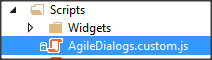

Example:

Change all text controls to convert the content to Uppercase.

```javascript
var KendoTextBoxWidgetPrototype = KendoTextBoxWidget;

function UpperCaseTextBoxWidget(widgetObjectSelector) {

    var widgetinstance = new KendoTextBoxWidgetPrototype(widgetObjectSelector);

    widgetinstance.methods.getValue = function () {

        var control = this.getControl();

        if (control.attr("type".toLowerCase()) === "text"  
        && control.prop("tagName").toLowerCase() == "input") {

            return control.val().toUpperCase();
        }
        return control.val();
    }
    return widgetinstance;
}

KendoTextBoxWidget = UpperCaseTextBoxWidget;
```
-->

---

### Deprecated functions

#### Subscribe to control value changes (Deprecated - Use addChangeEventHandler Instead)

In order to manage value changes in controls this code must be added:

```javascript
// add change handler to control called textControl

function myChangeHandler (controlName,controlValue){  
    if (controlName == "textControl"){  
        //add your logic here  
    }  
}  
fieldChangeHandler.addHandler(myChangeHandler);
```

*myChangeHandler* method will add a handler to be called when a control value is
changed. The method added (in this example: *myChangeHandler*) will receive 2
parameters:

> Where:  
> **controlName**: Name of the control to be validated.  
> **controValue**: Current value of the control.  

## Disclaimer of warranty

[Disclaimer of warranty](DisclaimerOfWarranty.md)
