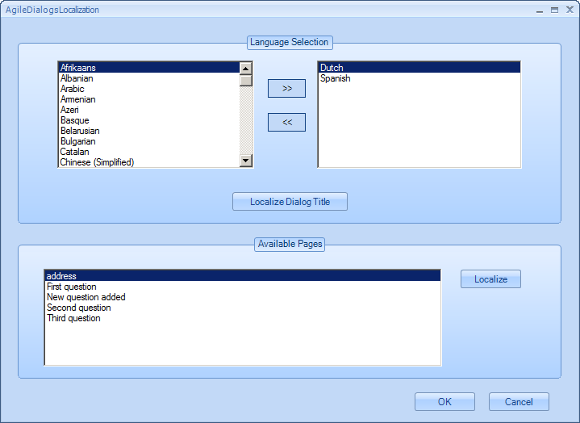
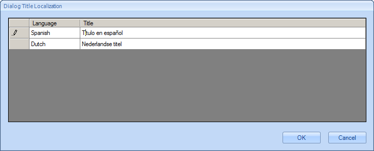
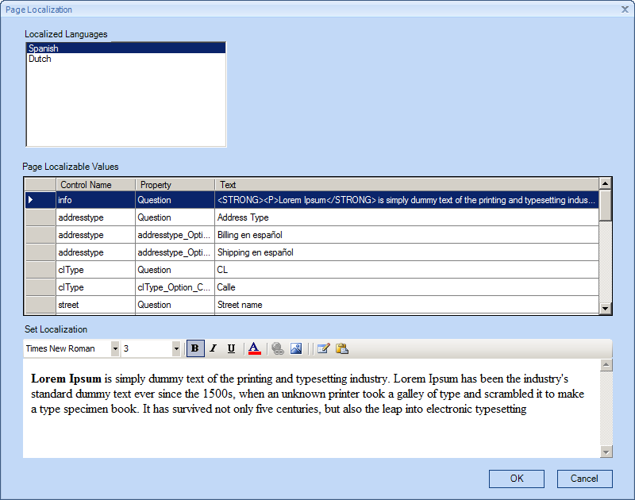
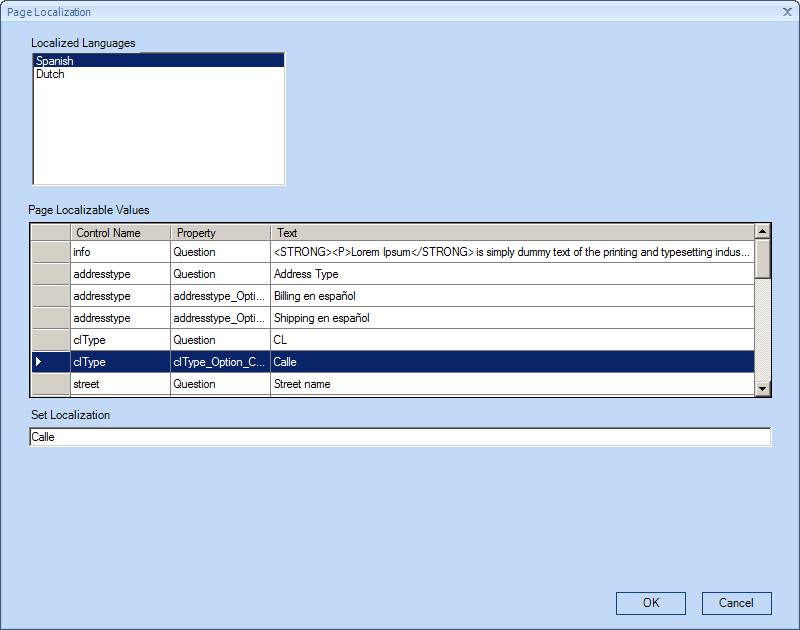
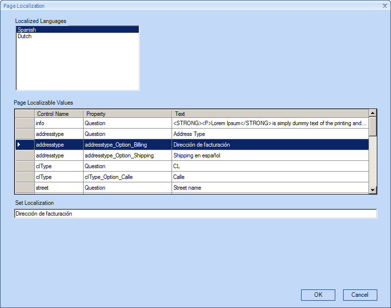
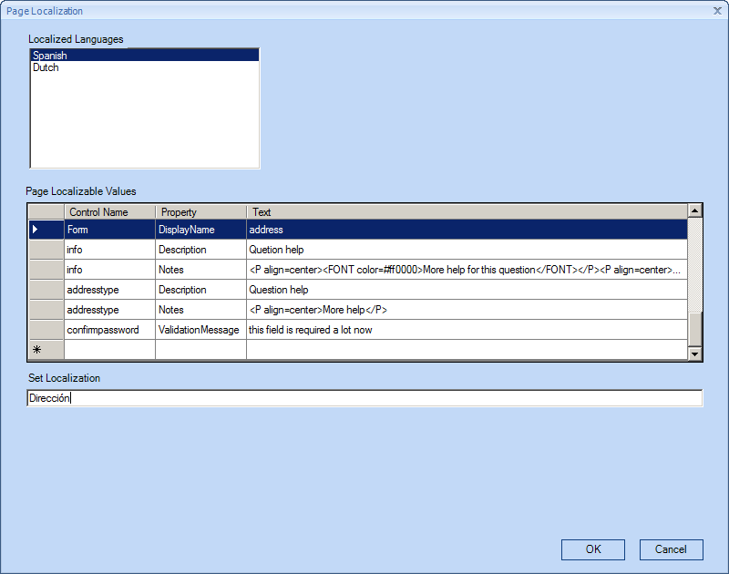

__[Home](/) --> [AgileDialogs design guide](/guides/AgileDialogs-DesignGuide.md) --> Localization__

# Localization

AgileDialogs contents can be localized in order to provide localized pages to
the end user. This way, the same dialog can be presented to different people in
different languages, avoiding the maintenance of multiple dialogs (one for each
language).

For Full Users, the language choice is based on the user's language setting in
XRM.

For Process Participants or External Users, the language choice is based on
their browser's language setting.

Also, when initiating a dialog, the lcid query string can be used to set the
desired language.

The elements that can be localized are:

-   Dialog Title
-   Page Title
-   Question Caption
-   Validation Messages
-   Display values for options, checkboxes and combos
-   Question Tip (Description) and extended Help

AgileDialogs localization is managed using Localization button in AgileXRM
ribbon:

This window allows configuring localization for all dialog pages:

In the upper part of the window, select the languages that you want to translate
the Dialog to.

Click *Localize Dialog Title* to localize the title of the Dialog to the
selected languages:

To localize the pages, select them in the list and click *Localize*:

Select each literal to translate in the list of Page Localizable Values and set
the localized values. The control to set the localized value changes depending
on the type of value, when value allows formatting the advanced editor is
presented. For simple values a textbox is presented:

This window allows the translation the display of the options for option, combo
and check boxes with static values.

To localize the title of the step select the row where Control Name column value
is *Form* and Property column value is *DisplayName*:

To set localizations for different languages, select them in the list of
*Localized Languages* and fill localization for each localizable string.

## Disclaimer of warranty

[Disclaimer of warranty](DisclaimerOfWarranty.md)

