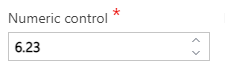

__[Home](/) --> [AgileDialogs design guide](/guides/AgileDialogs-DesignGuide.md) --> Numeric Control__

# Numeric Control

This control shows a numeric input to the user to store numeric data. This control stores an invariant numeric data in ValueVariable property and the displayed text in the DisplayVariable property.

**Decimals**: This is the number of decilmals for the control data. Only numberic values are allowed.

**MaxValue**: This is the maximum value allowed in the control data. Property accepts a valid numeric input or AgilePoint variable. 

**MinValue**: This is the minimum value allowed in the control data.
