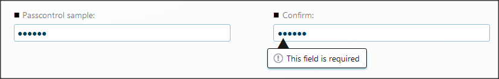

__[Home](/) --> [AgileDialogs design guide](/guides/AgileDialogs-DesignGuide.md) --> Password__

# Password control

This control is used to present a control to get passwords.

For security, these controls do not maintain their value when navigating back
and forth in the dialog Pages.

The properties for the Password control are:

-   **AssignableByCode**: If *true*, the control allows to set his value using client API.

> __Note__: To avoid security issues, it is the responsibility of the dialog designer
to clear the variable holding the password, right after it is used in the
dialog.

## Disclaimer of warranty

[Disclaimer of warranty](DisclaimerOfWarranty.md)
