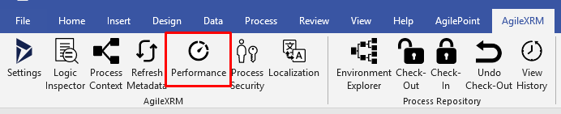
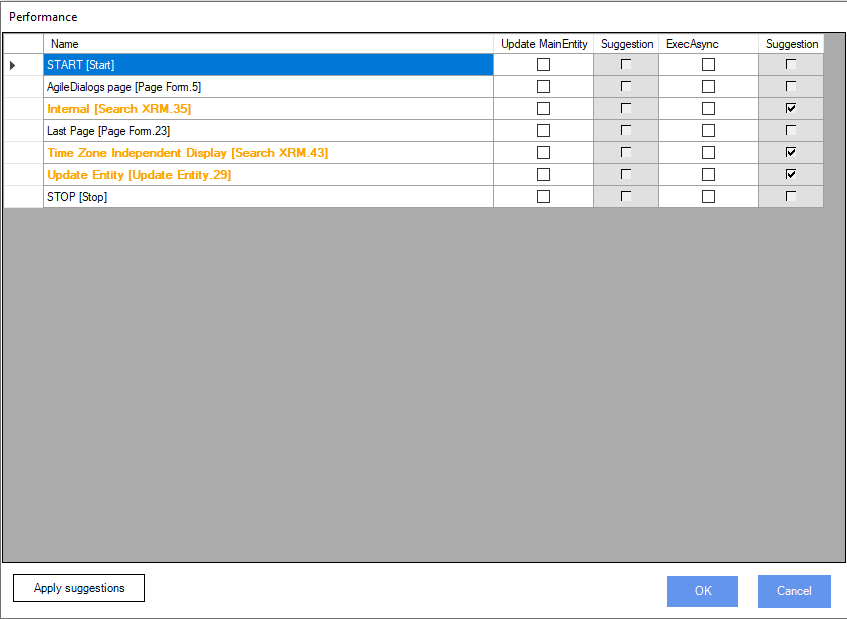

__[Home](/) --> [AgileDialogs design guide](/guides/AgileDialogs-DesignGuide.md) --> Performance Window

# Performance Window

Performance window allows process modeller user to improve the performance for **AgileXRM** and **AgileDialogs** process templates.

By default, when **AgileXRM** process has *Main Entity* defined, its needed to get the data for that entity for each activity within process model. 
This behaviour could affect **AgileXRM** performance, due of **AgileXRM** will perform a **CRM/CDS** query even when its not needed. 

By using **Performance Window** process modeller can define which activities will performs a **CRM/CDS** query and which not.

Also, when any **AgileXRM** activity is executed consumes server resources. 
When an activity invokes extenal resource the activity thread is running until the remote resource responses. Process modeller can configure this behavior using *Performance Window* in order to perform the activity work in asyncronous mode.

In order to launch perfomance window, use the *Performance* button placed on *AgileXRM* ribbon.

Once **Performace window** is shown, it shows a list of all process activities:

|Column | Description|
|----------------------------|---------------------------------|
| **Name** | Shows the activity name. When *Update MainEntity* or *Exec async* option value differs from system suggestion, the row is draw using different color.|
| **Update MainEntity** | When checked, indicates must refresh MainEntity data. This means that **AgileXRM** is going to perform a CRM FetchXML to update the data. When process does not have MainEntity cannot check this option. |
| **Suggestion** | System suggestion for *Update MainEntity* field, when **AgileXRM** detects that MainEntity data is used within activity configuration, suggestion is check the Update MainEntity option.|
| **Exec Async** | When checked, indicates that **AgileXRM** must perform the activity in asyncornous mode .|
| **Suggestion** | System suggestion for *Exec Async* field, the suggestion is check *Exec Async* option for automatic activities.|

> **Important**: System suggestion is what is, a suggestion. Process modeller must validate the system suggestion value is properly.

> **Note**: Double click in any **Performance Window** activity row selects the activity in process model diagram.
