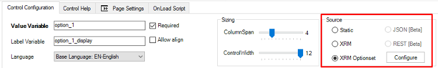
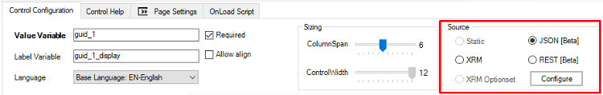
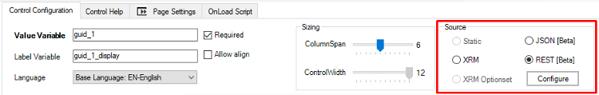

__[Home](/) --> [AgileDialogs design guide](/guides/AgileDialogs-DesignGuide.md) --> Populating Combo__

# Populating Combo, Radio-button and Checkbox controls

**AgileDialogs** controls allow populate data from diferents sources.

- **Static**: Choose this option to fill control with static values.
- **XRM**: Choose this option to fill control with XRM data.
- **XRM Optionset**: Choose this option to fill control with XRM Optionset.
- **JSON**: Choose this option to fill the control from AgileXRM variable which contains JSON.
- **REST**: Choose this option to fill the control from the response of REST service.

## Static Values

If static option is selected, the `Configure` button opens the options editor window to configure static options:

Options editor allows to create a set of data to show in **AgileDialogs** controls.

The labels and values can be variables:

And the variables used can be semicolon-separated list of values.

## XRM. Dynamic values using a XRM query

When the dynamic option is selected, the `Configure` button opens the Advanced
Find window to configure a query to get the values to be shown in the
control:

Once configuration window is shown, choose **Query** tab to define  which XRM entity we want to show data from. Obviously, also can define filters to select the appropriate data.

> These queries can have dynamic filters (e.g. show opportunities whose
Account is the value of *\${SelectedAccount}*), that is have variables on the right hand side of the operator.

The **Columns** tab is used for selecting the fields that the query is going
to return.

> Also we can use this window to define sorting expressions.

The **Variable Mapping** tab allows define mapping between XRM fields and **AgileXRM** variables:

> Choose `Value`option to indicate that XRM field value will be stored in control value variable.

> Choose `Display`option to indicate that XRM field will be stored in control display variable.

The **Test** tab can show at design-time the data that would be returned by the query.

If the query has variables, then a window is shown to set the value of the variables needed for testing.

Finally, the **Advanced** tab bot shows the resultant **FetchXML** generated by the settings
in the other tabs, as well as allows using a custom **FetchXML**, by setting the *Enable Advanced Mode* checkbox.

For custom **FetchXML**, use the `Validate FetchXML` Query button to make sure it is valid and there are no errors.

Note that an attribute called *ReturnInternalValue* is used in the XML that is not standard FetchXML, and defines if the Formatted Value/Display Value of a field is returned or the internal value (e.g. for Date, Currency,Number, OptionSet, etc. ).

> Also we can run the query within different user context using the `Run Query on behalf of CRM user`option.
### Dynamic values from an Option Set in XRM

Combo and Radio-button controls (but not Checkboxes) can be filled with values from *Option Sets* configured in XRM. 
Choose `XRM optionset` option and click `Configure`button to open the *OptionSet Selector*.

Once editor is shown, choose which entity defines the optionsets and the desired optionset.

### JSON. 

This option allows show data from **AgileXRM** variable that contains a **JSON** data.

Choose **JSON** option and use `Configure` button to show editor.

Complete the configuration as follows: [Show data from JSON data](JSONAgileDialogs.md#show-data-from-JSON-data)

### REST.

This option allows show data from a REST service response.

Choose **REST** option and use `Configure` button to show editor.

Complete the configuration as follows: [Show data from REST call](JSONAgileDialogs.md#show-data-from-rest-call)

## Disclaimer of warranty

[Disclaimer of warranty](DisclaimerOfWarranty.md)

