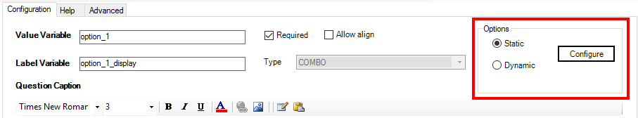
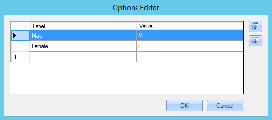
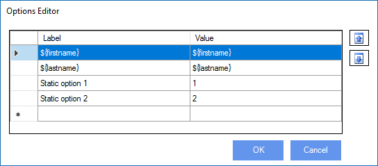
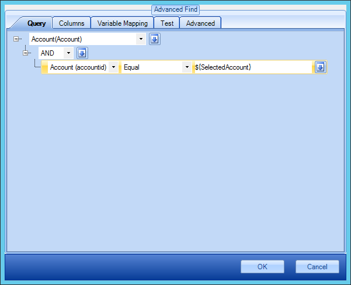
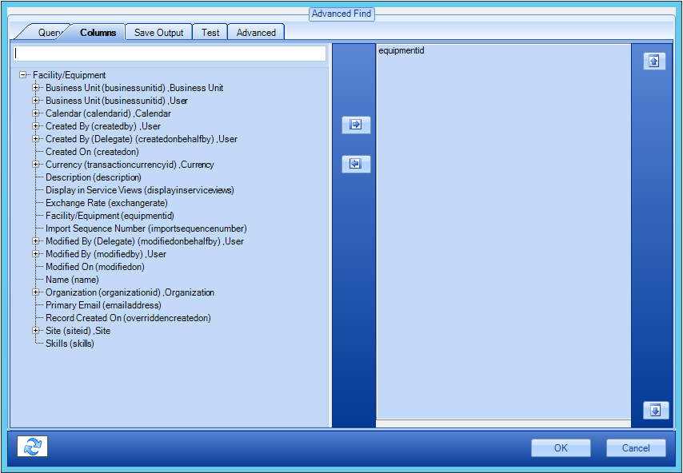
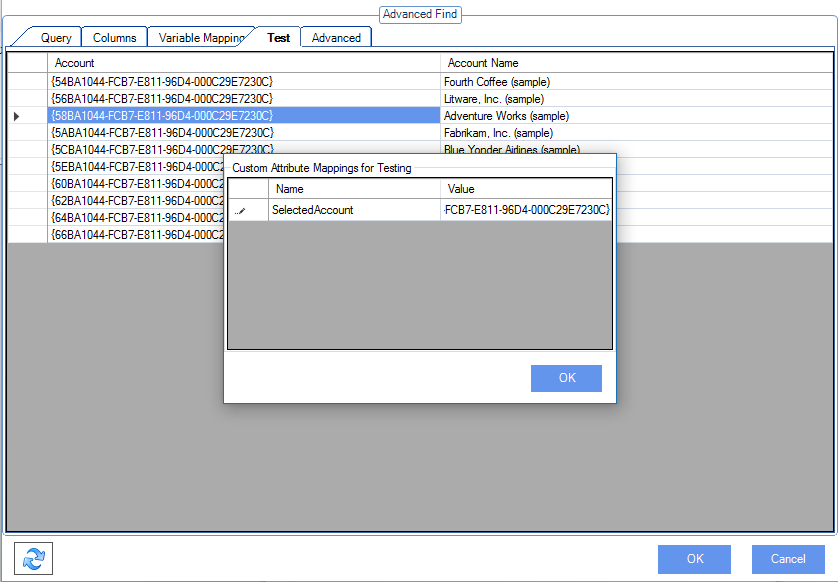
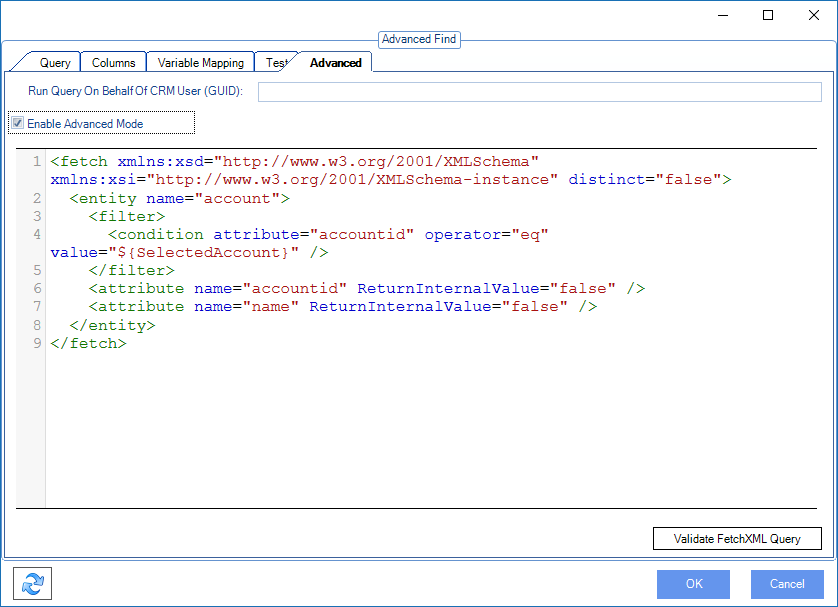
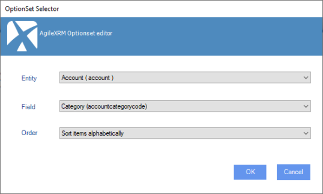

__[Home](/) --> [AgileDialogs design guide](/guides/AgileDialogs-DesignGuide.md) --> Populating Combo__

# Populating Combo, Radio-button and Checkbox controls

## Static Values

If static option is selected, the Configure button opens the options editor
window to configure static options:

The Labels/Values can be variables:

And the variables used can be semicolon-separated list of values.

## Dynamic values using a XRM query

When the dynamic option is selected, the Configure button opens the Advanced
Find window to configure a query to get the values to be shown in the
control:

These queries can have dynamic filters (e.g. show opportunities whose
Account is the value of *\${SelectedAccount}*), that is have variables on
the right hand side of the operator.

The **Columns** tab is used for selecting the fields that the query is going
to return.

The Variable Mapping tab is for mapping fields / variables:

The Test tab can show at design-time the data that would be returned by the
query.

If the query has variables, then a window is shown to set the value of the
variables needed for testing.

The Advanced tab bot shows the resultant FetchXML generated by the settings
in the other tabs, as well as allows using a custom FetchXML, by setting the
*Enable Advanced Mode* checkbox.

For custom FetchXML, use the Validate FetchXML Query button to make sure it
is valid and there are no errors.

Note that an attribute called *ReturnInternalValue* is used in the XML that
is not standard FetchXML, and defines if the Formatted Value/Display Value
of a field is returned or the internal value (e.g. for Date, Currency,
Number, OptionSet, etc. ).

### Dynamic values from an Option Set in XRM

Combo and Radio-button controls (but not Checkboxes) can be filled with values
from *Option Sets* configured in XRM. To configure this behavior go to
*Advanced* tab and configure the *FieldAndEntity* property to open the
*OptionSet Selector*, and select the Entity. This will populate the Field
drop-down which with all Fields that are of type OptionSet in the selected
Entity:

