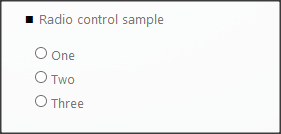
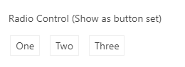
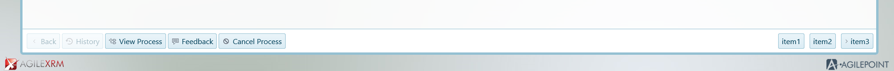
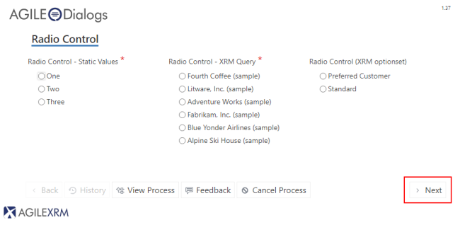

__[Home](/) --> [AgileDialogs design guide](/guides/AgileDialogs-DesignGuide.md) --> Radio__
# Radio control

This control is used to show a set of options to the user and allows selecting
only one of them.

These values can be:

-   Static
-   Dynamic

This control can also be used show a set of Action buttons. By clicking the
resultant buttons, the user has in effect selected the option and clicked the
*Next* button. In order to activate this behavior, set the *ShowAsButtonSet*
property to *true*. This action also disables the standard *Next* button:

The **ShowAsButtonSet** property (set to *true*) changes the items behavior,
from being shown as radio options, as buttons. If this behavior is set to
*true*, we can also activate the property

**ShowInButtonBar**, which places the button options that conforms the Radio
choice in the buttons bar. To advance through the process flow, the user should
select one of the options.

It is possible to move forward / backwards on our process using the keyboard
(pressing **AvPag** / **RePag**. Please note that, If we move forward using the
keyboard instead of pressing one of the buttons, the last value of the available
items in the Radio Control will be the selected one (*item3* in the example
shown above).

The **AutoNext** property, if set to *true*, enables the control to move
forward, once the user has filled in the control with the desired value.

For instance, if we have a Page Form composed by one Radio control, with its
*Required* property set to *true* we would need to select an item inside our
control, and press the predefined *next* button afterwards to keep on
progressing in our process (Image below); if we set *AutoNext* to true, the
process will continue right after we select a value of our Radio control,
without pressing the *next* button 

> **Important**: if there is any other control
in the current form with its required property set to true, the process will not
move forward.

