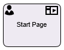
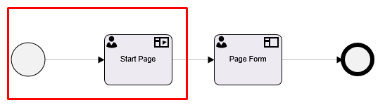
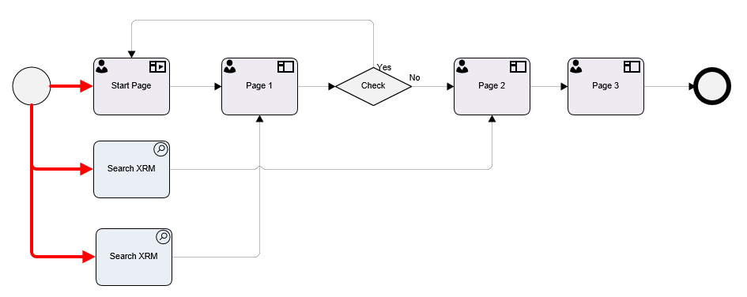
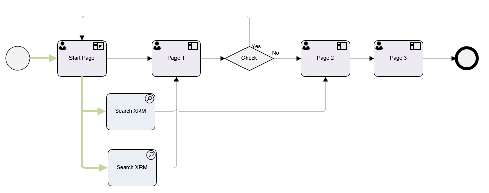

__[Home](/) --> [AgileDialogs Design Guide](/guides/AgileDialogs-DesignGuide.md) --> Start Page Shape__

# Start Page Shape

This shape allows to show an AgileDialog Page without creating a process instance until this activity is completed.

This shape is only usable in AgileDialogs. It cannot be used in **AgileXRM**
processes.

The Start Page can only be placed immediately after the Start shape.

An AgileDialogs process model can only have one Start Page shape.

## Start Page Configuration

Start Page shape is confiured as any PageForm shape.

See [Page Form](PageFormShape.md) for full reference.

## Start Page shape within subprocess

When we use Start Page shapes within scenarios that contains subprocesses, the Start Page will be rendered only when it is the first shape in root process. When a Start Page is executed as a part of a subprocess, the page will not be shown to user and its will be completed automatically.

## Start Page shape limitations

A Start page shape must be the unique activity after the Start shape. 

When AgileDialogs does not contains the Start Page shape, we can model using automatic activities outgoing from the Start Shape. But when an Start Page is present in our model, this configuration will throw a validation error.

In order to perform automatic activities on process starts, use parallel shapes from the Start Page shape instead of the Start shape as picture shown:

## Related
- [AgileDialogs Page Form](../../ref/PAgeForm.md) 
- [AgileDialogs Page controls](../../ref/AgileDialogsControls.md) 

## Disclaimer of warranty

[Disclaimer of warranty](DisclaimerOfWarranty.md)

