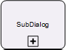
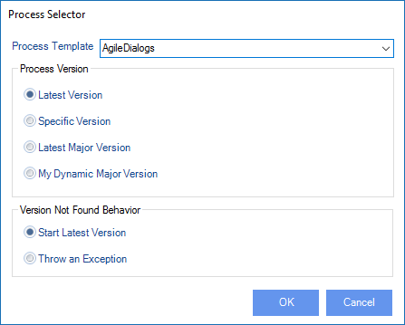

__[Home](/) --> [AgileDialogs design guide](/guides/AgileDialogs-DesignGuide.md) --> SubDialog Shape__

# SubDialog shape

This shape is used to launch a SubDialog.

## Configuration

A SubDialog is similar to a sub-process in AgileXRM. SubDialogs always share the
context with the parent dialog. They can be included anywhere in the parent
dialog and multiple levels are allowed, so a SubDialog can contain other
SubDialogs.

## Dialog Property

This window is used to configure the SubDialog to run:

| **Property**| Description |
|-----------------------------------------|---------------------------------------------------------------------------------------------------------------------------------------------------------------------------------------------------------------------------------------------------------------------------|
| **Process Template**                    | Select which dialog to run, from the list of AgileDialogs already deployed to the Process Engine                                                                                                                                                                          |
| **Latest Version**                      | The latest version of the SubDialog will be used at runtime                                                                                                                                                                                                               |
| **Specific Version (\*)**               | The selected version will always be used                                                                                                                                                                                                                                  |
| **Latest Major Version (\*)**           | The highest minor version of the selected major version is used                                                                                                                                                                                                           |
| **My Dynamic Major Version (\*)**       | The same as Latest Major Version but the major version number is the calling dialog’s Major Version                                                                                                                                                                       |
| **Start Latest Version (if not found)** | This configures the behavior of the shape if the version setting above is one of the ones with an (\*) and that version does not exist at runtime. In the case it will behave as if Latest Version was selected                                                           |
| **Throw an exception (if not found)**   | This configures the behavior of the shape if the version setting above is one of the ones with an (\*) and that version does not exist at runtime. In the case it will make the shape throw an Exception (i.e. process hangs in this shape until the problem is remedied) |

## NamePrefix property

The *NamePrefix* property can be used to set a readable name for the SubDialog
instance. This name is used in *AgileXRM Process Manager* to show a hyperlink to
the SubDialog.
