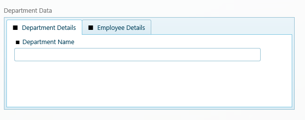
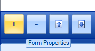
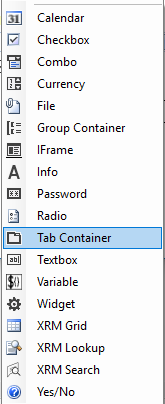
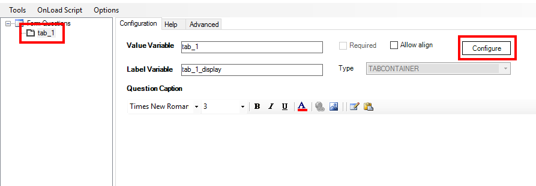
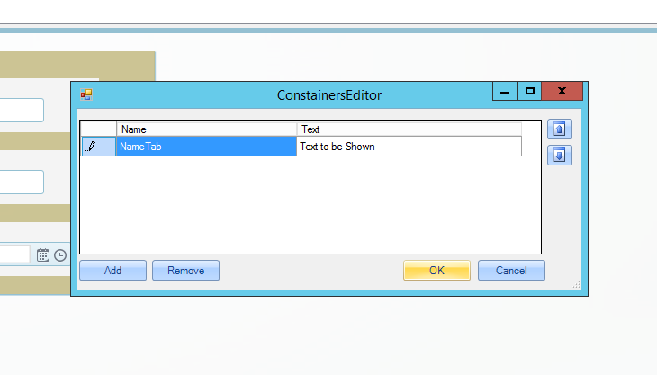
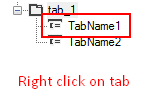
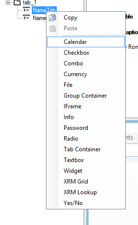

__[Home](/) --> [AgileDialogs design guide](/guides/AgileDialogs-DesignGuide.md) --> Tab Container Control__

# Tab Container control

We can organize our Form information for structural and / or validation
purposes. For that goal, the Tab Container control can be included inside our
form. We can place different kinds of elements inside it, and distribute them by
creating different tabs. Another advantage is that we can hide or disable all
tab container elements as a whole.

**How to create a Tab Container in a Form**

The procedure to add a new tab container inside a form is really simple. First
of all, we should select a new item in add items menu / Tab container. Once the
tab container is created, a minimum of one tab has to be included inside our Tab
Container, in order to organize and add inner controls.

1.  Adding Tab Container:

    

    

2.  Once added, we have to position our focus into the tab container control and
    add a tab / tabs into it, and then, we will be pressing the *configure*
    button:

    

3.  Now we add different tabs pressing *Add* and create the desired tabs to
    organize the information:

    

4.  Lastly, we will add the controls to the created tabs following its
    hierarchy, right clicking on it and choosing the desired control / controls:

    

    

The most important properties for the Tab Container control are:

-   **AllowAlign:** If activated, the container would position inline to the
    previous element before it. If set to *false*, the container will be placed
    on a new line inside the canvas.

-   **AutoHeight:** If set to *true*, the tab container height will set a
    predefined height for all tabs (set to the height of the tallest tab). If
    *false*, the height of the tab container will be adapted to its selected tab
    height, which may make the other controls following the Tab Container to
    move accordingly.

-   **ColumnSpan**: Number of columns (1 to 12) that the control is going to
    take (actual width of the control when the canvas is rendered)

-   **Visible**: We can hide /show the Tab Container (and all its inner
    elements) to the user, for functional purposes, manipulating this property.
