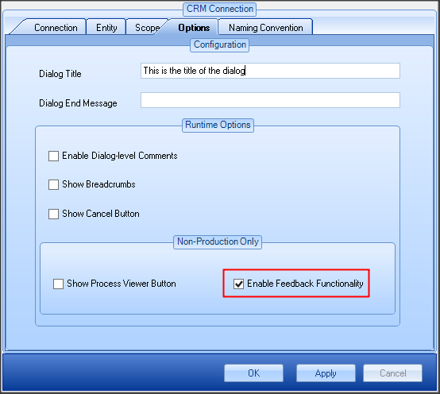
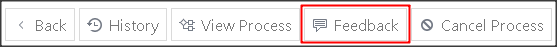
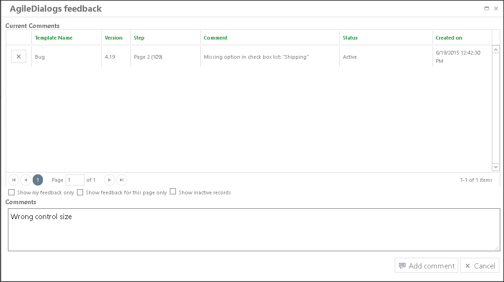
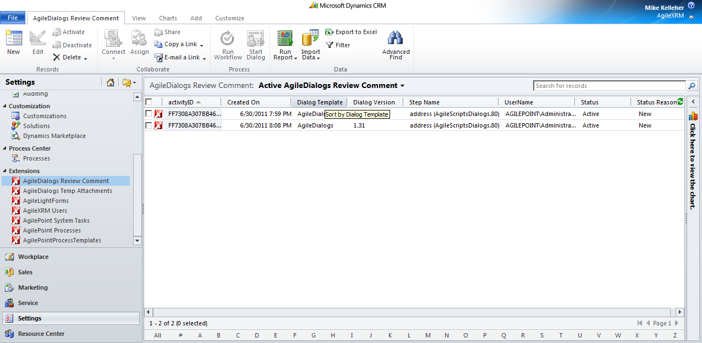

# User Feedback

**[Home](/) --> [AgileDialogs design guide](/guides/AgileDialogs-DesignGuide.md) --> User Feedback**

---

AgileDialogs infrastructure allows involving users in the design of the dialogs.

To allow users add suggestions or comments enable review comments in *XRM
Connection* window:

Doing that, a button to add comments (*Feedback*) is added to Dialogs Runtime:

When a user clicks this button this window is presented to allow the user adding
comments:

In the top of the window the user can see the comments included by him/her for
the current dialog instance and the step that the comment is linked to.

All comments are saved in XRM in an entity called *AgileXRM Feedback*.

Each comment has a set of information associated to help the designer to improve
the Dialog: the step (Page) where the comment was included, the name of the
Dialog, the version, the date and the user that added the comment.

Using XRM views the designer can manage the comments fixing the issues or
suggestions that the reviewers have created.

## Disclaimer of warranty

[Disclaimer of warranty](DisclaimerOfWarranty.md)
