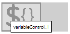

__[Home](/) --> [AgileDialogs design guide](/guides/AgileDialogs-DesignGuide.md) --> Variable Control__

## Common properties:

- [AgileDialogs control common properties](ControlCommonProperties.md)

## Variable Control

**Variable control** allows user to create a new variable in process context.  
**Variable control** will create its value when AgileDialogs page is submitted using Next button.

**Variable control** is an invisible control at runtime.

To set the value for control use one of these methods:
-	Set default value property
-	Use DialogsEngine API
-	Set the variable control as target of Search control. 

**Variable control** cannot be required, and does not have a display variable.
To create multiple variables use multiple controls.

The **properties** for the Variable control are:

- **Value Variable**: The name for process context variable that should be created.
- **Default Value**: The default value for control.

## Disclaimer of warranty

[Disclaimer of warranty](DisclaimerOfWarranty.md)
