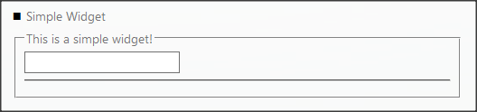
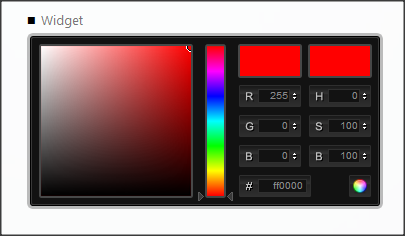

# Widget Control

**[Home](/) --> [AgileDialogs design guide](/guides/AgileDialogs-DesignGuide.md) --> Widget Control**

---

This allows adding custom controls to the Page to extend beyond the
out-of-the-box controls provided by the AgileDialogs.

Example of a simple Widget:

Example of a complex Widget like ColorPicker:

The properties of the Widget control are:

- **Url**: of the javascript file that contains the widget code  
    e.g. Scripts/Widgets/demo/colorpicker/widget.demo.colorpicker.js

- **WidgetClassImplementation**: Name of the Widget class  
    e.g. ColorPickerWidgetControlImplementation

- **OutputVariables**: Additional Variables of the Widget (Read Only)

For reference, the following Widgets are deployed with AgileDialogs here:

- \<AgileDialogsRoot\>/Scripts/Widgets/demo/simple
- \<AgileDialogsRoot\>/Scripts/Widgets/demo/colorpicker

The details of creating a Widget are in the **AgileDialogs Customization
Guide.**

---

## Common properties

- [AgileDialogs control common properties](ControlCommonProperties.md)

---

## Disclaimer of warranty

[Disclaimer of warranty](DisclaimerOfWarranty.md)
