# XRM Connection Window

**[Home](/) --> [AgileDialogs Design Guide](/guides/AgileDialogs-DesignGuide.md) --> XRM Connection Window**

---

This window allows manage connection and process template settings. It is open together when process template file is opened.

This window can be reopened at any time from the **AgileXRM** Ribbon.

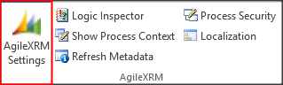

## Connection Tab

This section allows define connection settings:

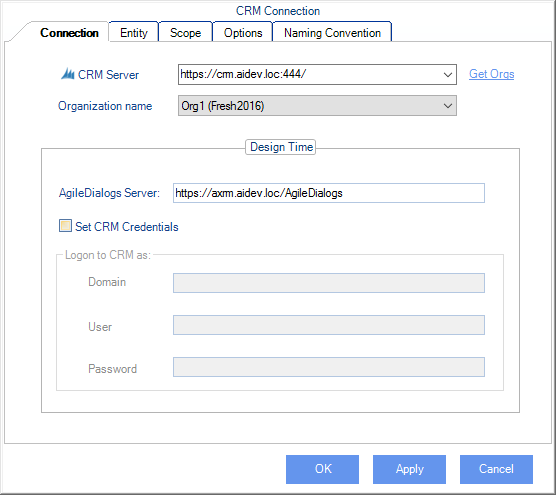

Provide these fields:

- **Username**: This is the the Username used to connect.
- **Organization**: This is the environment to connect.
- **Org Unique Name**: This is internal organization name.
- **Org Url**: This is the organization URL.
- **AgileDialogs Server URL**: This is the URL of AgileDialogs Server.
- **Process Engine Server URL**: This is the URL of Process Engine.

---

## Entity Tab

This section alllows define the `Main Entity` type asociated with the process template. When you set this data means that process instances of this template has a CRM entity as data source and we can use that entity data in model.

Setting `Main Entity` is **optional** in **AgileDialogs**. There is no need to set a relationship between the dialog and a record in CRM and in fact, it is recommended not to set a `Main Entity` for performance reasons.

> If is needed to associate a Main Entity record for agileDialogs processes, you will have configure the [Performance Window](PerformanceWindow.md).

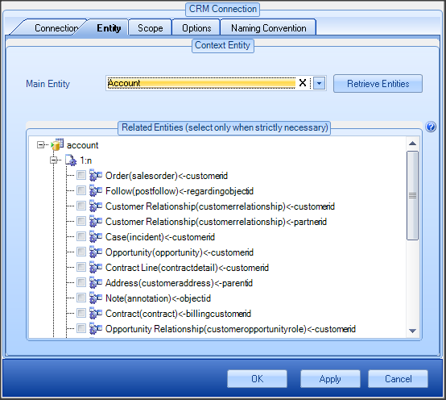

> **Tip:** If you wish to set the relationship between the dialog and the record in CRM (this is useful for using context data filters in AgileMonitor), then set *CrmBeType* and *CrmBeId* parameters using an *Update Custom Attributes* shape at the beginning of the dialog:  
> 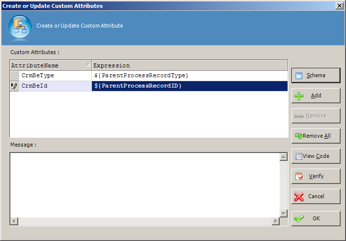

This also means that the dialog will be shown in the *View Process* tab for the related record in CRM.

---

## Scope tab

The scope tab allow you to define the behavior for new process instances, if it can be executed standalone, associated with CRM entity record or if it is an automatic process.

The content of this tab depends of the type of process that you have selected.

---

### Scope tab for AgileXRM process

The scope tab has these options:

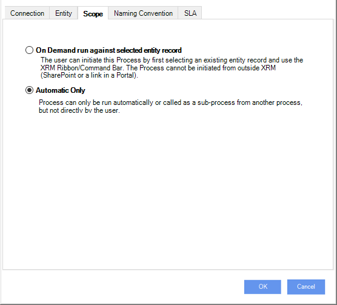

In the Scope tab, the following options can be set:

- **On Demand run against selected entity record**. The user can initiate this
    Process by first selecting an existing entity record and use the CRM
    Ribbon/Command Bar. The Process cannot be initiated from outside CRM
    (SharePoint or a link in a Portal).  
    Process can also be run automatically or called as a sub-process from
    another process, but always passing the CRM record ID and Type as input.
    > When this option is set, `Main Entity` must be provided.

- **Automatic Only**. Process can only be run automatically or called as a
    sub-process from another process, but not directly by the user.

### Scope tab for AgileDialogs process

The scope tab has these options:

- **On Demand Standalone.** The user can initiate this Dialog without an
    existing entity record, either from the CRM Ribbon/Command Bar or from
    outside CRM (SharePoint or a link in a Portal).  
    Dialog can also be run from a Dialog Task or as a Sub-Dialog.

- **On Demand run against selected entity record.** The user can initiate this
    Dialog by first selecting an existing entity record and using the CRM
    Ribbon/Command Bar. The Dialog cannot be initiated from outside CRM
    (SharePoint or a link in a Portal).  
    Dialog can also be run from a Dialog Task or as a Sub-Dialog.
    > When this option is set, `Main Entity` must be provided.

- **Automatic Only.** Dialog can only be run from a Dialog Task or as a
    Sub-Dialog, but not directly by the user.

### AgileDialogs Options tab

This section defines **AgileDialogs** options. It is not available for **AgileXRM** process templates.

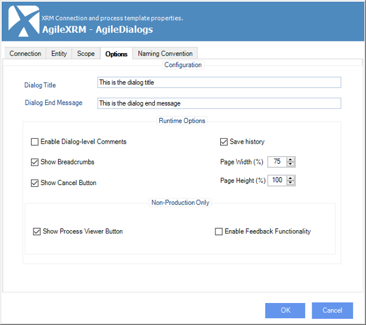

The following options can be set:

- **Dialog Title**: Is the title of the dialog shown to users at runtime.

    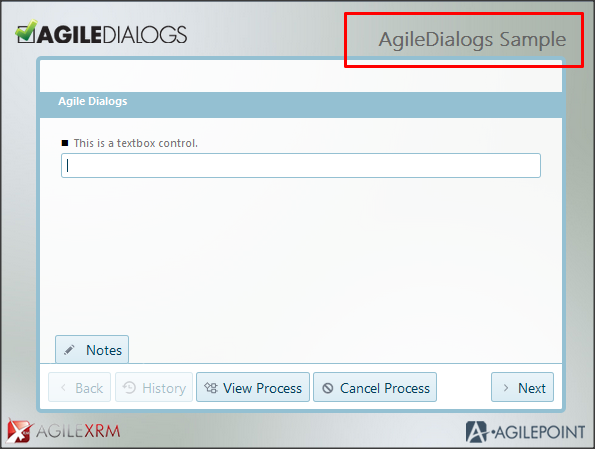

- **Dialog End Message**: Is the message shown to users when the dialog iscompleted.

    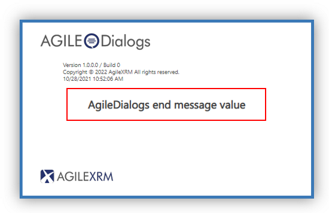

- **Enable Dialog-level comments**: Indicates if the Notes windows is shown to
    users at runtime to take notes or write comments during the execution of
    the dialog. If activated, the Notes area is collapsed by default, but the
    user can expand it as required.

    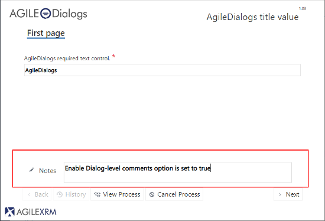

    <!-- 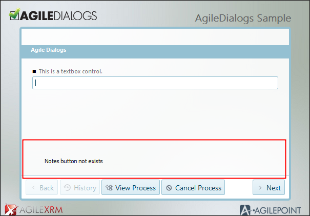 -->

    It is possibe also to collapse/expand the Notes panel via javascript.  
    In each step of the dialog, the content of the Notes section is stored
    automatically in a variable called *ProcessNotes*, which can be used to
    update a CRM entity.

- **Show Breadcrumbs**. With tis option selected, the dialog will show a
    Breadcrumb functionality where each Page in the dialog will add a clickable
    step in the breadcrumb, allow the user to see the progress of the steps and
    be able to navigate to a previous step quickly.

- **Show Cancel Button**: With this option selected, the user can use the Cancel
button to cancel the current dialog.

    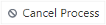

- **Show Process Viewer Button**: If selected, the View Process button is shown and allows following the progress of the dialog visually.

    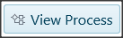

    > NOTE: Use of
    this functionality is not supported in Production environments, and is only
    useful when developing the dialogs.

- **Save history**: If selected, AgileDialogs will save the execution history in order to show it in ProcessManager.

    

- **Page Width**: This setting allows define the width of AgileDialogs. When its rendered within CRM/CDS this setting applies to window frame size, otherwhise this setting defines the page width within browser.

- **Page Height**: This setting allows define the height of AgileDialogs when its rendered within CRM/CDS. Otherwise this setting is ignored.

  > Page Height setting is ignored when AgileDialogs is executed outside CRM/CDS

`Page Width` and `Page Height` settings applies to window frame size when AgileDialogs is within CRM/CDS, and when not is within CRM/CDS defines the page within browser.

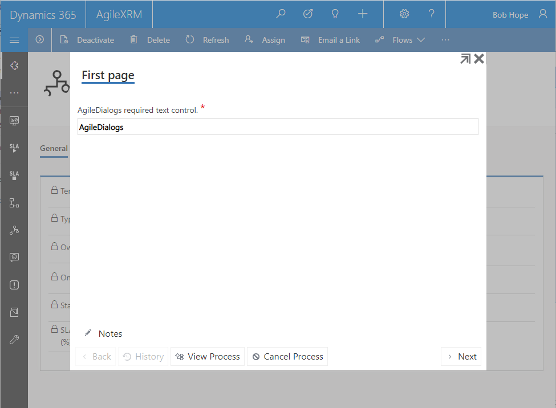

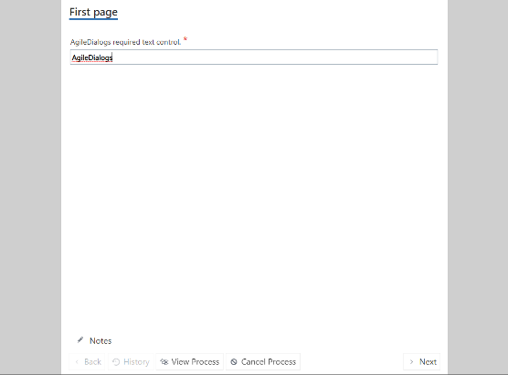

---

## Naming Convention tab

In this tab the designer can configure the name of the dialog template as well as the `Process Instance Name` which will be associated to the dialog. This name is shown the in `Process Instances View` in CRM and in Process Manager.

The name is set when the dialog is started so the parameters used in the name must have value when the dialog is started.

This name is not the same as the dialog title; the dialog title will be presented to the user that runs the dialog, whereas process name is used internally by Process Owners in CRM.

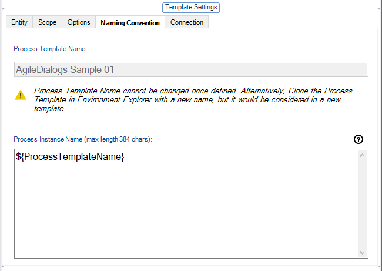

- **Process Template Name**: The process template name.
  
   > It is good practice to add context data to the name to make identifying the
record easier in CRM

- **Process template instance name**: The name which will provided to the process instance record.

## AgileXRM SLA Tab

This section defines **AgileXRM** SLA (Service Level Agreement ) options. It is not available for **AgileDialogs** process templates.

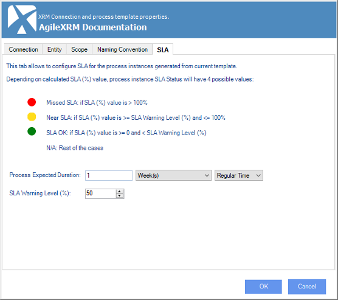

- **Process expected duration**: Use this field to provide the expected duration for each process instance.

- **SLA warning level**: This field defines the percentage value which will apply to calculate the SLA.

> SLA Status is shown within CRM views

---

## Disclaimer of warranty

[Disclaimer of warranty](DisclaimerOfWarranty.md)
