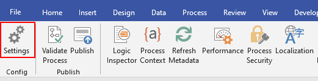
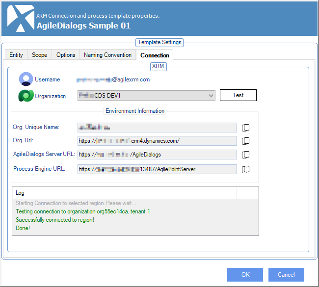
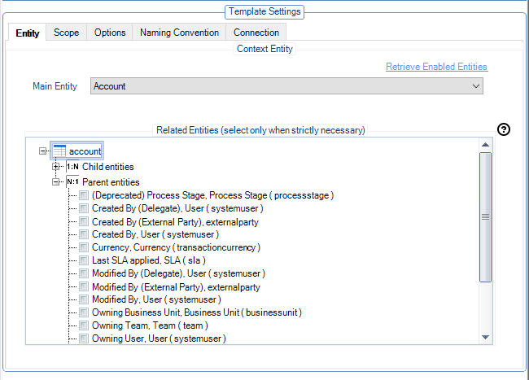

__[Home](/) --> [AgileDialogs Design Guide](/guides/AgileDialogs-DesignGuide.md) --> XRM Connection Window__

# XRM Connection Window

This window can be reopened at any time from the AgileXRM Ribbon.

### Connection Tab

In this tab, design-time connection configuration is set.

### Entity Tab

Setting Main Entity is **optional** in AgileDialogs. There is no need to set a
relationship between the dialog and a record in CRM and in fact, it is
recommended not to set a Main Entity for performance reasons.

**Tip:** If you wish to set the relationship between the dialog and the record
in CRM (this is useful for using context data filters in AgileMonitor), then set
*CrmBeType* and *CrmBeId* parameters using an *Update Custom Attributes* shape
at the beginning of the dialog:

This also means that the dialog will be shown in the *View Process* tab for the
related record in CRM.

### Scope tab

The scope tab allow you to define the behavior for new process instances. The
content of this tab depends of the type of process that you have selected.

### Scope tab for AgileXRM process

The scope tab has these options:

In the Scope tab, the following options can be set:

-   **On Demand with Startup Form.** The user can initiate this Process without
    an existing entity record, either from the CRM Ribbon/Command Bar or from
    outside CRM (SharePoint or a link in a Portal). The Startup Form will
    automatically create the entity record and launches the process.  
    Process can also be run automatically or called as a sub-process from
    another process.

-   **On Demand run against selected entity record**. The user can initiate this
    Process by first selecting an existing entity record and use the CRM
    Ribbon/Command Bar. The Process cannot be initiated from outside CRM
    (SharePoint or a link in a Portal).  
    Process can also be run automatically or called as a sub-process from
    another process, but always passing the CRM record ID and Type as input.

-   **Automatic Only**. Process can only be run automatically or called as a
    sub-process from another process, but not directly by the user.

    1.  Scope tab for AgileDialogs process

The scope tab has these options:

-   **On Demand Standalone.** The user can initiate this Dialog without an
    existing entity record, either from the CRM Ribbon/Command Bar or from
    outside CRM (SharePoint or a link in a Portal).  
    Dialog can also be run from a Dialog Task or as a Sub-Dialog.

-   **On Demand run against selected entity record.** The user can initiate this
    Dialog by first selecting an existing entity record and using the CRM
    Ribbon/Command Bar. The Dialog cannot be initiated from outside CRM
    (SharePoint or a link in a Portal).  
    Dialog can also be run from a Dialog Task or as a Sub-Dialog.

-   **Automatic Only.** Dialog can only be run from a Dialog Task or as a
    Sub-Dialog, but not directly by the user.

### Options tab

The following options can be set:

-   **Dialog Title**: Is the title of the dialog shown to users at runtime.

    

-   **Dialog End Message**: Is the message shown to users when the dialog is
    completed.  
      
    

    

-   **Enable Dialog-level comments**: Indicates if the Notes windows is shown to
    users at runtime to take notes or write comments during the execution of
    the dialog. If activated, the Notes area is collapsed by default, but the
    user can expand it as required.

    

    

    It is possibe also to collapse/expand the Notes panel via javascript.  
    In each step of the dialog, the content of the Notes section is stored
    automatically in a variable called *ProcessNotes*, which can be used to
    update a CRM entity.

-   **Show Breadcrumbs**. With tis option selected, the dialog will show a
    Breadcrumb functionality where each Page in the dialog will add a clickable
    step in the breadcrumb, allow the user to see the progress of the steps and
    be able to navigate to a previous step quickly.

- **Show Cancel Button**: With this option selected, the user can us a Cancel
button to cancel the current dialog.

-   **Show Process Viewer Button**: If selected, the View Process button is
    shown and allows following the progress of the dialog visually. NOTE: Use of
    this functionality is not supported in Production environments, and is only
    useful when developing the dialogs.

-- **Save history**: If selected, AgileDialogs will save the execution history in order to show it in ProcessManager.

 
### Naming Convention tab

In this tab the designer can configure the name of the dialog template as well
as the *Process Instance Name* which will be associated to the dialog. This name
is shown the in *Process Instances View*s in CRM and in Process Manager.

It is good practice to add context data to the name to make identifying the
record easier in CRM

The name is set when the dialog is started so the parameters used in the name
must have value when the dialog is started.

This name is not the same as the dialog title; the dialog title will be
presented to the user that runs the dialog, whereas process name is used
internally by Process Owners in CRM.

