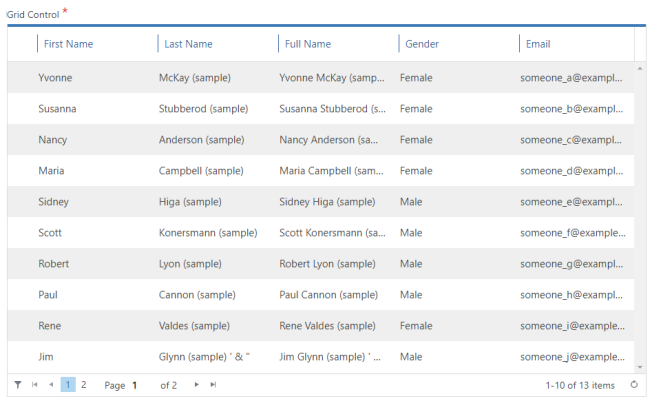
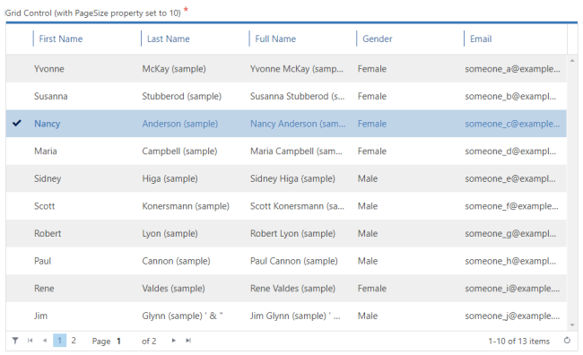
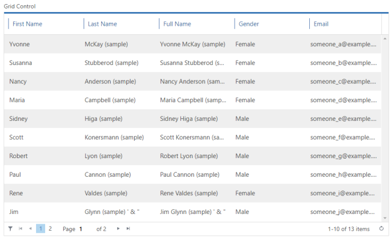
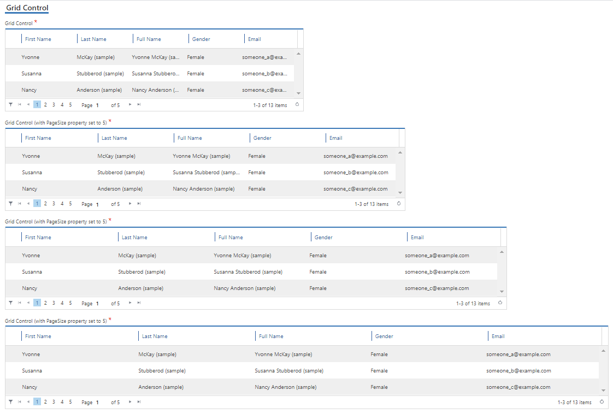
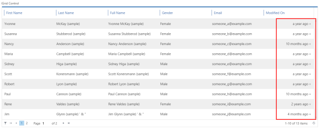

# Grid control

**[Home](/) --> [AgileDialogs design guide](/guides/AgileDialogs-DesignGuide.md) --> Grid**

---

This control presents a grid with the records selected with a query configured
using the *Configure* button.

Grid control can populate its items from one of these values:

- XRM: Grid control populates its items from the results of XRM query.
- JSON: Grid control populates its items from **AgileXRM** variable which contains a JSON value.
- REST: Grid control populates its items performing a REST call and getting its elements from the response of REST service.

It has Paging functionality with Page Navigation buttons. The ***PageSize***
parameter (default 10) controls the page size, and a value of zero disables
paging and returns all records.

---

## Grid control configuration

---

### Data configuration

Grid control can show data from by 2 ways:

- **Dynamic**: Choose *Dynamic* option and use *Configure* button to open the editor.  [XRMGridControl_03_01.png](../media/AgileDialogsDesignGuide/XRMGridControl_03_01.png)  
This option shows data from **Dynamics CRM/CDS** entities using a query expression.  
[How to configure QueryExpression](../../ref/common/QueryExpression.md)
<!--[How to configure QueryExpression](../../guides/common/PopulatingCombo.md)-->
- **External data**: Choose *Extenal data* option and use *Configure* button to open the editor.  
  
This option shows data from **JSON** value stored in *Process context*, that has been readed using a previous activity call (usually a REST activity)  
[How to configure external data](../../ref/common/ExternalData.md)

---

### Configuration

This control can be configured to behave in 3 different ways:

- **Allow single selection**: in *Advance* tab set ***AllowMultiple*** property to
    *false*.

- **Allow multiple selections**: in *Advance* tab set ***AllowMultiple*** property
    to *true*.

- **Readonly**: In *Advance* tab set ***ReadOnlyGrid*** property to *true*. This
    behavior is useful for summary pages:

Note that this control does not have the ***ControlWidth*** property and occupies
the full width of space set by ***ColumnSpan***.

This control also allows the following configuration settings:

- The **AutoNext** property, if set to *true*, enables the control to move forward, once the user has filled in the control with the desired value.  
For instance, if we have a Page Form composed by one Grid control, with its *Required* property set to *true* we would need to select an item inside our control, and press the predefined *Next* button afterwards to keep on progressing in our dialog; if we set *AutoNext* to true, the process will continue right after we select a value of our Grid, without pressing the *Next*button.

> **Note**: the *AllowMultipleSelection* property should be set to *false*.  
> Two Important features to take into account:
>
> - The *AutoNext* property cannot be set to *true* in a Grid that has its
    *AllowMultipleSelection* set to *true*. For *AutoNext* property to be work,
    the Grid must be set on *Single selection* mode.
> - Be careful changing both properties, because setting
    *AllowMultipleSelection* to *true* automatically toggles *AutoNext* property
    to *false*, and vice versa.  
    

- The fields presented in the grid are configured using **Configure Lookup** button,
and configuration in the *Columns* tab:

 

When multiple selection is allowed, the values selected by the user are stored
in the *ValueVariable* and *DisplayVariable* separated by semicolons. This
format can be used in other **AgileXRM** shapes like *Update Entity (Multi)*.

When multiple values are selected in Grid control , selected values can be
located in different grid pages depending of the user selection. We can filter
selected data clicking the filter button of Grid control placed at bottom
left.

Once Grid control is filtered, control only shows selected data. Click the
filter button again to remove the filter.

- The **UseRelativeDataFormat** property determines how Datetime columns are shown.  When its set to *false*, Datetime column are shown using the CRM/CDS date format.

    

    When its set to *true*, Datetime column are shown as friendly relative text and we can get the Datetime value by cross button.

    

  > **Note** When Grid control is configured with UseRelativeDateFormat, we can use the cross button to show the Datetime value

---

## Related

- [How to configure QueryExpression](../../ref/common/QueryExpression.md)

- [JSON data in AgileDialogs](../common/JSONAgileDialogs.md);

- [How to configure external data](../../ref/common/ExternalData.md)

---

## Common properties

- [AgileDialogs control common properties](ControlCommonProperties.md)

---

## Disclaimer of warranty

[Disclaimer of warranty](DisclaimerOfWarranty.md)
