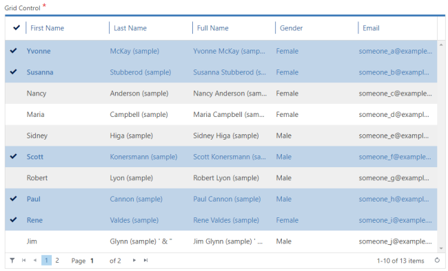
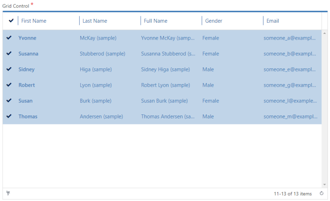

__[Home](/) --> [AgileDialogs design guide](/guides/AgileDialogs-DesignGuide.md) --> XRM Grid__

# XRM Grid

This control presents a grid with the records selected with a query configured
using the *Configure* button.

It has Paging functionality with Page Navigation buttons. The *PageSize*
parameter (default 10) controls the page size, and a value of zero disables
paging and returns all records.

This control can be configured to behave in 3 different ways:

-   **Allow single selection**: in *Advance* tab set *AllowMultiple* property to
    *false*.

-   **Allow multiple selections**: in *Advance* tab set *AllowMultiple* property
    to *true*.

-   **Readonly**: In *Advance* tab set *ReadOnlyGrid* property to *true*. This
    behavior is useful for summary pages:

Note that this control does not have the *ControlWidth* property and occupies
the full width of space set by *ColumnSpan*.

The “**AutoNext**” property, if set to “true”, enables the control to move
forward, once the user has filled in the control with the desired value.

For instance, if we have a Page Form composed by one Grid control, with its
“Required” property set to “true” we would need to select an item inside our
control, and press the predefined “Next” button afterwards to keep on
progressing in our dialog; if we set “AutoNext” to true, the process will
continue right after we select a value of our Grid, without pressing the “Next”
button.

> **Note**: the “AllowMultipleSelection” property should be set to false.

Two Important features to take into account:

-   The “AutoNext” property cannot be set to “true” in a Grid that has its
    “AllowMultipleSelection” set to true. For “AutoNext” property to be work,
    the Grid must be set on “single selection” mode.

-   Be careful changing both properties, because setting
    “AllowMultipleSelection” to “true” automatically toggles “AutoNext” property
    to “false”, and vice versa.

    

The fields presented in the grid are configured using *Configure Lookup* button,
and configuration in the *Columns* tab:

When multiple selection is allowed, the values selected by the user are stored
in the *ValueVariable* and *DisplayVariable* separated by semicolons. This
format can be used in other AgileXRM shapes like *Update Entity (Multi)*.

When multiple values are selected in XRM Grid control , selected values can be
located in different grid pages depending of the user selection. We can filter
selected data clicking the filter button of XRM Grid control placed at bottom
left.

Once XRM Grid control is filtered, control only shows selected data. Click the
filter button again to remove the filter.

