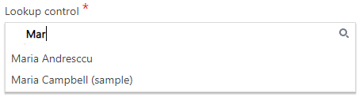

__[Home](/) --> [AgileDialogs design guide](/guides/AgileDialogs-DesignGuide.md) --> XRM Lookup__

# XRM Lookup

This control allows looking up records in XRM repository and provides an
auto-complete feature to help user select a value.

Lookup control has the *MinLength* property that allows users to set the number
of characters typed to fire the auto-complete feature.

When the user clicks the Search icon on the right, the lookup window is opened:

The query used to filter the records presented to the user, is configured by
clicking the *Configure Lookup* button. This windows uses the CRM System View -
Quick Find view - to find the data more easily.

To configure the filter criteria, click the Configure button to open the
*Advanced Find* window:

The fields presented in this lookup window are configured in *Columns* tab of
the *Advanced Find* window.

The **AutoNext** property, if set to *true*, enables the control to move
forward, once the user has filled in the control with the desired value.

For instance, if we have a Page Form composed by one Lookup control, with its
*Required* property set to *true* we would need to select an item inside our
control, and press the predefined *Next* button afterwards to keep on
progressing in our process; if we set *AutoNext* to *true*, the process will
continue right after we select a value of our lookup control, without pressing
the *Next* button 

> **Important**: if there is any other control in the current
form with its *required* property set to *true*, the process will not move forward.
